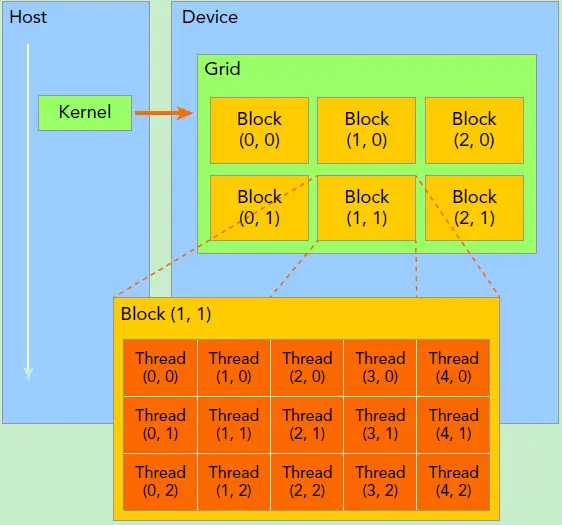
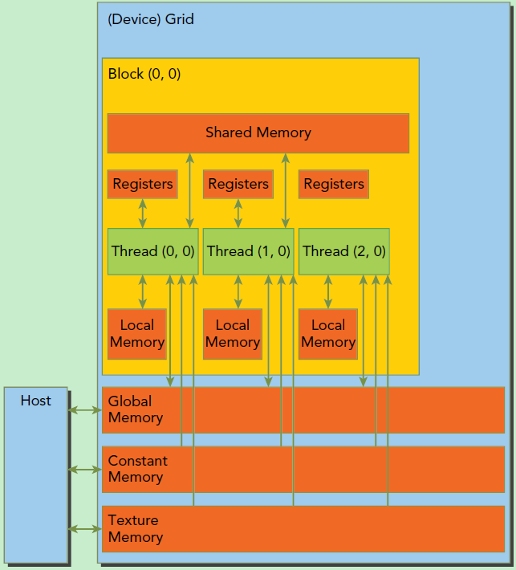
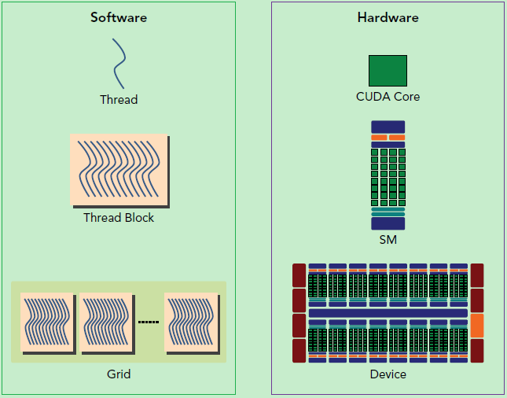
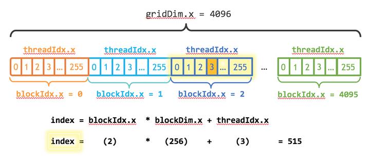
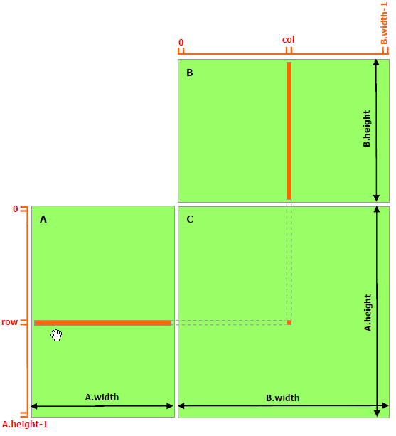

# 重要概念
1. 在CUDA中，用**host**指代**CPU及其内存**，而用**device**指代**GPU及其内存**。
2. 三种用于区分host和device上代码的函数类型限定词：

*  ```__global__```: 在device上执行，从host中调用（一些特定的GPU也可以从device上调用），返回类型必须是```void```，不支持可变参数，不能成为类成员函数。注意用```__global__```定义的kernel是异步的，这意味着host不会等待kernel执行完就执行下一步。
*  ```__device__```: 在device上执行，单仅可以从device中调用，不可以和```__global__```同时用。
* ```__host__```: 在host上执行，仅可以从host上调用，一般省略不写，不可以和```__global__```同时用，但可和```__device__```,此时函数会在device和host都编译。

3. **核函数(kernel)** 是在device上线程中并行执行的函数，核函数用```__global__```符号声明, 在调用时需要用```<<<grid, block>>>```来指定kernel要执行的线程数量。
```c
dim3 grid(3, 2);
dim3 block(5, 3);
kernel_fun<<< grid, block >>>(prams...);
```
4. 在CUDA中，每一个线程都要执行核函数，并且每个线程会分配一个唯一的线程号thread ID，这个ID值可以通过核函数的内置变量```ThreadIdx```来获得。


CUDA程序中既包含host程序，又包含device程序，它们分别在CPU和GPU上运行。同时，host与device之间可以进行通信，这样它们之间可以进行数据拷贝。典型的CUDA程序的执行流程如下：
1. 分配host内存，并进行数据初始化；
1. 分配device内存，并从host将数据拷贝到device上；
1. 调用CUDA的核函数在device上完成指定的运算；
1. 将device上的运算结果拷贝到host上；
1. 释放device和host上分配的内存。

# kernel的线程结构
**网格(grid)**：一个kernel所启动的所有线程。同一个网格上的线程共享相同的全局内存空间。
**线程块(block)**: 一个线程块里面包含很多线程。一个线程块上的线程是放在同一个 **流式多处理器（Streaming  Multiprocessor, SM）** 上的，但是单个SM的资源有限，这导致线程块中的线程数是有限制的，现代GPUs的线程块可支持的线程数可达1024个。
**流式多处理器（SM）**： 核心组件包括CUDA核心，共享内存，寄存器等，SM可以并发地执行数百个线程，并发能力就取决于SM所拥有的资源数。当一个kernel被执行时，它的gird中的线程块被分配到SM上，一个线程块只能在一个SM上被调度。SM一般可以调度多个线程块，这要看SM本身的能力。由于SM的基本执行单元是包含32个线程的线程束，所以block大小一般要设置为32的倍数。

图中，一个线程需要两个内置的坐标变量（blockIdx，threadIdx）来唯一标识，它们都是dim2类型变量，其中blockIdx指明线程所在grid中的位置，而threaIdx指明线程所在block中的位置，如图中的Thread (1,1)满足：
```c
threadIdx.x = 1
threadIdx.y = 1
blockIdx.x = 1
blockIdx.y = 1
```

如何获取一个线程在block中的全局ID，知道block和grid的组织结构：
对于2-dim的bloock(Dx,Dy), 线程(x,y)的ID值为(x + y * Dx)
对于3-dim的bloock(Dx,Dy,Dz), 线程(x,y,z)的ID值为(x + y * Dx + Z * Dx * Dy)
利用上图结构实现两个矩阵的加法，每个线程负责处理每个位置的两个元素相加，代码如下所示。线程块大小为(16, 16)，然后将N*N大小的矩阵均分为不同的线程块来执行加法运算。
<details>
    <summary><span style="color:blue;">查看矩阵加法代码</span> </summary>

```c {.line-numbers}
// kernel定义
__global__ void MatAdd(float A[N][N], float B[N][N], float C[N][N]) 
{ 
    int i = blockIdx.x * blockDim.x + threadIdx.x;  // 当前线程块的起始水平位置（基于所有线程块的水平维度）+ 当前线程在其线程块中的水平位置
    int j = blockIdx.y * blockDim.y + threadIdx.y; 
    if (i < N && j < N) 
        C[i][j] = A[i][j] + B[i][j]; 
}

int main() 
{ 
    ...
    // Kernel 线程配置
    dim3 threadsPerBlock(16, 16); 
    dim3 numBlocks(N / threadsPerBlock.x, N / threadsPerBlock.y);
    // kernel调用
    MatAdd<<<numBlocks, threadsPerBlock>>>(A, B, C); 
    ...
}
```
</details>

# CUDA的内存模型
每个线程有自己的私有本地内存（Local Memory），而每个线程块有包含共享内存（Shared Memory）,可以被线程块中所有线程共享，其生命周期与线程块一致。此外，所有的线程都可以访问全局内存（Global Memory）。还可以访问一些只读内存块：常量内存（Constant Memory）和纹理内存（Texture Memory）。

一个kernel实际上会启动很多线程，*这些线程是逻辑上并行的，但是在物理层却并不一定*。<span style="color:red;">网格和线程块只是逻辑划分，一个kernel的所有线程其实在物理层是不一定同时并发的。所以kernel的grid和block的配置不同，性能会出现差异</span>

<span style="text-align: center; color:grey;">CUDA编程的逻辑层和物理层</span>

<details>
    <summary><span style="color:blue;">获得GPU的配置属性</span> </summary>
    
```c {.line-numbers}
int dev = 0;
    cudaDeviceProp devProp;
    CHECK(cudaGetDeviceProperties(&devProp, dev));
    std::cout << "使用GPU device " << dev << ": " << devProp.name << std::endl;
    std::cout << "SM的数量：" << devProp.multiProcessorCount << std::endl;
    std::cout << "每个线程块的共享内存大小：" << devProp.sharedMemPerBlock / 1024.0 << " KB" << std::endl;
    std::cout << "每个线程块的最大线程数：" << devProp.maxThreadsPerBlock << std::endl;
    std::cout << "每个EM的最大线程数：" << devProp.maxThreadsPerMultiProcessor << std::endl;
    std::cout << "每个SM的最大线程束数：" << devProp.maxThreadsPerMultiProcessor / 32 << std::endl;

    // 输出如下
    使用GPU device 0: GeForce GT 730
    SM的数量：2
    每个线程块的共享内存大小：48 KB
    每个线程块的最大线程数：1024
    每个EM的最大线程数：2048
    每个EM的最大线程束数：64
```
</details>

# 向量加法实例
利用CUDA编程实现两个向量的加法
**CUDA内存管理API：**
```c
// 在device上申请一定字节大小的内存 
// devPtr:  指向所分配内存的指针
cudaError_t cudaMalloc(void** devPtr, size_t size);
// 释放时有cudaFree函数 
```
**CUDA的host与device间通信API：**
```c
// src:指向数据源的指针
// dst:只想目标区域的指针
// count:复制的字节数
// kind:控制复制的方向：
   // cudaMemcpyHostToHost, 
   // cudaMemcpyHostToDevice, 将host上数据拷贝到device上
   // cudaMemcpyDeviceToHost
   // cudaMemcpyDeviceToDevice，
cudaError_t cudaMemcpy(void* dst, const void* src, size_t count, cudaMemcpyKind kind)
```
设计grid和block都为1-dim, 定义kernel如下：
```c {.line-numbers}
// 两个向量加法kernel，grid和block均为一维
__global__ void add(float* x, float * y, float* z, int n)
{
    // 获取全局索引
    int index = threadIdx.x + blockIdx.x * blockDim.x;
    // 步长
    int stride = blockDim.x * gridDim.x;  // 整个gird的线程数 
    for (int i = index; i < n; i += stride)
    {
        z[i] = x[i] + y[i];
    }
}
```
若一个线程只处理一个元素（一个线程实现多个元素叫*grid-stride loop*方式），有如下实现：
<details>
    <summary><span style="color:blue;">查看向量加法实现</span> </summary>

```c {.line-numbers}
int main()
{
    int N = 1 << 20;  // 向量大小为2^20
    int nBytes = N * sizeof(float);
    // 申请host内存
    float *x, *y, *z;
    x = (float*)malloc(nBytes);
    y = (float*)malloc(nBytes);
    z = (float*)malloc(nBytes);

    // 初始化数据
    for (int i = 0; i < N; ++i)
    {
        x[i] = 10.0;
        y[i] = 20.0;
    }

    // 申请device内存
    float *d_x, *d_y, *d_z;
    cudaMalloc((void**)&d_x, nBytes);
    cudaMalloc((void**)&d_y, nBytes);
    cudaMalloc((void**)&d_z, nBytes);

    // 将host数据拷贝到device
    cudaMemcpy((void*)d_x, (void*)x, nBytes, cudaMemcpyHostToDevice);
    cudaMemcpy((void*)d_y, (void*)y, nBytes, cudaMemcpyHostToDevice);
    // 定义kernel的执行配置
    dim3 blockSize(256);   // block大小为256
    dim3 gridSize((N + blockSize.x - 1) / blockSize.x);  // 为了确保覆盖整个任务所至少需要的线程块数目 
    // 执行kernel
    add << < gridSize, blockSize >> >(d_x, d_y, d_z, N);

    // 将device得到的结果拷贝到host
    cudaMemcpy((void*)z, (void*)d_z, nBytes, cudaMemcpyDeviceToHost);

    // 检查执行结果
    float maxError = 0.0;
    for (int i = 0; i < N; i++)
        maxError = fmax(maxError, fabs(z[i] - 30.0));
    std::cout << "最大误差: " << maxError << std::endl;

    // 释放device内存
    cudaFree(d_x);
    cudaFree(d_y);
    cudaFree(d_z);
    // 释放host内存
    free(x);
    free(y);
    free(z);

    return 0;
}
```
</details>

向量大小为2^20，而block大小为256，那么grid大小是4096，kernel的线程层级结构如下图所示：


CUDA6.0引入**统一内存（Unified Memory）** 来避免单独在host和device上分配内存的不便，统一内存使用一个托管内存来共同管理host和device中的内存，并且自动在host和device中进行数据传输。CUDA中使用cudaMallocManaged函数分配托管内存：
```c
cudaError_t cudaMallocManaged(void **devPtr, size_t size, unsigned int flag=0);
```

<details>
    <summary><span style="color:blue;">查看简化后的代码</span> </summary>

```c {.line-numbers}
int main()
{
    int N = 1 << 20;
    int nBytes = N * sizeof(float);

    // 申请托管内存
    float *x, *y, *z;
    cudaMallocManaged((void**)&x, nBytes);
    cudaMallocManaged((void**)&y, nBytes);
    cudaMallocManaged((void**)&z, nBytes);

    // 初始化数据
    for (int i = 0; i < N; ++i)
    {
        x[i] = 10.0;
        y[i] = 20.0;
    }

    // 定义kernel的执行配置
    dim3 blockSize(256);
    dim3 gridSize((N + blockSize.x - 1) / blockSize.x);
    // 执行kernel
    add << < gridSize, blockSize >> >(x, y, z, N);

    // 同步device 保证结果能正确访问
    cudaDeviceSynchronize();  // kernel执行是与host异步的，由于托管内存自动进行数据传输，用cudaDeviceSynchronize()函数保证device和host同步，这样后面才可以正确访问kernel计算的结果。

    // 检查执行结果
    float maxError = 0.0;
    for (int i = 0; i < N; i++)
        maxError = fmax(maxError, fabs(z[i] - 30.0));
    std::cout << "最大误差: " << maxError << std::endl;

    // 释放内存
    cudaFree(x);
    cudaFree(y);
    cudaFree(z);

    return 0;
}
```
</details>

# 矩阵乘法实例
C = A × B  选用2-dim的grid和block
首先定义矩阵结构体：
```c
// 矩阵类型，行优先，M(row, col) = *(M.elements + row * M.width + col)
struct Matrix
{
    int width;
    int height;
    float *elements;
};
```

<span style="text-align:center; color:grey;">矩阵乘法实现模式 </span>

核函数实现：
```c {.line-numbers}
// 获取矩阵A的(row, col)元素
__device__ float getElement(Matrix *A, int row, int col)
{
	return A->elements[row * A->width + col];
}

// 为矩阵A的(row, col)元素赋值
__device__ void setElement(Matrix *A, int row, int col, float value)
{
	A->elements[row * A->width + col] = value;
}

// 矩阵相乘kernel，2-D，每个线程计算一个元素
__global__ void matMulKernel(Matrix *A, Matrix *B, Matrix *C)
{
	float Cvalue = 0.0;
	int row = threadIdx.y + blockIdx.y * blockDim.y;
	int col = threadIdx.x + blockIdx.x * blockDim.x;
	for (int i = 0; i < A->width; ++i)
	{
		Cvalue += getElement(A, row, i) * getElement(B, i, col);
	}
	setElement(C, row, col, Cvalue);
}
```
采用统一内存编写实现代码：
<details>
    <summary><span style="color:blue;">查看矩阵乘法实现代码</span> </summary>

```c {.line-numbers}
int main()
{
    int width = 1 << 10;
    int height = 1 << 10;
    Matrix *A, *B, *C;
    // 申请托管内存
    cudaMallocManaged((void**)&A, sizeof(Matrix));
    cudaMallocManaged((void**)&B, sizeof(Matrix));
    cudaMallocManaged((void**)&C, sizeof(Matrix));
    int nBytes = width * height * sizeof(float);
    cudaMallocManaged((void**)&A->elements, nBytes);
    cudaMallocManaged((void**)&B->elements, nBytes);
    cudaMallocManaged((void**)&C->elements, nBytes);

    // 初始化数据
    A->height = height;
    A->width = width;
    B->height = height;
    B->width = width;
    C->height = height;
    C->width = width;
    for (int i = 0; i < width * height; ++i)
    {
        A->elements[i] = 1.0;
        B->elements[i] = 2.0;
    }

    // 定义kernel的执行配置
    dim3 blockSize(32, 32);
    dim3 gridSize((width + blockSize.x - 1) / blockSize.x, 
        (height + blockSize.y - 1) / blockSize.y);
    // 执行kernel
    matMulKernel << < gridSize, blockSize >> >(A, B, C);


    // 同步device 保证结果能正确访问
    cudaDeviceSynchronize();
    // 检查执行结果
    float maxError = 0.0;
    for (int i = 0; i < width * height; ++i)
        maxError = fmax(maxError, fabs(C->elements[i] - 2 * width));
    std::cout << "最大误差: " << maxError << std::endl;

    return 0;
}
```
</details>