[课程官网](https://pdos.csail.mit.edu/6.828/2020/xv6.html)
[课程翻译](https://mit-public-courses-cn-translatio.gitbook.io/mit6-s081)
[书籍翻译&实验指导](https://pdos.csail.mit.edu/6.S081/2021/labs/util.html)
[xv6书籍](https://pdos.csail.mit.edu/6.828/2020/xv6/book-riscv-rev1.pdf)
[书籍中译文版本](https://github.com/shzhxh/xv6-riscv-book-CN?tab=readme-ov-file)

**本文档用于记录学习过程中的关键点**

# Lec01 Introduction and examples
## 1.2 操作系统结构
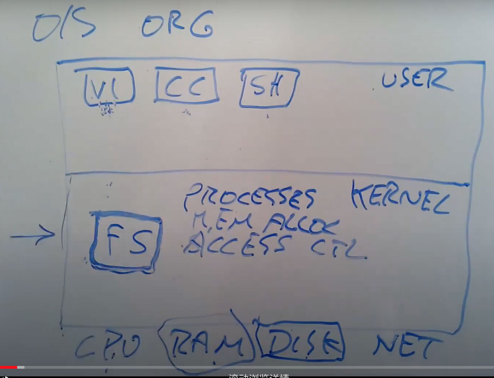
* 一个操作系统只有一个kernel，用于管理每一个用户空间进程
* 系统调用与程序中的函数调用看起来是一样的，但区别是系统调用会实际运行到系统内核中，并执行内核中对于系统调用的实现。

## 1.5 read, write, exit系统调用

* **文件描述符**：0，1，2对应标准输入、标准输出和标准错误流

* read接收3个参数：

1. 第一个参数是文件描述符，指向一个之前打开的文件。Shell会确保默认情况下，当一个程序启动时，文件描述符0连接到console的输入，文件描述符1连接到了console的输出。所以我可以通过这个程序看到console打印我的输入。当然，这里的程序会预期文件描述符已经被Shell打开并设置好。

1. read的第二个参数是指向某段内存的指针，程序可以通过指针对应的地址读取内存中的数据，这里的指针就是代码中的buf参数。在代码第10行，程序在栈里面申请了64字节的内存，并将指针保存在buf中，这样read可以将数据保存在这64字节中。

1. read的第三个参数是代码想读取的最大长度，sizeof(buf)表示，最多读取64字节的数据，所以这里的read最多只能从连接到文件描述符0的设备，也就是console中，读取64字节的数据。

## 1.6 open系统调用
```c
int fd = open("output.txt", 0_WRONLY|0_CREATE);
write(fd, "ooo/n", 4);
```
* open系统调用会返回一个新分配的文件描述符，这里的文件描述符是一个小的数字，可能是2，3，4或者其他的数字。
* write的第二个参数是数据的指针，第三个参数是要写入的字节数
* **文件描述符**本质上对应了内核中的一个表单数据。内核维护了每个运行进程的状态，内核会为每一个运行进程保存一个表单，表单的key是文件描述符。这个表单让内核知道，每个文件描述符对应的实际内容是什么。这里比较关键的点是，每个进程都有自己独立的文件描述符空间，所以如果运行了两个不同的程序，对应两个不同的进程，如果它们都打开一个文件，它们或许可以得到相同数字的文件描述符，但是因为内核为每个进程都维护了一个独立的文件描述符空间，这里相同数字的文件描述符可能会对应到不同的文件。

## 1.7 Shell
Q:有一个系统调用和编译器的问题。编译器如何处理系统调用？生成的汇编语言是不是会调用一些由操作系统定义的代码段？
A:有一个特殊的RISC-V指令，程序可以调用这个指令，并将控制权交给内核。所以，实际上当你运行C语言并执行例如open或者write的系统调用时，**从技术上来说，open是一个C函数，但是这个函数内的指令实际上是机器指令**，也就是说我们调用的open函数并不是一个C语言函数，它是**由汇编语言实现**，组成这个系统调用的汇编语言实际上在RISC-V中被称为ecall。这个特殊的指令将控制权转给内核。之后内核检查进程的内存和寄存器，并确定相应的参数。

## 1.8 fork系统调用 
```c {.line-numbers} 
//////////////////////////////////
//  fork.c: create a new process

#include "kernel/types.h"
#include "user/user.h"

int
main()
{
    int pid;

    pid = fork();  // 子父进程各返回一个pid

    printf("fork() returned %d\n", pid);  // 子父进程同时执行 

    if (pid == 0){ // pid=0, 为子进程
        printf("child\n");
    } else {  // 父进程
        printf("parent\n");
    }

    exit(0);
}
```
* fork会拷贝当前进程的内存，并创建一个新的进程，这里的内存包含了进程的指令和数据。**同时也会拷贝文件描述符的表单！**
* fork在原始的进程中会返回大于0的整数，这个是新创建进程的ID。而在新创建的进程中，fork系统调用会返回0。

##  1.9 exec, wait系统调用
```c
char *argv[] = { "echo", "this", "is", "redirected", "echo", 0 };  // 0作为一个NULL指针告诉内核数组结束了
exec("echo", argv);
printf("exec failed!\n");
exit(0);
```
* ```exec("echo", argv);```操作系统从名为echo的文件中加载指令到当前的进程中，并替换了当前进程的内存，之后开始执行这些新加载的指令。同时，可以传入命令行参数,在这里就是设置好的一个字符指针的数组argv，这里的字符指针本质就是一个字符串（string）。
* exec系统调用会**保留当前的文件描述符表单**。所以任何在exec系统调用之前的文件描述符，例如0，1，2等。它们在新的程序中表示相同的东西。
*  通常来说exec系统调用**不会返回**，因为exec会完全替换当前进程的内存，相当于当前进程不复存在了，所以exec系统调用已经没有地方能返回了。它只会在kernel不能运行相应的文件时返回。
```c {.line-numbers}
//////////////////////////////
#include "kernel/types.h"
#include "user/user.h"

// forkexec.c: fork then exec

int
main()
{
    int pid. status;

    pid = fork();
    if(pid == 0){
        char *argv[] = { "echo", "this", "is", "redirected", "echo", 0 }; 
        exec("echo", argv);   // echo执行完后退出，之后父进程重新获得对子进程的控制（相当于自动执行exit(0);)
        printf("exec failed!\n");   // 如果exec未能成功执行，执行第16,17行
        exit(1);
    } else {
        printf("parent waiting\n");
        wait(&status);  // 操作系统会将1从退出的子进程传递到此处
        printf("the chiled exited with status %d\n", status);
    }

    exit(0);
}
```
输出：

* wait会等待之前创建的子进程退出，wait的参数status，是一种让退出的子进程以一个整数（32bit的数据）的格式与等待的父进程通信方式。
* 对于Unix系统，如果一个程序成功的退出了，那么exit的参数会是0
* ```&status```，是将status对应的地址传递给内核，内核会向这个地址写入子进程向exit传入的参数(1或0)。
* Q: 当我们说子进程从父进程拷贝了所有的内存，这里具体指的是什么呢？是不是说子进程需要重新定义变量之类的？
A： 在编译之后，你的C程序就是一些在内存中的指令，这些指令存在于内存中。所以这些指令可以被拷贝，因为它们就是内存中的字节，它们可以被拷贝到别处。通过一些有关虚拟内存的技巧，可以使得子进程的内存与父进程的内存一样，这里实际就是将父进程的内存镜像拷贝给子进程，并在子进程中执行。
* Q：如果父进程有多个子进程，wait是不是会在第一个子进程完成时就退出？这样的话，还有一些与父进程交错运行的子进程，是不是需要有多个wait来确保所有的子进程都完成？
A: 是的，如果一个进程调用fork两次，如果它想要等两个子进程都退出，它需要调用wait两次。每个wait会在一个子进程退出时立即返回。当wait返回时，你实际上没有必要知道哪个子进程退出了，但是wait返回了子进程的进程号，所以在wait返回之后，你就可以知道是哪个子进程退出了。

## 1.10 I/O Redirect
```c {.line-numbers}
// redirect.c: run a command with output redirected

int
main()
{
	int pid;

	pid = fork();
	if (pid == 0) {
		close(1);  // 子进程关闭文件描述符为1的标准输出流。
		open("output.txt", 0_WRONLY|0_CREATE);   // O_WRONLY 表示写入方式，O_CREATE 表示如果文件不存在则创建

		char *argv[] = { "echo", "this", "is", "redirected", "echo", 0 };
		exec("echo", argv);
		printf("exec failed!\n");
		exit(1);
	} else {
		wait((int *) 0);
	}

	exit(0);
}
```
Shell:
```c
$ redirect
$  // no output
$ cat output.txt
this is redirected echo
```
* 代码第11行的open一定会返回1，因为**open会返回当前进程未使用的最小文件描述符序号**。因为我们刚刚关闭了文件描述符1，而文件描述符0还对应着console的输入，所以open一定可以返回1。在代码第16行之后，文件描述符1与文件output.txt关联。
* 执行```exec(echo)```时，echo会输出到文件描述符1，也就是文件output.txt。这里有意思的地方是，echo根本不知道发生了什么，**echo**也没有必要知道I/O重定向了，它**只是将自己的输出写到了文件描述符1**。只有Shell知道I/O重定向了

## 补充：pipe, list
```c {.line-numbers}
// pipe1.c: communication over a pipe

#include "kernel/types.h"
#include "user/user.h"

int
main()
{
  int fds[2];
  char buf[100];
  int n;

  // create a pipe, with two FDs in fds[0], fds[1].
  pipe(fds);

  write(fds[1], "this is pipe1\n", 14);   // 向管道的写端写入14个字节的数据,即字符串"this is pipe1\n"
  n = read(fds[0], buf, sizeof(buf));  // 从管道的读端读取数据，最多读取sizeof(buf)（即100）个字节，并将数据存储在缓冲区buf中。函数返回实际读取到的字节数，并将其存储在变量n中。

  write(1, buf, n);  // 将读取到的数据写到标准输出（文件描述符1），输出的字节数为n

  exit(0);
}
```
* 管道本质上是一个在内存中开辟的缓冲区，它连接了两个文件描述符：**第一个用于读取，第二个用于写入**。
* ```int pipe(int pipefd[2]);``` 参数：```pipefd[0]```将成为读端的文件描述符，```pipefd[1]```将成为写端的文件描述符（操作系统会自动找到当前可用的最小的两个未使用的文件描述符）
*  ```pipe()```成功时返回值为0，失败时返回值为-1，并设置errno以指示错误类型

```c {.line-numbers}
#include "kernel/types.h"
#include "user/user.h"

// pipe2.c: communication between two processes

int
main()
{
  int n, pid;
  int fds[2];
  char buf[100];

  // create a pipe, with two FDs in fds[0], fds[1].
  pipe(fds);

  pid = fork();
  if (pid == 0) {
    write(fds[1], "this is pipe2\n", 14);
  } else {
    n = read(fds[0], buf, sizeof(buf));
    write(1, buf, n);
  }

  exit(0);
}
```
* 上面代码演示了pipe在两个进程之间进行通信
```c {.line-numbers}
#include "kernel/types.h"
#include "user/user.h"

// list.c: list file names in the current directory

struct dirent {
  ushort inum;
  char name[14];
};  // 定义了一个结构体 dirent，用于表示目录项（directory entry）。每个目录项包含一个 inum 字段表示索引节点号（inode number），以及一个长度为 14 的字符数组 name 表示文件名。

int
main()
{
  int fd;  // 用于存储打开目录的文件描述符
  struct dirent e;  // 用于存储读取到的目录项

  fd = open(".", 0);
  while(read(fd, &e, sizeof(e)) == sizeof(e)){
    if(e.name[0] != '\0'){
      printf("%s\n", e.name);
    }
  }
  exit(0);
}

```
# 版本控制
## 1.  配置Linux系统HOSTS（针对虚拟机无法访问github,443错误）
1.1 打开hosts文件
```
sudo gedit /etc/hosts
```
1.2 将下面文本添加至hosts文件末尾
```
#github
140.82.114.4 github.com
151.101.1.6 github.global.ssl.fastly.net
151.101.65.6 github.global.ssl.fastly.net
151.101.129.6 github.global.ssl.fastly.net
151.101.193.6 github.global.ssl.fastly.net
```
1.3 保存并关闭文件，断开虚拟机网络然后重新连接即可

## 2. 配置Linux系统SSH（针对用https clone 远程仓库后每次push需要输密码/密码错误）
2.1 在Linux系统中生成ECDSA密钥的（*rsa密钥由于安全性问题已被github停用*）
```
//执行命令之后需要连续按3次回车键
//生成的公私钥github_id_ecdsa.pub与github_id_ecdsa文件位于root\.ssh目录下
ssh-keygen -t ecdsa -b 521 -C "450969657@qq.com"  -f ~/.ssh/github_id_ecdsa 
```
2.2 获取公钥内容
```
cd ~/.ssh
cat github_id_ecdsa.pub
```
复制保存其中的内容
2.3 将SSH key添加到ssh-agent **(须在项目文件夹中也运行一遍！)**
启动ssh-agent
```
$ eval "$(ssh-agent -s)"
> Agent pid 99360
```
添加SSH密钥到ssh-agent
```
ssh-add ~/.ssh/github_id_ecdsa 
> Identity added: /root/.ssh/github_id_ecdsa (/root/.ssh/github_id_ecdsa)
```
2.4 添加SSHkey到github账户
复制1.2中内容到网页端的个人账户设置里

2.5 测试
```
ssh -T git@github.com
> Hi bakulafalls! You've successfully authenticated, but GitHub does not provide shell access.
```

## 3. 拉取实验代码，推送
3.1 首先将mit的实验代码克隆到本地
```git clone git://g.csail.mit.edu/xv6-labs-2020```
3.2 在github创建一个新的空仓库
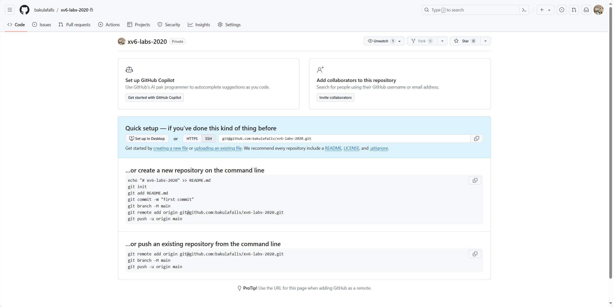
3.3 添加git仓库地址
查看 本地仓库git配置文件
```
cd xv6-labs-2020/
cat .git/config
> [core]
	repositoryformatversion = 0
	filemode = true
	bare = false
	logallrefupdates = true
[remote "origin"]
	url = git://g.csail.mit.edu/xv6-labs-2020
	fetch = +refs/heads/*:refs/remotes/origin/*
[branch "master"]
	remote = origin
	merge = refs/heads/master
[branch "util"]
	remote = origin
	merge = refs/heads/util
```
添加自己的github仓库地址
```
git remote add github git@github.com:bakulafalls/xv6-labs-2020.git
cat .git/config
>  [core]
	repositoryformatversion = 0
	filemode = true
	bare = false
	logallrefupdates = true
[remote "origin"]
	url = git://g.csail.mit.edu/xv6-labs-2020
	fetch = +refs/heads/*:refs/remotes/origin/*
[branch "master"]
	remote = origin
	merge = refs/heads/master
[branch "util"]
	remote = origin
	merge = refs/heads/util
[remote "github"]
	url = git@github.com:bakulafalls/xv6-labs-2020.git
	fetch = +refs/heads/*:refs/remotes/github/*
```
3.4 在项目目录下进行一遍2.3的操作

3.5 将实验代码推送github仓库
```c
// 将实验1用到的util分支推送到github
git checkout util
git push github util:util
```
3.6 建议每个实验创建一个测试分支，例如对于util来说
```c
git checkout util         // 切换到util分支
git checkout -b util_test // 建立并切换到util的测试分支
```
当在***util_test***分支中每测试通过一个作业，请提交（```git commit```）代码，并将所做的修改合并（```git merge```）到util中，然后提交（```git push```）到github
```c
git add .
git commit -m "完成了第一个作业"
git checkout util
git merge util_test
git push github util:util
```

# Lab1: Xv6 and Unix utilities
## Task1 Launch xv6
参考网站：[课程官方实验部署指南](https://pdos.csail.mit.edu/6.828/2018/tools.html)， [CENTOS7部署经验](https://blog.csdn.net/weixin_46803360/article/details/128116051?ops_request_misc=&request_id=&biz_id=102&utm_term=CENTOSMIT6.828&utm_medium=distribute.pc_search_result.none-task-blog-2~all~sobaiduweb~default-0-128116051.142^v100^pc_search_result_base1&spm=1018.2226.3001.4187)， [Ubuntu部署经验](https://blog.csdn.net/u013573243/article/details/129403949?ops_request_misc=%257B%2522request%255Fid%2522%253A%2522171627969616800197084566%2522%252C%2522scm%2522%253A%252220140713.130102334.pc%255Fall.%2522%257D&request_id=171627969616800197084566&biz_id=0&utm_medium=distribute.pc_search_result.none-task-blog-2~all~first_rank_ecpm_v1~rank_v31_ecpm-3-129403949-null-null.142^v100^pc_search_result_base1&utm_term=Error%3A%20Couldnt%20find%20a%20riscv64%20version%20of%20GCC%2Fbinutils.%20***%20To%20turn%20off%20this%20error%2C%20run%20gmake%20TOOLPREFIX%3D%20....&spm=1018.2226.3001.4187)
自用环境：CentOS7(VMware) + https://github.com/mit-pdos/xv6-public
实验用：```$ git clone git://g.csail.mit.edu/xv6-labs-2020```
**编译错误：**
1. 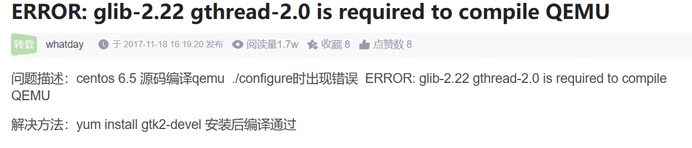
1. install riscv tool-gnu-toolchain 时，make时之前添加的PATH中的环境变量不在了，需重新在控制台输入
```
# source ~/.bash_profile
# echo $PATH
> /usr/local/bin:/usr/local/sbin:/usr/bin:/usr/sbin:/bin:/sbin:/root/bin:/root/bin:/opt/riscv/bin
```
或者在.bashrc中设置环境变量

**clone 错误：**
```
error: RPC failed; result=18, HTTP code = 20000 KiB/s   
fatal: The remote end hung up unexpectedly
fatal: 过早的文件结束符（EOF）
fatal: index-pack failed
```
解决方法：
  ```
  git config --global http.postBuffer 524288000
  ```

  **toolchain make 错误：**
 1. ``` log2’不是‘std’的成员```原因是Linux系统中C标准库版本过低
[解决方法](https://blog.csdn.net/m0_43453853/article/details/109381488?ops_request_misc=%257B%2522request%255Fid%2522%253A%2522171634022916800184171915%2522%252C%2522scm%2522%253A%252220140713.130102334.pc%255Fall.%2522%257D&request_id=171634022916800184171915&biz_id=0&utm_medium=distribute.pc_search_result.none-task-blog-2~all~first_rank_ecpm_v1~rank_v31_ecpm-4-109381488-null-null.142^v100^pc_search_result_base1&utm_term=make%20%E6%8A%A5%E9%94%99Log2%E4%B8%8D%E6%98%AFstd%E7%9A%84%E6%88%90%E5%91%98&spm=1018.2226.3001.4187)
1. 
```
g++: fatal error: 已杀死 signal terminated program cc1plus
compilation terminated.
```
原因：内存不足
尝试在VMware中将内存设为8G

<h2 id="make-err"> xv6-labs-2020 make 错误：</h2>

1. 
```
user/sh.c: In function 'runcmd':
user/sh.c:58:1: error: infinite recursion detected []8;;https://gcc.gnu.org/onlinedocs/gcc/Warning-Options.html#index-Winfinite-recursion-Werror=infinite-recursion]8;;]
```
参照[记录MIT6.s081 编译QEMU中的错误](https://blog.csdn.net/weixin_51472360/article/details/128800041),修改user/sh.c:58处，添加__attribute__((noreturn))
```c {.line-numbers}
diff --git a/user/sh.c b/user/sh.c
index 83dd513..c96dab0 100644
--- a/user/sh.c
+++ b/user/sh.c
@@ -54,6 +54,7 @@ void panic(char*);
 struct cmd *parsecmd(char*);
 
 // Execute cmd.  Never returns.
+__attribute__((noreturn))
 void
 runcmd(struct cmd *cmd)
 {
```
2. make: qemu-system-riscv64：命令未找到
新版的实验代码是在riscv上编译的，所以对应的qemu也需要安装riscv版本
[方法参考](https://stackoverflow.com/questions/66718225/qemu-system-riscv64-is-not-found-in-package-qemu-system-misc)

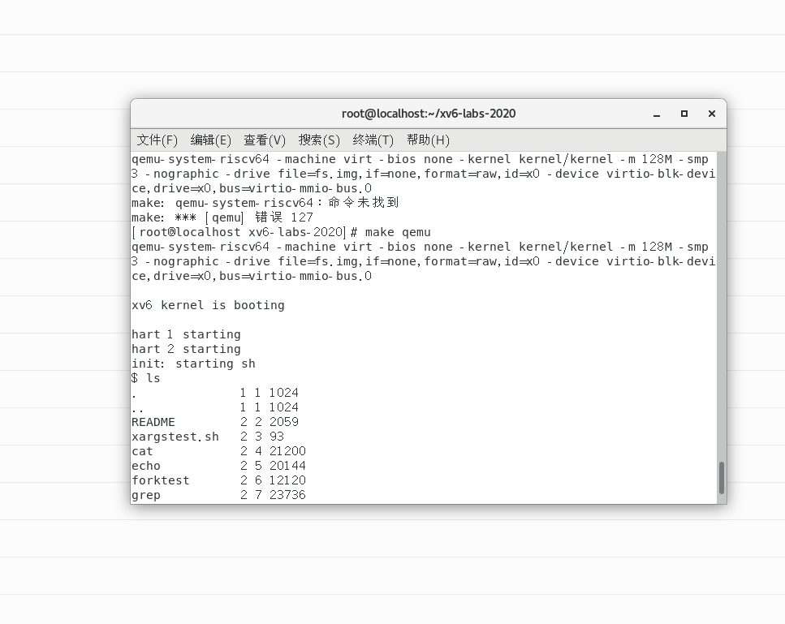
启动成功

***退出 qemu*** : ```Ctrl-a x```
***显示当前进程***：```Ctrl-p```

## Task2 Sleep
<span style="background-color:lightgreen;">实现xv6的UNIX程序```sleep```：您的```sleep```应该暂停到用户指定的计时数。一个滴答(tick)是由xv6内核定义的时间概念，即来自定时器芯片的两个中断之间的时间。您的解决方案应该在文件***user/sleep.c***中。</span>

**提示：**
* 在你开始编码之前，请阅读《book-riscv-rev1》的第一章

* 看看其他的一些程序（如 ***/user/echo.c, /user/grep.c, /user/rm.c***）查看如何获取传递给程序的命令行参数
<details>
    <summary><span style="color:blue;">echo.c</span> </summary>

```c {.line-numbers}
#include "kernel/types.h"
#include "kernel/stat.h"
#include "user/user.h"

int
main(int argc, char *argv[])  // argc为命令行的总的参数个数；argv为一个包含所有参数的字符串数组
{
  int i;

  for(i = 1; i < argc; i++){  // i=0为程序名称跳过
    write(1, argv[i], strlen(argv[i]));  // 1 为标准输出文件描述符；argv[i]为要写入的字符串
    if(i + 1 < argc){  // 当前参数不是最后一个参数时，输出一个空格
      write(1, " ", 1);
    } else {
      write(1, "\n", 1);  //当前参数是最后一个参数时，输出一个换行符
    }
  }
  exit(0);
}
```
</details>

<details>
    <summary><span style="color:blue;">grep.c</span> </summary>

```c {.line-numbers}
// Simple grep.  Only supports ^ . * $ operators.

#include "kernel/types.h"
#include "kernel/stat.h"
#include "user/user.h"

char buf[1024];
int match(char*, char*);

void
grep(char *pattern, int fd)
{
  int n, m;   // 用于跟踪读取的字符数和缓冲区中的字符总数
  char *p, *q;  // 用于在缓冲区中操作字符串

  m = 0; 
  while((n = read(fd, buf+m, sizeof(buf)-m-1)) > 0){
    m += n;  // 更新缓存区字符总数
    buf[m] = '\0';  // 放置字符串结束符，使得buf为有效字符串
    p = buf;  // 将指针p设置为缓冲区的开始，准备开始处理缓冲区中的数据
    while((q = strchr(p, '\n')) != 0){   // 查找每一行的结束位置(\n), strchr函数查找从p开始的第一个\n字符
      *q = 0;  // 将找到的换行符替换为字符串结束符，这样从p到q的内容现在是一个独立的字符串
      if(match(pattern, p)){
        *q = '\n';  // 如果匹配，将之前替换的字符串结束符恢复为换行符，以保持原始数据的完整性
        write(1, p, q+1 - p);  // 将该行(包括\n)写入标准输出
      }
      p = q+1;  // 指针移至下一行的开始位置
    }
    if(m > 0){  // 检查是否还有未处理的数据在缓冲区中
      m -= p - buf;  // 计算剩余未处理的数据长度，并更新m
      memmove(buf, p, m);  // 将剩余的数据移动到缓冲区的开始位置，为下一次读取做准备
    } 
  }
}

int
main(int argc, char *argv[])
{
  int fd, i;
  char *pattern;

  if(argc <= 1){
    fprintf(2, "usage: grep pattern [file ...]\n");
    exit(1);
  }
  pattern = argv[1];

  if(argc <= 2){
    grep(pattern, 0);
    exit(0);
  }

  for(i = 2; i < argc; i++){  // 遍历所有命令行参数（文件名）
    if((fd = open(argv[i], 0)) < 0){
      printf("grep: cannot open %s\n", argv[i]);
      exit(1);
    }
    grep(pattern, fd);
    close(fd);
  }
  exit(0);
}

// Regexp matcher from Kernighan & Pike,
// The Practice of Programming, Chapter 9.

int matchhere(char*, char*);
int matchstar(int, char*, char*);

int
match(char *re, char *text)
{
  if(re[0] == '^')
    return matchhere(re+1, text);
  do{  // must look at empty string
    if(matchhere(re, text))
      return 1;
  }while(*text++ != '\0');
  return 0;
}

// matchhere: search for re at beginning of text
int matchhere(char *re, char *text)
{
  if(re[0] == '\0')
    return 1;
  if(re[1] == '*')
    return matchstar(re[0], re+2, text);
  if(re[0] == '$' && re[1] == '\0')
    return *text == '\0';
  if(*text!='\0' && (re[0]=='.' || re[0]==*text))
    return matchhere(re+1, text+1);
  return 0;
}

// matchstar: search for c*re at beginning of text
int matchstar(int c, char *re, char *text)
{
  do{  // a * matches zero or more instances
    if(matchhere(re, text))
      return 1;
  }while(*text!='\0' && (*text++==c || c=='.'));
  return 0;
}

```
</details>

<details>
    <summary><span style="color:blue;">rm.c</span> </summary>

```c {.line-numbers}
#include "kernel/types.h"
#include "kernel/stat.h"
#include "user/user.h"

int
main(int argc, char *argv[])
{
  int i;

  if(argc < 2){  // 检查是否至少提供了一个文件名
    fprintf(2, "Usage: rm files...\n");
    exit(1);
  }

  for(i = 1; i < argc; i++){
    if(unlink(argv[i]) < 0){  // unlink函数返回一个小于0的值，表示删除操作失败
      fprintf(2, "rm: %s failed to delete\n", argv[i]);
      break;
    }
  }

  exit(0);
}
```
</details>

* 如果用户忘记传递参数，```sleep```应该打印一条错误信息

* 命令行参数作为字符串传递; 您可以使用```atoi```将其转换为数字（详见 ***/user/ulib.c***）
```c {.line-numbers}
// ulib.c
#include "kernel/types.h"
#include "kernel/stat.h"
#include "kernel/fcntl.h"
#include "user/user.h"

// ...

int
atoi(const char *s)
{
  int n;

  n = 0;
  while('0' <= *s && *s <= '9')
    n = n*10 + *s++ - '0';  // 之前的数字左移一位（即乘以10），然后加上新的数字
  return n;
}
```

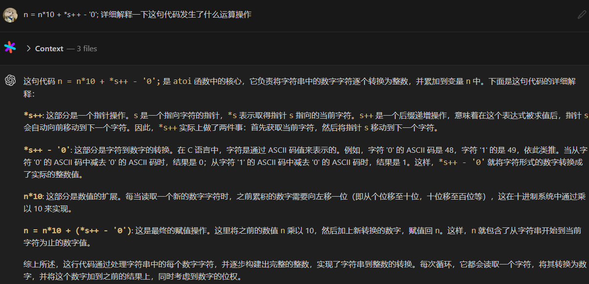
* 使用系统调用```sleep```

* 请参阅kernel/sysproc.c以获取实现```sleep```系统调用的xv6内核代码（查找```sys_sleep```），***user/user.h***提供了```sleep```的声明以便其他程序调用，用汇编程序编写的***user/usys.S***可以帮助```sleep```从用户区跳转到内核区。
```c {.line-numbers}
// kernel/sysproc.c
//...
uint64
sys_sleep(void)
{
  int n;
  uint ticks0;

  if(argint(0, &n) < 0)
    return -1;
  acquire(&tickslock);
  ticks0 = ticks;
  while(ticks - ticks0 < n){
    if(myproc()->killed){
      release(&tickslock);
      return -1;
    }
    sleep(&ticks, &tickslock);
  }
  release(&tickslock);
  return 0;
}
```

* 确保```main```函数调用```exit()```以退出程序。

* 将你的```sleep```程序添加到***Makefile***中的```UPROGS```中；完成之后，```make qemu```将编译您的程序，并且您可以从xv6的shell运行它。

* 看看Kernighan和Ritchie编著的《C程序设计语言》（第二版）来了解C语言。
***
**Sleep**
```c {.line-numbers}
#include "kernel/types.h"
#include "user/user.h"

int main(int argc, char const *argv[])
{
  if (argc != 2) { //参数错误
    fprintf(2, "usage: sleep <time>\n");
    exit(1);
  }
  sleep(atoi(argv[1]));
  exit(0);
}
```

## Task3 Pingpong
<span style="background-color:lightgreen;">编写一个使用UNIX系统调用的程序来在两个进程之间“ping-pong”一个字节，请使用两个管道，每个方向一个。父进程应该向子进程发送一个字节;子进程应该打印“\<pid>: received ping”，其中\<pid>是进程ID，并在管道中写入字节发送给父进程，然后退出;父级应该从读取从子进程而来的字节，打印“\<pid>: received pong”，然后退出。您的解决方案应该在文件```user/pingpong.c```中。</span>

**提示：**
* Use ```pipe``` to create a pipe.
* Use ```fork``` to create a child.
* Use ```read``` to read from the pipe, and ```write``` to write to the pipe.
* Use ```getpid``` to find the process ID of the calling process.
* Add the program to ```UPROGS``` in Makefile.
* User programs on xv6 have a limited set of library functions available to them. You can see the list in ```user/user.h```; the source (other than for system calls) is in ```user/ulib.c```, ```user/printf.c```, and ```user/umalloc.c```.
***
**Ping-pong**
```c {.line-numbers}
#include "kernel/types.h"
#include "user/user.h"

int
main(int argc, char const *argv[])
{
  if (argc != 1) {  // 参数错误
    fprintf(2, "usage: pingpong\n");
    exit(1);
  }

  int pid, n = 0;  // n为退出错误flag
  int fds1[2];  // parent->child
  int fds2[2];  // child->parent
  char buf = 'Z';  // 用于传送的字节

  // create two pipes, with four FDs in fds1[0], fds1[1], fds2[0], fds2[1]
  pipe(fds1);
  pipe(fds2);

  pid = fork();
  if (pid < 0) {
    fprintf(2, "fork() error!\n");
    // 错误处理
    close(fds1[1]);
    close(fds2[0]); 
    close(fds1[0]);
    close(fds2[1]);
    n = 1;
  }
  else if (pid == 0) {  // child proc 
    // 关闭子进程中不用的管道口
    close(fds1[1]);
    close(fds2[0]); 
    // if read buf, print
    if (read(fds1[0], &buf, sizeof(buf)) != sizeof(char)) {
      fprintf(2, "child read error!\n");
      n = 1;
    }
    else {
      fprintf(2, "%d: received ping\n", getpid());
    }
    close(fds1[0]);
    // send buf to parent through pipe2
    if (write(fds2[1], &buf, sizeof(buf)) != sizeof(char)) {
      fprintf(2, "child write error!\n");
      n = 1;
    }
    close(fds2[1]);
    // 退出子进程
    exit(n);
  }
  else {  // parent proc
    // 关闭父进程中不用的管道口
    close(fds1[0]);
    close(fds2[1]);
    // 通过pipe1向Child发送buf
    if (write(fds1[1], &buf, sizeof(buf)) != sizeof(char)) {
      fprintf(2, "parent write error!\n");
      n = 1;
    }
    close(fds1[1]);
    // if read buf, print
    if (read(fds2[0], &buf, sizeof(buf)) != sizeof(char)) {
      fprintf(2, "parent read error!\n");
      n = 1;
    }
    else {
      fprintf(2, "%d: received pong\n", getpid());
    }
    close(fds2[0]);

    // 等待子进程退出
    wait(&n);
  }

  exit(n);
}

```
测试结果：
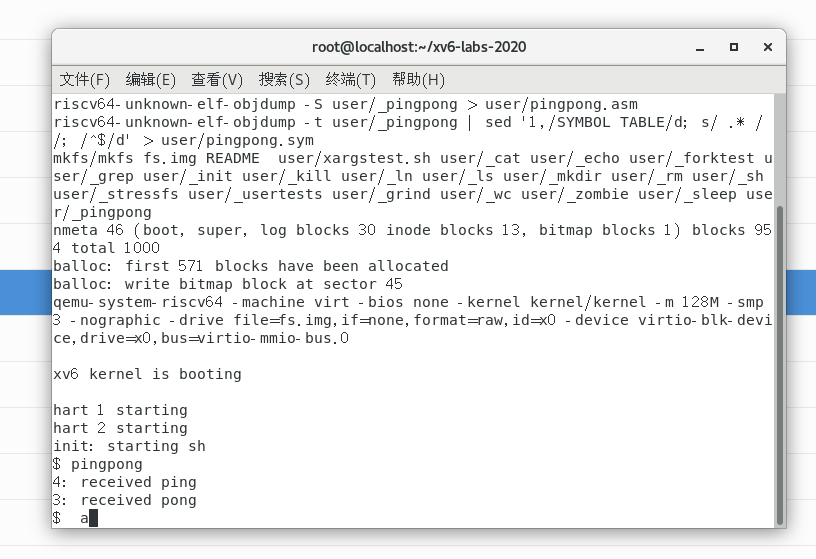

## Task4 Primes(Moderate/Hard)
<span style="background-color:lightgreen;">使用管道编写```prime sieve```(筛选素数)的并发版本。这个想法是由Unix管道的发明者Doug McIlroy提出的。请查看[这个网站](https://swtch.com/~rsc/thread/)，该网页中间的图片和周围的文字解释了如何做到这一点。您的解决方案应该在***user/primes.c***文件中。</span>
你的目标是使用```pipe```和```fork```来设置管道。第一个进程将数字2到35输入管道。对于每个素数，您将安排创建一个进程，该进程通过一个管道从其左邻居读取数据，并通过另一个管道向其右邻居写入数据。由于xv6的文件描述符和进程数量有限，因此第一个进程可以在35处停止。

**参考资料翻译：**
sieve of Eratosthenes算法伪代码：
```
p = get a number from left neighbor
print p
loop:
    n = get a number from left neighbor
    if (p does not divide n)
        send n to right neighbor
```
图解：
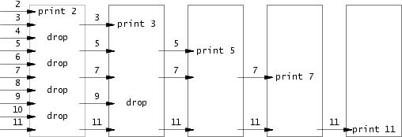
生成进程可以将数字2、3、4、…、1000输入管道的左端：行中的第一个进程消除2的倍数，第二个进程消除3的倍数，第三个进程消除5的倍数，依此类推。

**提示：**
* 请仔细关闭进程不需要的文件描述符，否则您的程序将在第一个进程达到35之前就会导致xv6系统资源不足。

* 一旦第一个进程达到35，它应该使用```wait```等待整个管道终止，包括所有子孙进程等等。因此，主```primes```进程应该只在打印完所有输出之后，并且在所有其他```primes```进程退出之后退出。

* 提示：当管道的```write```端关闭时，```read```返回零。

* 最简单的方法是直接将32位（4字节）int写入管道，而不是使用格式化的ASCII I/O。

* 您应该仅在需要时在管线中创建进程。

* 将程序添加到Makefile中的```UPROGS```

**示例输出：**
```sh
$ make qemu
...
init: starting sh
$ primes
prime 2
prime 3
prime 5
prime 7
prime 11
prime 13
prime 17
prime 19
prime 23
prime 29
prime 31
$
```
***
**Primes**
```c {.line-numbers}
#include "kernel/types.h"
#include "user/user.h"

/**
 *@brief 读取上一个管道的第一个数据并打印
 *@param pfirst 指向储存第一个数据的指针
*/
int
lpipe_first_data(int lpipe[2], int *pfirst)
{
  if (read(lpipe[0], pfirst, sizeof(int)) == sizeof(int)) {
    fprintf(2, "prime %d\n", *pfirst);
    return 0;
  }
  return -1;
}


/**
 *@brief 将lpipe中的数据传入p中，剔除掉不能被 first_number整除的数据
 *@param lpipe 上一个管道
 *@param rpipe 新的管道
 *@param pfirst 指向储存第一个数据的指针
*/
void
transmit_data(int lpipe[2], int rpipe[2], int *pfirst)
{
  int data;  // 存放读取的lpipe数据
  while (read(lpipe[0], &data, sizeof(int)) == sizeof(int))
  {
    // 将无法整除的数据传入rpipe
    if (data % *pfirst) {
      write(rpipe[1], &data, sizeof(int));
    }
  }
  close(lpipe[0]);
  close(rpipe[1]);
}


/**
 *@brief 寻找素数 
 *@param lpipe: 上一个管道的管道符
*/
__attribute__((noreturn))  // 告诉编译器，这个函数不会返回
void
find_primes(int lpipe[2])
{
  // 关闭上一个管道的写入端，已经不需要了
  close(lpipe[1]);
  int first_number;
  if (lpipe_first_data(lpipe, &first_number) == 0)  // 打印上一个管道得到的素数
  {
    int p[2];
    pipe(p);  // 新建管道作为当前管道
    //  将lpipe中的数据传入p中，剔除掉不能被 first_number整除的数据
    transmit_data(lpipe, p, &first_number);
    if (fork() == 0) {  //  新建子进程处理新的管道
      close(p[1]);
      find_primes(p);  // 递归
    }
    else {
      close(p[0]);
      close(p[1]);
      wait(0);  // 最后一个孙进程结束前，所有之前的进程都等待
    }
  }
  exit(0);
}


int
main(int argc, char const *argv[])
{
  if (argc != 1) {  // 参数错误
    fprintf(2, "usage: primes\n");
    exit(1);
  }

  int pid;
  int fds[2];
  pipe(fds);

  for (int i=2; i <= 35; i++)  // 写入2-35到第一个管道中
  {
    write(fds[1], &i, sizeof(int));
  }

  pid = fork();
  if (pid == 0) {  // child
    // 寻找素数
    find_primes(fds);
  }
  else {  // oldest parent, do nothing but wait
    close(fds[0]);
    close(fds[1]);
    wait(0);
  }
  exit(0);
}
```
需要注意的是， 我搭建的环境下的编译器似乎不能很好地理解递归停止条件，参照[task1中的xv6-labs-2020 make 错误](#make-err)，须在使用递归的函数前面添加```__attribute__((noreturn))```, 才能编译通过，输出如下：
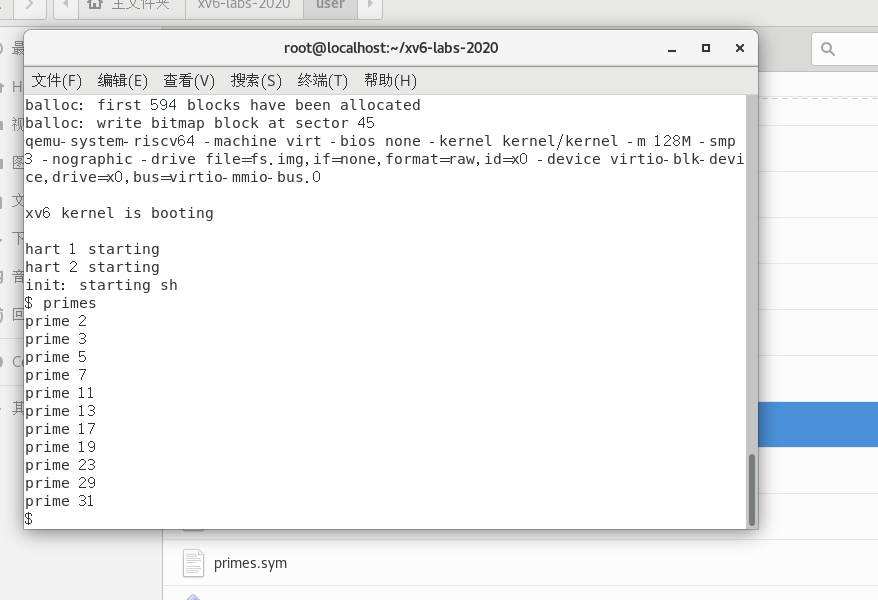

## Task5 Find(Moderate)
<span style="background-color:lightgreen;">写一个简化版本的UNIX的```find```程序：查找目录树中具有特定名称的所有文件，你的解决方案应该放在***user/find.c***.</span>

**提示：**
* 查看***user/ls.c***文件学习如何读取目录
<details>
    <summary><span style="color:blue;">ls.c</span> </summary>

```c {.line-numbers}
#include "kernel/types.h"
#include "kernel/stat.h"
#include "user/user.h"
#include "kernel/fs.h"

char*
fmtname(char *path)
{
  static char buf[DIRSIZ+1];
  char *p;

  // Find first character after last slash.
  for(p=path+strlen(path); p >= path && *p != '/'; p--)
    ;  // p指向从后往前搜索到的第一个'/'
  p++;

  // Return blank-padded name.
  if(strlen(p) >= DIRSIZ)
    return p;
  memmove(buf, p, strlen(p));
  memset(buf+strlen(p), ' ', DIRSIZ-strlen(p));  // 确保所有文件名长度相同
  return buf;
}

void
ls(char *path)
{
  char buf[512], *p;
  int fd;
  struct dirent de;  // 目录
  struct stat st;  // 状态信息

  if((fd = open(path, 0)) < 0){
    fprintf(2, "ls: cannot open %s\n", path);
    return;
  }

  if(fstat(fd, &st) < 0){
    fprintf(2, "ls: cannot stat %s\n", path);
    close(fd);
    return;
  }

  switch(st.type){
  case T_FILE:  // (2)
    printf("%s %d %d %l\n", fmtname(path), st.type, st.ino, st.size);
    break;

  case T_DIR:  // (1)
    if(strlen(path) + 1 + DIRSIZ + 1 > sizeof buf){
      printf("ls: path too long\n");
      break;
    }
    strcpy(buf, path);  // 在 buf 中构建新的路径，为读取目录内容做准备
    p = buf+strlen(buf);
    *p++ = '/';
    while(read(fd, &de, sizeof(de)) == sizeof(de)){
      if(de.inum == 0)
        continue;
      memmove(p, de.name, DIRSIZ);
      p[DIRSIZ] = 0;  // 在复制的文件名后添加一个字符串结束符
      if(stat(buf, &st) < 0){
        printf("ls: cannot stat %s\n", buf);
        continue;
      }
      printf("%s %d %d %d\n", fmtname(buf), st.type, st.ino, st.size);
    }
    break;
  }
  close(fd);
}

int
main(int argc, char *argv[])
{
  int i;

  if(argc < 2){
    ls(".");
    exit(0);
  }
  for(i=1; i<argc; i++)
    ls(argv[i]);
  exit(0);
}
```
</details>

* 使用递归允许```find```下降到子目录中
* 不要在“```.```”和“```..```”目录中递归
* 对文件系统的更改会在qemu的运行过程中一直保持；要获得一个干净的文件系统，请运行```make clean```，然后```make qemu```
* 你将会使用到C语言的字符串，要学习它请看《C程序设计语言》（K&R）,例如第5.5节
* 注意在C语言中不能像python一样使用“```==```”对字符串进行比较，而应当使用```strcmp()```
* 将程序加入到***Makefile***的```UPROGS```

**示例输出(文件系统中包含文件b和a/b)：**
```sh
$ make qemu
...
init: starting sh
$ echo > b
$ mkdir a
$ echo > a/b
$ find . b
./b
./a/b
$
```

**find**
```c {.line-numbers}
#include "kernel/types.h"
#include "kernel/stat.h"
#include "user/user.h"
#include "kernel/fs.h"

/**
 *@brief 寻找指定文件
 *@param path 要搜寻的目录路径  
 *@param filename 要搜寻的文件名
*/
//__attribute__((noreturn))
void
find(char *path, const char *filename)
{
  // 在第一级目录下搜寻
  char buf[512], *p;  // buf用于构建路径
  int fd;
  struct dirent de;  // 目录
  struct stat st;  // 状态信息

  if((fd = open(path, 0)) < 0){
    fprintf(2, "find: cannot open %s\n", path);
    return;
  }

  if(fstat(fd, &st) < 0){
    fprintf(2, "find: cannot stat %s\n", path);
    close(fd);
    return;
  }

  if (st.type != T_DIR) {
    fprintf(2, "invaild path! usage: find <dir> <filename>\n");
    close(fd);
    return;
  }

  if(strlen(path) + 1 + DIRSIZ + 1 > sizeof buf){
      fprintf(2, "ls: path too long\n");
      return;
    }

  strcpy(buf, path);  // 在 buf 中构建新的路径，为读取目录内容做准备
  p = buf+strlen(buf);
  *p++ = '/';  // p指向最后一个'/'后一个字符 
  while(read(fd, &de, sizeof(de)) == sizeof(de)){  // 遍历当前目录下每一个文件
    if(de.inum == 0)
      continue;
    memmove(p, de.name, DIRSIZ);  // 添加路径名称
    p[DIRSIZ] = 0;  // 在复制的文件名后添加一个字符串结束符
    if(stat(buf, &st) < 0){
      fprintf(2, "ls: cannot stat %s\n", buf);
      continue;
    }

    // 递归， "." 和 ".." 目录除外
    if (st.type == T_DIR && strcmp(p, ".") != 0 && strcmp(p, "..") != 0)
    {
      find(buf, filename);
    }
    else if (strcmp(filename, p) == 0)  // p指向的字符串不为DIR, 而是FILE（忽略DEVICE的情况），进行文件名比对
    printf("%s\n", buf);
  }
}


int
main(int argc, char *argv[])
{
  if (argc != 3) {  // 参数错误
    fprintf(2, "usage: find <dir> <filename>\n");
    exit(1);
  }

  find(argv[1], argv[2]);
  exit(0);
}
```

**测试输出：**
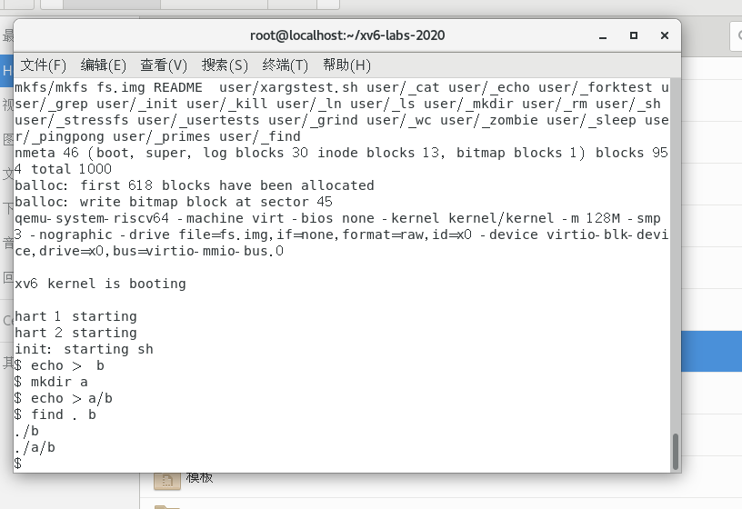

## Task6 xargs(Moderate)
<span style="background-color:lightgreen;">编写一个简化版UNIX的```xargs```程序：它从标准输入中按行读取，并且为每一行执行一个命令，将行作为参数提供给命令。你的解决方案应该在***user/xargs.c***</span>

**示例1：**
```sh
$ echo hello too | xargs echo bye
bye hello too
$
```
上面的命令实际上执行的是```echo bye hello too```

**示例2 ：**  UNIX系统下设置参数-n为1等效于lab所用系统(每次从输入中取出一个参数来执行后面的命令)
```sh
$ echo "1\n2" | xargs -n 1 echo line
line 1
line 2
$
```
对于每个输入项（这里是 "1" 和 "2"），```xargs``` 都会执行 ```echo line```，并将输入项作为参数附加到 ```echo line``` 命令后面。

**示例3：**
```sh
$ find . b | xargs grep hello
```
上面的命令会在"."下查找所有文件名为b的文件， 并在每个文件b中执行```grep hello```

**提示：**
* 对于示例1，"|"创建了一个管道连接两个命令：
```echo hello too``` 在管道的写端，对应标准输入流0
```xargs echo bye``` 在管道的读端。
* 使用```fork```和```exec```对每行输入调用命令，在父进程中使用```wait```等待子进程完成命令。
* 要读取单个输入行，请一次读取一个字符，直到出现换行符（```'\n'```）。
* ***kernel/param.h***声明```MAXARG```，如果需要声明```argv```数组，这可能很有用。
* 将程序添加到***Makefile***中的```UPROGS```。
* 对文件系统的更改会在qemu的运行过程中保持不变；要获得一个干净的文件系统，请运行```make clean```，然后```make qemu```

**xargs**
```c {.line-numbers}
#include "kernel/types.h"
#include "kernel/param.h"
#include "user/user.h"

#define MAXSZ 512

// 当前字符状态定义
enum state {
  S_WAIT,           // 等待输入（初始状态、空格）
  S_ARG,            // 当前为参数
  S_ARG_END,        // 参数结束
  S_ARG_LINE_END,   // 左侧有参数的换行，e.g.: "arg\n"
  S_LINE_END,       // 左侧有空格的换行，e.g.: "arg \n"
  S_END             // 结束
};

// 字符类型定义
enum char_type {
  C_SPC,  // 空格
  C_CHR,  // 普通字符
  C_LNEND // 换行符
};


/**
 *@brief 获取字符类型
 *@param c 要判定的字符
*/
enum char_type get_char_type(char c)
{
  switch (c) {
    case ' ':
      return C_SPC;
    case '\n':
      return C_LNEND;
    default:
      return C_CHR;
  }
}


/**
 *@brief 根据当前字符类型转换当前状态
 *@param last_state 判定前的状态
 *@param cur_char 当前字符种类
*/
enum state transform_state(enum state last_state, enum char_type cur_char)
{
  switch (last_state) {
    case S_WAIT:
      if (cur_char == C_SPC)    return S_WAIT; // 继续等待
      if (cur_char == C_LNEND)  return S_LINE_END;
      if (cur_char == C_CHR)    return S_ARG;
      break;
    case S_ARG:
      if (cur_char == C_SPC)    return S_ARG_END;  // 参数结束
      if (cur_char == C_LNEND)  return S_ARG_LINE_END;
      if (cur_char == C_CHR)    return S_ARG;  
      break;
    case S_ARG_END:  
    case S_ARG_LINE_END:
    case S_LINE_END:  // 换行后情况都一样
      if (cur_char == C_SPC)    return S_WAIT;  
      if (cur_char == C_LNEND)  return S_LINE_END;  // 连换两行
      if (cur_char == C_CHR)    return S_ARG;  
    default:  // S_END
      break;
  }
  return S_END;
}


int
main(int argc, char *argv[])  
{
  if (argc > MAXARG)  { // 参数错误
    fprintf(2, "Too many arguments!\n");
    exit(1);
  }

  enum state st = S_WAIT;  // 用于表示状态
  char lines[MAXSZ];  // 初始化内存用于读取命令参数
  char *p = lines;  // 初始化指针指向用于储存命令行的缓存
  char *new_argv[MAXARG] = {0};  // 初始化用于存储参数的指针数组
  int arg_start = 0;  // 参数起点
  int arg_end = 0;  // 参数终点
  int arg_cur = argc-1;  // 当前参数索引, 前面已经有argc-1个参数被记录了，如实例1中的"echo","bye",为argv[1:2]

  // 存储管道写入端里的原有的命令参数,如实例1中的"argx","echo","bye"，argc=3, 我们只储存"echo","bye"
  for (int i = 1; i < argc; ++i) {
    new_argv[i - 1] = argv[i];
  }

  // 对每一行命令参数循环, 每个while读取一个字符
  while (st != S_END ) {
    if (read(0, p, sizeof(char)) != sizeof(char)) {  // 读取到的命令为空，设置状态为结束
      st = S_END;
    }
    else {
      st = transform_state(st, get_char_type(*p));
      ++arg_end;  // 新读取了一个字符，需要更新当前参数结束位置
    }

    switch (st) {
      case S_WAIT:  // 忽略掉当前的空格，右移参数起始指针
        ++arg_start;
        break; 
      case S_ARG_END:  // 在new_argv中储存当前参数地址
        new_argv[arg_cur++] = &lines[arg_start];
        arg_start = arg_end;  // 移动参数起点到下一个参数位置
        *p = '\0';  // 在缓存中参数结尾添加字符串结束符
        break;
      case S_ARG_LINE_END:  // 先将参数地址存入newargv,然后和S_LINE_END一样执行命令
        new_argv[arg_cur++] = &lines[arg_start];
      case S_LINE_END:  // 为当前行执行命令
        arg_start = arg_end;
        *p = '\0';
        new_argv[arg_cur] = 0;  // 确保参数列表以NULL结束
        if (fork() == 0) {
          exec(argv[1], new_argv);  // arg[0]为xargs
          exit(0);  // 确保子进程在exec失败时退出 
        }
        arg_cur = argc - 1;  // 重置位置
        // 换行，清空参数
        for (int i = arg_cur; i < MAXARG; ++i)
          new_argv[i] = 0;
        wait(0);
        break;
      default:
        break;
    }

    p++;  // 读取下一个字符
  }

  exit(0);
}
```

**测试结果：**

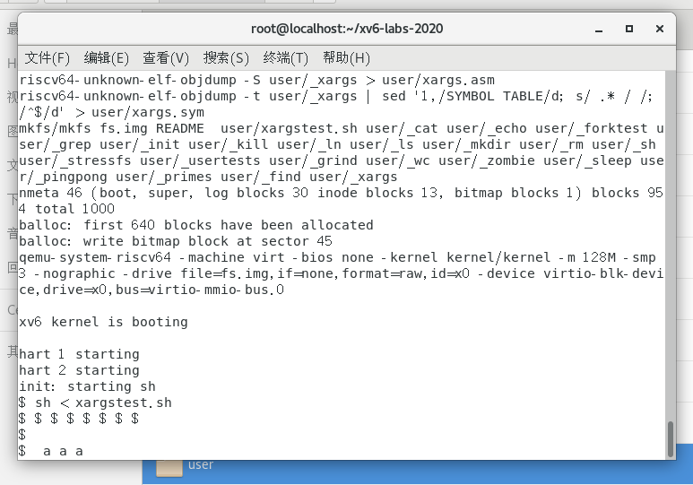
测试成功

# Lec03 OS Organization and System Calls
## 看书预习
*  操作系统的三大要求：**多路复用(multiplexing)、隔离(isolation)和交互(interaction)**, 书上侧重于讲解以**宏内核(monolithic kernel)** 为中心的主流设计来实现这三点。
*  RISC-V是一个64位的中央处理器，xv6是用基于 **“LP64”的C语言** 编写的, 所以```Long```(L)和指针变量(p)为64位，int为32位。
* Xv6是以qemu的“-machine virt”选项模拟的支撑硬件编写的。这包括RAM、包含引导代码的ROM、一个到用户键盘/屏幕的串行连接，以及一个用于存储的磁盘。
* 用户态=用户模式=目态
  核心态=管理模式=管态 
* **宏内核**：整个操作系统都驻留在内核中，这样**所有系统调用的实现都以管理模式运行**。
优点：方便操作系统设计者进行设计，操作系统的不同部分更容易合作
缺点：操作系统不同部分之间的接口通常很复杂，内核代码量更大使得更容易出现的bug经常会导致计算机停止工作.
* **微内核（microkernel）**： 为降低内核出错的风险，最大限度地**减少**在**管理模式下运行的操作系统代码量**，并在用户模式下执行大部分操作系统
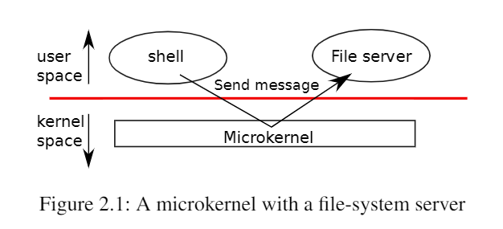
图中，**文件系统**作为**用户级进程**运行。作为进程运行的操作系统服务被称为**服务器**。为了允许应用程序与文件服务器交互，内核提供了允许从一个用户态进程向另一个用户态进程发送消息的进程间通信机制。例如，如果像shell这样的应用程序想要读取或写入文件，它会向文件服务器发送消息并等待响应。
* 单机微内核操作系统中几乎无一例外地都采用**客户/服务器(C/S)模式**，将操作系统中最基本的部分放入内核中，而把操作系统的绝大部分功能都放在微内核外面的一组服务器(进程)中实现。
* 内核模块间接口(***kernel/defs.h***):

|文件|描述|
|----|-----------------|
|bio.c|	文件系统的磁盘块缓存|
|console.c|	连接到用户的键盘和屏幕|
|entry.S|	首次启动指令|
|exec.c	|exec()系统调用|
|file.c	|文件描述符支持|
|fs.c	|文件系统|
|kalloc.c|	物理页面分配器|
|kernelvec.S	|处理来自内核的陷入指令以及计时器中断|
|log.c	|文件系统日志记录以及崩溃修复|
|main.c	|在启动过程中控制其他模块初始化|
|pipe.c	|管道|
|plic.c	|RISC-V中断控制器|
|printf.c	|格式化输出到控制台|
|proc.c	|进程和调度|
|sleeplock.c	|Locks that yield the CPU|
|spinlock.c	|Locks that don’t yield the CPU.|
|start.c	|早期机器模式启动代码|
|string.c	|字符串和字节数组库|
|swtch.c	|线程切换|
|syscall.c	|Dispatch system calls to handling function.|
|sysfile.c	|文件相关的系统调用|
|sysproc.c	|进程相关的系统调用|
|trampoline.S	|用于在用户和内核之间切换的汇编代码|
|trap.c	|对陷入指令和中断进行处理并返回的C代码|
|uart.c	|串口控制台设备驱动程序|
|virtio_disk.c	|磁盘设备驱动程序|
|vm.c	|管理页表和地址空间|

* **进程(process)** 是操作系统的隔离单位。内核用来实现进程的机制包括  **用户/管理模式标志、地址空间和线程的时间切片**。
* 进程抽象给程序提供了一种错觉(illusion)，即它有自己的专用机器。进程为程序提供了一个看起来像是私有内存系统或地址空间的东西，其他进程不能读取或写入。进程还为程序提供了看起来像是自己的CPU来执行程序的指令。
* Xv6使用页表（由硬件实现）为每个进程提供自己的地址空间。RISC-V页表将虚拟地址（RISC-V指令操纵的地址）转换（或“映射”）为物理地址（CPU芯片发送到主存储器的地址）。
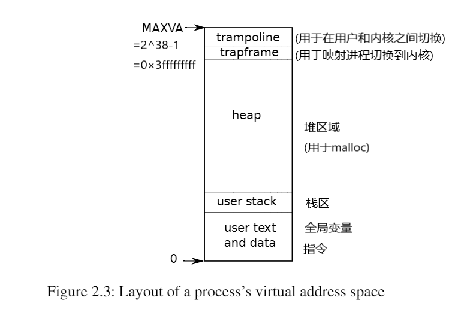
上图中一个进程的虚拟内存地址从0开始到MAXVA结束。xv6中指针有64位宽；硬件在页表中查找虚拟地址时只使用低39位；xv6只使用这39位中的38位。因此，最大地址是2^38-1=0x3fffffffff。堆区域用来使得进程可以根据需要来扩展。
*  **上下文（context）:**  进程执行所需的所有**数据和资源的集合**。
* **状态片段(piece of stste):** 在某个特定时刻，进程的一个或多个部分的状态信息。例如：
当前程序计数器的值，即下一条要执行的指令的地址。
某个特定寄存器的值，例如累加器的内容。
页表中的某个条目，表示某个虚拟页与物理页的映射关系。
打开的文件描述符列表中的一个条目，表示一个特定的文件及其当前状态。
这些"pieces of state"共同构成了进程的完整上下文。
* xv6内核为每个进程维护许多状态片段，并将它们聚集到一个```proc```(***kernel/proc.h:86***)结构体中。一个进程最重要的状态片段是**页表、内核栈区和运行状态**
```c 
// Per-process state
struct proc {
  struct spinlock lock;

  // p->lock must be held when using these:
  enum procstate state;        // Process state
  struct proc *parent;         // Parent process
  void *chan;                  // If non-zero, sleeping on chan
  int killed;                  // If non-zero, have been killed
  int xstate;                  // Exit status to be returned to parent's wait
  int pid;                     // Process ID

  // these are private to the process, so p->lock need not be held.
  uint64 kstack;               // Virtual address of kernel stack 内核栈区
  uint64 sz;                   // Size of process memory (bytes)
  pagetable_t pagetable;       // User page table
  struct trapframe *trapframe; // data page for trampoline.S
  struct context context;      // swtch() here to run process
  struct file *ofile[NOFILE];  // Open files
  struct inode *cwd;           // Current directory
  char name[16];               // Process name (debugging)
};
```

* 每个进程有两个栈区：一个*用户栈区*和一个*内核栈区*。进程的**执行线程**在主动使用它的用户栈和内核栈之间交替。
* 一个进程可以通过执行RISC-V的```ecall```指令进行系统调用，该指令提升硬件特权级别，并将程序计数器（PC）更改为内核定义的入口点，入口点的代码切换到内核栈，执行实现系统调用的内核指令，当系统调用完成时，内核切换回用户栈，并通过调用```sret```指令返回用户空间，该指令降低了硬件特权级别，并在系统调用指令刚结束时恢复执行用户指令。进程的线程可以在内核中“阻塞”等待I/O，并在I/O完成后恢复到中断的位置。
* RISC-V提供指令```mret```以进入管理模式，该指令最常用于将管理模式切换到机器模式的调用中返回。

## 3.2 操作系统隔离性（isolation）
* 操作系统不是直接将CPU提供给应用程序，而是向应用程序提供“进程”，**进程抽象了CPU**，这样操作系统才能在多个应用程序之间复用一个或者多个CPU

|操作系统|进程|CPU|
|--|--|--|

## 3.3 操作系统防御性（Defensive）
* 两种硬件支持来实现强隔离性：
1. **user/kernel mode** （在RISC-V中被称为**Supervisor mode**）
2. **页表(page table)** 或者 **虚拟内存（Virtual Memory）**

## 3.5 User/Kernel mode切换
* 在RISC-V架构的系统中，用户的应用程序执行系统调用的唯一方法就是通过的```ECALL```指令来触发**软中断**，```ecall```接受的数字参数代表了应用程序想要调用的System Call。

## 3.6 宏内核 vs 微内核 （Monolithic Kernel vs Micro Kernel）
* 微内核的的**用户空间<->内核空间跳转**是宏内核的两倍。通常微内核的挑战在于性能更差，有两个方面需要考虑：
1. 在user/kernel mode反复跳转带来的性能损耗。
2. 在一个类似宏内核的紧耦合系统，各个组成部分，例如文件系统和虚拟内存系统，可以很容易的共享page cache。而在微内核中，每个部分之间都很好的隔离开了，这种共享更难实现。进而导致更难在微内核中得到更高的性能。

## 3.7 编译运行kernel
* 内核的编译过程：
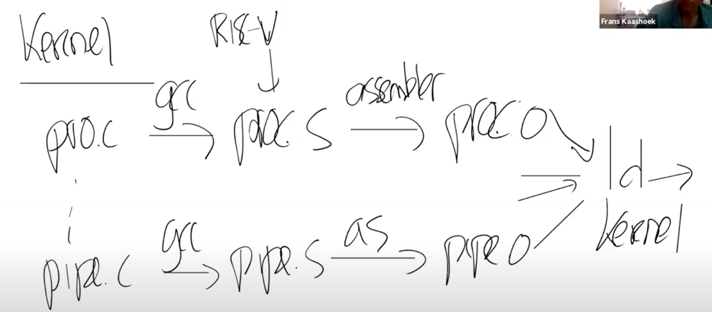
1. ***Makefile***（XV6目录下的文件）会读取一个C文件，例如```proc.c```；之后调用***gcc编译器***，生成一个文件叫做```proc.s```，这是RISC-V 汇编语言文件；之后再走到***汇编解释器***，生成```proc.o```，这是汇编语言的二进制格式。
2. Makefile会为所有内核文件做相同的操作
3. **系统加载器（Loader）** 会收集所有的.o文件，将它们链接在一起，并生成内核文件。生成的内核文件就是我们将会在QEMU中运行的文件.

* ***Makefile***还会创建```kernel.asm```，其中含了内核的完整汇编语言
```c {.line-numbers}
// kernel.asm
kernel/kernel：     文件格式 elf64-littleriscv


Disassembly of section .text:

0000000080000000 <_entry>:
    80000000:	00009117          	auipc	sp,0x9
    80000004:	a1010113          	addi	sp,sp,-1520 # 80008a10 <stack0>
    80000008:	6505                	lui	a0,0x1
    8000000a:	f14025f3          	csrr	a1,mhartid  // scrr: Control and Status Register Read; mhartid: machine hardware thread id
    8000000e:	0585                	addi	a1,a1,1
    80000010:	02b50533          	mul	a0,a0,a1
    80000014:	912a                	add	sp,sp,a0
    80000016:	076000ef          	jal	8000008c <start>

000000008000001a <spin>:
    8000001a:	a001                	j	8000001a <spin>

000000008000001c <timerinit>:
// at timervec in kernelvec.S,
// which turns them into software interrupts for
// devintr() in trap.c.
void
timerinit()
{
    8000001c:	1141                	addi	sp,sp,-16
    8000001e:	e422                	sd	s0,8(sp)
    80000020:	0800                	addi	s0,sp,16
    ...
```

可以看到第一个指令位于地址```0x80000000```，对应的是一个RISC-V指令。加载程序将**内核**放在```0x80000000```而不是```0x0```的原因是地址范围``0x0:0x80000000``包含**I/O设备**。

* 项目执行```make qemu```时可以看到：
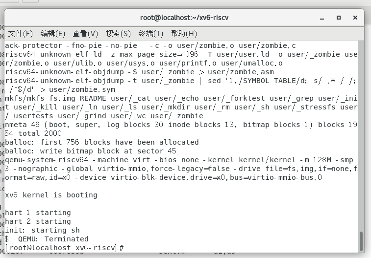
其中可以看到传给QEMU的几个参数：
1. ```-kernel```：这里传递的是内核文件（kernel目录下的***kernel***文件），这是将在QEMU中运行的程序文件。
1. ```-m```：这里传递的是RISC-V虚拟机将会使用的内存数量
1. ```-smp```：这里传递的是虚拟机可以使用的CPU核数
1. ```-drive```：传递的是虚拟机使用的磁盘驱动，这里传入的是fs.img文件

## 3.8 QEMU
* 在内部，在QEMU的主循环中，只在做一件事情：
1. **读取（read）** 4字节或者8字节的RISC-V指令。
1. **解析(decode)** RISC-V指令，并找出对应的操作码（op code）。我们之前在看```kernel.asm```的时候，看过一些操作码的二进制版本。通过解析，或许可以知道这是一个ADD指令，或者是一个SUB指令。
1. 之后，在软件中**执行(execute)** 相应的指令。

## 3.9 xv6的启动过程
* 一个实验：
1. 启动qemu,打开gdb
```sh
[root@localhost xv6-riscv]# make CPUS=1 qemu-gdb
sed "s/:1234/:25000/" < .gdbinit.tmpl-riscv > .gdbinit
*** Now run 'gdb' in another window.
qemu-system-riscv64 -machine virt -bios none -kernel kernel/kernel -m 128M -smp 1 -nographic -global virtio-mmio.force-legacy=false -drive file=fs.img,if=none,format=raw,id=x0 -device virtio-blk-device,drive=x0,bus=virtio-mmio-bus.0 -S -gdb tcp::25000
```

2. 下面需要用到RISC-V 64位Linux的gdb。安装方法参照[官方说明](https://pdos.csail.mit.edu/6.828/2023/tools.html), 我的CentOS7上安装方法稍微复杂一些：
<details>
    <summary><span style="color:blue;">安装方法</span> </summary>

```sh
// 1. 下载并安装源代码
wget http://ftp.gnu.org/gnu/gdb/gdb-8.3.1.tar.gz
tar -xvf gdb-8.3.1.tar.gz
cd gdb-8.3.1

// 2. 配置和安装：
./configure --target=riscv64-unknown-elf --with-python
make
sudo make install

// 3. 确认 gdb 安装并支持 RISC-V 架构：
riscv64-unknown-elf-gdb --version

// 4. 启动时发现安全路径设置警告，编辑或创建配置文件 /root/.config/gdb/gdbinit：
mkdir -p /root/.config/gdb
nano /root/.config/gdb/gdbinit
// 在文件中添加以下内容：
add-auto-load-safe-path /root/xv6-riscv/.gdbinit
// 关闭并保存文件，之后便可正常运行gdb
```
</details>

再启动一个RISC-V 64位Linux的gdb
```sh
[root@localhost xv6-riscv]# riscv64-unknown-elf-gdb
```
3. 在程序的入口处设置一个断点，参照***kernel.asm***，我们知道入口处在```0x8000000```，这是qemu跳转到的第一个指令
```sh
(gdb) b _entry
Breakpoint 1 at 0x8000000a
```
发现程序没有停在```0x8000000```而是```0x800000a```
```sh
(gdb) c
Continuing.

Breakpoint 1, 0x000000008000000a in _entry ()
=> 0x000000008000000a <_entry+10>:	f14025f3        	csrr	a1,mhartid
```
该行在地址0x8000000a读取了控制系统寄存器（Control System Register）mhartid，并将结果加载到了a1寄存器。
XV6从entry.s开始启动，这个时候没有内存分页，没有隔离性，并且运行在M-mode（machine mode）。**XV6会尽可能快的跳转到kernel mode或者说是supervisor mode**。我们在main函数设置一个断点，main函数已经运行在supervisor mode了。
4. 用gdb逐行运行main：
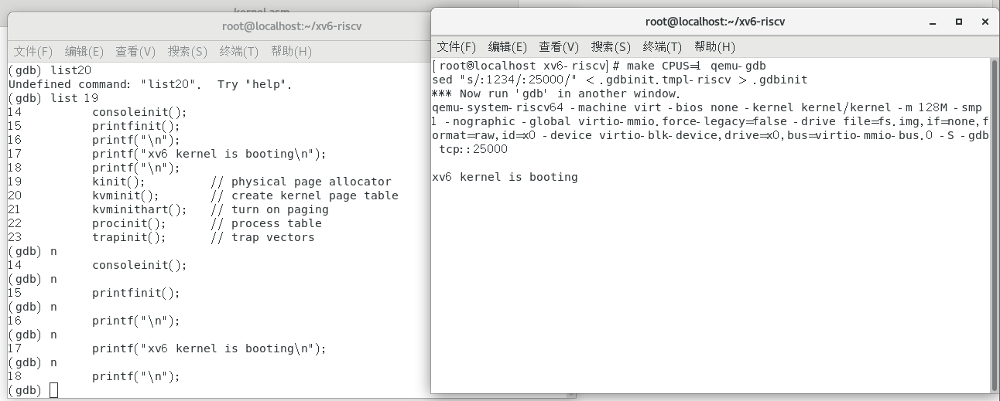
可以在qumu中看到相应的输出。
下面是初始化函数的功能：
```c
// start() jumps here in supervisor mode on all CPUs.
void
main()
{
  if(cpuid() == 0){
    consoleinit();
    printfinit();
    printf("\n");
    printf("xv6 kernel is booting\n");
    printf("\n");
    kinit();         // physical page allocator 设置好页表分配器（page allocator）
    kvminit();       // create kernel page table 设置好虚拟内存，这是下节课的内容
    kvminithart();   // turn on paging 打开页表，也是下节课的内容
    procinit();      // process table 设置好初始进程或者说设置好进程表单
    trapinit();      // trap vectors //
    trapinithart();  // install kernel trap vector   // 设置好user/kernel mode转换代码
    plicinit();      // set up interrupt controller  // 设置好中断控制器PLIC（Platform Level Interrupt Controller）
    plicinithart();  // ask PLIC for device interrupts  // 我们后面在介绍中断的时候会详细的介绍这部分，这是我们用来与磁盘和console交互方式
    binit();         // buffer cache 分配buffer cache
    iinit();         // inode table 初始化inode缓存
    fileinit();      // file table 初始化文件系统
    virtio_disk_init(); // emulated hard disk 初始化磁盘
    userinit();      // first user process 运行第一个进程
    __sync_synchronize();
    started = 1;
  }
```

5. 查看```userinit()```内部内容:
<details>
    <summary><span style="color:blue;">proc.c中部分代码</span> </summary>

```c 
// a user program that calls exec("/init")
// assembled from ../user/initcode.S
// od -t xC ../user/initcode
uchar initcode[] = {
  0x17, 0x05, 0x00, 0x00, 0x13, 0x05, 0x45, 0x02,
  0x97, 0x05, 0x00, 0x00, 0x93, 0x85, 0x35, 0x02,
  0x93, 0x08, 0x70, 0x00, 0x73, 0x00, 0x00, 0x00,
  0x93, 0x08, 0x20, 0x00, 0x73, 0x00, 0x00, 0x00,
  0xef, 0xf0, 0x9f, 0xff, 0x2f, 0x69, 0x6e, 0x69,
  0x74, 0x00, 0x00, 0x24, 0x00, 0x00, 0x00, 0x00,
  0x00, 0x00, 0x00, 0x00
};

// Set up first user process.
void
userinit(void)
{
  struct proc *p;

  p = allocproc();
  initproc = p;
  
  // allocate one user page and copy initcode's instructions
  // and data into it.
  uvmfirst(p->pagetable, initcode, sizeof(initcode));
  p->sz = PGSIZE;

  // prepare for the very first "return" from kernel to user.
  p->trapframe->epc = 0;      // user program counter
  p->trapframe->sp = PGSIZE;  // user stack pointer

  safestrcpy(p->name, "initcode", sizeof(p->name));
  p->cwd = namei("/");

  p->state = RUNNABLE;

  release(&p->lock);
}
```
</details>

```initcode```是用来初始化第一个用户进程，因为我们总是需要有一个用户进程在运行，这样才能实现与操作系统的交互。这里显示为程序的二进制形式，它会链接或者在内核中直接静态定义。实际上```initcode```包含4条汇编指令（见***user/initcode.S***）：
1）首先将init中的地址加载到```a0（la a0, init）```
2）argv中的地址加载到```a1（la a1, argv）```
3）exec系统调用对应的数字加载到```a7（li a7, SYS_exec）```
4）调用```ecall```, 将控制权交给了操作系统

5. 在```syscall```设置一个断点
```sh
(gdb) b syscall
Breakpoint 3 at 0x80002be2: file kernel/syscall.c, line 133.
```
让程序继续运行
```sh
(gdb) c
Continuing.

Breakpoint 3, syscall () at kernel/syscall.c:133
133	{
```
查看***syscall.c:133***处的代码：
```c
// part of syscall.c
void
syscall(void)
{                                // 133行
  int num;
  struct proc *p = myproc();

  num = p->trapframe->a7;  // 读取使用的系统调用对应的整数, 执行完后num=7
  if(num > 0 && num < NELEM(syscalls) && syscalls[num]) {
    // Use num to lookup the system call function for num, call it,
    // and store its return value in p->trapframe->a0
    p->trapframe->a0 = syscalls[num]();  // 实际执行系统调用
  } else {
    printf("%d %s: unknown sys call %d\n",
            p->pid, p->name, num);
    p->trapframe->a0 = -1;
  }
}
```
```num = p->trapframe->a7;```读取系统调用对应参数,用gdb查看num
```sh
(gdb) p num
$1 = 7
```
查看***syscall.h*** ，知道7对应的是系统调用```exec```
```c
// part of syscall.h
#define SYS_exec    7
```

6. 继续往下执行代码，跳入```p->trapframe->a0 = syscall[num]() ；```中(num=7)
```sh
(gdb) n
141	    p->trapframe->a0 = syscalls[num]();
(gdb) s
sys_exec () at kernel/sysfile.c:441
441	  argaddr(1, &uargv);
```
查看***sysfile.c*** 相关代码：
```c
// part of sysfile.c
uint64
sys_exec(void)
{
  char path[MAXPATH], *argv[MAXARG];
  int i;
  uint64 uargv, uarg;

  argaddr(1, &uargv);  // 441行
  if(argstr(0, path, MAXPATH) < 0) {
    return -1;
  }
  memset(argv, 0, sizeof(argv));  // 为参数分配空间
  for(i=0;; i++){
    if(i >= NELEM(argv)){
      goto bad;
    }
    if(fetchaddr(uargv+sizeof(uint64)*i, (uint64*)&uarg) < 0){
      goto bad;
    }
    if(uarg == 0){
      argv[i] = 0;
      break;
    }
    argv[i] = kalloc();
    if(argv[i] == 0)
      goto bad;
    if(fetchstr(uarg, argv[i], PGSIZE) < 0)
      goto bad;
  }

  int ret = exec(path, argv);

  for(i = 0; i < NELEM(argv) && argv[i] != 0; i++)
    kfree(argv[i]);

  return ret;

 bad:
  for(i = 0; i < NELEM(argv) && argv[i] != 0; i++)
    kfree(argv[i]);
  return -1;
}

```
```sys_exec```中的第一件事情是从用户空间读取参数，它会读取```path```，也就是要执行程序的文件名。这里首先会为参数分配空间，然后从用户空间将参数拷贝到内核空间。
```memset```后打印```path```:
```sh
(gdb) n
445	  memset(argv, 0, sizeof(argv));
(gdb) p path
$4 = "/init\...
```
可以看到传入的就***是init***程序。所以，综合来看，**```initcode```完成了通过```exec```调用 ***init*** 程序**。

7. 查看***user/init.c*** 代码
```c {.line-numbers}
// init: The initial user-level program

#include "kernel/types.h"
#include "kernel/stat.h"
#include "kernel/spinlock.h"
#include "kernel/sleeplock.h"
#include "kernel/fs.h"
#include "kernel/file.h"
#include "user/user.h"
#include "kernel/fcntl.h"

char *argv[] = { "sh", 0 };

int
main(void)
{
  int pid, wpid;

  if(open("console", O_RDWR) < 0){
    mknod("console", CONSOLE, 0);
    open("console", O_RDWR);            // 配置console
  }
  dup(0);  // stdout
  dup(0);  // stderr

  for(;;){
    printf("init: starting sh\n");
    pid = fork();
    if(pid < 0){
      printf("init: fork failed\n");
      exit(1);
    }
    if(pid == 0){
      exec("sh", argv);  // 调用shell
      printf("init: exec sh failed\n");
      exit(1);
    }

    for(;;){
      // this call to wait() returns if the shell exits,
      // or if a parentless process exits.
      wpid = wait((int *) 0);
      if(wpid == pid){
        // the shell exited; restart it.
        break;
      } else if(wpid < 0){
        printf("init: wait returned an error\n");
        exit(1);
      } else {
        // it was a parentless process; do nothing.
      }
    }
  }
}
```
可以看到***init***会为用户空间设置好一些东西，比如配置好console，调用```fork```，并在```fork```出的子进程中执行shell。
继续运行即可看到shell运行起来了。

# Lab2 System calls
[实验指导](https://pdos.csail.mit.edu/6.S081/2021/labs/syscall.html)
前置阅读材料：
1. book：《xv6: a simple, Unix-like teaching operating system》chapter2, 4.3, 4.4
2. code： 
* ***user/user.h***和***user/usys.pl*** 中系统调用的用户空间代码
<details>
    <summary><span style="color:blue;">usys.pl</span> </summary>

```pl
#!/usr/bin/perl -w

# Generate usys.S, the stubs for syscalls.

print "# generated by usys.pl - do not edit\n";

print "#include \"kernel/syscall.h\"\n";

sub entry {   # entry 的子例程，该子例程生成每个系统调用的汇编代码存根
    my $name = shift;   # $name为系统调用的名称
    print ".global $name\n";  # 声明系统调用名称为全局符号
    print "${name}:\n";  # 定义系统调用的标签
    print " li a7, SYS_${name}\n";  # 将系统调用号加载到寄存器 'a7' 中
    print " ecall\n";  # 触发系统调用
    print " ret\n";  # 返回
}
	
entry("fork");
entry("exit");
entry("wait");
entry("pipe");
entry("read");
entry("write");
entry("close");
entry("kill");
entry("exec");
entry("open");
entry("mknod");
entry("unlink");
entry("fstat");
entry("link");
entry("mkdir");
entry("chdir");
entry("dup");
entry("getpid");
entry("sbrk");
entry("sleep");
entry("uptime");
```
</details>  其生成的usys.S形式如下：

```c
# generated by usys.pl - do not edit
#include "kernel/syscall.h"  // 其中定义了每个系统调用对应的编号

.global fork  // 可以是其他系统调用
fork:
 li a7, SYS_fork
 ecall
 ret
 ...
```

* ***kernel/syscall.h***和***kernel/syscall.c*** 中的内核空间代码
***kernel/syscall.h*** 定义了每个系统调用对应的编号
***kernel/syscall.c***通过一系列*辅助函数*提取系统调用参数，并通过*系统调用表*找到并执行相应的系统调用处理函数。每个系统调用的具体功能在内核的其他部分实现。
***syscall.c*****定义了六个辅助函数，可在内核其他地方使用他们**：
```c {.line-numbers}
// part of syscall.c

// Fetch the uint64 at addr from the current process.
int
fetchaddr(uint64 addr, uint64 *ip)  // 从当前进程的地址空间中提取一个 64 位的值
{
  struct proc *p = myproc();
  if(addr >= p->sz || addr+sizeof(uint64) > p->sz)
    return -1;
  if(copyin(p->pagetable, (char *)ip, addr, sizeof(*ip)) != 0)
    return -1;
  return 0;
}

// Fetch the nul-terminated string at addr from the current process.
// Returns length of string, not including nul, or -1 for error.
int
fetchstr(uint64 addr, char *buf, int max)  // 从当前进程的地址空间中提取一个以空字符结尾的字符串
{
  struct proc *p = myproc();
  int err = copyinstr(p->pagetable, buf, addr, max);
  if(err < 0)
    return err;
  return strlen(buf);
}

static uint64
argraw(int n)  // 返回第 n 个系统调用参数，参数存储在当前进程的陷阱帧的寄存器中
{
  struct proc *p = myproc();
  switch (n) {
  case 0:
    return p->trapframe->a0;
  case 1:
    return p->trapframe->a1;
  case 2:
    return p->trapframe->a2;
  case 3:
    return p->trapframe->a3;
  case 4:
    return p->trapframe->a4;
  case 5:
    return p->trapframe->a5;
  }
  panic("argraw");
  return -1;
}

// Fetch the nth 32-bit system call argument.
int
argint(int n, int *ip)  // 提取第 n 个 32 位整数类型的系统调用参数
{
  *ip = argraw(n);
  return 0;
}

// Retrieve an argument as a pointer.
// Doesn't check for legality, since
// copyin/copyout will do that.
int
argaddr(int n, uint64 *ip)  // 提取第 n 个地址类型的系统调用参数
{
  *ip = argraw(n);
  return 0;
}

// Fetch the nth word-sized system call argument as a null-terminated string.
// Copies into buf, at most max.
// Returns string length if OK (including nul), -1 if error.
int
argstr(int n, char *buf, int max)  // 提取第 n 个字符串类型的系统调用参数
{
  uint64 addr;
  if(argaddr(n, &addr) < 0)
    return -1;
  return fetchstr(addr, buf, max);
}
...
```

* ***kernel/proc.h***和***kernel/proc.c*** 中的进程相关代码
***kernel/proc.c*** 用于创建、调度和管理进程 。


进行本章实验需切换到syscall分支：
```sh
$ git fetch
$ git checkout syscall
$ make clean
```

## Task1 System call tracing（moderate）
<span style="background-color:lightgreen;">在本作业中，您将添加一个系统调用跟踪功能，该功能可能会在以后调试实验时对您有所帮助。您将创建一个新的```trace```系统调用来控制跟踪。它应该有一个参数，这个参数是一个整数“掩码”（mask），它的比特位指定要跟踪的系统调用。例如，要跟踪```fork```系统调用，程序调用```trace(1 << SYS_fork)```，其中```SYS_fork```是***kernel/syscall.h***中的系统调用编号。如果在掩码中设置了系统调用的编号，则必须修改xv6内核，以便在每个系统调用即将返回时打印出一行。该行应该包含进程id、系统调用的名称和返回值；您不需要打印系统调用参数。```trace```系统调用应启用对调用它的进程及其随后派生的任何子进程的跟踪，但不应影响其他进程。</span>

**示例输出：**
```sh
$ trace 32 grep hello README
3: syscall read -> 1023
3: syscall read -> 966
3: syscall read -> 70
3: syscall read -> 0
$
$ trace 2147483647 grep hello README
4: syscall trace -> 0
4: syscall exec -> 3
4: syscall open -> 3
4: syscall read -> 1023
4: syscall read -> 966
4: syscall read -> 70
4: syscall read -> 0
4: syscall close -> 0
$
$ grep hello README
$
$ trace 2 usertests forkforkfork
usertests starting
test forkforkfork: 407: syscall fork -> 408
408: syscall fork -> 409
409: syscall fork -> 410
410: syscall fork -> 411
409: syscall fork -> 412
410: syscall fork -> 413
409: syscall fork -> 414
411: syscall fork -> 415
...
$   
```

**提示：**
* 在***Makefile***的```UPROGS```中添加```$U/_trace```
* 运行```make qemu```，您将看到编译器无法编译***user/trace.c***，因为系统调用的用户空间存根还不存在：将系统调用的原型添加到***user/user.h***，存根添加到***user/usys.pl***，以及将系统调用编号添加到***kernel/syscall.h***，***Makefile***调用perl脚本***user/usys.pl***，它生成实际的系统调用存根***user/usys.S***，这个文件中的汇编代码使用RISC-V的```ecall```指令转换到内核。一旦修复了编译问题（注：如果编译还未通过，尝试先```make clean```，再执行```make qemu```），就运行```trace 32 grep hello README```；但由于您还没有在内核中实现系统调用，执行将失败。
* 在***kernel/sysproc.c***中添加一个```sys_trace()```函数，它通过将参数保存到```proc```结构体（请参见***kernel/proc.h***）里的一个新变量中来实现新的系统调用。从用户空间检索系统调用参数的函数在***kernel/syscall.c***中，您可以在***kernel/sysproc.c***中看到它们的使用示例。
* 修改```fork()```（请参阅***kernel/proc.c***）将跟踪掩码从父进程复制到子进程。
修改***kernel/syscall.c***中的```syscall()```函数以打印跟踪输出。您将需要添加一个系统调用名称数组以建立索引。

按照提示，在***proc.h***中的```struct proc```里新添加一个参数```mask```， 并在***sysproc.c***的```sys_trace()```里去获取它
```c
// kernel/proc.h
struct proc {
  // ...

  int mask;
};

// kernel/sysproc.c
// ...
// lab code
// trace the system call
uint64
sys_trace(void) 
{
	int mask;
	if (argint(0, &mask) < 0) {  // 保存第一个整数类型的参数到mask中
		return -1;
	}
	
	myproc()->mask = mask;
	return 0;
}
```
由于结构体```proc```中新增加了一个参数，按照提示，需要更改```fork()```的代码，使得```fork()```时传递这个新增的参数:
```c
// kernel/proc.c
// ...
// Create a new process, copying the parent.
// Sets up child kernel stack to return as if from fork() system call.
int
fork(void)
{
  // ...

  safestrcpy(np->name, p->name, sizeof(p->name));

  np->mask = p->mask;  // 将掩码拷贝到子进程里（lab2task1)

  pid = np->pid;

  np->state = RUNNABLE;

  release(&np->lock);

  return pid;
}
```

实现系统调用追踪，根据提示，修改***kernel/syscall.c***中的```syscall()```函数：
```c
// end of kernel/syscall.c
void
syscall(void)
{
  int num;
  struct proc *p = myproc();

  num = p->trapframe->a7;
  if(num > 0 && num < NELEM(syscalls) && syscalls[num]) {
    p->trapframe->a0 = syscalls[num]();
     
    if ((1 << num) & p->mask) {  // 参照示例，1<<num生成一个只在第num位为1的二进制数，与mask作与运算
      printf("%d: syscall %s -> %d\n",
		p->pid, syscall_names[num-1], p->trapframe->a0);
    }
  } else {
    printf("%d %s: unknown sys call %d\n",
            p->pid, p->name, num);
    p->trapframe->a0 = -1;
  }
}
```

最后添加必要的声明使得编译成功：
```c
// kernel/syscall.h
#define SYS_trace  22

// part of kernel/syscall.c
//...
extern uint64 sys_trace(void);

static uint64 (*syscalls[])(void) = {
[SYS_fork]    sys_fork,
// ...
[SYS_trace]   sys_trace,
};

char const *syscall_names[] = {"fork", "exit", "wait", "pipe", "read", 
  "kill", "exec", "fstat", "chdir", "dup", "getpid", "sbrk", "sleep", 
  "uptime", "open", "write", "mknod", "unlink", "link", "mkdir", "close", "trace"};
// ...
```

**测试结果：**
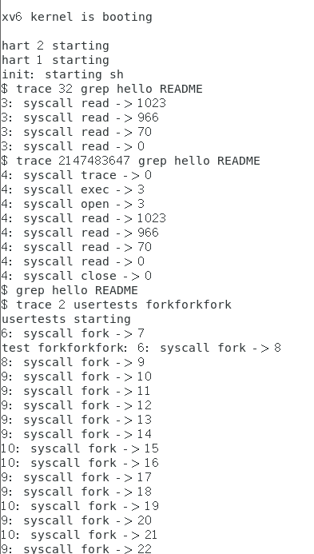

## Task2 Sysinfo (moderate)
<span style="background-color:lightgreen;">在这个作业中，您将添加一个系统调用```sysinfo```，它收集有关正在运行的系统的信息。系统调用采用一个参数：一个指向```struct sysinfo```的指针（参见***kernel/sysinfo.h***）。内核应该填写这个结构的字段：```freemem```字段应该设置为空闲内存的字节数，```nproc```字段应该设置为```state```字段不为```UNUSED```的进程数。我们提供了一个测试程序***sysinfotest***；如果输出“```sysinfotest: OK```”则通过。</span>

**提示：**

* Add ```$U/_sysinfotest``` to ```UPROGS``` in ***Makefile***

* Run ```make qemu```; ***user/sysinfotest.c*** will fail to compile. Add the system call sysinfo, following the same steps as in the previous assignment. To declare the prototype for sysinfo() in ***user/user.h*** you need predeclare the existence of ```struct sysinfo```:

```c    
struct sysinfo;
int sysinfo(struct sysinfo *);
```
  查看***sysinfo.h***里对```sysinfo```结构体的定义：
  ```c
 struct sysinfo {
  uint64 freemem;   // amount of free memory (bytes)
  uint64 nproc;     // number of process
};
  ```
* Once you fix the compilation issues, run ```sysinfotest```; it will fail because you haven't implemented the system call in the kernel yet.
sysinfo needs to copy a ```struct sysinfo``` back to user space; see ```sys_fstat()``` (***kernel/sysfile.c***) and ```filestat()``` (***kernel/file.c***) for examples of how to do that using ```copyout()```.
```copyout()```用于从内核空间复制数据到用户空间
```c
// part of kernel/vm.c

// Copy from kernel to user.
// Copy len bytes from src to virtual address dstva in a given page table.
// Return 0 on success, -1 on error.
/*
 *@param pagetable 页表
 *@param dstva 目标虚拟地址（用户空间）
 *@param src 源地址 （内核空间）
 *@param len 要复制的数据长度
*/
int
copyout(pagetable_t pagetable, uint64 dstva, char *src, uint64 len)
{
  uint64 n, va0, pa0;

  while(len > 0){
    va0 = PGROUNDDOWN(dstva);
    pa0 = walkaddr(pagetable, va0);
    if(pa0 == 0)
      return -1;
    n = PGSIZE - (dstva - va0);
    if(n > len)
      n = len;
    memmove((void *)(pa0 + (dstva - va0)), src, n);

    len -= n;
    src += n;
    dstva = va0 + PGSIZE;
  }
  return 0;
}
```

* To collect the amount of free memory, add a function to ***kernel/kalloc.c***

* To collect the number of processes, add a function to ***kernel/proc.c***


1. 在***kernel/kalloc.c***中添加一个函数来获取空闲内存的数量：
```c
// end of kernel/kalloc.c
//...
// 内存通过链表管理（见kalloc.c：struct run, struct kmem），因此遍历kmem中的空闲链表以获取所有空闲内存
void
freemem(uint64 *dst)
{
  struct run* r;  // 用于遍历
  *dst = 0;  // 空闲内存页的数量
  acquire(&kmem.lock);  // 获取锁，确保在遍历链表时不会有其他进程修改链表
  r = kmem.freelist;  
  while (r) {
    (*dst) += 1;
    r = r->next;
  }

  release(&kmem.lock);
  *dst = (*dst) << 12;  // 见书Fig3.2， 每个内存页的大小是 4096 字节（2^12）
}
```
2. 在***kernel/proc.c***中添加一个函数来获取进程数：
```c
// end of kernel/proc.c
struct proc proc[NPROC];   // 已经定义了一个数组proc[NPROC]用于储存每个进程的状态和信息
// ...
// 遍历进程数组计数
void
numproc(uint64 *dst)
{
  struct proc* p; 
  *dst = 0;

  for (p=proc; p < &proc[NPROC]; p++) {  // 遍历proc数组
    if (p->state != UNUSED) {
      (*dst)++;
    }
  }
}
```

3. ***sysproc.c***里```sys_sysinfo```的实现：
```c
// end of sysproc.c
uint64
sys_sysinfo(void)
{
  uint64 addr;
  if (argaddr(0, &addr) < 0) {  // 获取用户空间的虚拟地址，储存在addr中
    return -1;
  }

  struct proc *p = myproc();
  struct sysinfo info;

  freemem(&info.freemem);
  numproc(&info.nproc);
  if(copyout(p->pagetable, addr, (char *)&info, sizeof(info)) < 0) {  // 参见sysfile.c中示例用法
    return -1;
  }

  return 0;
}
```

4. 编译，注意应在sysproc.c添加新增的两个函数的声明：
```c
// sysproc.c
#include "proc.h"
#include "sysinfo.h"

void freemem(uint64*);
void numproc(uint64*);
```

**测试结果：**
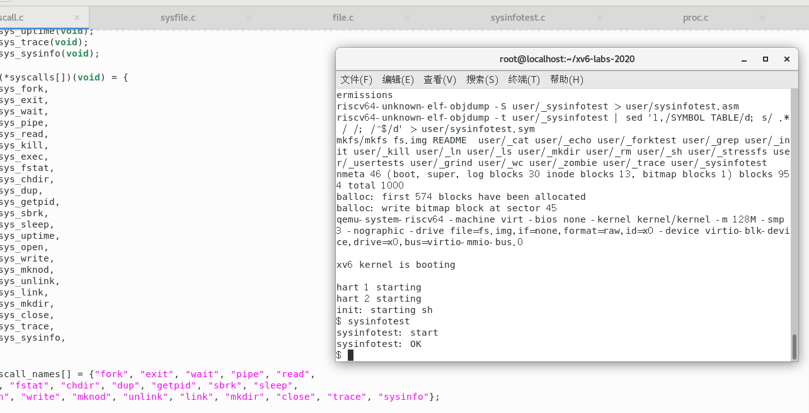

# Lec04 Page tables
## 看书预习
###  3.1 页式硬件 
* 页表是操作系统为每个进程提供私有地址空间和内存的机制。页表**决定了内存地址的含义**，以及物理内存的哪些部分可以访问。它们允许xv6*隔离不同进程的地址空间，并将它们复用到单个物理内存上*。页表还**提供了一层抽象**（a level of indirection），这允许xv6执行一些特殊操作：*映射相同的内存到不同的地址空间中（a trampoline page），并用一个未映射的页面保护内核和用户栈区*。 本章的其余部分**介绍了RISC-V硬件提供的页表以及xv6如何使用它们**。
* 基于Sv39 RISC-V的XV6只使用64位虚拟地址中的低39位，RISC-V页表在逻辑上是由$2^{27}$个**页表条目(Page Table Entries/PTE)** 组成的数组,  每个PTE包含 一个44位的  **物理页码（Physical Page Number/PPN）** 和一些标志。 分页硬件通过使用虚拟地址39位中的前27位(512GB)索引页表，以找到该虚拟地址对应的一个PTE，然后生成一个56位的物理地址，其前44位来自PTE中的PPN，其后12位来自原始虚拟地址。图3.1显示了这个过程，页表的逻辑视图是一个简单的PTE数组（参见图3.2进行更详细的了解）。页表使操作系统能够以 4096 ($2^{12}$) 字节的对齐块的粒度控制虚拟地址到物理地址的转换，这样的块称为**页（page）**。
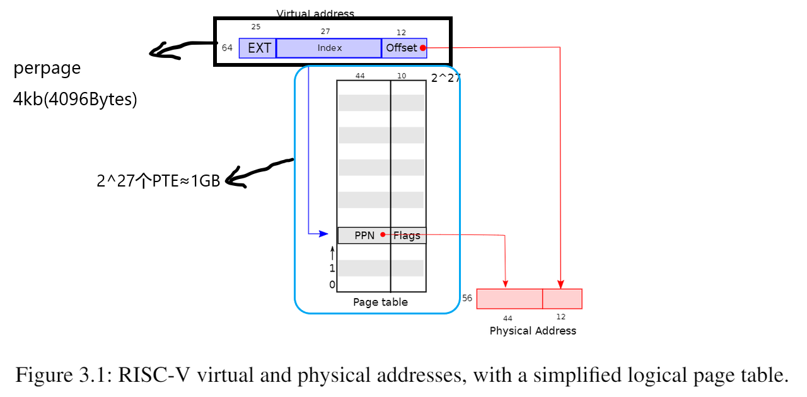
如图3.2所示，实际的转换分三个步骤进行。页表以三级的树型结构存储在物理内存中。该树的根是一个4096字节的页表页，其中包含512个PTE，每个PTE中包含该树下一级页表页的物理地址。这些页中的每一个PTE都包含该树最后一级的512个PTE（也就是说**每个PTE占8个字节**，正如图3.2最下面所描绘的）。分页硬件使用27位中的前9位在根页表页面中选择PTE，中间9位在树的下一级页表页面中选择PTE，最后9位选择最终的PTE。
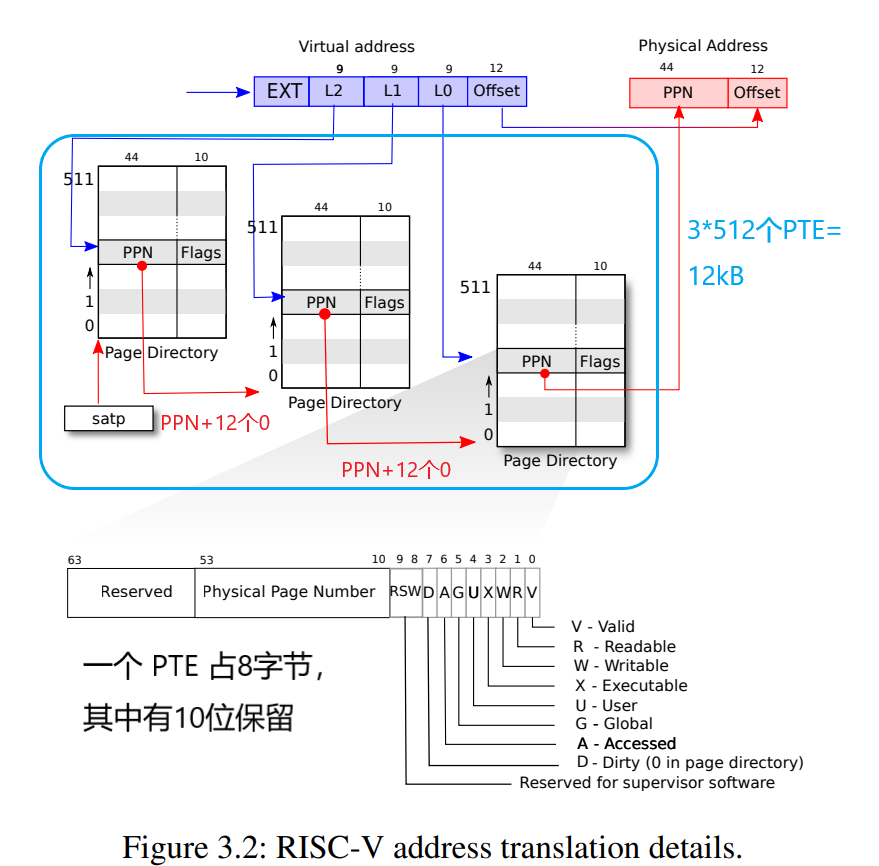
*  PTE是**按需分配**的， 图中L0,L1,L2的PTE数相等 
* CPU 在执行转换时会在硬件中遍历三级结构，所以缺点是 CPU 必须从内存中加载三个 PTE 以将虚拟地址转换为物理地址。为了减少从物理内存加载 PTE 的开销，RISC-V CPU 将最近使用的页表条目缓存在 **Translation Look-aside Buffer (TLB)** 中。
* 为了告诉硬件使用页表，内核必须将根页表页的物理地址写入到```satp```寄存器中（```satp```的作用是存放***当前使用的***根页表页在物理内存中的地址）。每个CPU都有自己的```satp```，一个CPU将使用自己的```satp```指向的页表转换后续指令生成的所有地址。每个CPU都有自己的```satp```，因此不同的CPU就可以运行不同的进程，每个进程都有自己的页表描述的私有地址空间。
* **物理内存**是指DRAM中的存储单元。物理内存以一个字节为单位划为地址，称为物理地址。**指令只使用虚拟地址**，分页硬件将其转换为物理地址，然后将其发送到DRAM硬件来进行读写。与物理内存和虚拟地址不同，**虚拟内存不是物理对象** ，而是指内核提供的管理物理内存和虚拟地址的抽象和机制的集合。（注意区分）
 ###  3.2 内核地址空间
* 内核除了为每个进程维护一个页表外，还会有一个 单独的页表用来描述**内核地址空间（Kernel address space）**。 xv6内核内存布局声明见***kernel/memlayout.h***
<a id="fig3.3"></a>
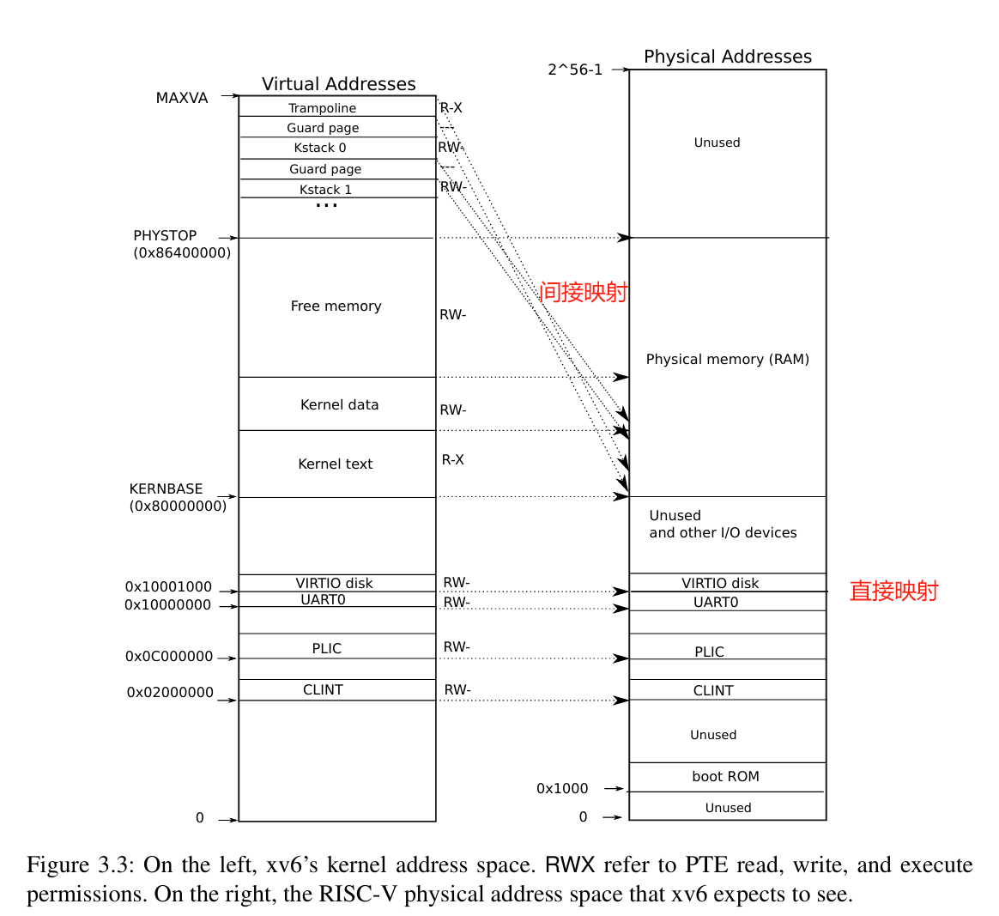
* QEMU将设备接口作为**内存映射控制寄存器**暴露给软件,内核可以通过读取/写入这些特殊的物理地址与设备交互，内核使用“**直接映射**”获取内存和内存映射设备寄存器。
* 如图3.3，直接映射意为**将资源映射到等于物理地址的虚拟地址**。直接映射简化了读取或写入物理内存的内核代码。
* 有几个内核虚拟地址不是直接映射：
1. **蹦床页面(trampoline page)**。它映射在虚拟地址空间的顶部；用户页表具有相同的映射。第4章讨论了蹦床页面的作用，但我们在这里看到了一个有趣的页表用例；一个物理页面（持有蹦床代码）在内核的虚拟地址空间中映射了两次：一次在虚拟地址空间的顶部，一次直接映射。
1. **内核栈页面(kernel stack pages)**。每个进程都有自己的内核栈，它将映射到偏高一些的地址，这样xv6在它之下就可以留下一个未映射的*保护页(guard page)*。保护页的PTE是无效的（也就是说```PTE_V```没有设置），所以如果内核溢出内核栈就会引发一个异常，内核触发panic。如果没有保护页，栈溢出将会覆盖其他内核内存，引发错误操作。恐慌崩溃（panic crash）是更可取的方案。（注：*Guard page*不会浪费物理内存，它只是占据了虚拟地址空间的一段靠后的地址，但并不映射到物理地址空间。）

### 3.3 code:创建地址空间 （kernel/vm.c）
核心的两个函数```walk```和```mappages```：
```c
// Return the address of the PTE in page table pagetable
// that corresponds to virtual address va.  If alloc!=0,
// create any required page-table pages.
//
// The risc-v Sv39 scheme has three levels of page-table
// pages. A page-table page contains 512 64-bit PTEs.
// A 64-bit virtual address is split into five fields:
//   39..63 -- must be zero.
//   30..38 -- 9 bits of level-2 index.
//   21..29 -- 9 bits of level-1 index.
//   12..20 -- 9 bits of level-0 index.
//    0..11 -- 12 bits of byte offset within the page.
pte_t *  // 为虚拟地址找到PTE
walk(pagetable_t pagetable, uint64 va, int alloc)   
{
  if(va >= MAXVA)
    panic("walk");

  for(int level = 2; level > 0; level--) {   // 遍历页表层级
    pte_t *pte = &pagetable[PX(level, va)];  // 计算出当前级别的页表索引
    if(*pte & PTE_V) {
      pagetable = (pagetable_t)PTE2PA(*pte);   // 当前页表条目有效时更新页表地址 
    } else {
      if(!alloc || (pagetable = (pde_t*)kalloc()) == 0)
        return 0;
      memset(pagetable, 0, PGSIZE);    // 清零新分配的页表页
      *pte = PA2PTE(pagetable) | PTE_V;  // 当前页表条目标记为有效，指向新分配的页表页
    }
  }
  return &pagetable[PX(0, va)];  // 返回零级页表条目的地址
}

// Create PTEs for virtual addresses starting at va that refer to
// physical addresses starting at pa. va and size might not
// be page-aligned. Returns 0 on success, -1 if walk() couldn't
// allocate a needed page-table page.
int   // 为新映射装载PTE
mappages(pagetable_t pagetable, uint64 va, uint64 size, uint64 pa, int perm)
{
  uint64 a, last;  // 计算起始地址和结束地址
  pte_t *pte;

  if(size == 0)
    panic("mappages: size");
  
  a = PGROUNDDOWN(va);
  last = PGROUNDDOWN(va + size - 1);  // 对齐后 
  for(;;){
    if((pte = walk(pagetable, a, 1)) == 0)  // 获取虚拟地址 a 对应的页表条目指针 pte
      return -1;
    if(*pte & PTE_V)
      panic("mappages: remap");
    *pte = PA2PTE(pa) | perm | PTE_V;  // 页表条目 pte，使其指向物理地址 pa，并设置权限 perm 和有效位 PTE_V
    if(a == last)
      break;
    a += PGSIZE;
    pa += PGSIZE;
  }
  return 0;
}
```

名称以```kvm```开头的函数操作*内核页表*；以```uvm```开头的函数操作*用户页表*；其他函数用于二者。```copyout```和```copyin```复制数据到用户虚拟地址或从用户虚拟地址复制数据，这些虚拟地址作为系统调用参数提供[见lab2Task2]; 由于它们需要显式地翻译这些地址，以便找到相应的物理内存，故将它们写在***vm.c***中。

### 3.5 code: 物理内存分配 （kernel/kalloc.c）
每个空闲页的列表元素为一个```struct run```:
```c
struct run {
  struct run *next;
};
```
分配器将每个空闲页的```run```结构存储在空闲页本身，空闲列表受自旋锁（spin lock）的保护：
```c
struct {
  struct spinlock lock;
  struct run *freelist;
} kmem;
```
关于锁的细节，在第六章学习
* 分配器有时将地址视为**整数**，以便对其执行算术运算（例如，在```freerange```中遍历所有页面），有时将地址用作读写内存的**指针**（例如，操纵存储在每个页面中的```run```结构）；这种地址的双重用途是分配器代码充满C类型转换的主要原因。另一个原因是**释放和分配从本质上改变了内存的类型**。

### 3.6 进程地址空间
图3.4更详细地显示了xv6中执行态进程的用户内存布局。栈是单独一个页面，显示的是由```exec```创建后的初始内容。包含命令行参数的字符串以及指向它们的指针数组位于栈的最顶部。再往下是允许程序在main处开始启动的值（即```main```的地址、```argc```、```argv```），这些值产生的效果就像刚刚调用了```main(argc, argv)```一样。
<a id="fig3.4"></a>
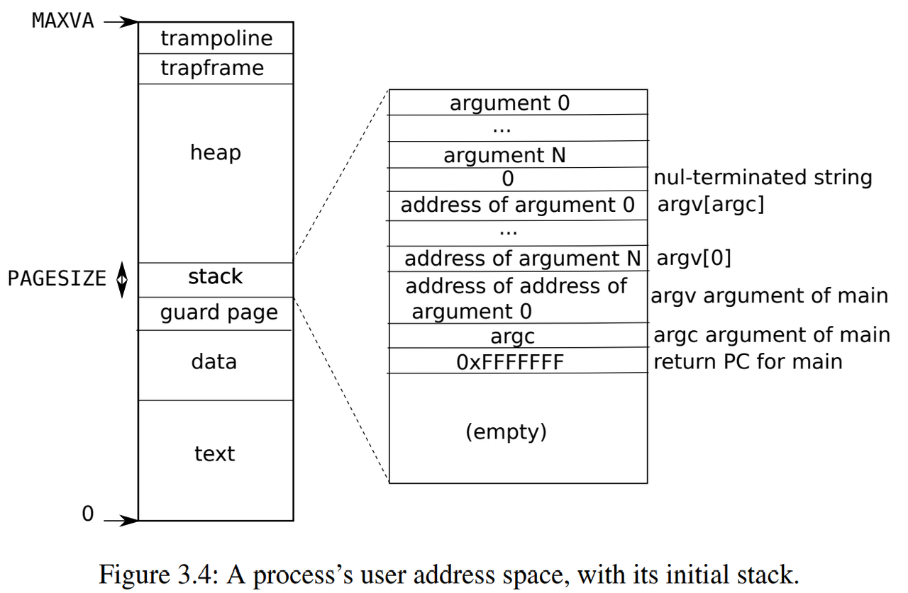

## 4.2 地址空间
* RISC-V主板上，内存是由一些DRAM芯片组成。在这些DRAM芯片中保存了程序的数据和代码。
* 虚拟内存可以比物理内存更大，物理内存也可以比虚拟内存更大。

## 4.3 页表
* 虚拟内存地址会被转到**内存管理单元（MMU，Memory Management Unit）**。MMU、TLB是**硬件的一部分**而不是操作系统的一部分。从CPU的角度来说，一旦MMU打开了，它执行的每条指令中的地址都是虚拟内存地址。
* 在xv6中函数```walk```在软件中实现了MMU硬件相同的功能。
* MMU并不会保存page table，它只会从内存中读取page table（通过存放根页表地址的寄存器```satp```），然后完成翻译
* offset必须是12bit，因为对应了一个page的4096个字节。这样可以确保page中的每个字节都可以被offset索引到。
* 物理内存地址是56bit（44+12）.地址转换时，只需要将虚拟内存中的27bit通过页表翻译成物理内存中的44bit的page号，剩下的12bitoffset直接拷贝过来即可.
* 每个进程都有完全属于自己的地址转换表来翻译成不同的物理内存地址。

## 4.4 页表缓存（Translation Lookaside Buffer）
* RISC-V处理器有L1 cache，L2 Cache，有些cache是根据物理地址索引的，有些cache是根据虚拟地址索引的，**由虚拟地址索引的cache位于MMU之前，由物理地址索引的cache位于MMU之后**。

## 4.5 Kernel Page Table
* 主板的设计人员决定了，在完成了虚拟到物理地址的翻译之后，如果得到的物理地址大于0x80000000会走向DRAM芯片，如果得到的物理地址低于0x80000000会走向不同的I/O设备。

* 地址0x1000是boot ROM的物理地址，当你对主板上电，主板做的第一件事情就是运行存储在boot ROM中的代码，当boot完成之后，会跳转到地址0x80000000
* 这里还有一些其他的I/O设备：
1. **PLIC**是**中断控制器（Platform-Level Interrupt Controller）** 我们下周的课会讲。

1. **CLINT（Core Local Interruptor）** 也是中断的一部分。所以多个设备都能产生中断，需要中断控制器来将这些中断路由到合适的处理函数。

1. **UART0（Universal Asynchronous Receiver/Transmitter）** 负责与Console和显示器交互。

1. **VIRTIO disk** ，与磁盘进行交互。

*  每一个用户进程都有一个对应的kernel stack, 在图[3.3](#fig3.3)中可以看到，**kernel stack 被映射了两次**，在靠后的虚拟地址映射了一次，在PHYSTOP下的Kernel data中又映射了一次，但是实际使用的时候用的是上面的部分，因为有Guard page会更加安全。
* xv6使用 kernel pagetale 中的 free memory来存放用户进程的page table, text和data。本质上来说，两边的虚拟地址空间大小是一样的。但是用户进程的虚拟地址空间使用率会更低。大多数的进程使用的内存都远远小于虚拟地址空间。

## 4.6-4.8 kvminit、kvminithart、walk 函数
[之前安装的gdb](#39-xv6的启动过程)不支持TUI模式所以用不了layout split模式，有些不便，这里更改一下配置：
<details>
    <summary><span style="color:blue;">方法</span> </summary>

```sh
// 1.安装依赖项
sudo yum groupinstall "Development Tools"
sudo yum install git gmp-devel mpfr-devel libmpc-devel zlib-devel
sudo yum install ncurses ncurses-devel

// 2.清理之前安装的gdb配置
cd gdb-8.3.1
make distclean

// 3.检查配置和日志
./configure --with-expat --with-python --enable-tui --enable-targets=all 2>&1 | tee configure.log
// 查看  configure.log 文件，确保它正确检测到 ncurses 库。

// 4. 设置环境变量
export CFLAGS="-I/usr/include/ncurses"
export LDFLAGS="-L/usr/lib64"

// 5.重新配置和编译
./configure --with-ncurses
#./configure --with-expat --with-python --enable-tui --enable-targets=all
make
sudo make install

//  6.验证安装
gdb --version
gdb
(gdb) tui enable
(gdb) layout split
```
</details>

***

一个实验，先参照[3.9](#39-xv6的启动过程)，启动xv6并打开gdb,运行至***kernel/main.c***中的```kvminit()```处，用指令```s```跳入:
<a id="kvminit"></a>

```c {.line-numbers}
// part of kernel/vm.c

// Make a direct-map page table for the kernel.
pagetable_t
kvmmake(void)
{
  pagetable_t kpgtbl;

  kpgtbl = (pagetable_t) kalloc();    // 为最高一级page directory分配物理page
  memset(kpgtbl, 0, PGSIZE);   // 内存初始化为0

  //  通过kvmmap函数，将每一个I/O设备映射到内核
  // uart registers
  kvmmap(kpgtbl, UART0, UART0, PGSIZE, PTE_R | PTE_W);  //  将UART0映射到内核的地址空间

  // virtio mmio disk interface
  kvmmap(kpgtbl, VIRTIO0, VIRTIO0, PGSIZE, PTE_R | PTE_W);

  // PLIC
  kvmmap(kpgtbl, PLIC, PLIC, 0x400000, PTE_R | PTE_W);

  // map kernel text executable and read-only.
  kvmmap(kpgtbl, KERNBASE, KERNBASE, (uint64)etext-KERNBASE, PTE_R | PTE_X);

  // map kernel data and the physical RAM we'll make use of.
  kvmmap(kpgtbl, (uint64)etext, (uint64)etext, PHYSTOP-(uint64)etext, PTE_R | PTE_W);

  // map the trampoline for trap entry/exit to
  // the highest virtual address in the kernel.
  kvmmap(kpgtbl, TRAMPOLINE, (uint64)trampoline, PGSIZE, PTE_R | PTE_X);

  // allocate and map a kernel stack for each process.
  proc_mapstacks(kpgtbl);
  
  return kpgtbl;
}

// Initialize the one kernel_pagetable
void
kvminit(void)
{
  kernel_pagetable = kvmmake();
}
```
这里walk函数能够正常物理地址的原因是内核设置了虚拟地址等于物理地址的映射关系，这里很重要，因为很多地方能工作的原因都是因为内核设置的地址映射关系是相同的。
运行至```kvminithart()``` 函数,跳入：
```c
// part of kernel/vm.c
// Switch h/w page table register to the kernel's page table,
// and enable paging.
void
kvminithart()
{
  // wait for any previous writes to the page table memory to finish.
  sfence_vma();

  w_satp(MAKE_SATP(kernel_pagetable));   // 告诉MMU使用刚刚在kvminit设置好的page table，这里的kernel_page_table是一个物理地址

  // flush stale entries from the TLB.
  sfence_vma();
}
```
**整个地址翻译从这条指令```w_satp(MAKE_SATP(kernel_pagetable));```之后开始生效**,在这条指令之前，我们使用的都是物理内存地址。
这里能正常工作的原因是kernel page的映射关系中，虚拟地址到物理地址是完全相等的。所以，在我们打开虚拟地址翻译硬件之后，地址翻译硬件会将一个虚拟地址翻译到相同的物理地址。所以实际上，我们最终还是能通过内存地址执行到正确的指令，因为经过地址翻译0x80001110还是对应0x80001110。

# Lab3: page tables
前置知识：
* ***kernel/memlayout.h***，它捕获了内存的布局。
* ***kernel/vm.c***，其中包含大多数虚拟内存（VM）代码。
* ***kernel/kalloc.c***，它包含分配和释放物理内存的代码。
实验分支：
```sh
$ git fetch
$ git checkout pgtbl
$ make clean
```

## Task1 Print a page table 
<span style="background-color:lightgreen;">定义一个名为```vmprint()```的函数。它应当接收一个```pagetable_t```作为参数，并以下面描述的格式打印该页表。在***exec.c***中的```return argc```之前插入```if(p->pid==1) vmprint(p->pagetable)```，以打印第一个进程的页表。如果你通过了```pte printout```测试的```make grade```，你将获得此作业的满分。</span>
启动xv6时，它应该像这样打印输出来描述第一个进程刚刚完成```exec()``` ing ```init```时的页表：
```sh
page table 0x0000000087f6e000
..0: pte 0x0000000021fda801 pa 0x0000000087f6a000
.. ..0: pte 0x0000000021fda401 pa 0x0000000087f69000
.. .. ..0: pte 0x0000000021fdac1f pa 0x0000000087f6b000
.. .. ..1: pte 0x0000000021fda00f pa 0x0000000087f68000
.. .. ..2: pte 0x0000000021fd9c1f pa 0x0000000087f67000
..255: pte 0x0000000021fdb401 pa 0x0000000087f6d000
.. ..511: pte 0x0000000021fdb001 pa 0x0000000087f6c000
.. .. ..510: pte 0x0000000021fdd807 pa 0x0000000087f76000
.. .. ..511: pte 0x0000000020001c0b pa 0x0000000080007000
```
第一行显示```vmprint```的参数。之后的每行对应一个PTE，包含树中指向页表页的PTE。每个PTE行都有一些“```..```”的缩进表明它在树中的深度。每个PTE行显示其在页表页中的PTE索引、PTE比特位以及从PTE提取的物理地址。不要打印无效的PTE。在上面的示例中，顶级页表页具有条目0和255的映射。条目0的下一级只映射了索引0，该索引0的下一级映射了条目0、1和2。

**提示：**
* 你可以将```vmprint()```放在***kernel/vm.c***中
* 使用定义在***kernel/riscv.h***末尾处的宏
* 函数```freewalk```可能会对你有所启发
```c
// part  of  vm.c
// Recursively free page-table pages.
// All leaf mappings must already have been removed.
void
freewalk(pagetable_t pagetable)
{
  // there are 2^9 = 512 PTEs in a page table.
  for(int i = 0; i < 512; i++){
    pte_t pte = pagetable[i];
    if((pte & PTE_V) && (pte & (PTE_R|PTE_W|PTE_X)) == 0){   // 有效的页表项并且不在最后一层
      // this PTE points to a lower-level page table.
      uint64 child = PTE2PA(pte);
      freewalk((pagetable_t)child);   // 递归
      pagetable[i] = 0;
    } else if(pte & PTE_V){
      panic("freewalk: leaf");
    }
  }
  kfree((void*)pagetable);
}

```
* 将```vmprint```的原型定义在***kernel/defs.h***中，这样你就可以在**exec.c**中调用它了
* 在你的```printf```调用中使用```%p```来打印像上面示例中的完成的64比特的十六进制PTE和地址

用递归实现```vmprint```，通过参数level控制打印的“```..```”数量：
```c
/**
 *@brief 打印页表 
 *@param pagetable 所要打印的页表
 *@param level 当前页表所在层级
*/
void
_vmprint(pagetable_t pagetable, int level)
{
  // there are 2^9 = 512 PTEs in a page table.
  for(int i = 0; i < 512; i++){
    pte_t pte = pagetable[i];
    if(pte & PTE_V){   // 有效的页表项
      for (int j = 0; j < level; j++){  // level=1/2/3
        if (j) printf(" ");
        printf("..");
      }

      uint64 child = PTE2PA(pte);
      printf("%d: pte %p pa %p\n", i, pte, child);
      if ((pte & (PTE_R|PTE_W|PTE_X))  == 0)
      // 该PTE指向下一级页表
      {
        _vmprint((pagetable_t) child, level+1);   // 递归
      }
    } 
  }
}

void
vmprint(pagetable_t pagetable)
{
  printf("page table %p\n", pagetable);
  _vmprint(pagetable, 1);
}
```

然后根据提示在kernel/defs.h里添加声明：
```c
int             copyin(pagetable_t, char *, uint64, uint64);
int             copyinstr(pagetable_t, char *, uint64, uint64);
void            vmprint(pagetable_t);
```

根据提示，在***exec.c***中的```return argc```之前插入```if(p->pid==1) vmprint(p->pagetable)；```
**测试结果：**
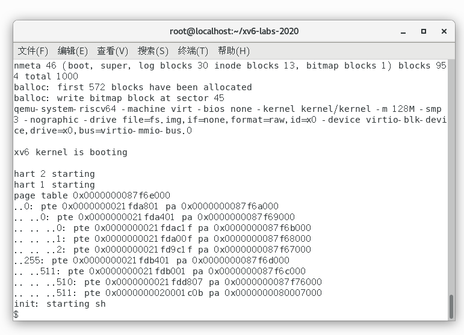
<span style="background-color:lightblue;">根据书中的 [图3-4](#fig3.4) 解释```vmprint```的输出。page 0包含什么？page 2中是什么？在用户模式下运行时，进程是否可以读取/写入page 1映射的内存？</span>

## Task2  A kernel page table per process (hard)
Xv6有一个单独的用于在内核中执行程序时的内核页表。内核页表直接映射（恒等映射）到物理地址，也就是说内核虚拟地址```x```映射到物理地址仍然是```x```。Xv6还为每个进程的用户地址空间提供了一个单独的页表，只包含该进程用户内存的映射，从虚拟地址0开始。因为内核页表不包含这些映射，所以用户地址在内核中无效。因此，当内核需要使用在系统调用中传递的用户指针（例如，传递给```write()```的缓冲区指针）时，内核必须首先将指针转换为物理地址。本节和下一节的目标是允许内核直接解引用用户指针。
<span style="background-color:lightgreen;">你的第一项工作是修改内核来让每一个进程在内核中执行时使用它自己的内核页表的副本。修改```struct proc```来为每一个进程维护一个内核页表，修改调度程序使得切换进程时也切换内核页表。对于这个步骤，每个进程的内核页表都应当与现有的的全局内核页表完全一致。如果你的```usertests```程序正确运行了，那么你就通过了这个实验。</span>

**提示：**
1. 在```struct proc```中为进程的内核页表增加一个字段
1. 为一个新进程生成一个内核页表的合理方案是实现一个修改版的```kvminit```，这个版本中应当创造一个新的页表而不是修改```kernel_pagetable```。你将会考虑在```allocproc```中调用这个函数
1. 确保每一个进程的内核页表都关于该进程的内核栈有一个映射。在未修改的XV6中，所有的内核栈都在```procinit```中设置。你将要把这个功能部分或全部的迁移到```allocproc```中
1. 修改```scheduler()```来加载进程的内核页表到核心的satp寄存器(参阅```kvminithart```来获取启发)。不要忘记在调用完```w_satp()```后调用```sfence_vma()```
1. 没有进程运行时```scheduler()```应当使用```kernel_pagetable```
1. 在```freeproc```中释放一个进程的内核页表
1. 你需要一种方法来释放页表，而不必释放叶子物理内存页面。
1. 调试页表时，也许```vmprint```能派上用场
1. 修改XV6本来的函数或新增函数都是允许的；你或许至少需要在***kernel/vm.c***和***kernel/proc.c***中这样做（但不要修改***kernel/vmcopyin.c***, ***kernel/stats.c***, ***user/usertests.c***, 和***user/stats.c***）
1. 页表映射丢失很可能导致内核遭遇页面错误。这将导致打印一段包含```sepc=0x00000000XXXXXXXX```的错误提示。你可以在***kernel/kernel.asm***通过查询```XXXXXXXX```来定位错误。

**步骤：**
1. 参照提示，在***kernel/proc.h***修改```struct proc```:
```c
// Per-process state
struct proc {
  struct spinlock lock;

  // p->lock must be held when using these:
  //...
  // these are private to the process, so p->lock need not be held.
  //...

  // add a kernel page for each process
  pagetable_t ex_kernel_pagetable;       // exclusive kernel pagetable
};
```

2. 按照提示，在***kernel/proc.c***中的```allocproc```添加如下调用：
```c
//...
 // An empty user page table.
  p->pagetable = proc_pagetable(p);
  if(p->pagetable == 0){
    freeproc(p);
    release(&p->lock);
    return 0;
  }

  // Init a kernel page table.
  p->ex_kernel_pagetable = proc_kernel_pagetable();
  if(p->ex_kernel_pagetable == 0){
    freeproc(p);
    release(&p->lock);
    return 0;
  }

  //...
```
参照[```kvminit```](#kvminit)来实现```proc_kernel_pagetable```,添加在***vm.c***中：
```c
// 添加一个辅助函数,功能和kvmmap一样
void
uvmmap(pagetable_t kpgtbl, uint64 va, uint64 pa, uint64 sz, int perm)
{
  if(mappages(kpgtbl, va, sz, pa, perm) != 0)
    panic("uvmmap");
}

// Make a direct-map page table for the kernel.
pagetable_t
proc_kernel_pagetable()
{
  pagetable_t kpgtbl;

  // An empty page table.  参照proc.c中的proc_pagetable()
  kpgtbl = uvmcreate();
  if(kpgtbl == 0)
    return 0;

  // uart registers
  uvmmap(kpgtbl, UART0, UART0, PGSIZE, PTE_R | PTE_W);  //  将UART0映射到内核的地址空间

  // virtio mmio disk interface
  uvmmap(kpgtbl, VIRTIO0, VIRTIO0, PGSIZE, PTE_R | PTE_W);

  uvmmap(kpgtbl, CLINT, CLINT, 0x10000, PTE_R | PTE_W);

  // PLIC
  uvmmap(kpgtbl, PLIC, PLIC, 0x400000, PTE_R | PTE_W);

  // map kernel text executable and read-only.
  uvmmap(kpgtbl, KERNBASE, KERNBASE, (uint64)etext-KERNBASE, PTE_R | PTE_X);

  // map kernel data and the physical RAM we'll make use of.
  uvmmap(kpgtbl, (uint64)etext, (uint64)etext, PHYSTOP-(uint64)etext, PTE_R | PTE_W);

  // map the trampoline for trap entry/exit to
  // the highest virtual address in the kernel.
  uvmmap(kpgtbl, TRAMPOLINE, (uint64)trampoline, PGSIZE, PTE_R | PTE_X);
  
  return kpgtbl;
}
```

3. 按照提示，把```procinit```中设置内核栈的部分迁移到```allocproc```中, 把```procinit```中下面代码剪切到```// Init a kernel page table.```部分的后面，把
```kvmmap(va, (uint64)pa, PGSIZE, PTE_R | PTE_W);```
改为
```uvmmap(p->kernel_pagetable, va, (uint64)pa, PGSIZE, PTE_R | PTE_W);```
```c
// Allocate a page for the process's kernel stack.
// Map it high in memory, followed by an invalid
// guard page.
char *pa = kalloc();
if(pa == 0)
  panic("kalloc");
uint64 va = KSTACK((int) (p - proc));
uvmmap(p->ex_kernel_pagetable, va, (uint64)pa, PGSIZE, PTE_R | PTE_W);  // modified
p->kstack = va;
```

4&5.  修改```scheduler()```来加载进程的内核页表到核心的satp寄存器,参考```kvminithart```代码如下：
```c
// part of kernel/vm.c
// Switch h/w page table register to the kernel's page table,
// and enable paging.
void
kvminithart()
{
  w_satp(MAKE_SATP(kernel_pagetable));   // 把原来的内核页表地址传给satp寄存器
  sfence_vma();
}
```
在其下面实现一个新方法用来把**进程的内核页表**传给satp寄存器：
```c
// Store process's kernel page table to SATP register
void
proc_kvminithart(pagetable_t kpt)
{
  w_satp(MAKE_SATP(kpt));   // 把原来的内核页表地址传给satp寄存器
  sfence_vma();
}
```
按照提示在```scheduler()```中调用它，并根据提示5，没有进程运行时切换回原来的内核页表：
```c
// part of  proc.c
// Per-CPU process scheduler.
// Each CPU calls scheduler() after setting itself up.
// Scheduler never returns.  It loops, doing:
//  - choose a process to run.
//  - swtch to start running that process.
//  - eventually that process transfers control
//    via swtch back to the scheduler.
void
scheduler(void)
{
  struct proc *p;
  struct cpu *c = mycpu();
  
  c->proc = 0;
  for(;;){
    // Avoid deadlock by ensuring that devices can interrupt.
    intr_on();
    
    int found = 0;
    for(p = proc; p < &proc[NPROC]; p++) {
      acquire(&p->lock);
      if(p->state == RUNNABLE) {
        // Switch to chosen process.  It is the process's job
        // to release its lock and then reacquire it
        // before jumping back to us.
        p->state = RUNNING;
        c->proc = p;

        // 在这里将进程的内核页表传给SATP寄存器
        proc_kvminithart(p->ex_kernel_pagetable);

        swtch(&c->context, &p->context);  // CPU 的控制权会从调度器转移到选定的进程 p

        // 没有进程运行时切换回原来的内核页表
        kvminithart();

        // Process is done running for now.
        // It should have changed its p->state before coming back.
        c->proc = 0;

        found = 1;
      }
      release(&p->lock);
    }
//...
  }
}
```
6. 在```freeproc```中释放一个进程的内核页表
```c
// part of proc.c:freeproc()
if(p->pagetable)
    proc_freepagetable(p->pagetable, p->sz);
// free the kernel stack in the RAM
uvmunmap(p->ex_kernel_pagetable, p->kstack, 1, 1);  // 解除内核栈映射并释放物理内存
p->kstack = 0;
if(p->ex_kernel_pagetable)
  proc_freekpt(p->ex_kernel_pagetable);   // 释放进程的内核页表
p->pagetable = 0;
//...
```  
在***vm.c***中实现```proc_freekpt()```,参照```freewalk```函数(同[Task1](#task1-print-a-page-table)) :
```c
void
proc_freekpt(pagetable_t kpt)
{
  // there are 2^9 = 512 PTEs in a page table.
  for(int i = 0; i < 512; i++){
    pte_t pte = kpt[i];
    if (pte & PTE_V) {  // 有效页表
      kpt[i] = 0;
      if ((pte & (PTE_R|PTE_W|PTE_X)) == 0) {
        // this PTE points to a lower-level page table.
        uint64 child = PTE2PA(pte);
        proc_freekpt((pagetable_t)child);  // 递归
      }    
    } 
  }
  kfree((void*)kpt);
}
```

7.  在***kernel/defs.h***添加必要定义
```c
// part of defs.h
// vm.c
void            kvminit(void);
pagetable_t     proc_kernel_pagetable(void);       // 用于内核页表的初始化
void            kvminithart(void);
void            proc_kvminithart(pagetable_t);  // 把进程的内核页表传给satp寄存器
void            proc_freekpt(pagetable_t);      // 释放进程的内核页表 
uint64          kvmpa(uint64);
void            kvmmap(uint64, uint64, uint64, int);
void            uvmmap(pagetable_t, uint64, uint64, uint64, int);  // copy from kvmmap
//...
```

8. 修改***vm.c***中的```kvmpa```,将原先的```kernel_pagetable```改成```myproc()->ex_kernel_pagetable```，使用进程的内核页表,并添加include。
```c
#include "spinlock.h" 
#include "proc.h"

// translate a kernel virtual address to
// a physical address. only needed for
// addresses on the stack.
// assumes va is page aligned.
uint64
kvmpa(uint64 va)
{
  uint64 off = va % PGSIZE;
  pte_t *pte;
  uint64 pa;
  
  //pte = walk(kernel_pagetable, va, 0);
  pte = walk(myproc()->ex_kernel_pagetable, va, 0);  //  使用进程的内核页表
  if(pte == 0)
    panic("kvmpa");
  if((*pte & PTE_V) == 0)
    panic("kvmpa");
  pa = PTE2PA(*pte);
  return pa+off;
}
```

**测试结果：**
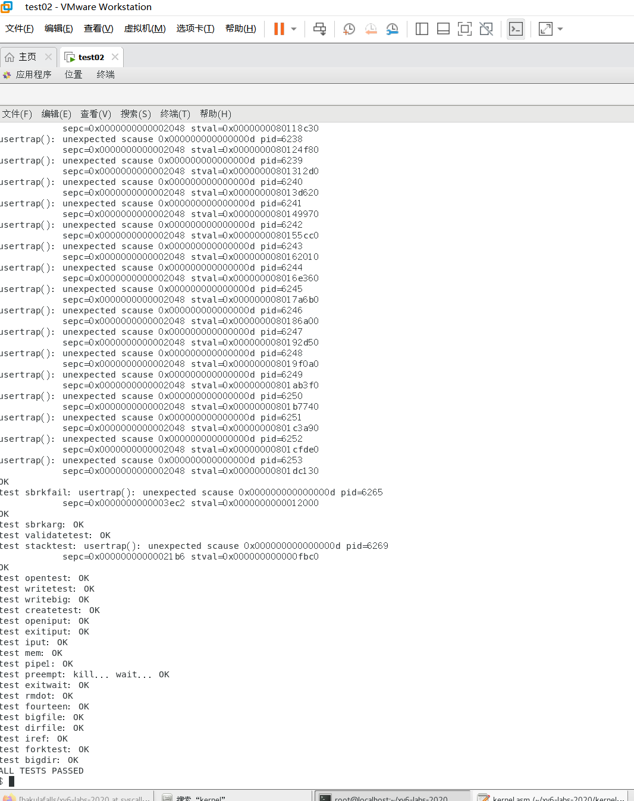
通过测试并看到有一些页表映射丢失报错，具体为
```sh
sepc=0x0000000000005476
sepc=0x0000000000002048
sepc=0x0000000000003ec2
sepc=0x00000000000021b6
```
查看***kernel/kernel.asm***：
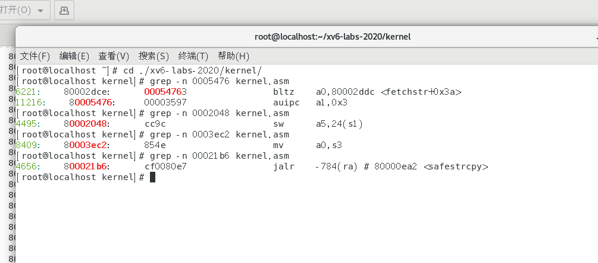
 ```80005476:	00003597          	auipc	a1,0x3```这一句位于```create```函数中,查看***sysfile.c***中的```create```函数：
```c
static struct inode*
create(char *path, short type, short major, short minor)
{
  struct inode *ip, *dp;
  char name[DIRSIZ];

  if((dp = nameiparent(path, name)) == 0)  // 80005476与这一句匹配
    return 0;

  ilock(dp);
  //...
```


## Task3 Simplify ```copyin/copyinstr``` (hard)
内核的```copyin```函数读取用户指针指向的内存。它通过将用户指针转换为内核可以直接解引用的物理地址来实现这一点。这个转换是通过在软件中遍历进程页表来执行的。在本部分的实验中，您的工作是将用户空间的映射添加到每个进程的内核页表（上一节中创建），以允许```copyin```（和相关的字符串函数```copyinstr```）直接解引用用户指针。

<span style="background-color:green;">将定义在***kernel/vm.c***中的```copyin```的主题内容替换为对```copyin_new```的调用（在k***ernel/vmcopyin.c***中定义）；对```copyinstr```和```copyinstr_new```执行相同的操作。为每个进程的内核页表添加用户地址映射，以便```copyin_new```和```copyinstr_new```工作。如果```usertests```正确运行并且所有make grade测试都通过，那么你就完成了此项作业。</span>

此方案依赖于用户的虚拟地址范围不与内核用于自身指令和数据的虚拟地址范围重叠。Xv6使用从零开始的虚拟地址作为用户地址空间，幸运的是内核的内存从更高的地址开始。然而，这个方案将用户进程的最大大小限制为小于内核的最低虚拟地址。内核启动后，在XV6中该地址是```0xC000000```，即PLIC寄存器的地址；请参见***kernel/vm.c***中的```kvminit()```、***kernel/memlayout.h***和文中的[图3-4](#fig3.4)。您需要修改xv6，以防止用户进程增长到超过PLIC的地址。

**提示：**
* 先用对```copyin_new```的调用替换```copyin()```，确保正常工作后再去修改```copyinstr```
* 在内核更改进程的用户映射的每一处，都以相同的方式更改进程的内核页表。包括```fork()```, ```exec()```, 和```sbrk()```.
* 不要忘记在```userinit```的内核页表中包含第一个进程的用户页表
* 用户地址的PTE在进程的内核页表中需要什么权限？(在内核模式下，无法访问设置了```PTE_U```的页面)
* 别忘了上面提到的PLIC限制

**步骤：**
1. 首先在***vm.c***中实现一个函数用于将用户进程空间映射到用户内核页表(需熟练掌握```walk```函数)：
```c
// end of vm.c
/**
 *@brief 用于将用户空间的映射添加到用户内核页表
 *@param pagetable 用户空间页表
 *@param kernelpt 内核空间页表
 *@param oldsz 旧的内存大小
 *@param newsz 新的内存大小
*/
void
uvm2kvmcopy(pagetable_t pagetable, pagetable_t kpagetable, uint64 oldsz, uint64 newsz)
{
  pte_t *pte, *kpte; 

  if (newsz >= PLIC) {  // 防止用户进程增长到超过PLIC的地址
    panic("uvm2kvmcopy: user process space is overwritten to kernel process space");
  }

  oldsz = PGROUNDUP(oldsz);  // 避免潜在的内存对齐问题
  uint64 va;

  for(va = oldsz; va < newsz; va += PGSIZE)
  {
    if ((pte = walk(pagetable, va, 0)) == 0) {  // 将va在用户空间页表对应的最后一级PTE地址传给pte
      panic("uvm2kvmcopy: pte invaild!");   // *pte & PTE_V == 0
    }
    if ((kpte = walk(kpagetable, va, 1)) == 0) { //  在用户内核页表创建新的页表项kpte用与存储va对应的PTE地址
      panic("uvm2kvmcopy: kpte alloc failed!");   // (pagetable = (pde_t*)kalloc()) == 0
    }
    *kpte = *pte;   // 页表指向相同的物理页
    *kpte &= ~PTE_U;  // 取消掉用户模式对kpt的访问权限
  }

  for(va = newsz; va < oldsz; va += PGSIZE) {
    if((kpte = walk(kpagetable, va, 1)) == 0)
      panic("uvm2kvmcopy: kpte should exist");
    *kpte &= ~PTE_V;
  }
}
```

2. 更改```fork()```, ```exec()```, 和```sbrk()```:
```c
//  kernel/exec.c
int
exec(char *path, char **argv)
{
  // ...
  sp = sz;
  stackbase = sp - PGSIZE;

  //  添加复制映射
  uvm2kvmcopy(pagetable, p->ex_kernel_pagetable, 0, sz);

  // Push argument strings, prepare rest of stack in ustack.
  for(argc = 0; argv[argc]; argc++) {
    //...
  }
}

//  kernel/proc.c
int
fork(void)
{
  //...
  np->state = RUNNABLE;

  // 添加复制映射
  uvm2kvmcopy(np->pagetable, np->ex_kernel_pagetable, 0,  np->sz);

  release(&np->lock);

  return pid;
}

// kernel/sysproc:sys_sbrk()跳转到kernel/proc.c:growproc()
int
growproc(int n)
{
  uint sz;
  struct proc *p = myproc();

  sz = p->sz;
  if(n > 0){
    if((sz = uvmalloc(p->pagetable, sz, sz + n)) == 0) {
      return -1;
    }
  } else if(n < 0){
    sz = uvmdealloc(p->pagetable, sz, sz + n);
  }
  //  添加复制映射 
  uvm2kvmcopy(p->pagetable, p->ex_kernel_pagetable,p->sz, sz);
  p->sz = sz;
  return 0;
}
```

3. 替换掉```copyin()```和```copyinstr()```:
```c
// part of vm.c
// Copy from user to kernel.
// Copy len bytes to dst from virtual address srcva in a given page table.
// Return 0 on success, -1 on error.
int
copyin(pagetable_t pagetable, char *dst, uint64 srcva, uint64 len)
{
  /*uint64 n, va0, pa0;

  while(len > 0){
    va0 = PGROUNDDOWN(srcva);
    pa0 = walkaddr(pagetable, va0);
    if(pa0 == 0)
      return -1;
    n = PGSIZE - (srcva - va0);
    if(n > len)
      n = len;
    memmove(dst, (void *)(pa0 + (srcva - va0)), n);

    len -= n;
    dst += n;
    srcva = va0 + PGSIZE;
  }
  return 0;*/
  return copyin_new(pagetable, dst, srcva, len);
}

int
copyinstr(pagetable_t pagetable, char *dst, uint64 srcva, uint64 max)
{
  /*uint64 n, va0, pa0;
  int got_null = 0;

  while(got_null == 0 && max > 0){
    va0 = PGROUNDDOWN(srcva);
    pa0 = walkaddr(pagetable, va0);
    if(pa0 == 0)
      return -1;
    n = PGSIZE - (srcva - va0);
    if(n > max)
      n = max;

    char *p = (char *) (pa0 + (srcva - va0));
    while(n > 0){
      if(*p == '\0'){
        *dst = '\0';
        got_null = 1;
        break;
      } else {
        *dst = *p;
      }
      --n;
      --max;
      p++;
      dst++;
    }

    srcva = va0 + PGSIZE;
  }
  if(got_null){
    return 0;
  } else {
    return -1;
  }*/
  return copyinstr_new(pagetable, dst, srcva, max);
}
```

4. 添加必要的定义：
```c
// defs.h
// vm.c
void uvm2kvmcopy(pagetable_t, pagetable_t, uint64, uint64);

// vmcopyin.c
int             copyin_new(pagetable_t, char *, uint64, uint64);
int             copyinstr_new(pagetable_t, char *, uint64, uint64);
```

**测试结果：**
测试时发现bug导致xv6无法启动
```sh
hart 2 starting
hart 1 starting
scause 0x000000000000000d
sepc=0x000000008000668c stval=0x0000000000000024
panic: kerneltrap
QEMU: Terminated
```
解决方法：
在***proc.c***:```userinit()```函数中也添加对```uvm2kvmcopy```的调用
```c
// Set up first user process.
void
userinit(void)
{
  //...
  p->state = RUNNABLE;

  
  // 将用户进程地址映射至用户内核页表中
   setupuvm2kvm(p->pagetable, p->ex_kernel_pagetable, 0, p->sz);

  release(&p->lock);
}
```
可以正常启动，开始测试, 在项目目录下运行```make grade```


#  Lec05 Calling conventions and stack frames RISC-V
[阅读材料](https://xv6.dgs.zone/tranlate_books/Calling%20Convention.html)
* ```long```和指针```void*```都与整数寄存器位数一致，所以在RV32中，两者都是32位，而在RV64中，两者都是64位。