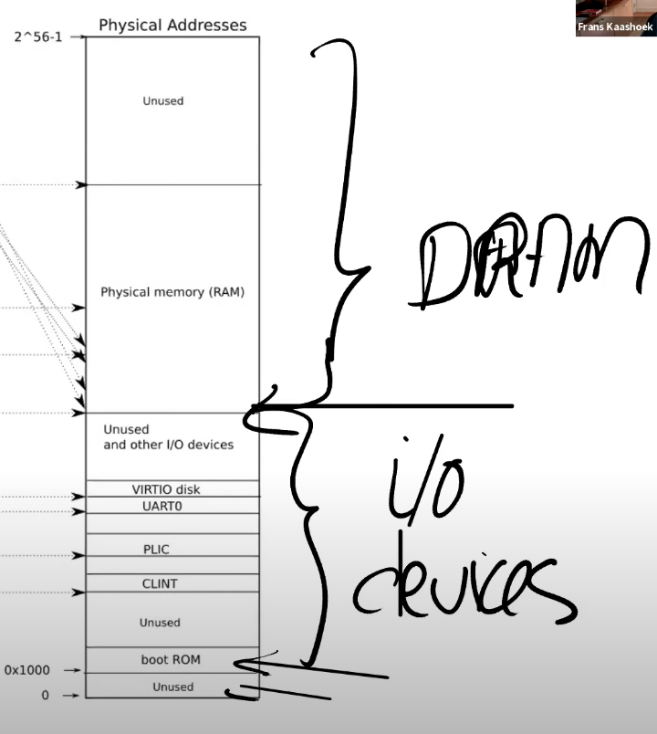
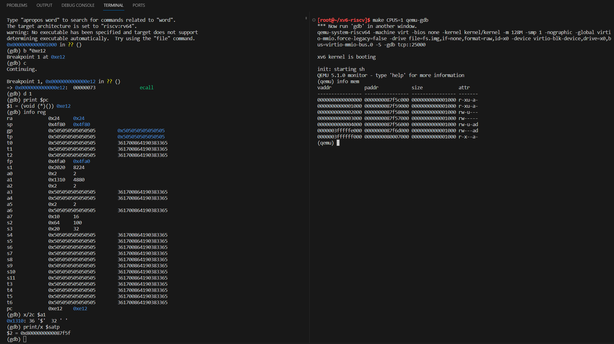
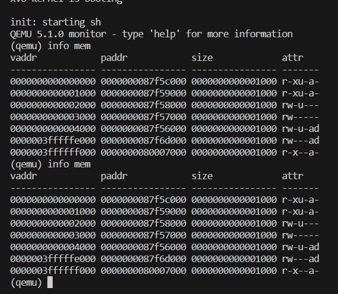
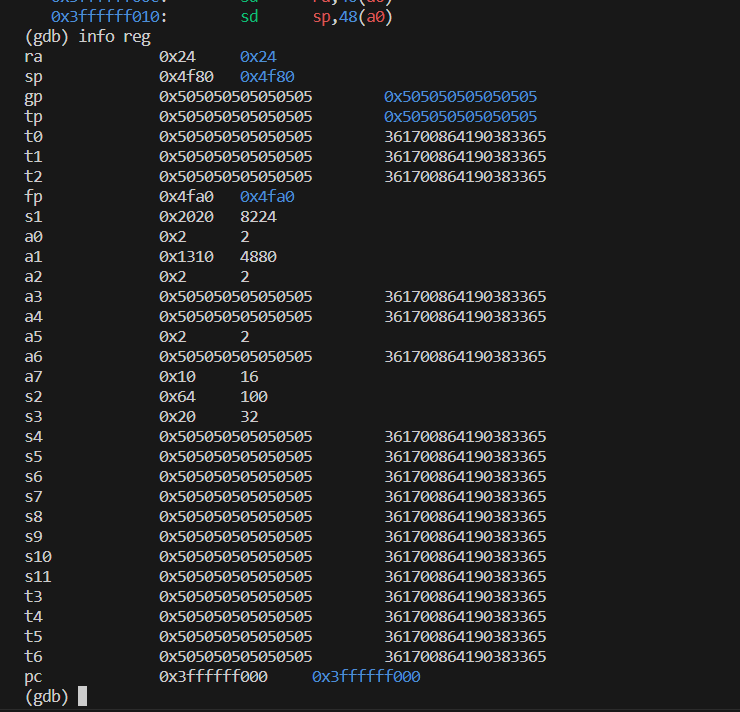
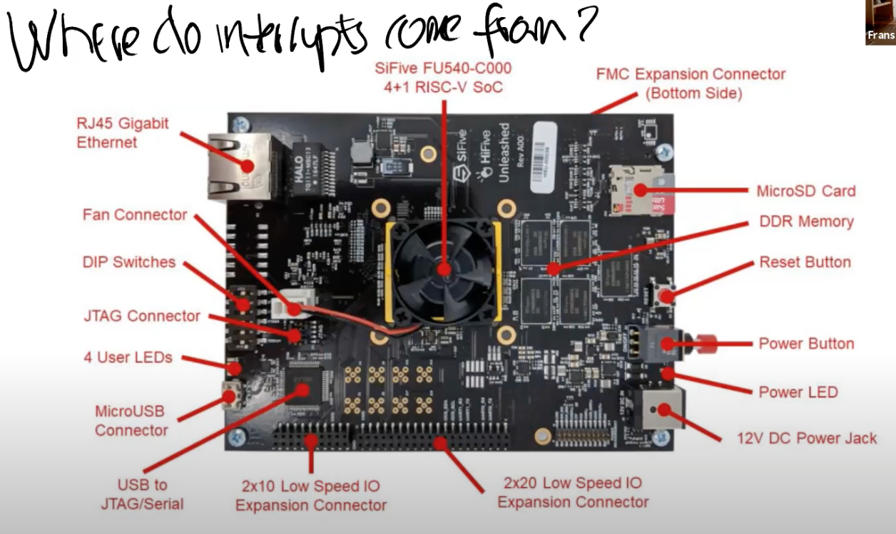

[课程官网](https://pdos.csail.mit.edu/6.828/2020/xv6.html)
[课程翻译](https://mit-public-courses-cn-translatio.gitbook.io/mit6-s081)
[书籍翻译&实验指导](https://pdos.csail.mit.edu/6.S081/2021/labs/util.html)
[xv6书籍](https://pdos.csail.mit.edu/6.828/2020/xv6/book-riscv-rev1.pdf)
[书籍中译文版本](https://github.com/shzhxh/xv6-riscv-book-CN?tab=readme-ov-file)

**本文档用于记录学习过程中的关键点**

# Lec01 Introduction and examples
## 1.2 操作系统结构

* 一个操作系统只有一个kernel，用于管理每一个用户空间进程
* 系统调用与程序中的函数调用看起来是一样的，但区别是系统调用会实际运行到系统内核中，并执行内核中对于系统调用的实现。

## 1.5 read, write, exit系统调用

* **文件描述符**：0，1，2对应标准输入、标准输出和标准错误流

* read接收3个参数：

1. 第一个参数是文件描述符，指向一个之前打开的文件。Shell会确保默认情况下，当一个程序启动时，文件描述符0连接到console的输入，文件描述符1连接到了console的输出。所以我可以通过这个程序看到console打印我的输入。当然，这里的程序会预期文件描述符已经被Shell打开并设置好。

1. read的第二个参数是指向某段内存的指针，程序可以通过指针对应的地址读取内存中的数据，这里的指针就是代码中的buf参数。在代码第10行，程序在栈里面申请了64字节的内存，并将指针保存在buf中，这样read可以将数据保存在这64字节中。

1. read的第三个参数是代码想读取的最大长度，sizeof(buf)表示，最多读取64字节的数据，所以这里的read最多只能从连接到文件描述符0的设备，也就是console中，读取64字节的数据。

## 1.6 open系统调用
```c
int fd = open("output.txt", 0_WRONLY|0_CREATE);
write(fd, "ooo/n", 4);
```
* open系统调用会返回一个新分配的文件描述符，这里的文件描述符是一个小的数字，可能是2，3，4或者其他的数字。
* write的第二个参数是数据的指针，第三个参数是要写入的字节数
* **文件描述符**本质上对应了内核中的一个表单数据。内核维护了每个运行进程的状态，内核会为每一个运行进程保存一个表单，表单的key是文件描述符。这个表单让内核知道，每个文件描述符对应的实际内容是什么。这里比较关键的点是，每个进程都有自己独立的文件描述符空间，所以如果运行了两个不同的程序，对应两个不同的进程，如果它们都打开一个文件，它们或许可以得到相同数字的文件描述符，但是因为内核为每个进程都维护了一个独立的文件描述符空间，这里相同数字的文件描述符可能会对应到不同的文件。

## 1.7 Shell
Q:有一个系统调用和编译器的问题。编译器如何处理系统调用？生成的汇编语言是不是会调用一些由操作系统定义的代码段？
A:有一个特殊的RISC-V指令，程序可以调用这个指令，并将控制权交给内核。所以，实际上当你运行C语言并执行例如open或者write的系统调用时，**从技术上来说，open是一个C函数，但是这个函数内的指令实际上是机器指令**，也就是说我们调用的open函数并不是一个C语言函数，它是**由汇编语言实现**，组成这个系统调用的汇编语言实际上在RISC-V中被称为ecall。这个特殊的指令将控制权转给内核。之后内核检查进程的内存和寄存器，并确定相应的参数。

## 1.8 fork系统调用 
```c {.line-numbers} 
//////////////////////////////////
//  fork.c: create a new process

#include "kernel/types.h"
#include "user/user.h"

int
main()
{
    int pid;

    pid = fork();  // 子父进程各返回一个pid

    printf("fork() returned %d\n", pid);  // 子父进程同时执行 

    if (pid == 0){ // pid=0, 为子进程
        printf("child\n");
    } else {  // 父进程
        printf("parent\n");
    }

    exit(0);
}
```
* fork会拷贝当前进程的内存，并创建一个新的进程，这里的内存包含了进程的指令和数据。**同时也会拷贝文件描述符的表单！**
* fork在原始的进程中会返回大于0的整数，这个是新创建进程的ID。而在新创建的进程中，fork系统调用会返回0。

##  1.9 exec, wait系统调用
```c
char *argv[] = { "echo", "this", "is", "redirected", "echo", 0 };  // 0作为一个NULL指针告诉内核数组结束了
exec("echo", argv);
printf("exec failed!\n");
exit(0);
```
* ```exec("echo", argv);```操作系统从名为echo的文件中加载指令到当前的进程中，并替换了当前进程的内存，之后开始执行这些新加载的指令。同时，可以传入命令行参数,在这里就是设置好的一个字符指针的数组argv，这里的字符指针本质就是一个字符串（string）。
* exec系统调用会**保留当前的文件描述符表单**。所以任何在exec系统调用之前的文件描述符，例如0，1，2等。它们在新的程序中表示相同的东西。
*  通常来说exec系统调用**不会返回**，因为exec会完全替换当前进程的内存，相当于当前进程不复存在了，所以exec系统调用已经没有地方能返回了。它只会在kernel不能运行相应的文件时返回。
```c {.line-numbers}
//////////////////////////////
#include "kernel/types.h"
#include "user/user.h"

// forkexec.c: fork then exec

int
main()
{
    int pid. status;

    pid = fork();
    if(pid == 0){
        char *argv[] = { "echo", "this", "is", "redirected", "echo", 0 }; 
        exec("echo", argv);   // echo执行完后退出，之后父进程重新获得对子进程的控制（相当于自动执行exit(0);)
        printf("exec failed!\n");   // 如果exec未能成功执行，执行第16,17行
        exit(1);
    } else {
        printf("parent waiting\n");
        wait(&status);  // 操作系统会将1从退出的子进程传递到此处
        printf("the chiled exited with status %d\n", status);
    }

    exit(0);
}
```
输出：

* wait会等待之前创建的子进程退出，wait的参数status，是一种让退出的子进程以一个整数（32bit的数据）的格式与等待的父进程通信方式。
* 对于Unix系统，如果一个程序成功的退出了，那么exit的参数会是0
* ```&status```，是将status对应的地址传递给内核，内核会向这个地址写入子进程向exit传入的参数(1或0)。
* Q: 当我们说子进程从父进程拷贝了所有的内存，这里具体指的是什么呢？是不是说子进程需要重新定义变量之类的？
A： 在编译之后，你的C程序就是一些在内存中的指令，这些指令存在于内存中。所以这些指令可以被拷贝，因为它们就是内存中的字节，它们可以被拷贝到别处。通过一些有关虚拟内存的技巧，可以使得子进程的内存与父进程的内存一样，这里实际就是将父进程的内存镜像拷贝给子进程，并在子进程中执行。
* Q：如果父进程有多个子进程，wait是不是会在第一个子进程完成时就退出？这样的话，还有一些与父进程交错运行的子进程，是不是需要有多个wait来确保所有的子进程都完成？
A: 是的，如果一个进程调用fork两次，如果它想要等两个子进程都退出，它需要调用wait两次。每个wait会在一个子进程退出时立即返回。当wait返回时，你实际上没有必要知道哪个子进程退出了，但是wait返回了子进程的进程号，所以在wait返回之后，你就可以知道是哪个子进程退出了。

## 1.10 I/O Redirect
```c {.line-numbers}
// redirect.c: run a command with output redirected

int
main()
{
	int pid;

	pid = fork();
	if (pid == 0) {
		close(1);  // 子进程关闭文件描述符为1的标准输出流。
		open("output.txt", 0_WRONLY|0_CREATE);   // O_WRONLY 表示写入方式，O_CREATE 表示如果文件不存在则创建

		char *argv[] = { "echo", "this", "is", "redirected", "echo", 0 };
		exec("echo", argv);
		printf("exec failed!\n");
		exit(1);
	} else {
		wait((int *) 0);
	}

	exit(0);
}
```
Shell:
```c
$ redirect
$  // no output
$ cat output.txt
this is redirected echo
```
* 代码第11行的open一定会返回1，因为**open会返回当前进程未使用的最小文件描述符序号**。因为我们刚刚关闭了文件描述符1，而文件描述符0还对应着console的输入，所以open一定可以返回1。在代码第16行之后，文件描述符1与文件output.txt关联。
* 执行```exec(echo)```时，echo会输出到文件描述符1，也就是文件output.txt。这里有意思的地方是，echo根本不知道发生了什么，**echo**也没有必要知道I/O重定向了，它**只是将自己的输出写到了文件描述符1**。只有Shell知道I/O重定向了

## 补充：pipe, list
```c {.line-numbers}
// pipe1.c: communication over a pipe

#include "kernel/types.h"
#include "user/user.h"

int
main()
{
  int fds[2];
  char buf[100];
  int n;

  // create a pipe, with two FDs in fds[0], fds[1].
  pipe(fds);

  write(fds[1], "this is pipe1\n", 14);   // 向管道的写端写入14个字节的数据,即字符串"this is pipe1\n"
  n = read(fds[0], buf, sizeof(buf));  // 从管道的读端读取数据，最多读取sizeof(buf)（即100）个字节，并将数据存储在缓冲区buf中。函数返回实际读取到的字节数，并将其存储在变量n中。

  write(1, buf, n);  // 将读取到的数据写到标准输出（文件描述符1），输出的字节数为n

  exit(0);
}
```
* 管道本质上是一个在内存中开辟的缓冲区，它连接了两个文件描述符：**第一个用于读取，第二个用于写入**。
* ```int pipe(int pipefd[2]);``` 参数：```pipefd[0]```将成为读端的文件描述符，```pipefd[1]```将成为写端的文件描述符（操作系统会自动找到当前可用的最小的两个未使用的文件描述符）
*  ```pipe()```成功时返回值为0，失败时返回值为-1，并设置errno以指示错误类型

```c {.line-numbers}
#include "kernel/types.h"
#include "user/user.h"

// pipe2.c: communication between two processes

int
main()
{
  int n, pid;
  int fds[2];
  char buf[100];

  // create a pipe, with two FDs in fds[0], fds[1].
  pipe(fds);

  pid = fork();
  if (pid == 0) {
    write(fds[1], "this is pipe2\n", 14);
  } else {
    n = read(fds[0], buf, sizeof(buf));
    write(1, buf, n);
  }

  exit(0);
}
```
* 上面代码演示了pipe在两个进程之间进行通信
```c {.line-numbers}
#include "kernel/types.h"
#include "user/user.h"

// list.c: list file names in the current directory

struct dirent {
  ushort inum;
  char name[14];
};  // 定义了一个结构体 dirent，用于表示目录项（directory entry）。每个目录项包含一个 inum 字段表示索引节点号（inode number），以及一个长度为 14 的字符数组 name 表示文件名。

int
main()
{
  int fd;  // 用于存储打开目录的文件描述符
  struct dirent e;  // 用于存储读取到的目录项

  fd = open(".", 0);
  while(read(fd, &e, sizeof(e)) == sizeof(e)){
    if(e.name[0] != '\0'){
      printf("%s\n", e.name);
    }
  }
  exit(0);
}

```
# 版本控制
## 1.  配置Linux系统HOSTS（针对虚拟机无法访问github,443错误）
1.1 打开hosts文件
```
sudo gedit /etc/hosts
```
1.2 将下面文本添加至hosts文件末尾
```
#github
140.82.114.4 github.com
151.101.1.6 github.global.ssl.fastly.net
151.101.65.6 github.global.ssl.fastly.net
151.101.129.6 github.global.ssl.fastly.net
151.101.193.6 github.global.ssl.fastly.net
```
1.3 保存并关闭文件，断开虚拟机网络然后重新连接即可

## 2. 配置Linux系统SSH（针对用https clone 远程仓库后每次push需要输密码/密码错误）
2.1 在Linux系统中生成ECDSA密钥的（*rsa密钥由于安全性问题已被github停用*）
```
//执行命令之后需要连续按3次回车键
//生成的公私钥github_id_ecdsa.pub与github_id_ecdsa文件位于root\.ssh目录下
ssh-keygen -t ecdsa -b 521 -C "450969657@qq.com"  -f ~/.ssh/github_id_ecdsa 
```
2.2 获取公钥内容
```
cd ~/.ssh
cat github_id_ecdsa.pub
```
复制保存其中的内容
2.3 将SSH key添加到ssh-agent **(须在项目文件夹中也运行一遍！)**
启动ssh-agent
```
$ eval "$(ssh-agent -s)"
> Agent pid 99360
```
添加SSH密钥到ssh-agent
```
ssh-add ~/.ssh/github_id_ecdsa 
> Identity added: /root/.ssh/github_id_ecdsa (/root/.ssh/github_id_ecdsa)
```
2.4 添加SSHkey到github账户
复制1.2中内容到网页端的个人账户设置里

2.5 测试
```
ssh -T git@github.com
> Hi bakulafalls! You've successfully authenticated, but GitHub does not provide shell access.
```

## 3. 拉取实验代码，推送
3.1 首先将mit的实验代码克隆到本地
```git clone git://g.csail.mit.edu/xv6-labs-2020```
3.2 在github创建一个新的空仓库

3.3 添加git仓库地址
查看 本地仓库git配置文件
```
cd xv6-labs-2020/
cat .git/config
> [core]
	repositoryformatversion = 0
	filemode = true
	bare = false
	logallrefupdates = true
[remote "origin"]
	url = git://g.csail.mit.edu/xv6-labs-2020
	fetch = +refs/heads/*:refs/remotes/origin/*
[branch "master"]
	remote = origin
	merge = refs/heads/master
[branch "util"]
	remote = origin
	merge = refs/heads/util
```
添加自己的github仓库地址
```
git remote add github git@github.com:bakulafalls/xv6-labs-2020.git
cat .git/config
>  [core]
	repositoryformatversion = 0
	filemode = true
	bare = false
	logallrefupdates = true
[remote "origin"]
	url = git://g.csail.mit.edu/xv6-labs-2020
	fetch = +refs/heads/*:refs/remotes/origin/*
[branch "master"]
	remote = origin
	merge = refs/heads/master
[branch "util"]
	remote = origin
	merge = refs/heads/util
[remote "github"]
	url = git@github.com:bakulafalls/xv6-labs-2020.git
	fetch = +refs/heads/*:refs/remotes/github/*
```
3.4 在项目目录下进行一遍2.3的操作

3.5 将实验代码推送github仓库
```c
// 将实验1用到的util分支推送到github
git checkout util
git push github util:util
```
3.6 建议每个实验创建一个测试分支，例如对于util来说
```c
git checkout util         // 切换到util分支
git checkout -b util_test // 建立并切换到util的测试分支
```
当在***util_test***分支中每测试通过一个作业，请提交（```git commit```）代码，并将所做的修改合并（```git merge```）到util中，然后提交（```git push```）到github
```c
git add .
git commit -m "完成了第一个作业"
git checkout util
git merge util_test
git push github util:util
```

# Lab1: Xv6 and Unix utilities
## Task1 Launch xv6
参考网站：[课程官方实验部署指南](https://pdos.csail.mit.edu/6.828/2018/tools.html)， [CENTOS7部署经验](https://blog.csdn.net/weixin_46803360/article/details/128116051?ops_request_misc=&request_id=&biz_id=102&utm_term=CENTOSMIT6.828&utm_medium=distribute.pc_search_result.none-task-blog-2~all~sobaiduweb~default-0-128116051.142^v100^pc_search_result_base1&spm=1018.2226.3001.4187)， [Ubuntu部署经验](https://blog.csdn.net/u013573243/article/details/129403949?ops_request_misc=%257B%2522request%255Fid%2522%253A%2522171627969616800197084566%2522%252C%2522scm%2522%253A%252220140713.130102334.pc%255Fall.%2522%257D&request_id=171627969616800197084566&biz_id=0&utm_medium=distribute.pc_search_result.none-task-blog-2~all~first_rank_ecpm_v1~rank_v31_ecpm-3-129403949-null-null.142^v100^pc_search_result_base1&utm_term=Error%3A%20Couldnt%20find%20a%20riscv64%20version%20of%20GCC%2Fbinutils.%20***%20To%20turn%20off%20this%20error%2C%20run%20gmake%20TOOLPREFIX%3D%20....&spm=1018.2226.3001.4187)
自用环境：CentOS7(VMware) + https://github.com/mit-pdos/xv6-public
实验用：```$ git clone git://g.csail.mit.edu/xv6-labs-2020```
**编译错误：**
1. 
1. install riscv tool-gnu-toolchain 时，make时之前添加的PATH中的环境变量不在了，需重新在控制台输入
```
# source ~/.bash_profile
# echo $PATH
> /usr/local/bin:/usr/local/sbin:/usr/bin:/usr/sbin:/bin:/sbin:/root/bin:/root/bin:/opt/riscv/bin
```
或者在.bashrc中设置环境变量

**clone 错误：**
```
error: RPC failed; result=18, HTTP code = 20000 KiB/s   
fatal: The remote end hung up unexpectedly
fatal: 过早的文件结束符（EOF）
fatal: index-pack failed
```
解决方法：
  ```
  git config --global http.postBuffer 524288000
  ```

  **toolchain make 错误：**
 1. ``` log2’不是‘std’的成员```原因是Linux系统中C标准库版本过低
[解决方法](https://blog.csdn.net/m0_43453853/article/details/109381488?ops_request_misc=%257B%2522request%255Fid%2522%253A%2522171634022916800184171915%2522%252C%2522scm%2522%253A%252220140713.130102334.pc%255Fall.%2522%257D&request_id=171634022916800184171915&biz_id=0&utm_medium=distribute.pc_search_result.none-task-blog-2~all~first_rank_ecpm_v1~rank_v31_ecpm-4-109381488-null-null.142^v100^pc_search_result_base1&utm_term=make%20%E6%8A%A5%E9%94%99Log2%E4%B8%8D%E6%98%AFstd%E7%9A%84%E6%88%90%E5%91%98&spm=1018.2226.3001.4187)
1. 
```
g++: fatal error: 已杀死 signal terminated program cc1plus
compilation terminated.
```
原因：内存不足
尝试在VMware中将内存设为8G

<h2 id="make-err"> xv6-labs-2020 make 错误：</h2>

1. 
```
user/sh.c: In function 'runcmd':
user/sh.c:58:1: error: infinite recursion detected []8;;https://gcc.gnu.org/onlinedocs/gcc/Warning-Options.html#index-Winfinite-recursion-Werror=infinite-recursion]8;;]
```
参照[记录MIT6.s081 编译QEMU中的错误](https://blog.csdn.net/weixin_51472360/article/details/128800041),修改user/sh.c:58处，添加__attribute__((noreturn))
```c {.line-numbers}
diff --git a/user/sh.c b/user/sh.c
index 83dd513..c96dab0 100644
--- a/user/sh.c
+++ b/user/sh.c
@@ -54,6 +54,7 @@ void panic(char*);
 struct cmd *parsecmd(char*);
 
 // Execute cmd.  Never returns.
+__attribute__((noreturn))
 void
 runcmd(struct cmd *cmd)
 {
```
2. make: qemu-system-riscv64：命令未找到
新版的实验代码是在riscv上编译的，所以对应的qemu也需要安装riscv版本
[方法参考](https://stackoverflow.com/questions/66718225/qemu-system-riscv64-is-not-found-in-package-qemu-system-misc)


启动成功

***退出 qemu*** : ```Ctrl-a x```
***显示当前进程***：```Ctrl-p```

## Task2 Sleep
<span style="background-color:green;">实现xv6的UNIX程序```sleep```：您的```sleep```应该暂停到用户指定的计时数。一个滴答(tick)是由xv6内核定义的时间概念，即来自定时器芯片的两个中断之间的时间。您的解决方案应该在文件***user/sleep.c***中。</span>

**提示：**
* 在你开始编码之前，请阅读《book-riscv-rev1》的第一章

* 看看其他的一些程序（如 ***/user/echo.c, /user/grep.c, /user/rm.c***）查看如何获取传递给程序的命令行参数
<details>
    <summary><span style="color:lightblue;">echo.c</span> </summary>

```c {.line-numbers}
#include "kernel/types.h"
#include "kernel/stat.h"
#include "user/user.h"

int
main(int argc, char *argv[])  // argc为命令行的总的参数个数；argv为一个包含所有参数的字符串数组
{
  int i;

  for(i = 1; i < argc; i++){  // i=0为程序名称跳过
    write(1, argv[i], strlen(argv[i]));  // 1 为标准输出文件描述符；argv[i]为要写入的字符串
    if(i + 1 < argc){  // 当前参数不是最后一个参数时，输出一个空格
      write(1, " ", 1);
    } else {
      write(1, "\n", 1);  //当前参数是最后一个参数时，输出一个换行符
    }
  }
  exit(0);
}
```
</details>

<details>
    <summary><span style="color:lightblue;">grep.c</span> </summary>

```c {.line-numbers}
// Simple grep.  Only supports ^ . * $ operators.

#include "kernel/types.h"
#include "kernel/stat.h"
#include "user/user.h"

char buf[1024];
int match(char*, char*);

void
grep(char *pattern, int fd)
{
  int n, m;   // 用于跟踪读取的字符数和缓冲区中的字符总数
  char *p, *q;  // 用于在缓冲区中操作字符串

  m = 0; 
  while((n = read(fd, buf+m, sizeof(buf)-m-1)) > 0){
    m += n;  // 更新缓存区字符总数
    buf[m] = '\0';  // 放置字符串结束符，使得buf为有效字符串
    p = buf;  // 将指针p设置为缓冲区的开始，准备开始处理缓冲区中的数据
    while((q = strchr(p, '\n')) != 0){   // 查找每一行的结束位置(\n), strchr函数查找从p开始的第一个\n字符
      *q = 0;  // 将找到的换行符替换为字符串结束符，这样从p到q的内容现在是一个独立的字符串
      if(match(pattern, p)){
        *q = '\n';  // 如果匹配，将之前替换的字符串结束符恢复为换行符，以保持原始数据的完整性
        write(1, p, q+1 - p);  // 将该行(包括\n)写入标准输出
      }
      p = q+1;  // 指针移至下一行的开始位置
    }
    if(m > 0){  // 检查是否还有未处理的数据在缓冲区中
      m -= p - buf;  // 计算剩余未处理的数据长度，并更新m
      memmove(buf, p, m);  // 将剩余的数据移动到缓冲区的开始位置，为下一次读取做准备
    } 
  }
}

int
main(int argc, char *argv[])
{
  int fd, i;
  char *pattern;

  if(argc <= 1){
    fprintf(2, "usage: grep pattern [file ...]\n");
    exit(1);
  }
  pattern = argv[1];

  if(argc <= 2){
    grep(pattern, 0);
    exit(0);
  }

  for(i = 2; i < argc; i++){  // 遍历所有命令行参数（文件名）
    if((fd = open(argv[i], 0)) < 0){
      printf("grep: cannot open %s\n", argv[i]);
      exit(1);
    }
    grep(pattern, fd);
    close(fd);
  }
  exit(0);
}

// Regexp matcher from Kernighan & Pike,
// The Practice of Programming, Chapter 9.

int matchhere(char*, char*);
int matchstar(int, char*, char*);

int
match(char *re, char *text)
{
  if(re[0] == '^')
    return matchhere(re+1, text);
  do{  // must look at empty string
    if(matchhere(re, text))
      return 1;
  }while(*text++ != '\0');
  return 0;
}

// matchhere: search for re at beginning of text
int matchhere(char *re, char *text)
{
  if(re[0] == '\0')
    return 1;
  if(re[1] == '*')
    return matchstar(re[0], re+2, text);
  if(re[0] == '$' && re[1] == '\0')
    return *text == '\0';
  if(*text!='\0' && (re[0]=='.' || re[0]==*text))
    return matchhere(re+1, text+1);
  return 0;
}

// matchstar: search for c*re at beginning of text
int matchstar(int c, char *re, char *text)
{
  do{  // a * matches zero or more instances
    if(matchhere(re, text))
      return 1;
  }while(*text!='\0' && (*text++==c || c=='.'));
  return 0;
}

```
</details>

<details>
    <summary><span style="color:lightblue;">rm.c</span> </summary>

```c {.line-numbers}
#include "kernel/types.h"
#include "kernel/stat.h"
#include "user/user.h"

int
main(int argc, char *argv[])
{
  int i;

  if(argc < 2){  // 检查是否至少提供了一个文件名
    fprintf(2, "Usage: rm files...\n");
    exit(1);
  }

  for(i = 1; i < argc; i++){
    if(unlink(argv[i]) < 0){  // unlink函数返回一个小于0的值，表示删除操作失败
      fprintf(2, "rm: %s failed to delete\n", argv[i]);
      break;
    }
  }

  exit(0);
}
```
</details>

* 如果用户忘记传递参数，```sleep```应该打印一条错误信息

* 命令行参数作为字符串传递; 您可以使用```atoi```将其转换为数字（详见 ***/user/ulib.c***）
```c {.line-numbers}
// ulib.c
#include "kernel/types.h"
#include "kernel/stat.h"
#include "kernel/fcntl.h"
#include "user/user.h"

// ...

int
atoi(const char *s)
{
  int n;

  n = 0;
  while('0' <= *s && *s <= '9')
    n = n*10 + *s++ - '0';  // 之前的数字左移一位（即乘以10），然后加上新的数字
  return n;
}
```


* 使用系统调用```sleep```

* 请参阅kernel/sysproc.c以获取实现```sleep```系统调用的xv6内核代码（查找```sys_sleep```），***user/user.h***提供了```sleep```的声明以便其他程序调用，用汇编程序编写的***user/usys.S***可以帮助```sleep```从用户区跳转到内核区。
```c {.line-numbers}
// kernel/sysproc.c
//...
uint64
sys_sleep(void)
{
  int n;
  uint ticks0;

  if(argint(0, &n) < 0)
    return -1;
  acquire(&tickslock);
  ticks0 = ticks;
  while(ticks - ticks0 < n){
    if(myproc()->killed){
      release(&tickslock);
      return -1;
    }
    sleep(&ticks, &tickslock);
  }
  release(&tickslock);
  return 0;
}
```

* 确保```main```函数调用```exit()```以退出程序。

* 将你的```sleep```程序添加到***Makefile***中的```UPROGS```中；完成之后，```make qemu```将编译您的程序，并且您可以从xv6的shell运行它。

* 看看Kernighan和Ritchie编著的《C程序设计语言》（第二版）来了解C语言。
***
**Sleep**
```c {.line-numbers}
#include "kernel/types.h"
#include "user/user.h"

int main(int argc, char const *argv[])
{
  if (argc != 2) { //参数错误
    fprintf(2, "usage: sleep <time>\n");
    exit(1);
  }
  sleep(atoi(argv[1]));
  exit(0);
}
```

## Task3 Pingpong
<span style="background-color:green;">编写一个使用UNIX系统调用的程序来在两个进程之间“ping-pong”一个字节，请使用两个管道，每个方向一个。父进程应该向子进程发送一个字节;子进程应该打印“\<pid>: received ping”，其中\<pid>是进程ID，并在管道中写入字节发送给父进程，然后退出;父级应该从读取从子进程而来的字节，打印“\<pid>: received pong”，然后退出。您的解决方案应该在文件```user/pingpong.c```中。</span>

**提示：**
* Use ```pipe``` to create a pipe.
* Use ```fork``` to create a child.
* Use ```read``` to read from the pipe, and ```write``` to write to the pipe.
* Use ```getpid``` to find the process ID of the calling process.
* Add the program to ```UPROGS``` in Makefile.
* User programs on xv6 have a limited set of library functions available to them. You can see the list in ```user/user.h```; the source (other than for system calls) is in ```user/ulib.c```, ```user/printf.c```, and ```user/umalloc.c```.
***
**Ping-pong**
```c {.line-numbers}
#include "kernel/types.h"
#include "user/user.h"

int
main(int argc, char const *argv[])
{
  if (argc != 1) {  // 参数错误
    fprintf(2, "usage: pingpong\n");
    exit(1);
  }

  int pid, n = 0;  // n为退出错误flag
  int fds1[2];  // parent->child
  int fds2[2];  // child->parent
  char buf = 'Z';  // 用于传送的字节

  // create two pipes, with four FDs in fds1[0], fds1[1], fds2[0], fds2[1]
  pipe(fds1);
  pipe(fds2);

  pid = fork();
  if (pid < 0) {
    fprintf(2, "fork() error!\n");
    // 错误处理
    close(fds1[1]);
    close(fds2[0]); 
    close(fds1[0]);
    close(fds2[1]);
    n = 1;
  }
  else if (pid == 0) {  // child proc 
    // 关闭子进程中不用的管道口
    close(fds1[1]);
    close(fds2[0]); 
    // if read buf, print
    if (read(fds1[0], &buf, sizeof(buf)) != sizeof(char)) {
      fprintf(2, "child read error!\n");
      n = 1;
    }
    else {
      fprintf(2, "%d: received ping\n", getpid());
    }
    close(fds1[0]);
    // send buf to parent through pipe2
    if (write(fds2[1], &buf, sizeof(buf)) != sizeof(char)) {
      fprintf(2, "child write error!\n");
      n = 1;
    }
    close(fds2[1]);
    // 退出子进程
    exit(n);
  }
  else {  // parent proc
    // 关闭父进程中不用的管道口
    close(fds1[0]);
    close(fds2[1]);
    // 通过pipe1向Child发送buf
    if (write(fds1[1], &buf, sizeof(buf)) != sizeof(char)) {
      fprintf(2, "parent write error!\n");
      n = 1;
    }
    close(fds1[1]);
    // if read buf, print
    if (read(fds2[0], &buf, sizeof(buf)) != sizeof(char)) {
      fprintf(2, "parent read error!\n");
      n = 1;
    }
    else {
      fprintf(2, "%d: received pong\n", getpid());
    }
    close(fds2[0]);

    // 等待子进程退出
    wait(&n);
  }

  exit(n);
}

```
测试结果：


## Task4 Primes(Moderate/Hard)
<span style="background-color:green;">使用管道编写```prime sieve```(筛选素数)的并发版本。这个想法是由Unix管道的发明者Doug McIlroy提出的。请查看[这个网站](https://swtch.com/~rsc/thread/)，该网页中间的图片和周围的文字解释了如何做到这一点。您的解决方案应该在***user/primes.c***文件中。</span>
你的目标是使用```pipe```和```fork```来设置管道。第一个进程将数字2到35输入管道。对于每个素数，您将安排创建一个进程，该进程通过一个管道从其左邻居读取数据，并通过另一个管道向其右邻居写入数据。由于xv6的文件描述符和进程数量有限，因此第一个进程可以在35处停止。

**参考资料翻译：**
sieve of Eratosthenes算法伪代码：
```
p = get a number from left neighbor
print p
loop:
    n = get a number from left neighbor
    if (p does not divide n)
        send n to right neighbor
```
图解：

生成进程可以将数字2、3、4、…、1000输入管道的左端：行中的第一个进程消除2的倍数，第二个进程消除3的倍数，第三个进程消除5的倍数，依此类推。

**提示：**
* 请仔细关闭进程不需要的文件描述符，否则您的程序将在第一个进程达到35之前就会导致xv6系统资源不足。

* 一旦第一个进程达到35，它应该使用```wait```等待整个管道终止，包括所有子孙进程等等。因此，主```primes```进程应该只在打印完所有输出之后，并且在所有其他```primes```进程退出之后退出。

* 提示：当管道的```write```端关闭时，```read```返回零。

* 最简单的方法是直接将32位（4字节）int写入管道，而不是使用格式化的ASCII I/O。

* 您应该仅在需要时在管线中创建进程。

* 将程序添加到Makefile中的```UPROGS```

**示例输出：**
```sh
$ make qemu
...
init: starting sh
$ primes
prime 2
prime 3
prime 5
prime 7
prime 11
prime 13
prime 17
prime 19
prime 23
prime 29
prime 31
$
```
***
**Primes**
```c {.line-numbers}
#include "kernel/types.h"
#include "user/user.h"

/**
 *@brief 读取上一个管道的第一个数据并打印
 *@param pfirst 指向储存第一个数据的指针
*/
int
lpipe_first_data(int lpipe[2], int *pfirst)
{
  if (read(lpipe[0], pfirst, sizeof(int)) == sizeof(int)) {
    fprintf(2, "prime %d\n", *pfirst);
    return 0;
  }
  return -1;
}


/**
 *@brief 将lpipe中的数据传入p中，剔除掉不能被 first_number整除的数据
 *@param lpipe 上一个管道
 *@param rpipe 新的管道
 *@param pfirst 指向储存第一个数据的指针
*/
void
transmit_data(int lpipe[2], int rpipe[2], int *pfirst)
{
  int data;  // 存放读取的lpipe数据
  while (read(lpipe[0], &data, sizeof(int)) == sizeof(int))
  {
    // 将无法整除的数据传入rpipe
    if (data % *pfirst) {
      write(rpipe[1], &data, sizeof(int));
    }
  }
  close(lpipe[0]);
  close(rpipe[1]);
}


/**
 *@brief 寻找素数 
 *@param lpipe: 上一个管道的管道符
*/
__attribute__((noreturn))  // 告诉编译器，这个函数不会返回
void
find_primes(int lpipe[2])
{
  // 关闭上一个管道的写入端，已经不需要了
  close(lpipe[1]);
  int first_number;
  if (lpipe_first_data(lpipe, &first_number) == 0)  // 打印上一个管道得到的素数
  {
    int p[2];
    pipe(p);  // 新建管道作为当前管道
    //  将lpipe中的数据传入p中，剔除掉不能被 first_number整除的数据
    transmit_data(lpipe, p, &first_number);
    if (fork() == 0) {  //  新建子进程处理新的管道
      close(p[1]);
      find_primes(p);  // 递归
    }
    else {
      close(p[0]);
      close(p[1]);
      wait(0);  // 最后一个孙进程结束前，所有之前的进程都等待
    }
  }
  exit(0);
}


int
main(int argc, char const *argv[])
{
  if (argc != 1) {  // 参数错误
    fprintf(2, "usage: primes\n");
    exit(1);
  }

  int pid;
  int fds[2];
  pipe(fds);

  for (int i=2; i <= 35; i++)  // 写入2-35到第一个管道中
  {
    write(fds[1], &i, sizeof(int));
  }

  pid = fork();
  if (pid == 0) {  // child
    // 寻找素数
    find_primes(fds);
  }
  else {  // oldest parent, do nothing but wait
    close(fds[0]);
    close(fds[1]);
    wait(0);
  }
  exit(0);
}
```
需要注意的是， 我搭建的环境下的编译器似乎不能很好地理解递归停止条件，参照[task1中的xv6-labs-2020 make 错误](#make-err)，须在使用递归的函数前面添加```__attribute__((noreturn))```, 才能编译通过，输出如下：


## Task5 Find(Moderate)
<span style="background-color:green;">写一个简化版本的UNIX的```find```程序：查找目录树中具有特定名称的所有文件，你的解决方案应该放在***user/find.c***.</span>

**提示：**
* 查看***user/ls.c***文件学习如何读取目录
<details>
    <summary><span style="color:blue;">ls.c</span> </summary>

```c {.line-numbers}
#include "kernel/types.h"
#include "kernel/stat.h"
#include "user/user.h"
#include "kernel/fs.h"

char*
fmtname(char *path)
{
  static char buf[DIRSIZ+1];
  char *p;

  // Find first character after last slash.
  for(p=path+strlen(path); p >= path && *p != '/'; p--)
    ;  // p指向从后往前搜索到的第一个'/'
  p++;

  // Return blank-padded name.
  if(strlen(p) >= DIRSIZ)
    return p;
  memmove(buf, p, strlen(p));
  memset(buf+strlen(p), ' ', DIRSIZ-strlen(p));  // 确保所有文件名长度相同
  return buf;
}

void
ls(char *path)
{
  char buf[512], *p;
  int fd;
  struct dirent de;  // 目录
  struct stat st;  // 状态信息

  if((fd = open(path, 0)) < 0){
    fprintf(2, "ls: cannot open %s\n", path);
    return;
  }

  if(fstat(fd, &st) < 0){
    fprintf(2, "ls: cannot stat %s\n", path);
    close(fd);
    return;
  }

  switch(st.type){
  case T_FILE:  // (2)
    printf("%s %d %d %l\n", fmtname(path), st.type, st.ino, st.size);
    break;

  case T_DIR:  // (1)
    if(strlen(path) + 1 + DIRSIZ + 1 > sizeof buf){
      printf("ls: path too long\n");
      break;
    }
    strcpy(buf, path);  // 在 buf 中构建新的路径，为读取目录内容做准备
    p = buf+strlen(buf);
    *p++ = '/';
    while(read(fd, &de, sizeof(de)) == sizeof(de)){
      if(de.inum == 0)
        continue;
      memmove(p, de.name, DIRSIZ);
      p[DIRSIZ] = 0;  // 在复制的文件名后添加一个字符串结束符
      if(stat(buf, &st) < 0){
        printf("ls: cannot stat %s\n", buf);
        continue;
      }
      printf("%s %d %d %d\n", fmtname(buf), st.type, st.ino, st.size);
    }
    break;
  }
  close(fd);
}

int
main(int argc, char *argv[])
{
  int i;

  if(argc < 2){
    ls(".");
    exit(0);
  }
  for(i=1; i<argc; i++)
    ls(argv[i]);
  exit(0);
}
```
</details>

* 使用递归允许```find```下降到子目录中
* 不要在“```.```”和“```..```”目录中递归
* 对文件系统的更改会在qemu的运行过程中一直保持；要获得一个干净的文件系统，请运行```make clean```，然后```make qemu```
* 你将会使用到C语言的字符串，要学习它请看《C程序设计语言》（K&R）,例如第5.5节
* 注意在C语言中不能像python一样使用“```==```”对字符串进行比较，而应当使用```strcmp()```
* 将程序加入到***Makefile***的```UPROGS```

**示例输出(文件系统中包含文件b和a/b)：**
```sh
$ make qemu
...
init: starting sh
$ echo > b
$ mkdir a
$ echo > a/b
$ find . b
./b
./a/b
$
```

**find**
```c {.line-numbers}
#include "kernel/types.h"
#include "kernel/stat.h"
#include "user/user.h"
#include "kernel/fs.h"

/**
 *@brief 寻找指定文件
 *@param path 要搜寻的目录路径  
 *@param filename 要搜寻的文件名
*/
//__attribute__((noreturn))
void
find(char *path, const char *filename)
{
  // 在第一级目录下搜寻
  char buf[512], *p;  // buf用于构建路径
  int fd;
  struct dirent de;  // 目录
  struct stat st;  // 状态信息

  if((fd = open(path, 0)) < 0){
    fprintf(2, "find: cannot open %s\n", path);
    return;
  }

  if(fstat(fd, &st) < 0){
    fprintf(2, "find: cannot stat %s\n", path);
    close(fd);
    return;
  }

  if (st.type != T_DIR) {
    fprintf(2, "invaild path! usage: find <dir> <filename>\n");
    close(fd);
    return;
  }

  if(strlen(path) + 1 + DIRSIZ + 1 > sizeof buf){
      fprintf(2, "ls: path too long\n");
      return;
    }

  strcpy(buf, path);  // 在 buf 中构建新的路径，为读取目录内容做准备
  p = buf+strlen(buf);
  *p++ = '/';  // p指向最后一个'/'后一个字符 
  while(read(fd, &de, sizeof(de)) == sizeof(de)){  // 遍历当前目录下每一个文件
    if(de.inum == 0)
      continue;
    memmove(p, de.name, DIRSIZ);  // 添加路径名称
    p[DIRSIZ] = 0;  // 在复制的文件名后添加一个字符串结束符
    if(stat(buf, &st) < 0){
      fprintf(2, "ls: cannot stat %s\n", buf);
      continue;
    }

    // 递归， "." 和 ".." 目录除外
    if (st.type == T_DIR && strcmp(p, ".") != 0 && strcmp(p, "..") != 0)
    {
      find(buf, filename);
    }
    else if (strcmp(filename, p) == 0)  // p指向的字符串不为DIR, 而是FILE（忽略DEVICE的情况），进行文件名比对
    printf("%s\n", buf);
  }
}


int
main(int argc, char *argv[])
{
  if (argc != 3) {  // 参数错误
    fprintf(2, "usage: find <dir> <filename>\n");
    exit(1);
  }

  find(argv[1], argv[2]);
  exit(0);
}
```

**测试输出：**


## Task6 xargs(Moderate)
<span style="background-color:green;">编写一个简化版UNIX的```xargs```程序：它从标准输入中按行读取，并且为每一行执行一个命令，将行作为参数提供给命令。你的解决方案应该在***user/xargs.c***</span>

**示例1：**
```sh
$ echo hello too | xargs echo bye
bye hello too
$
```
上面的命令实际上执行的是```echo bye hello too```

**示例2 ：**  UNIX系统下设置参数-n为1等效于lab所用系统(每次从输入中取出一个参数来执行后面的命令)
```sh
$ echo "1\n2" | xargs -n 1 echo line
line 1
line 2
$
```
对于每个输入项（这里是 "1" 和 "2"），```xargs``` 都会执行 ```echo line```，并将输入项作为参数附加到 ```echo line``` 命令后面。

**示例3：**
```sh
$ find . b | xargs grep hello
```
上面的命令会在"."下查找所有文件名为b的文件， 并在每个文件b中执行```grep hello```

**提示：**
* 对于示例1，"|"创建了一个管道连接两个命令：
```echo hello too``` 在管道的写端，对应标准输入流0
```xargs echo bye``` 在管道的读端。
* 使用```fork```和```exec```对每行输入调用命令，在父进程中使用```wait```等待子进程完成命令。
* 要读取单个输入行，请一次读取一个字符，直到出现换行符（```'\n'```）。
* ***kernel/param.h***声明```MAXARG```，如果需要声明```argv```数组，这可能很有用。
* 将程序添加到***Makefile***中的```UPROGS```。
* 对文件系统的更改会在qemu的运行过程中保持不变；要获得一个干净的文件系统，请运行```make clean```，然后```make qemu```

**xargs**
```c {.line-numbers}
#include "kernel/types.h"
#include "kernel/param.h"
#include "user/user.h"

#define MAXSZ 512

// 当前字符状态定义
enum state {
  S_WAIT,           // 等待输入（初始状态、空格）
  S_ARG,            // 当前为参数
  S_ARG_END,        // 参数结束
  S_ARG_LINE_END,   // 左侧有参数的换行，e.g.: "arg\n"
  S_LINE_END,       // 左侧有空格的换行，e.g.: "arg \n"
  S_END             // 结束
};

// 字符类型定义
enum char_type {
  C_SPC,  // 空格
  C_CHR,  // 普通字符
  C_LNEND // 换行符
};


/**
 *@brief 获取字符类型
 *@param c 要判定的字符
*/
enum char_type get_char_type(char c)
{
  switch (c) {
    case ' ':
      return C_SPC;
    case '\n':
      return C_LNEND;
    default:
      return C_CHR;
  }
}


/**
 *@brief 根据当前字符类型转换当前状态
 *@param last_state 判定前的状态
 *@param cur_char 当前字符种类
*/
enum state transform_state(enum state last_state, enum char_type cur_char)
{
  switch (last_state) {
    case S_WAIT:
      if (cur_char == C_SPC)    return S_WAIT; // 继续等待
      if (cur_char == C_LNEND)  return S_LINE_END;
      if (cur_char == C_CHR)    return S_ARG;
      break;
    case S_ARG:
      if (cur_char == C_SPC)    return S_ARG_END;  // 参数结束
      if (cur_char == C_LNEND)  return S_ARG_LINE_END;
      if (cur_char == C_CHR)    return S_ARG;  
      break;
    case S_ARG_END:  
    case S_ARG_LINE_END:
    case S_LINE_END:  // 换行后情况都一样
      if (cur_char == C_SPC)    return S_WAIT;  
      if (cur_char == C_LNEND)  return S_LINE_END;  // 连换两行
      if (cur_char == C_CHR)    return S_ARG;  
    default:  // S_END
      break;
  }
  return S_END;
}


int
main(int argc, char *argv[])  
{
  if (argc > MAXARG)  { // 参数错误
    fprintf(2, "Too many arguments!\n");
    exit(1);
  }

  enum state st = S_WAIT;  // 用于表示状态
  char lines[MAXSZ];  // 初始化内存用于读取命令参数
  char *p = lines;  // 初始化指针指向用于储存命令行的缓存
  char *new_argv[MAXARG] = {0};  // 初始化用于存储参数的指针数组
  int arg_start = 0;  // 参数起点
  int arg_end = 0;  // 参数终点
  int arg_cur = argc-1;  // 当前参数索引, 前面已经有argc-1个参数被记录了，如实例1中的"echo","bye",为argv[1:2]

  // 存储管道写入端里的原有的命令参数,如实例1中的"argx","echo","bye"，argc=3, 我们只储存"echo","bye"
  for (int i = 1; i < argc; ++i) {
    new_argv[i - 1] = argv[i];
  }

  // 对每一行命令参数循环, 每个while读取一个字符
  while (st != S_END ) {
    if (read(0, p, sizeof(char)) != sizeof(char)) {  // 读取到的命令为空，设置状态为结束
      st = S_END;
    }
    else {
      st = transform_state(st, get_char_type(*p));
      ++arg_end;  // 新读取了一个字符，需要更新当前参数结束位置
    }

    switch (st) {
      case S_WAIT:  // 忽略掉当前的空格，右移参数起始指针
        ++arg_start;
        break; 
      case S_ARG_END:  // 在new_argv中储存当前参数地址
        new_argv[arg_cur++] = &lines[arg_start];
        arg_start = arg_end;  // 移动参数起点到下一个参数位置
        *p = '\0';  // 在缓存中参数结尾添加字符串结束符
        break;
      case S_ARG_LINE_END:  // 先将参数地址存入newargv,然后和S_LINE_END一样执行命令
        new_argv[arg_cur++] = &lines[arg_start];
      case S_LINE_END:  // 为当前行执行命令
        arg_start = arg_end;
        *p = '\0';
        new_argv[arg_cur] = 0;  // 确保参数列表以NULL结束
        if (fork() == 0) {
          exec(argv[1], new_argv);  // arg[0]为xargs
          exit(0);  // 确保子进程在exec失败时退出 
        }
        arg_cur = argc - 1;  // 重置位置
        // 换行，清空参数
        for (int i = arg_cur; i < MAXARG; ++i)
          new_argv[i] = 0;
        wait(0);
        break;
      default:
        break;
    }

    p++;  // 读取下一个字符
  }

  exit(0);
}
```

**测试结果：**


测试成功

# Lec03 OS Organization and System Calls
## 看书预习
*  操作系统的三大要求：**多路复用(multiplexing)、隔离(isolation)和交互(interaction)**, 书上侧重于讲解以**宏内核(monolithic kernel)** 为中心的主流设计来实现这三点。
*  RISC-V是一个64位的中央处理器，xv6是用基于 **“LP64”的C语言** 编写的, 所以```Long```(L)和指针变量(p)为64位，int为32位。
* Xv6是以qemu的“-machine virt”选项模拟的支撑硬件编写的。这包括RAM、包含引导代码的ROM、一个到用户键盘/屏幕的串行连接，以及一个用于存储的磁盘。
* 用户态=用户模式=目态
  核心态=管理模式=管态 
* **宏内核**：整个操作系统都驻留在内核中，这样**所有系统调用的实现都以管理模式运行**。
优点：方便操作系统设计者进行设计，操作系统的不同部分更容易合作
缺点：操作系统不同部分之间的接口通常很复杂，内核代码量更大使得更容易出现的bug经常会导致计算机停止工作.
* **微内核（microkernel）**： 为降低内核出错的风险，最大限度地**减少**在**管理模式下运行的操作系统代码量**，并在用户模式下执行大部分操作系统

图中，**文件系统**作为**用户级进程**运行。作为进程运行的操作系统服务被称为**服务器**。为了允许应用程序与文件服务器交互，内核提供了允许从一个用户态进程向另一个用户态进程发送消息的进程间通信机制。例如，如果像shell这样的应用程序想要读取或写入文件，它会向文件服务器发送消息并等待响应。
* 单机微内核操作系统中几乎无一例外地都采用**客户/服务器(C/S)模式**，将操作系统中最基本的部分放入内核中，而把操作系统的绝大部分功能都放在微内核外面的一组服务器(进程)中实现。
* 内核模块间接口(***kernel/defs.h***):

|文件|描述|
|----|-----------------|
|bio.c|	文件系统的磁盘块缓存|
|console.c|	连接到用户的键盘和屏幕|
|entry.S|	首次启动指令|
|exec.c	|exec()系统调用|
|file.c	|文件描述符支持|
|fs.c	|文件系统|
|kalloc.c|	物理页面分配器|
|kernelvec.S	|处理来自内核的陷入指令以及计时器中断|
|log.c	|文件系统日志记录以及崩溃修复|
|main.c	|在启动过程中控制其他模块初始化|
|pipe.c	|管道|
|plic.c	|RISC-V中断控制器|
|printf.c	|格式化输出到控制台|
|proc.c	|进程和调度|
|sleeplock.c	|Locks that yield the CPU|
|spinlock.c	|Locks that don’t yield the CPU.|
|start.c	|早期机器模式启动代码|
|string.c	|字符串和字节数组库|
|swtch.c	|线程切换|
|syscall.c	|Dispatch system calls to handling function.|
|sysfile.c	|文件相关的系统调用|
|sysproc.c	|进程相关的系统调用|
|trampoline.S	|用于在用户和内核之间切换的汇编代码|
|trap.c	|对陷入指令和中断进行处理并返回的C代码|
|uart.c	|串口控制台设备驱动程序|
|virtio_disk.c	|磁盘设备驱动程序|
|vm.c	|管理页表和地址空间|

* **进程(process)** 是操作系统的隔离单位。内核用来实现进程的机制包括  **用户/管理模式标志、地址空间和线程的时间切片**。
* 进程抽象给程序提供了一种错觉(illusion)，即它有自己的专用机器。进程为程序提供了一个看起来像是私有内存系统或地址空间的东西，其他进程不能读取或写入。进程还为程序提供了看起来像是自己的CPU来执行程序的指令。
* Xv6使用页表（由硬件实现）为每个进程提供自己的地址空间。RISC-V页表将虚拟地址（RISC-V指令操纵的地址）转换（或“映射”）为物理地址（CPU芯片发送到主存储器的地址）。

上图中一个进程的虚拟内存地址从0开始到MAXVA结束。xv6中指针有64位宽；硬件在页表中查找虚拟地址时只使用低39位；xv6只使用这39位中的38位。因此，最大地址是2^38-1=0x3fffffffff。堆区域用来使得进程可以根据需要来扩展。
*  **上下文（context）:**  进程执行所需的所有**数据和资源的集合**。
* **状态片段(piece of stste):** 在某个特定时刻，进程的一个或多个部分的状态信息。例如：
当前程序计数器的值，即下一条要执行的指令的地址。
某个特定寄存器的值，例如累加器的内容。
页表中的某个条目，表示某个虚拟页与物理页的映射关系。
打开的文件描述符列表中的一个条目，表示一个特定的文件及其当前状态。
这些"pieces of state"共同构成了进程的完整上下文。
* xv6内核为每个进程维护许多状态片段，并将它们聚集到一个```proc```(***kernel/proc.h:86***)结构体中。一个进程最重要的状态片段是**页表、内核栈区和运行状态**
```c 
// Per-process state
struct proc {
  struct spinlock lock;

  // p->lock must be held when using these:
  enum procstate state;        // Process state
  struct proc *parent;         // Parent process
  void *chan;                  // If non-zero, sleeping on chan
  int killed;                  // If non-zero, have been killed
  int xstate;                  // Exit status to be returned to parent's wait
  int pid;                     // Process ID

  // these are private to the process, so p->lock need not be held.
  uint64 kstack;               // Virtual address of kernel stack 内核栈区
  uint64 sz;                   // Size of process memory (bytes)
  pagetable_t pagetable;       // User page table
  struct trapframe *trapframe; // data page for trampoline.S
  struct context context;      // swtch() here to run process
  struct file *ofile[NOFILE];  // Open files
  struct inode *cwd;           // Current directory
  char name[16];               // Process name (debugging)
};
```

* 每个进程有两个栈区：一个*用户栈区*和一个*内核栈区*。进程的**执行线程**在主动使用它的用户栈和内核栈之间交替。
* 一个进程可以通过执行RISC-V的```ecall```指令进行系统调用，该指令提升硬件特权级别，并将程序计数器（PC）更改为内核定义的入口点，入口点的代码切换到内核栈，执行实现系统调用的内核指令，当系统调用完成时，内核切换回用户栈，并通过调用```sret```指令返回用户空间，该指令降低了硬件特权级别，并在系统调用指令刚结束时恢复执行用户指令。进程的线程可以在内核中“阻塞”等待I/O，并在I/O完成后恢复到中断的位置。
* RISC-V提供指令```mret```以进入管理模式，该指令最常用于将管理模式切换到机器模式的调用中返回。

## 3.2 操作系统隔离性（isolation）
* 操作系统不是直接将CPU提供给应用程序，而是向应用程序提供“进程”，**进程抽象了CPU**，这样操作系统才能在多个应用程序之间复用一个或者多个CPU

|操作系统|进程|CPU|
|--|--|--|

## 3.3 操作系统防御性（Defensive）
* 两种硬件支持来实现强隔离性：
1. **user/kernel mode** （在RISC-V中被称为**Supervisor mode**）
2. **页表(page table)** 或者 **虚拟内存（Virtual Memory）**

## 3.5 User/Kernel mode切换
* 在RISC-V架构的系统中，用户的应用程序执行系统调用的唯一方法就是通过的```ECALL```指令来触发**软中断**，```ecall```接受的数字参数代表了应用程序想要调用的System Call。

## 3.6 宏内核 vs 微内核 （Monolithic Kernel vs Micro Kernel）
* 微内核的的**用户空间<->内核空间跳转**是宏内核的两倍。通常微内核的挑战在于性能更差，有两个方面需要考虑：
1. 在user/kernel mode反复跳转带来的性能损耗。
2. 在一个类似宏内核的紧耦合系统，各个组成部分，例如文件系统和虚拟内存系统，可以很容易的共享page cache。而在微内核中，每个部分之间都很好的隔离开了，这种共享更难实现。进而导致更难在微内核中得到更高的性能。

## 3.7 编译运行kernel
* 内核的编译过程：

1. ***Makefile***（XV6目录下的文件）会读取一个C文件，例如```proc.c```；之后调用***gcc编译器***，生成一个文件叫做```proc.s```，这是RISC-V 汇编语言文件；之后再走到***汇编解释器***，生成```proc.o```，这是汇编语言的二进制格式。
2. Makefile会为所有内核文件做相同的操作
3. **系统加载器（Loader）** 会收集所有的.o文件，将它们链接在一起，并生成内核文件。生成的内核文件就是我们将会在QEMU中运行的文件.

* ***Makefile***还会创建```kernel.asm```，其中含了内核的完整汇编语言
```c {.line-numbers}
// kernel.asm
kernel/kernel：     文件格式 elf64-littleriscv


Disassembly of section .text:

0000000080000000 <_entry>:
    80000000:	00009117          	auipc	sp,0x9
    80000004:	a1010113          	addi	sp,sp,-1520 # 80008a10 <stack0>
    80000008:	6505                	lui	a0,0x1
    8000000a:	f14025f3          	csrr	a1,mhartid  // scrr: Control and Status Register Read; mhartid: machine hardware thread id
    8000000e:	0585                	addi	a1,a1,1
    80000010:	02b50533          	mul	a0,a0,a1
    80000014:	912a                	add	sp,sp,a0
    80000016:	076000ef          	jal	8000008c <start>

000000008000001a <spin>:
    8000001a:	a001                	j	8000001a <spin>

000000008000001c <timerinit>:
// at timervec in kernelvec.S,
// which turns them into software interrupts for
// devintr() in trap.c.
void
timerinit()
{
    8000001c:	1141                	addi	sp,sp,-16
    8000001e:	e422                	sd	s0,8(sp)
    80000020:	0800                	addi	s0,sp,16
    ...
```

可以看到第一个指令位于地址```0x80000000```，对应的是一个RISC-V指令。加载程序将**内核**放在```0x80000000```而不是```0x0```的原因是地址范围``0x0:0x80000000``包含**I/O设备**。

* 项目执行```make qemu```时可以看到：

其中可以看到传给QEMU的几个参数：
1. ```-kernel```：这里传递的是内核文件（kernel目录下的***kernel***文件），这是将在QEMU中运行的程序文件。
1. ```-m```：这里传递的是RISC-V虚拟机将会使用的内存数量
1. ```-smp```：这里传递的是虚拟机可以使用的CPU核数
1. ```-drive```：传递的是虚拟机使用的磁盘驱动，这里传入的是fs.img文件

## 3.8 QEMU
* 在内部，在QEMU的主循环中，只在做一件事情：
1. **读取（read）** 4字节或者8字节的RISC-V指令。
1. **解析(decode)** RISC-V指令，并找出对应的操作码（op code）。我们之前在看```kernel.asm```的时候，看过一些操作码的二进制版本。通过解析，或许可以知道这是一个ADD指令，或者是一个SUB指令。
1. 之后，在软件中**执行(execute)** 相应的指令。

## 3.9 xv6的启动过程
* 一个实验：
1. 启动qemu,打开gdb
```sh
[root@localhost xv6-riscv]# make CPUS=1 qemu-gdb
sed "s/:1234/:25000/" < .gdbinit.tmpl-riscv > .gdbinit
*** Now run 'gdb' in another window.
qemu-system-riscv64 -machine virt -bios none -kernel kernel/kernel -m 128M -smp 1 -nographic -global virtio-mmio.force-legacy=false -drive file=fs.img,if=none,format=raw,id=x0 -device virtio-blk-device,drive=x0,bus=virtio-mmio-bus.0 -S -gdb tcp::25000
```

2. 下面需要用到RISC-V 64位Linux的gdb。安装方法参照[官方说明](https://pdos.csail.mit.edu/6.828/2023/tools.html), 我的CentOS7上安装方法稍微复杂一些：
<details>
    <summary><span style="color:blue;">安装方法</span> </summary>

```sh
// 1. 下载并安装源代码
wget http://ftp.gnu.org/gnu/gdb/gdb-8.3.1.tar.gz
tar -xvf gdb-8.3.1.tar.gz
cd gdb-8.3.1

// 2. 配置和安装：
./configure --target=riscv64-unknown-elf --with-python
make
sudo make install

// 3. 确认 gdb 安装并支持 RISC-V 架构：
riscv64-unknown-elf-gdb --version

// 4. 启动时发现安全路径设置警告，编辑或创建配置文件 /root/.config/gdb/gdbinit：
mkdir -p /root/.config/gdb
nano /root/.config/gdb/gdbinit
// 在文件中添加以下内容：
add-auto-load-safe-path /root/xv6-riscv/.gdbinit
// 关闭并保存文件，之后便可正常运行gdb
```
</details>

再启动一个RISC-V 64位Linux的gdb
```sh
[root@localhost xv6-riscv]# riscv64-unknown-elf-gdb
```
3. 在程序的入口处设置一个断点，参照***kernel.asm***，我们知道入口处在```0x8000000```，这是qemu跳转到的第一个指令
```sh
(gdb) b _entry
Breakpoint 1 at 0x8000000a
```
发现程序没有停在```0x8000000```而是```0x800000a```
```sh
(gdb) c
Continuing.

Breakpoint 1, 0x000000008000000a in _entry ()
=> 0x000000008000000a <_entry+10>:	f14025f3        	csrr	a1,mhartid
```
该行在地址0x8000000a读取了控制系统寄存器（Control System Register）mhartid，并将结果加载到了a1寄存器。
XV6从entry.s开始启动，这个时候没有内存分页，没有隔离性，并且运行在M-mode（machine mode）。**XV6会尽可能快的跳转到kernel mode或者说是supervisor mode**。我们在main函数设置一个断点，main函数已经运行在supervisor mode了。
4. 用gdb逐行运行main：

可以在qumu中看到相应的输出。
下面是初始化函数的功能：
```c
// start() jumps here in supervisor mode on all CPUs.
void
main()
{
  if(cpuid() == 0){
    consoleinit();
    printfinit();
    printf("\n");
    printf("xv6 kernel is booting\n");
    printf("\n");
    kinit();         // physical page allocator 设置好页表分配器（page allocator）
    kvminit();       // create kernel page table 设置好虚拟内存，这是下节课的内容
    kvminithart();   // turn on paging 打开页表，也是下节课的内容
    procinit();      // process table 设置好初始进程或者说设置好进程表单
    trapinit();      // trap vectors //
    trapinithart();  // install kernel trap vector   // 设置好user/kernel mode转换代码
    plicinit();      // set up interrupt controller  // 设置好中断控制器PLIC（Platform Level Interrupt Controller）
    plicinithart();  // ask PLIC for device interrupts  // 我们后面在介绍中断的时候会详细的介绍这部分，这是我们用来与磁盘和console交互方式
    binit();         // buffer cache 分配buffer cache
    iinit();         // inode table 初始化inode缓存
    fileinit();      // file table 初始化文件系统
    virtio_disk_init(); // emulated hard disk 初始化磁盘
    userinit();      // first user process 运行第一个进程
    __sync_synchronize();
    started = 1;
  }
```

5. 查看```userinit()```内部内容:
<details>
    <summary><span style="color:blue;">proc.c中部分代码</span> </summary>

```c 
// a user program that calls exec("/init")
// assembled from ../user/initcode.S
// od -t xC ../user/initcode
uchar initcode[] = {
  0x17, 0x05, 0x00, 0x00, 0x13, 0x05, 0x45, 0x02,
  0x97, 0x05, 0x00, 0x00, 0x93, 0x85, 0x35, 0x02,
  0x93, 0x08, 0x70, 0x00, 0x73, 0x00, 0x00, 0x00,
  0x93, 0x08, 0x20, 0x00, 0x73, 0x00, 0x00, 0x00,
  0xef, 0xf0, 0x9f, 0xff, 0x2f, 0x69, 0x6e, 0x69,
  0x74, 0x00, 0x00, 0x24, 0x00, 0x00, 0x00, 0x00,
  0x00, 0x00, 0x00, 0x00
};

// Set up first user process.
void
userinit(void)
{
  struct proc *p;

  p = allocproc();
  initproc = p;
  
  // allocate one user page and copy initcode's instructions
  // and data into it.
  uvmfirst(p->pagetable, initcode, sizeof(initcode));
  p->sz = PGSIZE;

  // prepare for the very first "return" from kernel to user.
  p->trapframe->epc = 0;      // user program counter
  p->trapframe->sp = PGSIZE;  // user stack pointer

  safestrcpy(p->name, "initcode", sizeof(p->name));
  p->cwd = namei("/");

  p->state = RUNNABLE;

  release(&p->lock);
}
```
</details>

```initcode```是用来初始化第一个用户进程，因为我们总是需要有一个用户进程在运行，这样才能实现与操作系统的交互。这里显示为程序的二进制形式，它会链接或者在内核中直接静态定义。实际上```initcode```包含4条汇编指令（见***user/initcode.S***）：
1）首先将init中的地址加载到```a0（la a0, init）```
2）argv中的地址加载到```a1（la a1, argv）```
3）exec系统调用对应的数字加载到```a7（li a7, SYS_exec）```
4）调用```ecall```, 将控制权交给了操作系统

5. 在```syscall```设置一个断点
```sh
(gdb) b syscall
Breakpoint 3 at 0x80002be2: file kernel/syscall.c, line 133.
```
让程序继续运行
```sh
(gdb) c
Continuing.

Breakpoint 3, syscall () at kernel/syscall.c:133
133	{
```
查看***syscall.c:133***处的代码：
```c
// part of syscall.c
void
syscall(void)
{                                // 133行
  int num;
  struct proc *p = myproc();

  num = p->trapframe->a7;  // 读取使用的系统调用对应的整数, 执行完后num=7
  if(num > 0 && num < NELEM(syscalls) && syscalls[num]) {
    // Use num to lookup the system call function for num, call it,
    // and store its return value in p->trapframe->a0
    p->trapframe->a0 = syscalls[num]();  // 实际执行系统调用
  } else {
    printf("%d %s: unknown sys call %d\n",
            p->pid, p->name, num);
    p->trapframe->a0 = -1;
  }
}
```
```num = p->trapframe->a7;```读取系统调用对应参数,用gdb查看num
```sh
(gdb) p num
$1 = 7
```
查看***syscall.h*** ，知道7对应的是系统调用```exec```
```c
// part of syscall.h
#define SYS_exec    7
```

6. 继续往下执行代码，跳入```p->trapframe->a0 = syscall[num]() ；```中(num=7)
```sh
(gdb) n
141	    p->trapframe->a0 = syscalls[num]();
(gdb) s
sys_exec () at kernel/sysfile.c:441
441	  argaddr(1, &uargv);
```
查看***sysfile.c*** 相关代码：
```c
// part of sysfile.c
uint64
sys_exec(void)
{
  char path[MAXPATH], *argv[MAXARG];
  int i;
  uint64 uargv, uarg;

  argaddr(1, &uargv);  // 441行
  if(argstr(0, path, MAXPATH) < 0) {
    return -1;
  }
  memset(argv, 0, sizeof(argv));  // 为参数分配空间
  for(i=0;; i++){
    if(i >= NELEM(argv)){
      goto bad;
    }
    if(fetchaddr(uargv+sizeof(uint64)*i, (uint64*)&uarg) < 0){
      goto bad;
    }
    if(uarg == 0){
      argv[i] = 0;
      break;
    }
    argv[i] = kalloc();
    if(argv[i] == 0)
      goto bad;
    if(fetchstr(uarg, argv[i], PGSIZE) < 0)
      goto bad;
  }

  int ret = exec(path, argv);

  for(i = 0; i < NELEM(argv) && argv[i] != 0; i++)
    kfree(argv[i]);

  return ret;

 bad:
  for(i = 0; i < NELEM(argv) && argv[i] != 0; i++)
    kfree(argv[i]);
  return -1;
}

```
```sys_exec```中的第一件事情是从用户空间读取参数，它会读取```path```，也就是要执行程序的文件名。这里首先会为参数分配空间，然后从用户空间将参数拷贝到内核空间。
```memset```后打印```path```:
```sh
(gdb) n
445	  memset(argv, 0, sizeof(argv));
(gdb) p path
$4 = "/init\...
```
可以看到传入的就***是init***程序。所以，综合来看，**```initcode```完成了通过```exec```调用 ***init*** 程序**。

7. 查看***user/init.c*** 代码
```c {.line-numbers}
// init: The initial user-level program

#include "kernel/types.h"
#include "kernel/stat.h"
#include "kernel/spinlock.h"
#include "kernel/sleeplock.h"
#include "kernel/fs.h"
#include "kernel/file.h"
#include "user/user.h"
#include "kernel/fcntl.h"

char *argv[] = { "sh", 0 };

int
main(void)
{
  int pid, wpid;

  if(open("console", O_RDWR) < 0){
    mknod("console", CONSOLE, 0);
    open("console", O_RDWR);            // 配置console
  }
  dup(0);  // stdout
  dup(0);  // stderr

  for(;;){
    printf("init: starting sh\n");
    pid = fork();
    if(pid < 0){
      printf("init: fork failed\n");
      exit(1);
    }
    if(pid == 0){
      exec("sh", argv);  // 调用shell
      printf("init: exec sh failed\n");
      exit(1);
    }

    for(;;){
      // this call to wait() returns if the shell exits,
      // or if a parentless process exits.
      wpid = wait((int *) 0);
      if(wpid == pid){
        // the shell exited; restart it.
        break;
      } else if(wpid < 0){
        printf("init: wait returned an error\n");
        exit(1);
      } else {
        // it was a parentless process; do nothing.
      }
    }
  }
}
```
可以看到***init***会为用户空间设置好一些东西，比如配置好console，调用```fork```，并在```fork```出的子进程中执行shell。
继续运行即可看到shell运行起来了。

# Lab2 System calls
[实验指导](https://pdos.csail.mit.edu/6.S081/2021/labs/syscall.html)
前置阅读材料：
1. book：《xv6: a simple, Unix-like teaching operating system》chapter2, 4.3, 4.4
2. code： 
* ***user/user.h***和***user/usys.pl*** 中系统调用的用户空间代码
<details>
    <summary><span style="color:blue;">usys.pl</span> </summary>

```pl
#!/usr/bin/perl -w

# Generate usys.S, the stubs for syscalls.

print "# generated by usys.pl - do not edit\n";

print "#include \"kernel/syscall.h\"\n";

sub entry {   # entry 的子例程，该子例程生成每个系统调用的汇编代码存根
    my $name = shift;   # $name为系统调用的名称
    print ".global $name\n";  # 声明系统调用名称为全局符号
    print "${name}:\n";  # 定义系统调用的标签
    print " li a7, SYS_${name}\n";  # 将系统调用号加载到寄存器 'a7' 中
    print " ecall\n";  # 触发系统调用
    print " ret\n";  # 返回
}
	
entry("fork");
entry("exit");
entry("wait");
entry("pipe");
entry("read");
entry("write");
entry("close");
entry("kill");
entry("exec");
entry("open");
entry("mknod");
entry("unlink");
entry("fstat");
entry("link");
entry("mkdir");
entry("chdir");
entry("dup");
entry("getpid");
entry("sbrk");
entry("sleep");
entry("uptime");
```
</details>  其生成的usys.S形式如下：

```c
# generated by usys.pl - do not edit
#include "kernel/syscall.h"  // 其中定义了每个系统调用对应的编号

.global fork  // 可以是其他系统调用
fork:
 li a7, SYS_fork
 ecall
 ret
 ...
```

* ***kernel/syscall.h***和***kernel/syscall.c*** 中的内核空间代码
***kernel/syscall.h*** 定义了每个系统调用对应的编号
***kernel/syscall.c***通过一系列*辅助函数*提取系统调用参数，并通过*系统调用表*找到并执行相应的系统调用处理函数。每个系统调用的具体功能在内核的其他部分实现。
***syscall.c*****定义了六个辅助函数，可在内核其他地方使用他们**：
```c {.line-numbers}
// part of syscall.c

// Fetch the uint64 at addr from the current process.
int
fetchaddr(uint64 addr, uint64 *ip)  // 从当前进程的地址空间中提取一个 64 位的值
{
  struct proc *p = myproc();
  if(addr >= p->sz || addr+sizeof(uint64) > p->sz)
    return -1;
  if(copyin(p->pagetable, (char *)ip, addr, sizeof(*ip)) != 0)
    return -1;
  return 0;
}

// Fetch the nul-terminated string at addr from the current process.
// Returns length of string, not including nul, or -1 for error.
int
fetchstr(uint64 addr, char *buf, int max)  // 从当前进程的地址空间中提取一个以空字符结尾的字符串
{
  struct proc *p = myproc();
  int err = copyinstr(p->pagetable, buf, addr, max);
  if(err < 0)
    return err;
  return strlen(buf);
}

static uint64
argraw(int n)  // 返回第 n 个系统调用参数，参数存储在当前进程的陷阱帧的寄存器中
{
  struct proc *p = myproc();
  switch (n) {
  case 0:
    return p->trapframe->a0;
  case 1:
    return p->trapframe->a1;
  case 2:
    return p->trapframe->a2;
  case 3:
    return p->trapframe->a3;
  case 4:
    return p->trapframe->a4;
  case 5:
    return p->trapframe->a5;
  }
  panic("argraw");
  return -1;
}

// Fetch the nth 32-bit system call argument.
int
argint(int n, int *ip)  // 提取第 n 个 32 位整数类型的系统调用参数
{
  *ip = argraw(n);
  return 0;
}

// Retrieve an argument as a pointer.
// Doesn't check for legality, since
// copyin/copyout will do that.
int
argaddr(int n, uint64 *ip)  // 提取第 n 个地址类型的系统调用参数
{
  *ip = argraw(n);
  return 0;
}

// Fetch the nth word-sized system call argument as a null-terminated string.
// Copies into buf, at most max.
// Returns string length if OK (including nul), -1 if error.
int
argstr(int n, char *buf, int max)  // 提取第 n 个字符串类型的系统调用参数
{
  uint64 addr;
  if(argaddr(n, &addr) < 0)
    return -1;
  return fetchstr(addr, buf, max);
}
...
```

* ***kernel/proc.h***和***kernel/proc.c*** 中的进程相关代码
***kernel/proc.c*** 用于创建、调度和管理进程 。


进行本章实验需切换到syscall分支：
```sh
$ git fetch
$ git checkout syscall
$ make clean
```

## Task1 System call tracing（moderate）
<span style="background-color:green;">在本作业中，您将添加一个系统调用跟踪功能，该功能可能会在以后调试实验时对您有所帮助。您将创建一个新的```trace```系统调用来控制跟踪。它应该有一个参数，这个参数是一个整数“掩码”（mask），它的比特位指定要跟踪的系统调用。例如，要跟踪```fork```系统调用，程序调用```trace(1 << SYS_fork)```，其中```SYS_fork```是***kernel/syscall.h***中的系统调用编号。如果在掩码中设置了系统调用的编号，则必须修改xv6内核，以便在每个系统调用即将返回时打印出一行。该行应该包含进程id、系统调用的名称和返回值；您不需要打印系统调用参数。```trace```系统调用应启用对调用它的进程及其随后派生的任何子进程的跟踪，但不应影响其他进程。</span>

**示例输出：**
```sh
$ trace 32 grep hello README
3: syscall read -> 1023
3: syscall read -> 966
3: syscall read -> 70
3: syscall read -> 0
$
$ trace 2147483647 grep hello README
4: syscall trace -> 0
4: syscall exec -> 3
4: syscall open -> 3
4: syscall read -> 1023
4: syscall read -> 966
4: syscall read -> 70
4: syscall read -> 0
4: syscall close -> 0
$
$ grep hello README
$
$ trace 2 usertests forkforkfork
usertests starting
test forkforkfork: 407: syscall fork -> 408
408: syscall fork -> 409
409: syscall fork -> 410
410: syscall fork -> 411
409: syscall fork -> 412
410: syscall fork -> 413
409: syscall fork -> 414
411: syscall fork -> 415
...
$   
```

**提示：**
* 在***Makefile***的```UPROGS```中添加```$U/_trace```
* 运行```make qemu```，您将看到编译器无法编译***user/trace.c***，因为系统调用的用户空间存根还不存在：将系统调用的原型添加到***user/user.h***，存根添加到***user/usys.pl***，以及将系统调用编号添加到***kernel/syscall.h***，***Makefile***调用perl脚本***user/usys.pl***，它生成实际的系统调用存根***user/usys.S***，这个文件中的汇编代码使用RISC-V的```ecall```指令转换到内核。一旦修复了编译问题（注：如果编译还未通过，尝试先```make clean```，再执行```make qemu```），就运行```trace 32 grep hello README```；但由于您还没有在内核中实现系统调用，执行将失败。
* 在***kernel/sysproc.c***中添加一个```sys_trace()```函数，它通过将参数保存到```proc```结构体（请参见***kernel/proc.h***）里的一个新变量中来实现新的系统调用。从用户空间检索系统调用参数的函数在***kernel/syscall.c***中，您可以在***kernel/sysproc.c***中看到它们的使用示例。
* 修改```fork()```（请参阅***kernel/proc.c***）将跟踪掩码从父进程复制到子进程。
修改***kernel/syscall.c***中的```syscall()```函数以打印跟踪输出。您将需要添加一个系统调用名称数组以建立索引。

按照提示，在***proc.h***中的```struct proc```里新添加一个参数```mask```， 并在***sysproc.c***的```sys_trace()```里去获取它
```c
// kernel/proc.h
struct proc {
  // ...

  int mask;
};

// kernel/sysproc.c
// ...
// lab code
// trace the system call
uint64
sys_trace(void) 
{
	int mask;
	if (argint(0, &mask) < 0) {  // 保存第一个整数类型的参数到mask中
		return -1;
	}
	
	myproc()->mask = mask;
	return 0;
}
```
由于结构体```proc```中新增加了一个参数，按照提示，需要更改```fork()```的代码，使得```fork()```时传递这个新增的参数:
```c
// kernel/proc.c
// ...
// Create a new process, copying the parent.
// Sets up child kernel stack to return as if from fork() system call.
int
fork(void)
{
  // ...

  safestrcpy(np->name, p->name, sizeof(p->name));

  np->mask = p->mask;  // 将掩码拷贝到子进程里（lab2task1)

  pid = np->pid;

  np->state = RUNNABLE;

  release(&np->lock);

  return pid;
}
```

实现系统调用追踪，根据提示，修改***kernel/syscall.c***中的```syscall()```函数：
```c
// end of kernel/syscall.c
void
syscall(void)
{
  int num;
  struct proc *p = myproc();

  num = p->trapframe->a7;
  if(num > 0 && num < NELEM(syscalls) && syscalls[num]) {
    p->trapframe->a0 = syscalls[num]();
     
    if ((1 << num) & p->mask) {  // 参照示例，1<<num生成一个只在第num位为1的二进制数，与mask作与运算
      printf("%d: syscall %s -> %d\n",
		p->pid, syscall_names[num-1], p->trapframe->a0);
    }
  } else {
    printf("%d %s: unknown sys call %d\n",
            p->pid, p->name, num);
    p->trapframe->a0 = -1;
  }
}
```

最后添加必要的声明使得编译成功：
```c
// kernel/syscall.h
#define SYS_trace  22

// part of kernel/syscall.c
//...
extern uint64 sys_trace(void);

static uint64 (*syscalls[])(void) = {
[SYS_fork]    sys_fork,
// ...
[SYS_trace]   sys_trace,
};

char const *syscall_names[] = {"fork", "exit", "wait", "pipe", "read", 
  "kill", "exec", "fstat", "chdir", "dup", "getpid", "sbrk", "sleep", 
  "uptime", "open", "write", "mknod", "unlink", "link", "mkdir", "close", "trace"};
// ...
```

**测试结果：**


## Task2 Sysinfo (moderate)
<span style="background-color:green;">在这个作业中，您将添加一个系统调用```sysinfo```，它收集有关正在运行的系统的信息。系统调用采用一个参数：一个指向```struct sysinfo```的指针（参见***kernel/sysinfo.h***）。内核应该填写这个结构的字段：```freemem```字段应该设置为空闲内存的字节数，```nproc```字段应该设置为```state```字段不为```UNUSED```的进程数。我们提供了一个测试程序***sysinfotest***；如果输出“```sysinfotest: OK```”则通过。</span>

**提示：**

* Add ```$U/_sysinfotest``` to ```UPROGS``` in ***Makefile***

* Run ```make qemu```; ***user/sysinfotest.c*** will fail to compile. Add the system call sysinfo, following the same steps as in the previous assignment. To declare the prototype for sysinfo() in ***user/user.h*** you need predeclare the existence of ```struct sysinfo```:

```c    
struct sysinfo;
int sysinfo(struct sysinfo *);
```
  查看***sysinfo.h***里对```sysinfo```结构体的定义：
  ```c
 struct sysinfo {
  uint64 freemem;   // amount of free memory (bytes)
  uint64 nproc;     // number of process
};
  ```
* Once you fix the compilation issues, run ```sysinfotest```; it will fail because you haven't implemented the system call in the kernel yet.
sysinfo needs to copy a ```struct sysinfo``` back to user space; see ```sys_fstat()``` (***kernel/sysfile.c***) and ```filestat()``` (***kernel/file.c***) for examples of how to do that using ```copyout()```.
```copyout()```用于从内核空间复制数据到用户空间
```c
// part of kernel/vm.c

// Copy from kernel to user.
// Copy len bytes from src to virtual address dstva in a given page table.
// Return 0 on success, -1 on error.
/*
 *@param pagetable 页表
 *@param dstva 目标虚拟地址（用户空间）
 *@param src 源地址 （内核空间）
 *@param len 要复制的数据长度
*/
int
copyout(pagetable_t pagetable, uint64 dstva, char *src, uint64 len)
{
  uint64 n, va0, pa0;

  while(len > 0){
    va0 = PGROUNDDOWN(dstva);
    pa0 = walkaddr(pagetable, va0);
    if(pa0 == 0)
      return -1;
    n = PGSIZE - (dstva - va0);
    if(n > len)
      n = len;
    memmove((void *)(pa0 + (dstva - va0)), src, n);

    len -= n;
    src += n;
    dstva = va0 + PGSIZE;
  }
  return 0;
}
```

* To collect the amount of free memory, add a function to ***kernel/kalloc.c***

* To collect the number of processes, add a function to ***kernel/proc.c***


1. 在***kernel/kalloc.c***中添加一个函数来获取空闲内存的数量：
```c
// end of kernel/kalloc.c
//...
// 内存通过链表管理（见kalloc.c：struct run, struct kmem），因此遍历kmem中的空闲链表以获取所有空闲内存
void
freemem(uint64 *dst)
{
  struct run* r;  // 用于遍历
  *dst = 0;  // 空闲内存页的数量
  acquire(&kmem.lock);  // 获取锁，确保在遍历链表时不会有其他进程修改链表
  r = kmem.freelist;  
  while (r) {
    (*dst) += 1;
    r = r->next;
  }

  release(&kmem.lock);
  *dst = (*dst) << 12;  // 见书Fig3.2， 每个内存页的大小是 4096 字节（2^12）
}
```
2. 在***kernel/proc.c***中添加一个函数来获取进程数：
```c
// end of kernel/proc.c
struct proc proc[NPROC];   // 已经定义了一个数组proc[NPROC]用于储存每个进程的状态和信息
// ...
// 遍历进程数组计数
void
numproc(uint64 *dst)
{
  struct proc* p; 
  *dst = 0;

  for (p=proc; p < &proc[NPROC]; p++) {  // 遍历proc数组
    if (p->state != UNUSED) {
      (*dst)++;
    }
  }
}
```

3. ***sysproc.c***里```sys_sysinfo```的实现：
```c
// end of sysproc.c
uint64
sys_sysinfo(void)
{
  uint64 addr;
  if (argaddr(0, &addr) < 0) {  // 获取用户空间的虚拟地址，储存在addr中
    return -1;
  }

  struct proc *p = myproc();
  struct sysinfo info;

  freemem(&info.freemem);
  numproc(&info.nproc);
  if(copyout(p->pagetable, addr, (char *)&info, sizeof(info)) < 0) {  // 参见sysfile.c中示例用法
    return -1;
  }

  return 0;
}
```

4. 编译，注意应在sysproc.c添加新增的两个函数的声明：
```c
// sysproc.c
#include "proc.h"
#include "sysinfo.h"

void freemem(uint64*);
void numproc(uint64*);
```

**测试结果：**


# Lec04 Page tables
## 看书预习
###  3.1 页式硬件 
* 页表是操作系统为每个进程提供私有地址空间和内存的机制。页表**决定了内存地址的含义**，以及物理内存的哪些部分可以访问。它们允许xv6*隔离不同进程的地址空间，并将它们复用到单个物理内存上*。页表还**提供了一层抽象**（a level of indirection），这允许xv6执行一些特殊操作：*映射相同的内存到不同的地址空间中（a trampoline page），并用一个未映射的页面保护内核和用户栈区*。 本章的其余部分**介绍了RISC-V硬件提供的页表以及xv6如何使用它们**。
* 基于Sv39 RISC-V的XV6只使用64位虚拟地址中的低39位，RISC-V页表在逻辑上是由$2^{27}$个**页表条目(Page Table Entries/PTE)** 组成的数组,  每个PTE包含 一个44位的  **物理页码（Physical Page Number/PPN）** 和一些标志。 分页硬件通过使用虚拟地址39位中的前27位(512GB)索引页表，以找到该虚拟地址对应的一个PTE，然后生成一个56位的物理地址，其前44位来自PTE中的PPN，其后12位来自原始虚拟地址。图3.1显示了这个过程，页表的逻辑视图是一个简单的PTE数组（参见图3.2进行更详细的了解）。页表使操作系统能够以 4096 ($2^{12}$) 字节的对齐块的粒度控制虚拟地址到物理地址的转换，这样的块称为**页（page）**。

如图3.2所示，实际的转换分三个步骤进行。页表以三级的树型结构存储在物理内存中。该树的根是一个4096字节的页表页，其中包含512个PTE，每个PTE中包含该树下一级页表页的物理地址。这些页中的每一个PTE都包含该树最后一级的512个PTE（也就是说**每个PTE占8个字节**，正如图3.2最下面所描绘的）。分页硬件使用27位中的前9位在根页表页面中选择PTE，中间9位在树的下一级页表页面中选择PTE，最后9位选择最终的PTE。

*  PTE是**按需分配**的， 图中L0,L1,L2的PTE数相等 
* CPU 在执行转换时会在硬件中遍历三级结构，所以缺点是 CPU 必须从内存中加载三个 PTE 以将虚拟地址转换为物理地址。为了减少从物理内存加载 PTE 的开销，RISC-V CPU 将最近使用的页表条目缓存在 **Translation Look-aside Buffer (TLB)** 中。
* 为了告诉硬件使用页表，内核必须将根页表页的物理地址写入到```satp```寄存器中（```satp```的作用是存放***当前使用的***根页表页在物理内存中的地址）。每个CPU都有自己的```satp```，一个CPU将使用自己的```satp```指向的页表转换后续指令生成的所有地址。每个CPU都有自己的```satp```，因此不同的CPU就可以运行不同的进程，每个进程都有自己的页表描述的私有地址空间。
* **物理内存**是指DRAM中的存储单元。物理内存以一个字节为单位划为地址，称为物理地址。**指令只使用虚拟地址**，分页硬件将其转换为物理地址，然后将其发送到DRAM硬件来进行读写。与物理内存和虚拟地址不同，**虚拟内存不是物理对象** ，而是指内核提供的管理物理内存和虚拟地址的抽象和机制的集合。（注意区分）

###  3.2 内核地址空间
* 内核除了为每个进程维护一个页表外，还会有一个 单独的页表用来描述**内核地址空间（Kernel address space）**。 xv6内核内存布局声明见***kernel/memlayout.h***
<a id="fig3.3"></a>

* QEMU将设备接口作为**内存映射控制寄存器**暴露给软件,内核可以通过读取/写入这些特殊的物理地址与设备交互，内核使用“**直接映射**”获取内存和内存映射设备寄存器。
* 如图3.3，直接映射意为**将资源映射到等于物理地址的虚拟地址**。直接映射简化了读取或写入物理内存的内核代码。
* 有几个内核虚拟地址不是直接映射：
1. **蹦床页面(trampoline page)**。它映射在虚拟地址空间的顶部；用户页表具有相同的映射。第4章讨论了蹦床页面的作用，但我们在这里看到了一个有趣的页表用例；一个物理页面（持有蹦床代码）在内核的虚拟地址空间中映射了两次：一次在虚拟地址空间的顶部，一次直接映射。
1. **内核栈页面(kernel stack pages)**。每个进程都有自己的内核栈，它将映射到偏高一些的地址，这样xv6在它之下就可以留下一个未映射的*保护页(guard page)*。保护页的PTE是无效的（也就是说```PTE_V```没有设置），所以如果内核溢出内核栈就会引发一个异常，内核触发panic。如果没有保护页，栈溢出将会覆盖其他内核内存，引发错误操作。恐慌崩溃（panic crash）是更可取的方案。（注：*Guard page*不会浪费物理内存，它只是占据了虚拟地址空间的一段靠后的地址，但并不映射到物理地址空间。）

### 3.3 code:创建地址空间 （kernel/vm.c）
核心的两个函数```walk```和```mappages```：
```c
// Return the address of the PTE in page table pagetable
// that corresponds to virtual address va.  If alloc!=0,
// create any required page-table pages.
//
// The risc-v Sv39 scheme has three levels of page-table
// pages. A page-table page contains 512 64-bit PTEs.
// A 64-bit virtual address is split into five fields:
//   39..63 -- must be zero.
//   30..38 -- 9 bits of level-2 index.
//   21..29 -- 9 bits of level-1 index.
//   12..20 -- 9 bits of level-0 index.
//    0..11 -- 12 bits of byte offset within the page.
pte_t *  // 为虚拟地址找到PTE
walk(pagetable_t pagetable, uint64 va, int alloc)   
{
  if(va >= MAXVA)
    panic("walk");

  for(int level = 2; level > 0; level--) {   // 遍历页表层级
    pte_t *pte = &pagetable[PX(level, va)];  // 计算出当前级别的页表索引
    if(*pte & PTE_V) {
      pagetable = (pagetable_t)PTE2PA(*pte);   // 当前页表条目有效时更新页表地址 
    } else {
      if(!alloc || (pagetable = (pde_t*)kalloc()) == 0)
        return 0;
      memset(pagetable, 0, PGSIZE);    // 清零新分配的页表页
      *pte = PA2PTE(pagetable) | PTE_V;  // 当前页表条目标记为有效，指向新分配的页表页
    }
  }
  return &pagetable[PX(0, va)];  // 返回零级页表条目的地址
}

// Create PTEs for virtual addresses starting at va that refer to
// physical addresses starting at pa. va and size might not
// be page-aligned. Returns 0 on success, -1 if walk() couldn't
// allocate a needed page-table page.
int   // 为新映射装载PTE
mappages(pagetable_t pagetable, uint64 va, uint64 size, uint64 pa, int perm)
{
  uint64 a, last;  // 计算起始地址和结束地址
  pte_t *pte;

  if(size == 0)
    panic("mappages: size");
  
  a = PGROUNDDOWN(va);
  last = PGROUNDDOWN(va + size - 1);  // 对齐后 
  for(;;){
    if((pte = walk(pagetable, a, 1)) == 0)  // 获取虚拟地址 a 对应的页表条目指针 pte
      return -1;
    if(*pte & PTE_V)
      panic("mappages: remap");
    *pte = PA2PTE(pa) | perm | PTE_V;  // 页表条目 pte，使其指向物理地址 pa，并设置权限 perm 和有效位 PTE_V
    if(a == last)
      break;
    a += PGSIZE;
    pa += PGSIZE;
  }
  return 0;
}
```

名称以```kvm```开头的函数操作*内核页表*；以```uvm```开头的函数操作*用户页表*；其他函数用于二者。```copyout```和```copyin```复制数据到用户虚拟地址或从用户虚拟地址复制数据，这些虚拟地址作为系统调用参数提供[见lab2Task2]; 由于它们需要显式地翻译这些地址，以便找到相应的物理内存，故将它们写在***vm.c***中。

### 3.5 code: 物理内存分配 （kernel/kalloc.c）
每个空闲页的列表元素为一个```struct run```:
```c
struct run {
  struct run *next;
};
```
分配器将每个空闲页的```run```结构存储在空闲页本身，空闲列表受自旋锁（spin lock）的保护：
```c
struct {
  struct spinlock lock;
  struct run *freelist;
} kmem;
```
关于锁的细节，在第六章学习
* 分配器有时将地址视为**整数**，以便对其执行算术运算（例如，在```freerange```中遍历所有页面），有时将地址用作读写内存的**指针**（例如，操纵存储在每个页面中的```run```结构）；这种地址的双重用途是分配器代码充满C类型转换的主要原因。另一个原因是**释放和分配从本质上改变了内存的类型**。

### 3.6 进程地址空间
图3.4更详细地显示了xv6中执行态进程的用户内存布局。栈是单独一个页面，显示的是由```exec```创建后的初始内容。包含命令行参数的字符串以及指向它们的指针数组位于栈的最顶部。再往下是允许程序在main处开始启动的值（即```main```的地址、```argc```、```argv```），这些值产生的效果就像刚刚调用了```main(argc, argv)```一样。
<a id="fig3.4"></a>


## 4.2 地址空间
* RISC-V主板上，内存是由一些DRAM芯片组成。在这些DRAM芯片中保存了程序的数据和代码。
* 虚拟内存可以比物理内存更大，物理内存也可以比虚拟内存更大。

## 4.3 页表
* 虚拟内存地址会被转到**内存管理单元（MMU，Memory Management Unit）**。MMU、TLB是**硬件的一部分**而不是操作系统的一部分。从CPU的角度来说，一旦MMU打开了，它执行的每条指令中的地址都是虚拟内存地址。
* 在xv6中函数```walk```在软件中实现了MMU硬件相同的功能。
* MMU并不会保存page table，它只会从内存中读取page table（通过存放根页表地址的寄存器```satp```），然后完成翻译
* offset必须是12bit，因为对应了一个page的4096个字节。这样可以确保page中的每个字节都可以被offset索引到。
* 物理内存地址是56bit（44+12）.地址转换时，只需要将虚拟内存中的27bit通过页表翻译成物理内存中的44bit的page号，剩下的12bitoffset直接拷贝过来即可.
* 每个进程都有完全属于自己的地址转换表来翻译成不同的物理内存地址。

## 4.4 页表缓存（Translation Lookaside Buffer）
* RISC-V处理器有L1 cache，L2 Cache，有些cache是根据物理地址索引的，有些cache是根据虚拟地址索引的，**由虚拟地址索引的cache位于MMU之前，由物理地址索引的cache位于MMU之后**。

## 4.5 Kernel Page Table
* 主板的设计人员决定了，在完成了虚拟到物理地址的翻译之后，如果得到的物理地址大于0x80000000会走向DRAM芯片，如果得到的物理地址低于0x80000000会走向不同的I/O设备。

* 地址0x1000是boot ROM的物理地址，当你对主板上电，主板做的第一件事情就是运行存储在boot ROM中的代码，当boot完成之后，会跳转到地址0x80000000
* 这里还有一些其他的I/O设备：
1. **PLIC**是**中断控制器（Platform-Level Interrupt Controller）** 我们下周的课会讲。

1. **CLINT（Core Local Interruptor）** 也是中断的一部分。所以多个设备都能产生中断，需要中断控制器来将这些中断路由到合适的处理函数。

1. **UART0（Universal Asynchronous Receiver/Transmitter）** 负责与Console和显示器交互。

1. **VIRTIO disk** ，与磁盘进行交互。

*  每一个用户进程都有一个对应的kernel stack, 在图[3.3](#fig3.3)中可以看到，**kernel stack 被映射了两次**，在靠后的虚拟地址映射了一次，在PHYSTOP下的Kernel data中又映射了一次，但是实际使用的时候用的是上面的部分，因为有Guard page会更加安全。
* xv6使用 kernel pagetale 中的 free memory来存放用户进程的page table, text和data。本质上来说，两边的虚拟地址空间大小是一样的。但是用户进程的虚拟地址空间使用率会更低。大多数的进程使用的内存都远远小于虚拟地址空间。

## 4.6-4.8 kvminit、kvminithart、walk 函数
[之前安装的gdb](#39-xv6的启动过程)不支持TUI模式所以用不了layout split模式，有些不便，这里更改一下配置：
<details>
    <summary><span style="color:blue;">方法</span> </summary>

```sh
// 1.安装依赖项
sudo yum groupinstall "Development Tools"
sudo yum install git gmp-devel mpfr-devel libmpc-devel zlib-devel
sudo yum install ncurses ncurses-devel

// 2.清理之前安装的gdb配置
cd gdb-8.3.1
make distclean

// 3.检查配置和日志
./configure --with-expat --with-python --enable-tui --enable-targets=all 2>&1 | tee configure.log
// 查看  configure.log 文件，确保它正确检测到 ncurses 库。

// 4. 设置环境变量
export CFLAGS="-I/usr/include/ncurses"
export LDFLAGS="-L/usr/lib64"

// 5.重新配置和编译
./configure --with-ncurses
#./configure --with-expat --with-python --enable-tui --enable-targets=all
make
sudo make install

//  6.验证安装
gdb --version
gdb
(gdb) tui enable
(gdb) layout split
```
</details>

***

一个实验，先参照[3.9](#39-xv6的启动过程)，启动xv6并打开gdb,运行至***kernel/main.c***中的```kvminit()```处，用指令```s```跳入:
<a id="kvminit"></a>

```c {.line-numbers}
// part of kernel/vm.c

// Make a direct-map page table for the kernel.
pagetable_t
kvmmake(void)
{
  pagetable_t kpgtbl;

  kpgtbl = (pagetable_t) kalloc();    // 为最高一级page directory分配物理page
  memset(kpgtbl, 0, PGSIZE);   // 内存初始化为0

  //  通过kvmmap函数，将每一个I/O设备映射到内核
  // uart registers
  kvmmap(kpgtbl, UART0, UART0, PGSIZE, PTE_R | PTE_W);  //  将UART0映射到内核的地址空间

  // virtio mmio disk interface
  kvmmap(kpgtbl, VIRTIO0, VIRTIO0, PGSIZE, PTE_R | PTE_W);

  // PLIC
  kvmmap(kpgtbl, PLIC, PLIC, 0x400000, PTE_R | PTE_W);

  // map kernel text executable and read-only.
  kvmmap(kpgtbl, KERNBASE, KERNBASE, (uint64)etext-KERNBASE, PTE_R | PTE_X);

  // map kernel data and the physical RAM we'll make use of.
  kvmmap(kpgtbl, (uint64)etext, (uint64)etext, PHYSTOP-(uint64)etext, PTE_R | PTE_W);

  // map the trampoline for trap entry/exit to
  // the highest virtual address in the kernel.
  kvmmap(kpgtbl, TRAMPOLINE, (uint64)trampoline, PGSIZE, PTE_R | PTE_X);

  // allocate and map a kernel stack for each process.
  proc_mapstacks(kpgtbl);
  
  return kpgtbl;
}

// Initialize the one kernel_pagetable
void
kvminit(void)
{
  kernel_pagetable = kvmmake();
}
```
这里walk函数能够正常物理地址的原因是内核设置了虚拟地址等于物理地址的映射关系，这里很重要，因为很多地方能工作的原因都是因为内核设置的地址映射关系是相同的。
运行至```kvminithart()``` 函数,跳入：
```c
// part of kernel/vm.c
// Switch h/w page table register to the kernel's page table,
// and enable paging.
void
kvminithart()
{
  // wait for any previous writes to the page table memory to finish.
  sfence_vma();

  w_satp(MAKE_SATP(kernel_pagetable));   // 告诉MMU使用刚刚在kvminit设置好的page table，这里的kernel_page_table是一个物理地址

  // flush stale entries from the TLB.
  sfence_vma();
}
```
**整个地址翻译从这条指令```w_satp(MAKE_SATP(kernel_pagetable));```之后开始生效**,在这条指令之前，我们使用的都是物理内存地址。
这里能正常工作的原因是kernel page的映射关系中，虚拟地址到物理地址是完全相等的。所以，在我们打开虚拟地址翻译硬件之后，地址翻译硬件会将一个虚拟地址翻译到相同的物理地址。所以实际上，我们最终还是能通过内存地址执行到正确的指令，因为经过地址翻译0x80001110还是对应0x80001110。

# Lab3: page tables
前置知识：
* ***kernel/memlayout.h***，它捕获了内存的布局。
* ***kernel/vm.c***，其中包含大多数虚拟内存（VM）代码。
* ***kernel/kalloc.c***，它包含分配和释放物理内存的代码。
实验分支：
```sh
$ git fetch
$ git checkout pgtbl
$ make clean
```

## Task1 Print a page table 
<span style="background-color:green;">定义一个名为```vmprint()```的函数。它应当接收一个```pagetable_t```作为参数，并以下面描述的格式打印该页表。在***exec.c***中的```return argc```之前插入```if(p->pid==1) vmprint(p->pagetable)```，以打印第一个进程的页表。如果你通过了```pte printout```测试的```make grade```，你将获得此作业的满分。</span>
启动xv6时，它应该像这样打印输出来描述第一个进程刚刚完成```exec()``` ing ```init```时的页表：
```sh
page table 0x0000000087f6e000
..0: pte 0x0000000021fda801 pa 0x0000000087f6a000
.. ..0: pte 0x0000000021fda401 pa 0x0000000087f69000
.. .. ..0: pte 0x0000000021fdac1f pa 0x0000000087f6b000
.. .. ..1: pte 0x0000000021fda00f pa 0x0000000087f68000
.. .. ..2: pte 0x0000000021fd9c1f pa 0x0000000087f67000
..255: pte 0x0000000021fdb401 pa 0x0000000087f6d000
.. ..511: pte 0x0000000021fdb001 pa 0x0000000087f6c000
.. .. ..510: pte 0x0000000021fdd807 pa 0x0000000087f76000
.. .. ..511: pte 0x0000000020001c0b pa 0x0000000080007000
```
第一行显示```vmprint```的参数。之后的每行对应一个PTE，包含树中指向页表页的PTE。每个PTE行都有一些“```..```”的缩进表明它在树中的深度。每个PTE行显示其在页表页中的PTE索引、PTE比特位以及从PTE提取的物理地址。不要打印无效的PTE。在上面的示例中，顶级页表页具有条目0和255的映射。条目0的下一级只映射了索引0，该索引0的下一级映射了条目0、1和2。

**提示：**
* 你可以将```vmprint()```放在***kernel/vm.c***中
* 使用定义在***kernel/riscv.h***末尾处的宏
* 函数```freewalk```可能会对你有所启发
```c
// part  of  vm.c
// Recursively free page-table pages.
// All leaf mappings must already have been removed.
void
freewalk(pagetable_t pagetable)
{
  // there are 2^9 = 512 PTEs in a page table.
  for(int i = 0; i < 512; i++){
    pte_t pte = pagetable[i];
    if((pte & PTE_V) && (pte & (PTE_R|PTE_W|PTE_X)) == 0){   // 有效的页表项并且不在最后一层
      // this PTE points to a lower-level page table.
      uint64 child = PTE2PA(pte);
      freewalk((pagetable_t)child);   // 递归
      pagetable[i] = 0;
    } else if(pte & PTE_V){
      panic("freewalk: leaf");
    }
  }
  kfree((void*)pagetable);
}

```
* 将```vmprint```的原型定义在***kernel/defs.h***中，这样你就可以在**exec.c**中调用它了
* 在你的```printf```调用中使用```%p```来打印像上面示例中的完成的64比特的十六进制PTE和地址

用递归实现```vmprint```，通过参数level控制打印的“```..```”数量：
```c
/**
 *@brief 打印页表 
 *@param pagetable 所要打印的页表
 *@param level 当前页表所在层级
*/
void
_vmprint(pagetable_t pagetable, int level)
{
  // there are 2^9 = 512 PTEs in a page table.
  for(int i = 0; i < 512; i++){
    pte_t pte = pagetable[i];
    if(pte & PTE_V){   // 有效的页表项
      for (int j = 0; j < level; j++){  // level=1/2/3
        if (j) printf(" ");
        printf("..");
      }

      uint64 child = PTE2PA(pte);
      printf("%d: pte %p pa %p\n", i, pte, child);
      if ((pte & (PTE_R|PTE_W|PTE_X))  == 0)
      // 该PTE指向下一级页表
      {
        _vmprint((pagetable_t) child, level+1);   // 递归
      }
    } 
  }
}

void
vmprint(pagetable_t pagetable)
{
  printf("page table %p\n", pagetable);
  _vmprint(pagetable, 1);
}
```

然后根据提示在kernel/defs.h里添加声明：
```c
int             copyin(pagetable_t, char *, uint64, uint64);
int             copyinstr(pagetable_t, char *, uint64, uint64);
void            vmprint(pagetable_t);
```

根据提示，在***exec.c***中的```return argc```之前插入```if(p->pid==1) vmprint(p->pagetable);```
**测试结果：**

<span style="background-color:blue;">根据书中的 [图3-4](#fig3.4) 解释```vmprint```的输出。page 0包含什么？page 2中是什么？在用户模式下运行时，进程是否可以读取/写入page 1映射的内存？</span>

## Task2  A kernel page table per process (hard)
Xv6有一个单独的用于在内核中执行程序时的内核页表。内核页表直接映射（恒等映射）到物理地址，也就是说内核虚拟地址```x```映射到物理地址仍然是```x```。Xv6还为每个进程的用户地址空间提供了一个单独的页表，只包含该进程用户内存的映射，从虚拟地址0开始。因为内核页表不包含这些映射，所以用户地址在内核中无效。因此，当内核需要使用在系统调用中传递的用户指针（例如，传递给```write()```的缓冲区指针）时，内核必须首先将指针转换为物理地址。本节和下一节的目标是允许内核直接解引用用户指针。
<span style="background-color:green;">你的第一项工作是修改内核来让每一个进程在内核中执行时使用它自己的内核页表的副本。修改```struct proc```来为每一个进程维护一个内核页表，修改调度程序使得切换进程时也切换内核页表。对于这个步骤，每个进程的内核页表都应当与现有的的全局内核页表完全一致。如果你的```usertests```程序正确运行了，那么你就通过了这个实验。</span>

**提示：**
1. 在```struct proc```中为进程的内核页表增加一个字段
1. 为一个新进程生成一个内核页表的合理方案是实现一个修改版的```kvminit```，这个版本中应当创造一个新的页表而不是修改```kernel_pagetable```。你将会考虑在```allocproc```中调用这个函数
1. 确保每一个进程的内核页表都关于该进程的内核栈有一个映射。在未修改的XV6中，所有的内核栈都在```procinit```中设置。你将要把这个功能部分或全部的迁移到```allocproc```中
1. 修改```scheduler()```来加载进程的内核页表到核心的satp寄存器(参阅```kvminithart```来获取启发)。不要忘记在调用完```w_satp()```后调用```sfence_vma()```
1. 没有进程运行时```scheduler()```应当使用```kernel_pagetable```
1. 在```freeproc```中释放一个进程的内核页表
1. 你需要一种方法来释放页表，而不必释放叶子物理内存页面。
1. 调试页表时，也许```vmprint```能派上用场
1. 修改XV6本来的函数或新增函数都是允许的；你或许至少需要在***kernel/vm.c***和***kernel/proc.c***中这样做（但不要修改***kernel/vmcopyin.c***, ***kernel/stats.c***, ***user/usertests.c***, 和***user/stats.c***）
1. 页表映射丢失很可能导致内核遭遇页面错误。这将导致打印一段包含```sepc=0x00000000XXXXXXXX```的错误提示。你可以在***kernel/kernel.asm***通过查询```XXXXXXXX```来定位错误。

**步骤：**
1. 参照提示，在***kernel/proc.h***修改```struct proc```:
```c
// Per-process state
struct proc {
  struct spinlock lock;

  // p->lock must be held when using these:
  //...
  // these are private to the process, so p->lock need not be held.
  //...

  // add a kernel page for each process
  pagetable_t ex_kernel_pagetable;       // exclusive kernel pagetable
};
```

2. 按照提示，在***kernel/proc.c***中的```allocproc```添加如下调用：
```c
//...
 // An empty user page table.
  p->pagetable = proc_pagetable(p);
  if(p->pagetable == 0){
    freeproc(p);
    release(&p->lock);
    return 0;
  }

  // Init a kernel page table.
  p->ex_kernel_pagetable = proc_kernel_pagetable();
  if(p->ex_kernel_pagetable == 0){
    freeproc(p);
    release(&p->lock);
    return 0;
  }

  //...
```
参照[```kvminit```](#kvminit)来实现```proc_kernel_pagetable```,添加在***vm.c***中：
```c
// 添加一个辅助函数,功能和kvmmap一样
void
uvmmap(pagetable_t kpgtbl, uint64 va, uint64 pa, uint64 sz, int perm)
{
  if(mappages(kpgtbl, va, sz, pa, perm) != 0)
    panic("uvmmap");
}

// Make a direct-map page table for the kernel.
pagetable_t
proc_kernel_pagetable()
{
  pagetable_t kpgtbl;

  // An empty page table.  参照proc.c中的proc_pagetable()
  kpgtbl = uvmcreate();
  if(kpgtbl == 0)
    return 0;

  // uart registers
  uvmmap(kpgtbl, UART0, UART0, PGSIZE, PTE_R | PTE_W);  //  将UART0映射到内核的地址空间

  // virtio mmio disk interface
  uvmmap(kpgtbl, VIRTIO0, VIRTIO0, PGSIZE, PTE_R | PTE_W);

  uvmmap(kpgtbl, CLINT, CLINT, 0x10000, PTE_R | PTE_W);

  // PLIC
  uvmmap(kpgtbl, PLIC, PLIC, 0x400000, PTE_R | PTE_W);

  // map kernel text executable and read-only.
  uvmmap(kpgtbl, KERNBASE, KERNBASE, (uint64)etext-KERNBASE, PTE_R | PTE_X);

  // map kernel data and the physical RAM we'll make use of.
  uvmmap(kpgtbl, (uint64)etext, (uint64)etext, PHYSTOP-(uint64)etext, PTE_R | PTE_W);

  // map the trampoline for trap entry/exit to
  // the highest virtual address in the kernel.
  uvmmap(kpgtbl, TRAMPOLINE, (uint64)trampoline, PGSIZE, PTE_R | PTE_X);
  
  return kpgtbl;
}
```

3. 按照提示，把```procinit```中设置内核栈的部分迁移到```allocproc```中, 把```procinit```中下面代码剪切到```// Init a kernel page table.```部分的后面，把
```kvmmap(va, (uint64)pa, PGSIZE, PTE_R | PTE_W);```
改为
```uvmmap(p->kernel_pagetable, va, (uint64)pa, PGSIZE, PTE_R | PTE_W);```
```c
// Allocate a page for the process's kernel stack.
// Map it high in memory, followed by an invalid
// guard page.
char *pa = kalloc();
if(pa == 0)
  panic("kalloc");
uint64 va = KSTACK((int) (p - proc));
uvmmap(p->ex_kernel_pagetable, va, (uint64)pa, PGSIZE, PTE_R | PTE_W);  // modified
p->kstack = va;
```

4&5.  修改```scheduler()```来加载进程的内核页表到核心的satp寄存器,参考```kvminithart```代码如下：
```c
// part of kernel/vm.c
// Switch h/w page table register to the kernel's page table,
// and enable paging.
void
kvminithart()
{
  w_satp(MAKE_SATP(kernel_pagetable));   // 把原来的内核页表地址传给satp寄存器
  sfence_vma();
}
```
在其下面实现一个新方法用来把**进程的内核页表**传给satp寄存器：
```c
// Store process's kernel page table to SATP register
void
proc_kvminithart(pagetable_t kpt)
{
  w_satp(MAKE_SATP(kpt));   // 把原来的内核页表地址传给satp寄存器
  sfence_vma();
}
```
按照提示在```scheduler()```中调用它，并根据提示5，没有进程运行时切换回原来的内核页表：
```c
// part of  proc.c
// Per-CPU process scheduler.
// Each CPU calls scheduler() after setting itself up.
// Scheduler never returns.  It loops, doing:
//  - choose a process to run.
//  - swtch to start running that process.
//  - eventually that process transfers control
//    via swtch back to the scheduler.
void
scheduler(void)
{
  struct proc *p;
  struct cpu *c = mycpu();
  
  c->proc = 0;
  for(;;){
    // Avoid deadlock by ensuring that devices can interrupt.
    intr_on();
    
    int found = 0;
    for(p = proc; p < &proc[NPROC]; p++) {
      acquire(&p->lock);
      if(p->state == RUNNABLE) {
        // Switch to chosen process.  It is the process's job
        // to release its lock and then reacquire it
        // before jumping back to us.
        p->state = RUNNING;
        c->proc = p;

        // 在这里将进程的内核页表传给SATP寄存器
        proc_kvminithart(p->ex_kernel_pagetable);

        swtch(&c->context, &p->context);  // CPU 的控制权会从调度器转移到选定的进程 p

        // 没有进程运行时切换回原来的内核页表
        kvminithart();

        // Process is done running for now.
        // It should have changed its p->state before coming back.
        c->proc = 0;

        found = 1;
      }
      release(&p->lock);
    }
//...
  }
}
```
6. 在```freeproc```中释放一个进程的内核页表
```c
// part of proc.c:freeproc()
if(p->pagetable)
    proc_freepagetable(p->pagetable, p->sz);
// free the kernel stack in the RAM
uvmunmap(p->ex_kernel_pagetable, p->kstack, 1, 1);  // 解除内核栈映射并释放物理内存
p->kstack = 0;
if(p->ex_kernel_pagetable)
  proc_freekpt(p->ex_kernel_pagetable);   // 释放进程的内核页表
p->pagetable = 0;
//...
```  
在***vm.c***中实现```proc_freekpt()```,参照```freewalk```函数(同[Task1](#task1-print-a-page-table)) :
```c
void
proc_freekpt(pagetable_t kpt)
{
  // there are 2^9 = 512 PTEs in a page table.
  for(int i = 0; i < 512; i++){
    pte_t pte = kpt[i];
    if (pte & PTE_V) {  // 有效页表
      kpt[i] = 0;
      if ((pte & (PTE_R|PTE_W|PTE_X)) == 0) {
        // this PTE points to a lower-level page table.
        uint64 child = PTE2PA(pte);
        proc_freekpt((pagetable_t)child);  // 递归
      }    
    } 
  }
  kfree((void*)kpt);
}
```

7.  在***kernel/defs.h***添加必要定义
```c
// part of defs.h
// vm.c
void            kvminit(void);
pagetable_t     proc_kernel_pagetable(void);       // 用于内核页表的初始化
void            kvminithart(void);
void            proc_kvminithart(pagetable_t);  // 把进程的内核页表传给satp寄存器
void            proc_freekpt(pagetable_t);      // 释放进程的内核页表 
uint64          kvmpa(uint64);
void            kvmmap(uint64, uint64, uint64, int);
void            uvmmap(pagetable_t, uint64, uint64, uint64, int);  // copy from kvmmap
//...
```

8. 修改***vm.c***中的```kvmpa```,将原先的```kernel_pagetable```改成```myproc()->ex_kernel_pagetable```，使用进程的内核页表,并添加include。
```c
#include "spinlock.h" 
#include "proc.h"

// translate a kernel virtual address to
// a physical address. only needed for
// addresses on the stack.
// assumes va is page aligned.
uint64
kvmpa(uint64 va)
{
  uint64 off = va % PGSIZE;
  pte_t *pte;
  uint64 pa;
  
  //pte = walk(kernel_pagetable, va, 0);
  pte = walk(myproc()->ex_kernel_pagetable, va, 0);  //  使用进程的内核页表
  if(pte == 0)
    panic("kvmpa");
  if((*pte & PTE_V) == 0)
    panic("kvmpa");
  pa = PTE2PA(*pte);
  return pa+off;
}
```

**测试结果：**

通过测试并看到有一些页表映射丢失报错，具体为
```sh
sepc=0x0000000000005476
sepc=0x0000000000002048
sepc=0x0000000000003ec2
sepc=0x00000000000021b6
```
查看***kernel/kernel.asm***：

 ```80005476:	00003597          	auipc	a1,0x3```这一句位于```create```函数中,查看***sysfile.c***中的```create```函数：
```c
static struct inode*
create(char *path, short type, short major, short minor)
{
  struct inode *ip, *dp;
  char name[DIRSIZ];

  if((dp = nameiparent(path, name)) == 0)  // 80005476与这一句匹配
    return 0;

  ilock(dp);
  //...
```


## Task3 Simplify ```copyin/copyinstr``` (hard)
内核的```copyin```函数读取用户指针指向的内存。它通过将用户指针转换为内核可以直接解引用的物理地址来实现这一点。这个转换是通过在软件中遍历进程页表来执行的。在本部分的实验中，您的工作是将用户空间的映射添加到每个进程的内核页表（上一节中创建），以允许```copyin```（和相关的字符串函数```copyinstr```）直接解引用用户指针。

<span style="background-color:green;">将定义在***kernel/vm.c***中的```copyin```的主题内容替换为对```copyin_new```的调用（在k***ernel/vmcopyin.c***中定义）；对```copyinstr```和```copyinstr_new```执行相同的操作。为每个进程的内核页表添加用户地址映射，以便```copyin_new```和```copyinstr_new```工作。如果```usertests```正确运行并且所有make grade测试都通过，那么你就完成了此项作业。</span>

此方案依赖于用户的虚拟地址范围不与内核用于自身指令和数据的虚拟地址范围重叠。Xv6使用从零开始的虚拟地址作为用户地址空间，幸运的是内核的内存从更高的地址开始。然而，这个方案将用户进程的最大大小限制为小于内核的最低虚拟地址。内核启动后，在XV6中该地址是```0xC000000```，即PLIC寄存器的地址；请参见***kernel/vm.c***中的```kvminit()```、***kernel/memlayout.h***和文中的[图3-4](#fig3.4)。您需要修改xv6，以防止用户进程增长到超过PLIC的地址。

**提示：**
* 先用对```copyin_new```的调用替换```copyin()```，确保正常工作后再去修改```copyinstr```
* 在内核更改进程的用户映射的每一处，都以相同的方式更改进程的内核页表。包括```fork()```, ```exec()```, 和```sbrk()```.
* 不要忘记在```userinit```的内核页表中包含第一个进程的用户页表
* 用户地址的PTE在进程的内核页表中需要什么权限？(在内核模式下，无法访问设置了```PTE_U```的页面)
* 别忘了上面提到的PLIC限制

**步骤：**
1. 首先在***vm.c***中实现一个函数用于将用户进程空间映射到用户内核页表(需熟练掌握```walk```函数)：
```c
// end of vm.c
/**
 *@brief 用于将用户空间的映射添加到用户内核页表
 *@param pagetable 用户空间页表
 *@param kernelpt 内核空间页表
 *@param oldsz 旧的内存大小
 *@param newsz 新的内存大小
*/
void
uvm2kvmcopy(pagetable_t pagetable, pagetable_t kpagetable, uint64 oldsz, uint64 newsz)
{
  pte_t *pte, *kpte; 

  if (newsz >= PLIC) {  // 防止用户进程增长到超过PLIC的地址
    panic("uvm2kvmcopy: user process space is overwritten to kernel process space");
  }

  oldsz = PGROUNDUP(oldsz);  // 避免潜在的内存对齐问题
  uint64 va;

  for(va = oldsz; va < newsz; va += PGSIZE)
  {
    if ((pte = walk(pagetable, va, 0)) == 0) {  // 将va在用户空间页表对应的最后一级PTE地址传给pte
      panic("uvm2kvmcopy: pte invaild!");   // *pte & PTE_V == 0
    }
    if ((kpte = walk(kpagetable, va, 1)) == 0) { //  在用户内核页表创建新的页表项kpte用与存储va对应的PTE地址
      panic("uvm2kvmcopy: kpte alloc failed!");   // (pagetable = (pde_t*)kalloc()) == 0
    }
    *kpte = *pte;   // 页表指向相同的物理页
    *kpte &= ~PTE_U;  // 取消掉用户模式对kpt的访问权限
  }

  for(va = newsz; va < oldsz; va += PGSIZE) {
    if((kpte = walk(kpagetable, va, 1)) == 0)
      panic("uvm2kvmcopy: kpte should exist");
    *kpte &= ~PTE_V;
  }
}
```

2. 更改```fork()```, ```exec()```, 和```sbrk()```:
```c
//  kernel/exec.c
int
exec(char *path, char **argv)
{
  // ...
  sp = sz;
  stackbase = sp - PGSIZE;

  //  添加复制映射
  uvm2kvmcopy(pagetable, p->ex_kernel_pagetable, 0, sz);

  // Push argument strings, prepare rest of stack in ustack.
  for(argc = 0; argv[argc]; argc++) {
    //...
  }
}

//  kernel/proc.c
int
fork(void)
{
  //...
  np->state = RUNNABLE;

  // 添加复制映射
  uvm2kvmcopy(np->pagetable, np->ex_kernel_pagetable, 0,  np->sz);

  release(&np->lock);

  return pid;
}

// kernel/sysproc:sys_sbrk()跳转到kernel/proc.c:growproc()
int
growproc(int n)
{
  uint sz;
  struct proc *p = myproc();

  sz = p->sz;
  if(n > 0){
    if((sz = uvmalloc(p->pagetable, sz, sz + n)) == 0) {
      return -1;
    }
  } else if(n < 0){
    sz = uvmdealloc(p->pagetable, sz, sz + n);
  }
  //  添加复制映射 
  uvm2kvmcopy(p->pagetable, p->ex_kernel_pagetable,p->sz, sz);
  p->sz = sz;
  return 0;
}
```

3. 替换掉```copyin()```和```copyinstr()```:
```c
// part of vm.c
// Copy from user to kernel.
// Copy len bytes to dst from virtual address srcva in a given page table.
// Return 0 on success, -1 on error.
int
copyin(pagetable_t pagetable, char *dst, uint64 srcva, uint64 len)
{
  /*uint64 n, va0, pa0;

  while(len > 0){
    va0 = PGROUNDDOWN(srcva);
    pa0 = walkaddr(pagetable, va0);
    if(pa0 == 0)
      return -1;
    n = PGSIZE - (srcva - va0);
    if(n > len)
      n = len;
    memmove(dst, (void *)(pa0 + (srcva - va0)), n);

    len -= n;
    dst += n;
    srcva = va0 + PGSIZE;
  }
  return 0;*/
  return copyin_new(pagetable, dst, srcva, len);
}

int
copyinstr(pagetable_t pagetable, char *dst, uint64 srcva, uint64 max)
{
  /*uint64 n, va0, pa0;
  int got_null = 0;

  while(got_null == 0 && max > 0){
    va0 = PGROUNDDOWN(srcva);
    pa0 = walkaddr(pagetable, va0);
    if(pa0 == 0)
      return -1;
    n = PGSIZE - (srcva - va0);
    if(n > max)
      n = max;

    char *p = (char *) (pa0 + (srcva - va0));
    while(n > 0){
      if(*p == '\0'){
        *dst = '\0';
        got_null = 1;
        break;
      } else {
        *dst = *p;
      }
      --n;
      --max;
      p++;
      dst++;
    }

    srcva = va0 + PGSIZE;
  }
  if(got_null){
    return 0;
  } else {
    return -1;
  }*/
  return copyinstr_new(pagetable, dst, srcva, max);
}
```

4. 添加必要的定义：
```c
// defs.h
// vm.c
void uvm2kvmcopy(pagetable_t, pagetable_t, uint64, uint64);

// vmcopyin.c
int             copyin_new(pagetable_t, char *, uint64, uint64);
int             copyinstr_new(pagetable_t, char *, uint64, uint64);
```

**测试结果：**
测试时发现bug导致xv6无法启动
```sh
hart 2 starting
hart 1 starting
scause 0x000000000000000d
sepc=0x000000008000668c stval=0x0000000000000024
panic: kerneltrap
QEMU: Terminated
```
解决方法：
在***proc.c***:```userinit()```函数中也添加对```uvm2kvmcopy```的调用
```c
// Set up first user process.
void
userinit(void)
{
  //...
  p->state = RUNNABLE;

  
  // 将用户进程地址映射至用户内核页表中
   setupuvm2kvm(p->pagetable, p->ex_kernel_pagetable, 0, p->sz);

  release(&p->lock);
}
```
可以正常启动，开始测试, 在项目目录下运行```make grade```


#  Lec05 Calling conventions and stack frames RISC-V
[阅读材料](https://xv6.dgs.zone/tranlate_books/Calling%20Convention.html)
* ```long```和指针```void*```都与整数寄存器位数一致，所以在RV32中，两者都是32位，而在RV64中，两者都是64位。

## 5.3 gdb和汇编代码执行
gdb调试实验检查```sum_to```函数
```c
.section .text
.global sum_to

/* 
int sum_to(int n) {
  int acc = 0;
  for (int i = 0; i <=n; i++) {
    acc +=1;
  }
  return acc;
}
 */

 sum_to:
    mv t0, a0            # t0 <- a0
    li a0, 0             # a0 <- 0
  loop:
    ad a0, a0, t0        # a0 <- a0 + t0
    addi t0, t0, -1      # to <- t0 - 1
    bnez t0, loop        # if t0 != 0: pc <- loop
    ret
```
gdb显示resource窗口： ```tui enable```
在resource窗口显示汇编代码：```layout asm```
显示寄存器内容：```layout reg```
显示c代码和汇编：```layout split```
只显示c：```layout source```
聚焦于汇编分窗口便于滚动：```focus asm```
step into: ```si```
查看从当前调用栈开始的所有Stack Frame：```bt```  或 ```backtrace```
查看所有tui指令：```apropos tui```

**tmux快捷键：**
```Ctrl-b``` +:
```c```: 创建新窗口
```%```: 垂直分屏
```"```: 水平分屏
```o```: 切换窗格
```p```: 前一个窗口
```n```: 后一个窗口
```x```: 关闭窗格
```!```: 取消所有窗格保留当前窗格
```d```: 离开回话，返回shell
```Ctrl-Z```: 挂起回话，返回shell

## 5.4 RISC-V寄存器
*  寄存器是位于处理器内部的一种高速存储器，用于临时存放指令、数据和地址等信息。数量有限，访问速度块。
<a id="reg"></a>

*  **Caller** Saved寄存器在函数调用的时候**不会保存**, 作为调用方的函数要小心可能的数据**可能的变化**
   **Callee** Saved寄存器在函数调用的时候**会保存**，作为被调用方的函数要小心寄存器的值**不会相应的变化**
* 汇编代码并不是在内存上执行，而是在寄存器上执行
* a0到a7寄存器是用来作为函数的参数。如果一个函数有超过8个参数，我们就需要用内存了。
* 当可以使用寄存器的时候，我们不会使用内存，我们只在不得不使用内存的场景才使用它。

## 5.5 栈(Stack)

* 栈结构图中，每个区域都是一个Stack Frame，每一次执行函数调用就会产生一个**专属**的Stack Frame。函数通过移动Stack Pointer来完成Stack Frame的空间分配。
* Stack是从高地址开始向低地址使用。所以栈总是**向下增长**。
* 如果函数的参数**多于8个**，额外的参数会出现在Stack中。所以Stack Frame**大小并不总是一样**。
* Stack Frame中有两个重要的寄存器，第一个是**SP（Stack Pointer）**，它指向Stack的底部并代表了当前Stack Frame的位置。第二个是**FP（Frame Pointer）**，它指向当前Stack Frame的顶部。
* 指向前一个Stack Frame的指针会出现在栈中的固定位置。保存前一个Stack Frame的指针的原因是为了让我们能跳转回去。所以当前函数返回时，我们可以将前一个Frame Pointer存储到FP寄存器中。所以我们使用Frame Pointer来操纵我们的Stack Frames，并确保我们总是指向正确的函数。
* Stack Frame必须要**被汇编代码创建**，所以是编译器生成了汇编代码，进而创建了Stack Frame。

## 5.6 Struct
*  struct在内存中是一段**连续**的地址。可以认为struct像是一个数组，但是里面的不同字段的类型可以不一样。

# Lec06 Lec06 Isolation & system call entry/exit
预习内容：
书第4章(除4.6)、 ```riscv.h```、 ```trampoline.S```、 ```trap.c``` 
## 看书预习——第四章 陷阱指令和系统调用
* 有三种事件会导致CPU搁置普通指令的执行，使用户空间和内核空间切换：
1. **系统调用**，用户程序执行```ecall```
2. **异常**，用户/内核指令作出非法操作(除以0、使用无效的虚拟地址)
3. **设备中断**，例如当磁盘硬件完成读或写请求时，向系统表明它需要被关注
书里将这些情况称为**陷阱(trap)**
* 陷阱发生时正在执行的任何代码都需要稍后恢复，并且不需要意识到发生了任何特殊的事情。(陷阱是**透明**的)
* 陷阱发生的顺序：
1. 陷阱强制将控制权转移到内核；
1. 内核保存寄存器和其他状态，以便可以恢复执行；
1. 内核执行适当的处理程序代码（例如，系统调用接口或设备驱动程序）；
1. 内核恢复保存的状态并从陷阱中返回；
1. 原始代码从它停止的地方恢复
* xv6陷阱处理分为四个阶段：
1. RISC-V CPU采取的硬件操作；
1. 为内核C代码执行而准备的汇编程序集“向量”；
1. 决定如何处理陷阱的C陷阱处理程序；
1. 系统调用或设备驱动程序服务例程

### 4.1 RISC-V陷入机制
* 每个RISC-V CPU都有一组控制寄存器，**内核通过向这些寄存器写入内容来告诉CPU如何处理陷阱**，一些重要寄存器概述如下：
1. ```stvec```（Supervisor Trap Vector Base Address Register）：内核在这里写入其陷阱处理程序的地址；RISC-V跳转到这里处理陷阱。
1. ```sepc```（Supervisor Exception Program Counter）：当发生陷阱时，RISC-V会在这里保存程序计数器```pc```（Program Counter Register）（因为```pc```会被```stvec```覆盖）。```sret```（从陷阱返回）指令会将```sepc```复制到```pc```。内核可以写入```sepc```来控制```sret```的去向。
1. ```scause```： RISC-V在这里放置一个描述陷阱原因的数字。
1. ```sscratch```（Supervisor Scratch Register）：内核在这里放置了一个值，这个值在陷阱处理程序一开始就会派上用场。（存放trapframe地址）。它指向```process->trapframe```(在***proc.h***中可以看到结构体定义)
1. ```sstatus```：其中的**SIE**位控制设备中断是否启用。如果内核清空SIE，RISC-V将推迟设备中断，直到内核重新设置**SIE**。**SPP**位指示陷阱是来自用户模式还是管理模式，并控制```sret```返回的模式。
* **SIE**是```sstatus``` 寄存器中的一个控制位，用于控制设备中断
* 当需要强制执行陷阱时，RISC-V硬件对所有陷阱类型（计时器中断除外）执行以下操作：
1. 如果陷阱是设备中断，并且状态**SIE**位被清空，则不执行以下任何操作。
1. 清除**SIE**以禁用中断。
1. 将```pc```复制到```sepc```。
1. 将当前模式（用户或管理）保存在状态的**SPP**位中。
1. 设置```scause```以反映产生陷阱的原因。
1. 将模式设置为管理模式。
1. 将```stvec```复制到```pc```。
1. 在新的```pc```上开始执行。

* CPU**不会切换到内核页表，不会切换到内核栈，也不会保存除``pc``之外的任何寄存器**。内核软件必须执行这些任务。
* 在陷阱处理中使用专门的寄存器```stvec```切换到内核指定的指令地址是为了保护**用户/内核的隔离机制**

### 4.2 从用户空间陷入 ——ecall/非法/设备中断
* 来自用户代码的陷阱比来自内核的陷阱**更具挑战性**，因为```satp```指向不映射内核的用户页表，**栈指针**可能包含无效甚至恶意的值。
* ```uservec```必须在内核页表中与用户页表中映射相同的地址
* <span style="background-color:red;">流程比较复杂，直接看书不太好理解，后面直接做课程笔记吧，这样写比较有条理</span>

## 6.1 Trap机制
*  **用户**应用程序可以使用全部的**寄存器**（不包括上面提到的控制寄存器）
*  为了让用户程序在中段后能够恢复，很明显我们需要在某处保存32个用户寄存器的值、程序计数器；将mode改为supervisor mode；将SATP指向kernel page table以便之后运行内核代码；将堆栈寄存器指向位于内核的一个地址，因为我们需要一个堆栈来调用内核的C函数；当所有硬件状态适合在内核中使用时，跳入内核的C代码
* trap机制只保存来自用户空间的东西，而不查看（隔离性、安全性）
* supervisor mode 比 user mode 多出的权限：
1. 可以读写控制寄存器（SATP、STVEC、SEPC、SSCRATCH）
1. 可以使用PTE_U标志位为0的PTE
仅这两点而已
* <span style="background-color:red;">SATP指向的page table中PTE_U=1，那么supervisor mode不能使用那个地址。</span> --Robert说的，需考证 

## 6.2 Trap代码执行流程

***
Q：这个问题或许并不完全相关，read和write系统调用，相比内存的读写，他们的代价都高的多，因为它们需要切换模式，并来回捣腾。有没有可能当你执行打开一个文件的系统调用时， 直接得到一个page table映射，而不是返回一个文件描述符？这样只需要向对应于设备的特定的地址写数据，程序就能通过page table访问特定的设备。你可以设置好限制，就像文件描述符只允许修改特定文件一样，这样就不用像系统调用一样在用户空间和内核空间来回捣腾了。

A：这是个很好的想法。实际上很多操作系统都提供这种叫做内存映射文件（Memory-mapped file access）的机制，在这个机制里面通过page table，可以将用户空间的虚拟地址空间，对应到文件内容，这样你就可以通过内存地址直接读写文件。实际上，你们将在mmap 实验中完成这个机制。对于许多程序来说，这个机制的确会比直接调用read/write系统调用要快的多。
***

## 6.3 gdb调试观察ecall执行前后的状态
跟踪一个XV6的系统调用，也就是Shell将它的提示信息通过```write```系统调用走到操作系统再输出到console的过程。
```c
int getcmd(cahr *buf, int nbuf)
{
  write(2, "$", "2");  // 跟踪这一行

  // ...
}
```
启动xv6和gdb, 首先在ecall指令处放一个断点，ecall指令的地址通过查看由XV6编译过程产生的***sh.asm***找出：

试着打印程序计数器```pc```，输入```info reg```打印全部32个寄存器

可以看到程序计数器（```pc```）和堆栈指针（```sp```）的地址现在都在距离0比较近的地址，这进一步印证了当前代码运行在用户空间，因为用户空间中所有的地址都比较小。
QEMU中可以打印当前的page table，输入```ctrl a + c```可以进入到QEMU的console，之后输入```info mem```，QEMU会打印完整的page table。

如果启动qemu时设置```CPUS=1```,这里应该会只有6个PTE,重启验证一下
<a id="before_ecall"></a>

这6个映射按shell指令的顺序排列
a表示该PTE条目是否被访问(acessed)过，d表示是否曾经对该地址写入(dirty)
最后两个PTE的地址很大，接近虚拟地址空间的顶部，它们就是trampoline和trapframe页面，可以看到用户代码不允许访问它们
接下来打印write函数的内容：

程序计数器现在指向```ecall```指令，我们接下来要执行```ecall```指令。现在我们还在**用户空间**，但是马上我们就要进入**内核空间**了。
***
执行```ecall```指令并通过打印```pc```查看现在在哪里
<a id="printpc"></a>

可以看到现在程序计数器到了一个大的多的地址，之前在```0xe12```
查看pagetable:

可以看到page table没有变
查看现在将要运行的指令：

查看寄存器：

与[执行ecall前的寄存器](#before_ecall)比较，发现寄存器的值并没有改变，这里还是用户程序拥有的一些寄存器内容。
在将寄存器数据保存在某处之前，**我们在这个时间点不能使用任何寄存器**，否则的话我们是没法恢复寄存器数据的。如果内核在这个时间点使用了任何一个寄存器，内核会覆盖寄存器内的用户数据，之后如果我们尝试要恢复用户程序，我们就不能恢复寄存器中的正确数据，用户程序的执行也会相应的出错。
现在所在的地址```0x3ffffff000```为上面pagetable中最后一个page，也就是**trampoline page**，它包含了内核的**trap处理代码**。
由于现在pagetable仍然还是用户的pagetable，所以我们需要在user page table中的某个地方来执行最初的内核代码。trampoline page由内核小心地映射到每一个user page table中，以使得当我们仍然在使用user page table时，内核在一个地方能够执行trap机制的最开始的一些指令。
查看stvec寄存器存放的地址：

按书中所说，内核已经事先了stvec寄存器指向trampoline page的起始位置，这也是执行完```ecall```指令后，现在位于该地址的原因。
***
**总结一下```ecall```做了什么：**
1. 将代码从user mode改为supervisor mode
1. 将```pc```的值保存在```sepc```寄存器,[见上图](#printpc)。将原来pc的值保存在```sepc```寄存器:

可以看到其中保存了之前ecall指令在用户空间的地址
1. 跳转到stvec寄存器指向的指令

**对于RISC-V，```ecall```不会做，所以接下来需要用软件完成的事：**
1. 我们需要保存32个用户寄存器的内容，这样当我们想要恢复用户代码执行时，我们才能恢复这些寄存器的内容。

1. 因为现在我们还在user page table，我们需要切换到kernel page table。

1. 我们需要创建或者找到一个kernel stack，并将Stack Pointer寄存器的内容指向那个kernel stack。这样才能给C代码提供栈。

1. 我们还需要跳转到内核中C代码的某些合理的位置。
***
为了保存用户寄存器，XV6在RISC-V上通过两部分实现：
1. XV6在每个user page table映射了trapframe page，这样每个进程都有自己的trapframe page。trapframe page指向了一个可以用来存放这个进程的用户寄存器的内存位置,这个位置的虚拟地址总是```0x3ffffffe000```，这是由内核设置好了的。
1. 进入到user space之前，内核会将trapframe page的地址（```0x3fffffe000```）保存在SSCRATCH寄存器中。进入到内核空间后，***uservec***的第一句代码便是交换```a0```和```sscratch```两个寄存器的内容。


可以看到执行完```sd  ra,40(a0)```后，```a0```现在的值是```0x3fffffe000```，这是trapframe page的虚拟地址。它之前由内核保存在```SSCRATCH```寄存器中。
```SSCRATCH```寄存器现在的内容是```2```，这是```a0```寄存器之前保存的```write```函数的第一个参数，在这个场景下，是Shell传入的文件描述符2。
***
Q1: trapframe的地址是怎么出现在SSCRATCH寄存器中的？
A1: 内核在返回到用户空间之前执行的最后两条指令:
```c
// end of trampoline.S
# restore user a0, and save TRAPFRAME in sscratch
        csrrw a0, sscratch, a0
        
        # return to user mode and user pc.
        # usertrapret() set up sstatus and sepc.
        sret
```
在内核返回到用户空间时，会恢复所有的用户寄存器。之后会再次执行交换指令，```csrrw```。因为之前内核已经设置了```a0```保存的是trap frame地址，经过交换之后```SSCRATCH```仍然指向了trapframe page地址，而```a0```也恢复成了之前的数值。最后```sret```返回到了用户空间。

Q2: ```a0```是如何有trapframe page的地址?
A2: 内核返回到用户空间的最后的C函数在***trap.c***中：
```c
void
usertrapret(void)
{
  //...
   // jump to trampoline.S at the top of memory, which 
  // switches to the user page table, restores user registers,
  // and switches to user mode with sret.
  uint64 fn = TRAMPOLINE + (userret - trampoline);
  ((void (*)(uint64,uint64))fn)(TRAPFRAME, satp);
}
```
C函数做的最后一件事情是调用fn函数，传递的参数是```TRAMFRAME```和user page table。在C代码中，当你调用函数，第一个参数会存在```a0```，这就是为什么```a0```里面的数值是指向trapframe的指针。```fn```函数是就是刚刚我向你展示的位于***trampoline.S***中的代码。
***

让代码继续运行，停在下面的一条ld指令：

这条指令正在将a0指向的内存地址往后数的第8个字节开始的数据加载到Stack Pointer寄存器。```a0```的内容现在是trapframe page的地址，从本节第一张图中，trapframe的格式可以看出，第8个字节开始的数据是内核的Stack Pointer（kernel_sp）。trapframe中的kernel_sp是由kernel在进入用户空间之前就设置好的，它的值是这个进程的kernel stack。所以这条指令的作用是**初始化Stack Pointer指向这个进程的kernel stack的最顶端**。
执行完后查看当前Stack Pointer寄存器：

这是这个进程的kernel stack。因为XV6在每个kernel stack下面放置一个guard page，所以kernel stack的地址都比较大。
下一条指令```ld tp, 32(a0)```是向```tp```寄存器写入当前**CPU核的编号**,可以看到结果为0（我们启动时设定了CPUS=1）.
再下一条指令```ld t0, 16(a0)```是向```t0```寄存器写入我们将要执行的第一个C函数的指针，也就是函数 **```usertrap```的指针**。

再下一条指令```ld t1, 0(a0)```是向```t1```寄存器写入**kernel page table的地址**

下面的指令```csrw satp, t1```是交换```SATP```和```t1```寄存器。
这条指令执行完成之后，当前程序会从user page table切换到kernel page table:

至此为止，Stack Pointer指向了kernel stack，我们有了kernel page table，可以读取kernel data。我们已经准备好了执行内核中的C代码了。
***
Q: 什么代码没有崩溃？毕竟我们在内存中的某个位置执行代码，程序计数器保存的是虚拟地址，如果我们切换了page table，为什么同一个虚拟地址不会通过新的page table寻址走到一些无关的page中？
A: 因为我们还在trampoline代码中，而trampoline代码在用户空间和内核空间都映射到了同一个地址(见[第四章](#fig3.3),trampoline在内核页表与用户页表中具有相同的映射)。因此我们在切换page table时，寻址的结果不会改变，我们实际上就可以继续在同一个代码序列中执行程序而不崩溃。
***
最后一条指令是```jr t0```，作用是跳转到t0指向的函数```usertrap```。接下来```step in```查看***trap.c***:```usertrap()```

它做的第一件事情是更改STVEC寄存器。取决于trap是来自于用户空间还是内核空间，实际上XV6处理trap的方法是不一样的。目前为止，我们只讨论过当trap是由用户空间发起时会发生什么。如果trap从内核空间发起，将会是一个非常不同的处理流程，因为从内核发起的话，程序已经在使用kernel page table。所以当trap发生时，程序执行仍然在内核的话，很多处理都不必存在。

<a id="usertrap"></a>
<details>
    <summary><span style="color:lightblue;">查看usertrap的逐行解释</span> </summary>

```c {.line-numbers}
//
// handle an interrupt, exception, or system call from user space.
// called from trampoline.S
//
void
usertrap(void)
{
  int which_dev = 0;

  if((r_sstatus() & SSTATUS_SPP) != 0)
    panic("usertrap: not from user mode");

  // send interrupts and exceptions to kerneltrap(),
  // since we're now in the kernel.
  w_stvec((uint64)kernelvec);  // 先将STVEC指向了kernelvec内核空间trap处理代码的位置，确保现在在内核发生中断或异常时能正常处理

  struct proc *p = myproc();
  
  // save user program counter.
  p->trapframe->epc = r_sepc();  // 保存用户程序计数器以防止 切换到新的进程进行系统调用 导致SEPC寄存器的内容被覆盖
  
  if(r_scause() == 8){  // 找出我们现在会在usertrap函数的原因, 8代表系统调用
    // system call

    if(p->killed)
      exit(-1);

    // sepc points to the ecall instruction,
    // but we want to return to the next instruction.
    p->trapframe->epc += 4;  // 最后返回ecall的下一条指令而不是重新执行ecall

    // an interrupt will change sstatus &c registers,
    // so don't enable until done with those registers.
    intr_on();  // 有些系统调用需要许多时间处理。中断总是会被RISC-V的trap硬件关闭，所以这里需要显式的打开中断

    syscall();
  } else if((which_dev = devintr()) != 0){
    // ok
  } else {
    printf("usertrap(): unexpected scause %p pid=%d\n", r_scause(), p->pid);
    printf("            sepc=%p stval=%p\n", r_sepc(), r_stval());
    p->killed = 1;
  }

  if(p->killed)
    exit(-1);

  // give up the CPU if this is a timer interrupt.
  if(which_dev == 2)
    yield();

  usertrapret();
}
```
</details>

```usertrap()```最后调用```usertrapret```函数, 其用于进行在返回到用户空间之前内核要做的工作。
<details>
    <summary><span style="color:lightblue;">查看usertrapret的逐行解释</span> </summary>

```c {.line-numbers}
//
// return to user space
//
void
usertrapret(void)
{
  struct proc *p = myproc();

  // we're about to switch the destination of traps from
  // kerneltrap() to usertrap(), so turn off interrupts until
  // we're back in user space, where usertrap() is correct.
  intr_off();  // 关闭中断是因为我们将要更新STVEC寄存器来指向用户空间的trap处理代码,防止因为 仍然在内核执行代码时发生中断 导致内核出错

  // send syscalls, interrupts, and exceptions to trampoline.S
  w_stvec(TRAMPOLINE + (uservec - trampoline));  // 设置STVEC寄存器指向trampoline代码，在那里最终会执行sret指令返回到用户空间。trampoline代码的最后sret会重新打开中断。

  // set up trapframe values that uservec will need when
  // the process next re-enters the kernel.
  p->trapframe->kernel_satp = r_satp();         // kernel page table
  p->trapframe->kernel_sp = p->kstack + PGSIZE; // process's kernel stack
  p->trapframe->kernel_trap = (uint64)usertrap;  // usertrap函数指针，使trampoline 代码能跳转至usertrap()
  p->trapframe->kernel_hartid = r_tp();         // hartid for cpuid()

  // set up the registers that trampoline.S's sret will use
  // to get to user space.
  
  // set S Previous Privilege mode to User.
  unsigned long x = r_sstatus();
  x &= ~SSTATUS_SPP; // clear SPP to 0 for user mode， 其控制了sret指令的行为，该bit为0表示下次执行sret的时候，我们想要返回user mode而不是supervisor mode。
  x |= SSTATUS_SPIE; // enable interrupts in user mode，在执行完sret之后，打开中断，所以这里将SPIE bit位设置为1。
  w_sstatus(x);

  // set S Exception Program Counter to the saved user pc.
  w_sepc(p->trapframe->epc);  //将SEPC寄存器的值设置成之前保存的用户程序计数器的值,该值在usertrap函数中被保存至epc

  // tell trampoline.S the user page table to switch to.
  uint64 satp = MAKE_SATP(p->pagetable);   // 将page table指针准备好，并将这个指针作为第二个参数传递给汇编代码，这个参数会出现在a1寄存器。

  // jump to trampoline.S at the top of memory, which 
  // switches to the user page table, restores user registers,
  // and switches to user mode with sret.
  uint64 fn = TRAMPOLINE + (userret - trampoline);  // 计算出我们将要跳转到汇编代码的地址,tampoline中的userret函数
  ((void (*)(uint64,uint64))fn)(TRAPFRAME, satp);  // 将fn指针作为一个函数指针，执行相应的函数（也就是userret函数）并传入两个参数，两个参数存储在a0，a1寄存器中。
}
```
</details>


现在程序又执行到了***trampoline.S***：```userret```当中，第一句```csrw satp, a1```会将kernel page table切换回user page table（sfence.vma是清空页表缓存TLB）

下面一段 
```
# put the saved user a0 in sscratch, so we
# can swap it with our a0 (TRAPFRAME) in the last step.
ld t0, 112(a0)   # a0是trapframe地址（见usertrapret末尾），112(a0)是位于trapframe中的a0寄存器的位置 
csrw sscratch, t0
```
将```SSCRATCH```寄存器恢复成保存好的用户的```a0```寄存器。在这里```a0```是trapframe的地址，因为C代码```usertrapret```函数中将trapframe地址作为第一个参数传递过来了。```112```是```a0```寄存器在trapframe中的位置。先将这个地址里的数值保存在```t0```寄存器中，之后再将```t0```寄存器的数值保存在```SSCRATCH```寄存器中。(*用通用寄存器``t0``中转的原因是不能直接从内存地址读取数据并写入到控制状态寄存器*)

接下来的这些指令将```a0```寄存器指向的trapframe中，之前保存的寄存器的值加载到对应的各个寄存器中。之后，我们离能真正运行用户代码就很近了。
执行完这一段后，只剩a0寄存器是个例外，它现在仍然是指向trapframe的指针，而不是保存了用户的数据，所以下面的代码
```
# restore user a0, and save TRAPFRAME in sscratch
csrrw a0, sscratch, a0
```
交换```SSCRATCH```寄存器和```a0```寄存器的值。交换完成之后，a0持有的是系统调用的返回值，SSCRATCH持有的是trapframe的地址。
<a id="sret"></a>
执行完kernel中的最后一条指令```sret```：
1.  程序会切换回user mode

1. ```SEPC```寄存器的数值会被拷贝到```PC```寄存器（程序计数器）

1. 重新打开中断

回到用户空间后，查看pc寄存器：

查看***sh.asm***可以看到返回的是```write```函数的```ret```指令地址。现在我们回到了shell中。

# Lab4 Traps
本实验探索如何使用陷阱实现系统调用。您将首先使用栈做一个热身练习，然后实现一个用户级陷阱处理的示例。
切换实验分支：
```sh
$ git fetch
$ git checkout traps
$ make clean
```
**前置知识：**
* ```kernel/trampoline.S```：涉及从用户空间到内核空间再到内核空间的转换的程序集
* ```kernel/trap.c```：处理所有中断的代码
<span style="background-color:green;">定义一个名为```vmprint()```的函数。它应当接收一个```pagetable_t```作为参数，并以下面描述的格式打印该页表。在***exec.c***中的```return argc```之前插入```if(p->pid==1) vmprint(p->pagetable)```，以打印第一个进程的页表。如果你通过了```pte printout```测试的```make grade```，你将获得此作业的满分。</span>

## Task1 assembly
理解一点RISC-V汇编是很重要的，你应该在6.004中接触过。xv6仓库中有一个文件***user/call.c***。执行```make fs.img```编译它，并在***user/call.asm***中生成可读的汇编版本。

阅读 ***call.asm*** 中函数```g```、```f```和```main```的代码。RISC-V的使用手册在[参考页](https://pdos.csail.mit.edu/6.828/2020/reference.html)上。 以下是您应该回答的一些问题（将答案存储在 ***answers-traps.txt*** 文件中）：

1.  哪些寄存器保存函数的参数？例如，在```main```对```printf```的调用中，哪个寄存器保存13？
1. ```main```的汇编代码中对函数```f```的调用在哪里？对```g```的调用在哪里(提示：编译器可能会将函数内联)
1.  ```printf```函数位于哪个地址？
1. 在```main```中```printf```的```jalr```之后的寄存器```ra```中有什么值？
1. 运行以下代码:
```c
unsigned int i = 0x00646c72;
printf("H%x Wo%s", 57616, &i);
```
程序的输出是什么？这是将字节映射到字符的[ASCII码表](http://web.cs.mun.ca/~michael/c/ascii-table.html).
输出取决于RISC-V小端存储的事实。如果RISC-V是大端存储，为了得到相同的输出，你会把```i```设置成什么？是否需要将```57616```更改为其他值？
这里有一个[小端和大端存储的描述](http://www.webopedia.com/TERM/b/big_endian.html)和一个[更异想天开的描述](http://www.networksorcery.com/enp/ien/ien137.txt)。

6. 在下面的代码中，“```y=```”之后将打印什么(注：答案不是一个特定的值)？为什么会发生这种情况？
```c
printf("x=%d y=%d", 3);
```

***call.asm:***
```
user/_call：     文件格式 elf64-littleriscv


Disassembly of section .text:

0000000000000000 <g>:
#include "kernel/param.h"
#include "kernel/types.h"
#include "kernel/stat.h"
#include "user/user.h"

int g(int x) {
   0:	1141                	addi	sp,sp,-16
   2:	e422                	sd	s0,8(sp)
   4:	0800                	addi	s0,sp,16
  return x+3;
}
   6:	250d                	addiw	a0,a0,3
   8:	6422                	ld	s0,8(sp)
   a:	0141                	addi	sp,sp,16
   c:	8082                	ret

000000000000000e <f>:

int f(int x) {
   e:	1141                	addi	sp,sp,-16
  10:	e422                	sd	s0,8(sp)
  12:	0800                	addi	s0,sp,16
  return g(x);
}
  14:	250d                	addiw	a0,a0,3
  16:	6422                	ld	s0,8(sp)
  18:	0141                	addi	sp,sp,16
  1a:	8082                	ret

000000000000001c <main>:

void main(void) {
  1c:	1141                	addi	sp,sp,-16
  1e:	e406                	sd	ra,8(sp)
  20:	e022                	sd	s0,0(sp)
  22:	0800                	addi	s0,sp,16
  printf("%d %d\n", f(8)+1, 13);
  24:	4635                	li	a2,13
  26:	45b1                	li	a1,12
  28:	00000517          	auipc	a0,0x0
  2c:	7a850513          	addi	a0,a0,1960 # 7d0 <malloc+0x102>
  30:	00000097          	auipc	ra,0x0
  34:	5e6080e7          	jalr	1510(ra) # 616 <printf>
  exit(0);
  38:	4501                	li	a0,0
  3a:	00000097          	auipc	ra,0x0
  3e:	274080e7          	jalr	628(ra) # 2ae <exit>
```

**答案：**

1.  a0-a7寄存器保存函数的参数。a2寄存器保存了13  (可查看[RISC-V寄存器表](#reg))
2.  ```main```对```f```的调用在c代码中的```printf("%d %d\n", f(8)+1, 13)```,```f```又对```g```调用。但是在汇编中
    ```
    26:	45b1                	li	a1,12
    ```
直接计算出了8+3+1=12的结果并储存

3. 由这两行：
    ```
    30:	00000097          	auipc	ra,0x0                      # ra = 0x30
    34:	5e6080e7          	jalr	1510(ra) # 616 <printf>     # 跳转至ra+1510的地址   
    ```
  0x30 + 1510 = 0x30 + 0x5E6 = 0x616

4. ```auipc```(Add Upper Immediate to PC)：```auipc rd imm```，将高位立即数加到PC上
```jalr ```(jump and link register)：```jalr rd, offset(rs1)```跳转并链接寄存器。```jalr```指令会将当前PC+4保存在rd中，然后跳转到指定的偏移地址```offset(rs1)```。
因此跳转到printf函数以后,会将0x34+0x4 = 0x38保存到```ra```中

5. 57616 = 0xE110, 0x00646c72小端存储（little endian）为 72-6c-64-00, 对照ASCII码表
72->r
6c->l
64->d
00->NULL
因此输出为"HE110 World"
如为大端存存储，i应该为0x726c640，不需要改变57616

6. 原本需要两个参数，却只传入了一个，因此y=后面打印的结果取决于之前a2中保存的数据

## Task2 Backtrace
回溯(Backtrace)通常对于调试很有用：它是一个存放于栈上用于指示错误发生位置的函数调用列表。
<span style="background-color:green;">
在***kernel/printf.c***中实现名为```backtrace()```的函数。在```sys_sleep```中插入一个对此函数的调用，然后运行```bttest```，它将会调用```sys_sleep```。</span>你的输出应该如下所示：
```
backtrace:
0x0000000080002cda
0x0000000080002bb6
0x0000000080002898
```
在```bttest```退出qemu后。在你的终端：地址或许会稍有不同，但如果你运行```addr2line -e kernel/kernel```（或```riscv64-unknown-elf-addr2line -e kernel/kernel```），并将上面的地址剪切粘贴如下：
```
$ addr2line -e kernel/kernel
0x0000000080002de2
0x0000000080002f4a
0x0000000080002bfc
Ctrl-D
```
你应该看到类似下面的输出：
```c
kernel/sysproc.c:74
kernel/syscall.c:224
kernel/trap.c:85
```

**提示：**
1. 在***kernel/defs.h***中添加```backtrace```的原型，那样你就能在```sys_sleep```中引用```backtrace```
2. GCC编译器将当前正在执行的函数的帧指针保存在```s0```寄存器，将下面的函数添加到***kernel/riscv.h***
```c
static inline uint64
r_fp()
{
  uint64 x;
  asm volatile("mv %0, s0" : "=r" (x) );
  return x;
}
```
并在```backtrace```中调用此函数来读取当前的帧指针。这个函数使用内联汇编来读取```s0```
3. 这个[课堂笔记](https://pdos.csail.mit.edu/6.828/2020/lec/l-riscv-slides.pdf)中有张栈帧布局图。注意返回地址位于栈帧帧指针的固定偏移(-8)位置，并且保存的帧指针位于帧指针的固定偏移(-16)位置

4.  XV6在内核中以页面对齐的地址为每个栈分配一个页面。你可以通过```PGROUNDDOWN(fp)```和```PGROUNDUP(fp)```（参见k***ernel/riscv.h***）来计算栈页面的顶部和底部地址。这些数字对于```backtrace```终止循环是有帮助的。

一旦你的```backtrace```能够运行，就在***kernel/printf.c***的```panic```中调用它，那样你就可以在```panic```发生时看到内核的```backtrace```。

**步骤：**
1. 按照提示，在***kernel/defs.h***中添加```backtrace```的声明，在***kernel/riscv.h***中添加```r_fp()```函数
2. 在***kernel/printf.c***中实现```backtrace()```:
```c
/**
 * @brief 回溯函数调用的返回地址
*/
void
backtrace()
{
  uint64 kstack = myproc()->kstack;
  printf("backtrace:\n");
  // 调用r_fp来获取当前的帧指针, PGROUNDDOWN用于将地址向下舍入到最接近的页面边界，上一个函数的帧指针在上面偏移16字节的位置
  for (uint64 fp = r_fp(); PGROUNDDOWN(fp) == kstack; fp = *(uint64*)(fp-16))
  {
    printf("%p\n", *(uint64*)(fp-8));  // 打印函数返回地址
  }
}
```
3. 在***sysproc.c***里的```sys_sleep()```中调用```backtrace```:
```c
uint64
sys_sleep(void)
{
  int n;
  uint ticks0;

  backtrace();

  //...
}
```

**测试：**


## Task3 Alarm(Hard)
<span style="background-color:green;">在这个练习中你将向XV6添加一个特性，在进程使用CPU的时间内，XV6定期向进程发出警报。这对于那些希望限制CPU时间消耗的受计算限制的进程，或者对于那些计算的同时执行某些周期性操作的进程可能很有用。更普遍的来说，你将实现用户级中断/故障处理程序的一种初级形式。例如，你可以在应用程序中使用类似的一些东西处理页面故障。如果你的解决方案通过了 ```alarmtest```和```usertests``` 就是正确的。</span>

你应当添加一个新的```sigalarm(interval, handler)```系统调用，如果一个程序调用了````sigalarm(n, fn)````，那么每当程序消耗了CPU时间达到n个“滴答”，内核应当使应用程序函数```fn```被调用。当```fn```返回时，应用应当在它离开的地方恢复执行。在XV6中，一个滴答是一段相当任意的时间单元，取决于硬件计时器生成中断的频率。如果一个程序调用了```sigalarm(0, 0)```，系统应当停止生成周期性的报警调用。

你将在XV6的存储库中找到名为***user/alarmtest.c***的文件。将其添加到```Makefile```。注意：你必须添加了```sigalarm```和```sigreturn```系统调用后才能正确编译（往下看）。

```alarmtest```在t**est0**中调用了```sigalarm(2, periodic)```来要求内核每隔两个滴答强制调用```periodic()```，然后旋转一段时间。你可以在***user/alarmtest.asm***中看到```alarmtest```的汇编代码，这或许会便于调试。当```alarmtest```产生如下输出并且```usertests```也能正常运行时，你的方案就是正确的：
```sh
$ alarmtest
test0 start
........alarm!
test0 passed
test1 start
...alarm!
..alarm!
...alarm!
..alarm!
...alarm!
..alarm!
...alarm!
..alarm!
...alarm!
..alarm!
test1 passed
test2 start
................alarm!
test2 passed
$ usertests
...
ALL TESTS PASSED
$
```
**test0: invoke handler(调用处理程序)**
首先修改内核以跳转到用户空间中的报警处理程序，这将导致```test0```打印“alarm!”。不用担心输出“alarm!”之后会发生什么；如果您的程序在打印“alarm!”后崩溃，对于目前来说也是正常的。
**提示：**
1. 您需要修改***Makefile***以使***alarmtest.c***被编译为xv6用户程序。
1.  放入***user/user.h***的正确声明是：
    ```c
    int sigalarm(int ticks, void (*handler)());
    int sigreturn(void);
    ```
1. 更新***user/usys.pl***（此文件生成***user/usys.S***）、***kernel/syscall.h***和***kernel/syscall.c***以允许```alarmtest```调用```sigalarm```和```sigreturn```系统调用。
1. 目前来说，你的```sys_sigreturn```系统调用返回应该是零。
1. 你的```sys_sigalarm()```应该将报警间隔和指向处理程序函数的指针存储在```struct proc```的新字段中（位于***kernel/proc.h***）。
1. 你也需要在```struct proc```新增一个新字段。用于跟踪自上一次调用（或直到下一次调用）到进程的报警处理程序间经历了多少滴答；您可以在***proc.c***的```allocproc()```中初始化```proc```字段。
1. 每一个滴答声，硬件时钟就会强制一个中断，这个中断在***kernel/trap.c***中的```usertrap()```中处理。
    ```c
    // give up the CPU if this is a timer interrupt.
    if(which_dev == 2)
      yield();
    ```
1. 如果产生了计时器中断，您只想操纵进程的报警滴答；你需要写类似下面的代码:
    ```c
    if(which_dev == 2) ...
    ```
1. 仅当进程有未完成的计时器时才调用报警函数。请注意，用户报警函数的地址可能是0（例如，在***user/alarmtest.asm***中，```periodic```位于地址0）。
1. 您需要修改```usertrap()```，以便当进程的报警间隔期满时，用户进程执行处理程序函数。当RISC-V上的陷阱返回到用户空间时，什么决定了用户空间代码恢复执行的指令地址？
1. 如果您告诉qemu只使用一个CPU，那么使用gdb查看陷阱会更容易，这可以通过运行
    ```sh
    make CPUS=1 qemu-gdb
    ```
1. 如果```alarmtest```打印“alarm!”，则您已成功。

**test1/test2(): resume interrupted code(恢复被中断的代码)**
```alarmtest```打印“alarm!”后，很可能会在test0或test1中崩溃，或者```alarmtest```（最后）打印“test1 failed”，或者```alarmtest```未打印“test1 passed”就退出。要解决此问题，必须确保完成报警处理程序后返回到用户程序最初被计时器中断的指令执行。必须确保寄存器内容恢复到中断时的值，以便用户程序在报警后可以不受干扰地继续运行。最后，您应该在每次报警计数器关闭后“重新配置”它，以便周期性地调用处理程序。
作为一个起始点，我们为您做了一个设计决策：用户报警处理程序需要在完成后调用```sigreturn```系统调用。请查看***alarmtest.c***中的```periodic```作为示例。这意味着您可以将代码添加到```usertrap```和```sys_sigreturn```中，这两个代码协同工作，以使用户进程在处理完警报后正确恢复。
**提示：**
1. 您的解决方案将要求您保存和恢复寄存器——您需要保存和恢复哪些寄存器才能正确恢复中断的代码？(提示：会有很多)
1. 当计时器关闭时，让```usertrap```在```struct proc```中保存足够的状态，以使```sigreturn```可以正确返回中断的用户代码。
1. 防止对处理程序的重复调用——如果处理程序还没有返回，内核就不应该再次调用它。**test2**测试这个。
1. 一旦通过**test0**、**test1**和**test2**，就运行```usertests```以确保没有破坏内核的任何其他部分。

**步骤**：
1. 修改***Makefile***确保```alarmtest```能编译成功，修改***user/user.h***、***user/usys.pl***、***kernel/syscall.h***和***kernel/syscall.c***为添加系统调用的基本流程（参见lab2）
    ```c
    // Makefile
    UPROGS=\
      //...
      $U/_zombie\
      $U/_alarmtest\
    ```

    ```c
    // user/user.h
    // systemcalls
    //...
    int sigalarm(int ticks, void (*handler)());
    int sigreturn(void);

    // end of user/usys.pl
    entry("sigalarm");
    entry("sigreturn");

    // end of kernel/syscall.h
    #define SYS_sigalarm  22
    #define SYS_sigreturn 23

    // kernel/syscall.c
    extern uint64 sys_sigalarm(void);
    extern uint64 sys_sigreturn(void);

    static uint64 (*syscalls[])(void) = {
    //...
    [SYS_sigalarm] sys_sigalarm,
    [SYS_sigreturn] sys_sigreturn,
    };
    ```

1. 在***kernel/proc.h***的```struct proc```中添加**报警间隔**、**指向处理程序函数的指针**和**下一次报警的倒计时**
    ```c
    // Per-process state
    struct proc {
      //...
      char name[16];               // Process name (debugging)
      
      int alarm_interaval;         // 报警间隔
      int alarm_count_down;        // 下一次报警倒计时
      uint64 alarm_handler;        // 报警处理函数
    };
    ```

1. 在```sys_sigalarm```中读取参数, 参照题干中的```sigalarm(interval, handler)```形式
    ```c
    // end of kernel/sysproc.c
    uint64
    sys_sigalarm(void)
    {
      if (argint(0, &myproc()->alarm_interaval) < 0 ||
        argaddr(1, &myproc()->alarm_handler) < 0)
        return -1;
      return 0;
    }
    ```

1. 修改```usertrap()```，根据lec06中[trap过程](#usertrap)可以知道，```p->trapframe->epc```用于存放trap结束时函数返回的地址 
    ```c
    void
    usertrap(void)
    {
      //...

      // give up the CPU if this is a timer interrupt.
      if(which_dev == 2)
      {
        // 如果倒计时为0，重置为初始值
        if (p->alarm_count_down == 0) {
            p->alarm_count_down = p->alarm_interaval;
        }
      
        if (--p->alarm_count_down == 0) {          // 报警 倒计时结束后触发警报
          p->trapframe->epc = p->alarm_handler;    // 使trap结束后返回警报处理函数
          p->alarm_count_down = p->alarm_interaval;  // 重置倒计时
        }

        yield();
      }

      usertrapret();
    }
    ```
1. 暂时定义一个空的```sys_sigreturn()```函数，然后进行 **test0**测试：
    ```c
    //  end of sysproc.c
    uint64
    sys_sigreturn(void)
    {
      return 0;
    }
    ```
    
    通过了**test0**
  
1. 现在trap结束时返回的是```alarm_handler```的地址，为了使程序能够恢复到原来的状态，需要在```usertrap```中保存用户寄存器，在```alarm_handler```调用```sigreturn```时将其恢复，并且需要防止在```alarm_handler```执行过程中重复调用。
首先在```struct proc```中新增两个元素：
    ```c
    // kernel/proc.h
    struct trapframe *alarm_trapframe;  // 警报用陷阱帧
    int    is_alarming;                 // 是否正在执行警报处理的flag
    ```

1. 在初始化进程```allocproc()```和释放进程```freeproc()```时完成相关设置：
    ```c
    // kernel/proc.c: allocproc(), freeproc()

    static struct proc*
    allocproc(void)
    {
      //...

    found:
      p->pid = allocpid();

      // Allocate a trapframe page.
      if((p->trapframe = (struct trapframe *)kalloc()) == 0){
        //...
      }

      // Allocate a alarm_trapframe page.
      if((p->alarm_trapframe = (struct trapframe *)kalloc()) == 0){
        freeproc(p);
        release(&p->lock);
        return 0;
      }
      // init alarm params
      p->is_alarming = 0;
      p->alarm_interaval = 0;
      p->alarm_handler = 0;
      p->alarm_count_down = 0;

      // An empty user page table.
      //...
    }

    static void
    freeproc(struct proc *p)
    {
      if(p->trapframe)
        kfree((void*)p->trapframe);
      p->trapframe = 0;
      if(p->alarm_trapframe)
        kfree((void*)p->alarm_trapframe);
      p->alarm_trapframe = 0;
      //...
      p->is_alarming = 0;
      p->alarm_interaval = 0;
      p->alarm_handler = 0;
      p->alarm_count_down = 0;
    }
    ```

1. 修改```usertrap()```函数，保存陷阱帧```p->trapframe```到```p->alarm_trapframe```
    ```c
    // kernel/trap.c
    void
    usertrap(void)
    {
      //...
      // give up the CPU if this is a timer interrupt.
      if(which_dev == 2)
      {
        // 如果倒计时为0，重置为初始值， 正常来讲只在第一次进入时有用
        if (p->alarm_count_down == 0) {
            p->alarm_count_down = p->alarm_interaval;
        }
      
        if (p->alarm_interaval > 0 && --p->alarm_count_down == 0 && p->is_alarming == 0) {          // 报警 倒计时结束后触发警报
          memmove(p->alarm_trapframe, p->trapframe, sizeof(struct trapframe));  // // 保存寄存器内容
          p->trapframe->epc = p->alarm_handler;    // 使trap结束后返回警报处理函数
          p->alarm_count_down = p->alarm_interaval;  // 重置倒计时
          p->is_alarming = 1; // 标记现在正在触发警报
        }

        yield();
      }

      usertrapret();
    }
    ```

1. 在```sys_sigreturn```中实现陷阱帧的恢复
    ```c
    // end of kernel/sysproc.c
    uint64
    sys_sigreturn(void)
    {
      memmove(myproc()->trapframe, myproc()->alarm_trapframe, sizeof(struct trapframe));
      myproc()->is_alarming = 0;  // 标记警报结束，进程可以执行下一次警报
      return 0;
    }
    ```

1. 测试**test1**和**test2**


1. **make grade**


# Lec08 Page faults
## 8.1 Page Fault Basics
* 通过page fault可以实现一系列的功能，包括：
    1. lazy allocation，这是下一个lab的内容
    1. copy-on-write fork
    1. demand paging
    1. memory mapped files
* page fault可以让页表的地址**映射关系**变得**动态**起来。通过page fault，内核可以更新page table，这是一个非常强大的功能。结合page table和page fault，内核将会有巨大的**灵活性**。
* 发生page fault时，内核需要什么样的信息才能够响应page fault
    1. 出错的虚拟地址(xv6存放在```stval```寄存器中)
    1. 出错的原因（在```scause```寄存器中）
    <a id="pagefault_table"></a>
    
    1. 触发page fault的指令的地址(在```sepc```寄存器、```trapframe->epc```中)

## 8.2 Lazy page alllocation & Lab5-Task1
* ```sbrk```系统调用：启动应用程序时指向heap的最底端，会扩展heap的上边界(也就是会扩大heap)
* 当```sbrk```实际发生或者被调用的时候，内核会分配一些物理内存，并将这些内存映射到用户应用程序的地址空间，然后将内存内容初始化为0，再返回```sbrk```系统调用。
* 通常来说，应用程序倾向于申请多于自己所需要的内存。因此我们可以利用虚拟内存和page fault handler，实现**lazy allocation** 来解决这个问题。
* **lazy allocation** 的核心思路：```sbrk```系统调基本上不做任何事情，唯一需要做的事情就是提升```p->sz```，将```p->sz```增加n，其中n是需要新分配的内存page数量。但是内核在这个时间点并不会分配任何物理内存。之后在某个时间点，应用程序使用到了新申请的那部分内存，这时会触发page fault，因为我们还没有将新的内存映射到page table。所以，如果我们解析一个大于旧的```p->sz```，但是又小于新的```p->sz```（注，也就是旧的```p->sz + n```）的虚拟地址，我们希望内核能够分配一个内存page，并且重新执行指令。
* 在应用程序用光物理内存后，内核可以有两个做法：
    1. 返回一个错误并杀掉进程 (lazy lab中的做法)
    1. 见后面的[8.5](#85-demand-paging)

<a id="lab5task1&2"></a>

**代码实验：**
1. 首先修改```sys_sbrk```函数，让它只对```p->sz```加n，不执行增加内存的操作
    ```c
    uint64
    sys_sbrk(void)
    {
      int addr;
      int n;

      if (argint(0, &n) < 0)
        return -1;
      addr = myproc()->sz;
      myproc()->sz = myproc()->sz + n;
      // if (growproc(n) < 0)
      //  return -1;
      return addr;
    }
    ```
修改完后启动xv6并输入```echo hi```:

这是因为在Shell中执行程序，Shell会先```fork```一个子进程，子进程会通过```exec```执行```echo```（注，详见[1.9](#19-exec-wait系统调用)）。在这个过程中，Shell会申请一些内存，所以Shell会调用```sys_sbrk```，然后就出错了,因为```sys_sbrk```没有实际分配所需要的内存
观察输出，可以看到：
* ```scause```寄存器的值是15，表明其是一个pagefault （见[对照表](#pagefault_table)）
* 进程的pid为3，其很可能为shell的pid
* ```sepc```寄存器的值为0x1272
* 出错的虚拟内存地址，即```stval```的值0x4008

在***user/sh.asm***中搜索```sepc```的值1272:
```s
void*
malloc(uint nbytes)
{
  #...
  hp->s.size = nu;
    1272:	01652423          	sw	s6,8(a0)
```

2. 在***trap.c***的```usertrap```函数中新增错误判断, ```scause == 15``` 时，尝试实现lazy page alloc 的逻辑：
```c
void
usertrap(void)
{
  //...

    syscall();
  } else if((which_dev = devintr()) != 0){
    // ok
  } 
  else if (r_scause() == 15) {
    uint64 va = r_stval();
    printf("page fault %p\n", va);
    uint64 ka = (uint64) kalloc();
    if (ka == 0) {  // Out of memory
      p->killed = 1;
    }
    else {
      memset((void *) ka, 0, PGSIZE);
      va = PGROUNDDOWN(va); 
      if (mappages(p->pagetable, va, PGSIZE, ka, PTE_W|PTE_U|PTE_R) !=0) {  // 将物理内存page指向用户地址空间中合适的虚拟内存地址va
        kfree((void *)ka);
        p->killed = 1;
      }
    }
  }
  else {
    //...
  }
 //...
}

```
进行测试：

还是没有正常工作，这里可以看到两个page fault。第一个对应的虚拟内存地址是```0x4008```，但是很明显在处理这个page fault时，我们又有了另一个page fault ```0x13f48```。
由于之前lazy allocation没有分配实际的内存，因此uvmunmap报错，因为一些它尝试unmap的page在lazy allocation是没有实际分配

3. 修改***kernel/vm.c***中的```uvmunmap```函数
```c
// vm.c
void
uvmunmap(pagetable_t pagetable, uint64 va, uint64 npages, int do_free)
{
  uint64 a;
  pte_t *pte;

  if((va % PGSIZE) != 0)
    panic("uvmunmap: not aligned");

  for(a = va; a < va + npages*PGSIZE; a += PGSIZE){
    if((pte = walk(pagetable, a, 0)) == 0)
      panic("uvmunmap: walk");
    if((*pte & PTE_V) == 0)
      // panic("uvmunmap: not mapped");
      continue;
    if(PTE_FLAGS(*pte) == PTE_V)
      panic("uvmunmap: not a leaf");
    if(do_free){
      uint64 pa = PTE2PA(*pte);
      kfree((void*)pa);
    }
    *pte = 0;
  }
}
```
重新编译并运行:

可以看到```echo hi```正常工作了

## 8.3 Zero Fill On Demand
* 用户程序的地址空间中，存在一个**BSS区域**，其中包含了未被初始化或者初始化为0的全局或者静态变量。为了节省内存，我们可以将其中的虚拟地址全部映射到物理内存的**一个**page上。

* 显然BSS中的PTE都应该是只读的，在之后应用程序尝试写BSS中的一个page时（比如更改一些变量的值），会产生page fault，这时我们应该创建一个新的page,将其内容设置为0，并重新执行指令。
* 本质上与lazy allocation类似，都是将一部分操作推迟到了page fault再去执行。

## 8.4 Copy On Wirte(COW) Fork (写时复制分支)
* 之前提到过，```fork```创建了shell地址空间或其他程序地址空间的一个完整的拷贝，而```exec```做的第一件事情就是丢弃这个空间，用要执行的函数的地址空间取代替它，这样看着很浪费
* COW fork的优化方式：当我们创建子进程时，**直接共享父进程的物理内存page**，即设置子进程的PTE指向父进程对应的物理内存page。
* 一旦子进程想要修改这些内存的内容，**相应的更新应该对父进程不可见**，因为我们希望在父进程和子进程之间有强隔离性。我们可以将父进程和子进程的PTE都设置为只读的。
* 在之后我们需要更改内存的内容时，我们会得到page fault。因为父进程和子进程都会继续运行，而父进程或者子进程都可能会执行store指令来更新一些全局变量，这时就会触发page fault，因为现在在向一个只读的PTE写数据。
* 假设现在是子进程在执行store指令，我们将触发page fault的页面复制一份到新页面。这时，新的页面只对子进程可见，并且可读可写，旧的那个页面只对父进程可见并且可读可写。
***
Q： 当发生page fault时，我们其实是在向一个只读的地址执行写操作。内核如何能分辨现在是一个copy-on-write fork的场景，而不是应用程序在向一个正常的只读地址写数据。是不是说默认情况下，用户程序的PTE都是可读写的，除非在copy-on-write fork的场景下才可能出现只读的PTE？

A: 内核必须要能够识别这是一个copy-on-write场景。几乎所有的page table硬件都支持了这一点。我们之前并没有提到相关的内容，下图是一个常见的多级page table。对于PTE的标志位，我之前介绍过第0bit到第7bit，但是没有介绍最后两位RSW。这两位保留给supervisor software使用，supervisor softeware指的就是内核。内核可以随意使用这两个bit位。所以可以做的一件事情就是，将bit8标识为当前是一个copy-on-write page。

当内核在管理这些page table时，对于copy-on-write相关的page，内核可以设置相应的bit位，这样当发生page fault时，我们可以发现如果copy-on-write bit位设置了，我们就可以执行相应的操作了。否则的话，比如说lazy allocation，我们就做一些其他的处理操作。
在copy-on-write lab中，你们会使用RSW在PTE中设置一个copy-on-write标志位。

Q: 当父进程退出时，我们不能立即释放page，因为有可能子进程还在使用这些内存，那么现在释放内存page的依据是什么呢？

A: 我们需要对于每一个物理内存page的引用进行计数，当我们释放虚拟page时，我们将物理内存page的引用数减1，如果引用数等于0，那么我们就能释放物理内存page。所以在copy-on-write lab中，你们需要引入一些额外的数据结构或者元数据信息来完成引用计数。
***

## 8.5 Demand Paging
* 同样在exec中，之前提到的text, data区域，我们也可以采用延迟的方式，等到应用程序实际需要这些指令的时候再加载内存。在这之前，我们将这些暂时不分配实际内存的PTE的valid bit 位设置为0。
* 应用程序从地址0开始运行，触发第一个page fault。**我们需要在某个地方记录了这些page对应的程序文件**，在page fault handler中需要从程序文件中读取page数据，加载到内存中；之后将内存page映射到page table；最后再重新执行指令。
* 对于demand paging来说，假设**内存已经耗尽**了，这个时候如果得到了一个page fault，需要从文件系统拷贝中拷贝一些内容到内存中，那么可以选择**撤回page(evict apge)**：比如说将部分内存page中的内容写回到文件系统再撤回page。一旦你撤回并释放了page，那么你就有了一个新的空闲的page，你可以使用这个刚刚空闲出来的page，分配给刚刚的page fault handler，再重新执行指令。
* 在撤回page时，应当使用**Least Recently Used（LRU）策略**，并且加上一些优化，比如优先撤回non-dirty page，这样可以减少写的操作。
* 如果想实现LRU，你需要找到一个在一定时间内没有被访问过的page，那么这个page可以被用来撤回。而被访问过的page不能被撤回。所以**Access bit**通常被用来实现这里的LRU策略。

## 8.6 Memory Mapped Files
* Memory mapped files 的核心思想是将完整或部分文件加载到内存中，这样就可以**通过内存地址**相关的load 指令或者store指令**来操纵文件**。
* 为了实现该功能，现代的操作系统会提供一个```mmap```系统调用
    ```c
    /**
     *@brief 从fd对应的文件的偏移量offset开始，映射长度为len的内容到地址va
    *@param va：虚拟内存地址
    *@param protection:只读或只写
    *@param falgs:一些标志位，表示该区域是私有的还是共享的
    *@param fd:文件描述符
    */
    mmap(va, len, protection, flags, fd, offset)
    ```
* 假设文件内容是读写并且内核实现```mmap```的方式是**eager**方式（不过大部分系统都不会这么做），内核会从文件的offset位置开始，将数据拷贝到内存，设置好PTE指向物理内存的位置。之后应用程序就可以使用load或者store指令来修改内存中对应的文件内容。当完成操作之后，会有一个对应的```unmap```系统调用，参数是虚拟地址（VA），长度（len）。来表明应用程序已经完成了对文件的操作，在unmap时间点，我们需要将dirty block写回到文件中。我们可以很容易的找到哪些block是dirty的，因为它们在PTE中的dirty bit为1。
* 在聪明的内存管理机制中，这些以```lazy```的方式实现。我们不会立即将文件内容拷贝到内存中，而是先记录一下这个PTE属于这个文件描述符。相应的信息通常在**VMA结构体**中保存，VMA全称是Virtual Memory Area。例如对于这里的文件f，会有一个VMA，在VMA中我们会记录文件描述符，偏移量等等，这些信息用来表示对应的内存虚拟地址的实际内容在哪，这样当我们得到一个位于VMA地址范围的page fault时，内核可以从磁盘中读数据，并加载到内存中。所以这里回答之前一个问题，**dirty bit**是很重要的，因为在unmap中，你需要向文件回写dirty block。
***
Q: 有没有可能多个进程将同一个文件映射到内存，然后会有同步的问题？

A： 好问题。这个问题其实等价于，多个进程同时通过read/write系统调用读写一个文件会怎么样？
这里的行为是不可预知的。write系统调用会以某种顺序出现，如果两个进程向一个文件的block写数据，要么第一个进程的write能生效，要么第二个进程的write能生效，只能是两者之一生效。在这里其实也是一样的，所以我们并不需要考虑冲突的问题。
一个更加成熟的Unix操作系统支持锁定文件，你可以先锁定文件，这样就能保证数据同步。但是默认情况下，并没有同步保证。
***


# Lab5 Xv6 lazy page allocation
**前置知识：**
* 书第四章，特别是4.6
* ***kernel/trap.c***
* ***kernel/vm.c***
* ***kernel/sysproc.c***

## Task1 Eliminate allocation from sbrk() 
<span style="background-color:green;">你的首项任务是删除```sbrk(n)```系统调用中的页面分配代码（位于***sysproc.c***中的函数```sys_sbrk()```）。```sbrk(n)```系统调用将进程的内存大小增加n个字节，然后返回新分配区域的开始部分（即旧的大小）。新的```sbrk(n)```应该只将进程的大小（```myproc()->sz```）增加n，然后返回旧的大小。它不应该分配内存——因此您应该删除对```growproc()的```调用（但是您仍然需要增加进程的大小！）。</span>

这个任务在课上做过，见[Lec08](#lab5task1&2)

## Task2 allocation
<span style="background-color:green;">修改***trap.c***中的代码以响应来自用户空间的页面错误，方法是新分配一个物理页面并映射到发生错误的地址，然后返回到用户空间，让进程继续执行。您应该在生成“```usertrap(): …```”消息的```printf```调用之前添加代码。你可以修改任何其他xv6内核代码，以使```echo hi```正常工作。</span>

**提示：**
* 你可以在```usertrap()```中查看```r_scause()```的返回值是否为13或15来判断该错误是否为页面错误
* ```stval```寄存器中保存了造成页面错误的虚拟地址，你可以通过```r_stval()```读取
* 参考***vm.c***中的```uvmalloc()```中的代码，那是一个```sbrk()```通过```growproc()```调用的函数。你将需要对```kalloc()```和```mappages()```进行调用
* 使用```PGROUNDDOWN(va)```将出错的虚拟地址向下舍入到页面边界
* 当前```uvmunmap()```会导致系统```panic```崩溃；请修改程序保证正常运行
* 如果内核崩溃，请在k***ernel/kernel.asm***中查看```sepc```
* 使用pgtbl lab的```vmprint```函数打印页表的内容
* 如果您看到错误“incomplete type proc”，请include“***spinlock.h***”然后是“***proc.h***”。

如果一切正常，你的lazy allocation应该使```echo hi```正常运行。您应该至少有一个页面错误（因为延迟分配），也许有两个。

这个任务在课堂上也完成了大部分，具体需要修正一些地方:
1. 将```usertrap```中的page fault 判断条件完善
1. PTE检查条件加一个```PTE_X```
    ```c
    void
    trapinithart(void)
    {
      w_stvec((uint64)kernelvec);
    }

    //
    // handle an interrupt, exception, or system call from user space.
    // called from trampoline.S
    //
    void
    usertrap(void)
    {
      //...
        syscall();
      } else if((which_dev = devintr()) != 0){
        // ok
      } 
      else if (r_scause() == 15 || r_scause() == 13) {  // page fault
        uint64 va = r_stval();  // where the page fault is 
        printf("page fault %p\n", va);
        uint64 ka = (uint64) kalloc();
        if (ka == 0) {  // OOM
          p->killed = 1;
        }
        else {
          memset((void *) ka, 0, PGSIZE);
          va = PGROUNDDOWN(va);
          if (mappages(p->pagetable, va, PGSIZE, ka, PTE_W|PTE_U|PTE_R|PTE_X) !=0) {
            kfree((void *)ka);
            p->killed = 1;
          }
        }
      }
      else {
        //...
      }
    //...
    }
    ```
1. 最后将[pgtbl lab中的vmprint](#task1-print-a-page-table)添加进代码，测试通过

## Task3 Lazytests and Usertests
我们为您提供了```lazytests```，这是一个xv6用户程序，它测试一些可能会给您的惰性内存分配器带来压力的特定情况。修改内核代码，使所有```lazytests```和```usertests```都通过。
1. 处理```sbrk()```参数为负的情况。
1. 如果某个进程在高于```sbrk()```分配的任何虚拟内存地址上出现页错误，则终止该进程。
1. 在```fork()```中正确处理父到子内存拷贝。
1. 处理这种情形：进程从```sbrk()```向系统调用（如```read```或```write```）传递有效地址，但尚未分配该地址的内存。
1. 正确处理内存不足：如果在页面错误处理程序中执行```kalloc()```失败，则终止当前进程。
1. 处理用户栈下面的无效页面上发生的错误。

**步骤：**
1. 当```sbrk()```参数为负数时，意为缩减内存，需调用```uvmdealloc()```函数，需要限制缩小后的内存空间不能小于0
    ```c
    // kernel/sys_proc.c
    uint64
    sys_sbrk(void)
    {
      int addr;
      int n;

      if(argint(0, &n) < 0)
        return -1;

      struct proc* p = myproc();
      addr = p->sz;
      uint64 sz = p->sz; 

      if(n>0) {  // lazy alloc
        p->sz += n;
      }
      else if(sz + n > 0) {
        sz = uvmdealloc(p->pagetable, sz, sz+n);
        p->sz = sz;
      }
      else {
        return -1;
      }

      return addr;
    }
    ```

1. 修改```uvmcopy()```，使得fork能够正确处理父到子的内存拷贝
    ```c
    // kernel/vm.c
    int
    uvmcopy(pagetable_t old, pagetable_t new, uint64 sz)
    {
      ...
      for(i = 0; i < sz; i += PGSIZE){
        if((pte = walk(old, i, 0)) == 0)
          continue;
        if((*pte & PTE_V) == 0)
          continue;
        //...
      }
      //...
    }
    ```

1. 修改```uvmunmap```， 使得运行不报错
    ```c
    // vm.c
    void
    uvmunmap(pagetable_t pagetable, uint64 va, uint64 npages, int do_free)
    {
      ...

      for(a = va; a < va + npages*PGSIZE; a += PGSIZE){
        if((pte = walk(pagetable, a, 0)) == 0)
          continue;
        if((*pte & PTE_V) == 0)
          continue;

        ...
      }
    }
    ```

1. 处理进程从```sbrk()```向系统调用（如```read```或```write```）传递有效地址，但尚未分配该地址的内存的情况。
在***kernel/syscall.c***:```argaddr()```中添加分配物理内存的实现，因为将地址传入系统调用后，会在这里从寄存器中读取。
    ```c
    // kernel/syscall.c
    // Retrieve an argument as a pointer.
    // Doesn't check for legality, since
    // copyin/copyout will do that.
    int
    argaddr(int n, uint64 *ip)
    {
      *ip = argraw(n);
      struct proc* p = myproc();

      // page fault of lazy allocation
      if(walkaddr(p->pagetable, *ip) == 0) {  // addr not mapped. TODO: reduce the call of walkaddr() here
        if(PGROUNDUP(p->trapframe->sp) - 1 < *ip && *ip < p->sz) {  // p->sz was updated already
          char* pa = kalloc();
          if(pa == 0)   // OOM
            return -1;
          memset(pa, 0, PGSIZE);

          if(mappages(p->pagetable, PGROUNDDOWN(*ip), PGSIZE, (uint64)pa, 
          PTE_R | PTE_W | PTE_X | PTE_U) != 0) {
            kfree(pa);
            return -1;
          }
        }
        else {  // not on the pages allocated in lazy alloc
          return -1;
        }
      }

      return 0;
    }
    ```

**测试结果**：
第二个测试报错
```sh
panic: freewalk: leaf
```
在***vm.c***:```freewalk()```中修改一下：
```c
void
freewalk(pagetable_t pagetable)
{
  // there are 2^9 = 512 PTEs in a page table.
  for(int i = 0; i < 512; i++){
    //...
    } else if(pte & PTE_V){
      //panic("freewalk: leaf");
    }
  }
  //...
}
```
再次测试报错uvmunmapped,在usertrap中添加判断条件，当```va > p->sz```时杀掉进程:

    ```c
    void
    usertrap(void)
    {
      //...
      else if (r_scause() == 15 || r_scause() == 13) {  // page fault
        uint64 va = r_stval();  // where the page fault is 
        do {
          if(va > p->sz) {
            p->killed = 1;
            break;
          }
          uint64 ka = (uint64) kalloc();
          if (ka == 0) {  // OOM
            p->killed = 1;
          }
          else {
            memset((void *) ka, 0, PGSIZE);
            va = PGROUNDDOWN(va);
            if (mappages(p->pagetable, va, PGSIZE, ka, PTE_W|PTE_U|PTE_R|PTE_X) !=0) {
              kfree((void *)ka);
              p->killed = 1;
            }
          }
            } while(0);
      }
      else {
        //...
      }
    //...
    }
    ```
再次进行```lazytests```测试：
\
**usertests**有一项没有通过：
```sh
test stacktest: (null): stacktest: read below stack 0x0000000000000001
FAILED
```
刚才忽略了保护页，在新增的判断条件下面再加一个判断：

```c
void
usertrap(void)
{
  //...
  else if (r_scause() == 15 || r_scause() == 13) {  // page fault
    uint64 va = r_stval();  // where the page fault is 
    do {
      if(va > p->sz) {
        p->killed = 1;
        break;
      }
      if(va > p->sz - 2*PGSIZE && va < p->sz - PGSIZE) {  // guard page
        p->killed = 1;
        break;
      }
      //...
```

再次运行```usertests```:


# Lec09 Interrupts 
**预习内容：**
* 书第五章
* ***kernel/kernelvec.S***
* ***kernel/plic.c***
* ***kernnel/console.c***
* ***kernel/uart.c***
* ***kernel/printf.c***

**本课讨论的主要内容：**
* console中的提示符“```$ ```”是如何显示出来的
* 如果你在键盘输入“```ls```”，这些字符是怎么最终在console中显示出来的。

## 9.1 真实操作系统内存使用情况 
* 在真实的操作系统中，大部分内存都被使用了，但是大部分内存并没有被应用程序所使用，而是被buff/cache用掉了。
* 当内核在分配内存时，通常都不是一个低成本的操作，因为并不是总有足够的可用内存，**为了分配内存需要先撤回一些内存**。
* **实际使用的内存数量远小于地址空间的大小**，所以上节课讨论的基于虚拟内存和page fault提供的很多功能都是很有用的。

## 9.2 Interrupt硬件部分
*  **中断(Interrupts)** 对应的场景就是硬件想要得到操作系统的关注。
* **系统调用**、**page fault**、**中断**都采用相同的机制：操作系统保存当前工作，处理中断，处理完成后再恢复之前的工作。
* 中断与系统调用主要有3个小区别：
    1. **异步(asynchronous)**。当硬件生成中断时，Interrupt handler与当前运行的进程在CPU上没有任何关联。但如果是系统调用的话，系统调用发生在运行进程的context下。
    1. **并发(concurrency)**。对于中断来说，CPU和生成中断的设备是并行地在运行。网卡自己独立的处理来自网络的packet，然后在某个时间点产生中断，但是同时，CPU也在运行。所以我们在CPU和设备之间是真正的并行的，我们必须管理这里的并行。下一节课会介绍更多并发相关的内容。
    1. **程序设备(program device)**。我们这节课主要关注外部设备，例如网卡，UART，而这些设备需要被编程。每个设备都有一个编程手册，就像RISC-V有一个包含了指令和寄存器的手册一样。设备的编程手册包含了它有什么样的寄存器，它能执行什么样的操作，在读写控制寄存器的时候，设备会如何响应。不过通常来说，设备的手册不如RISC-V的手册清晰，这会使得对于设备的编程会更加复杂。
* 外设中断来自于主板上的设备
    
    主板上的各种线路将外设和CPU连接在一起。
*  类似于读写内存，我们可以通过向对应的设备的地址执行**load/store指令**，来对例如UART0的设备进行编程。这里load/store会**读写设备的控制寄存器**。
* 处理器上是通过Platform Level Interrupt Control，简称**PLIC**来处理设备中断。PLIC会管理来自于外设的中断。
* PLIC会将中断**路由**到某一个CPU的核。如果所有的CPU核都正在处理中断，PLIC会保留中断直到有一个CPU核可以用来处理中断。所以**PLIC需要保存一些内部数据来跟踪中断的状态**。这里的具体流程是：
    1. PLIC会通知当前有一个待处理的中断
    1. 其中一个CPU核会Claim接收中断，这样PLIC就不会把中断发给其他的CPU处理
    1. CPU核处理完中断之后，CPU会通知PLIC
    1. PLIC将不再保存中断的信息
***
Q: PLIC有没有什么机制能确保中断一定被处理？

A: 这里取决于内核以什么样的方式来对PLIC进行编程。PLIC只是分发中断，而内核需要对PLIC进行编程来告诉它中断应该分发到哪。实际上，内核可以对中断优先级进行编程，这里非常的灵活。

Q: 当UART触发中断的时候，所有的CPU核都能收到中断吗？

A: 取决于你如何对PLIC进行编程。对于XV6来说，所有的CPU都能收到中断，但是只有一个CPU会Claim相应的中断。
***

## 9.3 设备驱动概述
* 管理设备的代码称为**驱动(driver)**， 所有的驱动都在内核中。
* 查看UART设备的驱动，在***uart.c***中，大部分驱动都分为bottom/top两个部分。
    
    **bottom部分**通常是Interrupt handler。当CPU接收到中断且已设置为接收时，会调用相应的中断处理程序。中断处理程序不在特定进程上下文中运行(*因此进程的page table并不知道该从哪个地址读写数据，也就无法直接从Interrupt handler读写数据*)，只负责处理中断。
    **top部分**是用户进程或内核其他部分调用的接口。对于UART，有read/write接口，供更高层代码调用。
    通常情况下，驱动中会有一些**队列（或者说buffer）**，top部分的代码会从队列中读写数据，而Interrupt handler（bottom部分）同时也会向队列中读写数据。这里的队列可以将**并行运行的设备和CPU解耦**开来。

* 对设备进行编程通常是通过**memory mapped I/O** 完成的。操作系统需要知道这些设备位于物理地址空间的具体位置，然后再通过普通的load/store指令对这些地址进行编程。

## 9.4 在XV6中设置中断
* 在键盘输入```ls```,在console看到```$ls```的过程：

对于```$```来说：
    1. 设备将字符传输给UART寄存器
    2. UART在发送完字符后产生一个中断。在QEMU中，模拟的线路的另一端会有另一个UART芯片（模拟的），这个UART芯片连接到了虚拟的Console，它会进一步将“```$``` ”显示在console上。

对于```ls```来说：
    1. 键盘连接到了UART的输入线路，在键盘上按下一个按键，UART芯片会将按键字符通过串口线发送到另一端的UART芯片。
    2. UART芯片先将数据bit合并成一个Byte，之后再产生一个中断，并告诉处理器说这里有一个来自于键盘的字符。
    3. Interrupt handler会处理来自于UART的字符。

* RISC-V有许多与中断相关的寄存器：

1. ```SIE（Supervisor Interrupt Enable）```寄存器。这个寄存器中有一个bit（```E```）专门针对例如UART的外部设备的中断；有一个bit（```S```）专门针对软件中断，软件中断可能由一个CPU核触发给另一个CPU核；还有一个bit（```T```）专门针对定时器中断。我们这节课只关注外部设备的中断。

1. ```SSTATUS（Supervisor Status）```寄存器。这个寄存器中有一个bit来打开或者关闭中断。每一个CPU核都有独立的```SIE```和```SSTATUS```寄存器，除了通过SIE寄存器来单独控制特定的中断，还可以通过```SSTATUS```寄存器中的一个bit来控制所有的中断。

1. ```SIP（Supervisor Interrupt Pending）```寄存器。当发生中断时，处理器可以通过查看这个寄存器知道当前是什么类型的中断。

1. ```SCAUSE```寄存器，这个寄存器我们之前看过很多次。它会表明当前状态的原因是中断。

1. ```STVEC```寄存器，它会保存当trap，page fault或者中断发生时，CPU运行的用户程序的程序计数器，这样才能在稍后恢复程序的运行。


**xv6如何对其他寄存器进行编程，使得CPU能够接受中断：**
* <details>
    <summary><span style="color:lightblue;">查看start函数解析</span> </summary>

  ```c
  // part of start.c
  // entry.S jumps here in machine mode on stack0.
  void
  start()
  {
    // set M Previous Privilege mode to Supervisor, for mret.
    unsigned long x = r_mstatus(); 
    x &= ~MSTATUS_MPP_MASK;
    x |= MSTATUS_MPP_S;   // 设置为supervisor mode
    w_mstatus(x);

    // set M Exception Program Counter to main, for mret.
    // requires gcc -mcmodel=medany
    w_mepc((uint64)main);

    // disable paging for now.
    w_satp(0);

    // delegate all interrupts and exceptions to supervisor mode.
    w_medeleg(0xffff);
    w_mideleg(0xffff);
    w_sie(r_sie() | SIE_SEIE | SIE_STIE | SIE_SSIE);  // 设置SIE寄存器来接收外部中断、软件中断和定时器中断

    // ask for clock interrupts.
    timerinit();

    // keep each CPU's hartid in its tp register, for cpuid().
    int id = r_mhartid();
    w_tp(id);

    // switch to supervisor mode and jump to main().
    asm volatile("mret");
  }
  ```
  </details>

* <details>
    <summary><span style="color:lightblue;">查看main函数解析</span> </summary>

    ```c
    // main.c
    // start() jumps here in supervisor mode on all CPUs.
    void
    main()
    {
      if(cpuid() == 0){
        consoleinit();  // 这个函数初始化了一个锁，然后调用uartinit(),也就是配置好uart芯片使其可用
        printfinit();
        printf("\n");
        printf("xv6 kernel is booting\n");
        printf("\n");
        kinit();         // physical page allocator
        kvminit();       // create kernel page table
        kvminithart();   // turn on paging
        procinit();      // process table
        trapinit();      // trap vectors
        trapinithart();  // install kernel trap vector
        plicinit();      // set up interrupt controller  // 初始化PLIC
        plicinithart();  // ask PLIC for device interrupts
        binit();         // buffer cache
        iinit();         // inode cache
        fileinit();      // file table
        virtio_disk_init(); // emulated hard disk
        userinit();      // first user process
        __sync_synchronize();
        started = 1;
      } else {
        while(started == 0)
          ;
        __sync_synchronize();
        printf("hart %d starting\n", cpuid());
        kvminithart();    // turn on paging
        trapinithart();   // install kernel trap vector
        plicinithart();   // ask PLIC for device interrupts
      }

      scheduler();        
    } 
    ```
  </details>

* <details>
    <summary><span style="color:lightblue;">查看uartinit函数</span> </summary>

  ```c
  // uart.c
  void
  uartinit(void)
  {
    // disable interrupts.
    WriteReg(IER, 0x00);

    // special mode to set baud rate.
    WriteReg(LCR, LCR_BAUD_LATCH);

    // LSB for baud rate of 38.4K.
    WriteReg(0, 0x03);

    // MSB for baud rate of 38.4K.
    WriteReg(1, 0x00);

    // leave set-baud mode,
    // and set word length to 8 bits, no parity.  
    WriteReg(LCR, LCR_EIGHT_BITS);

    // reset and enable FIFOs.
    WriteReg(FCR, FCR_FIFO_ENABLE | FCR_FIFO_CLEAR);

    // enable transmit and receive interrupts.
    WriteReg(IER, IER_TX_ENABLE | IER_RX_ENABLE);

    initlock(&uart_tx_lock, "uart");
  }
  ```
  </details>

  运行完```uartinit```函数，原则上UART就可以生成中断了。但是因为我们还没有对PLIC编程，所以中断不能被CPU感知。最终，在```main```函数中，需要调用```plicinit```函数和```plicinithart```函数。

* <details>
    <summary><span style="color:lightblue;">查看plicinit函数</span> </summary>

  ```c
  // plic.c
  void
  plicinit(void)
  {
    // set desired IRQ priorities non-zero (otherwise disabled).
    *(uint32*)(PLIC + UART0_IRQ*4) = 1;  // 使能UART的中断
    *(uint32*)(PLIC + VIRTIO0_IRQ*4) = 1;  // 设置PLIC接收来自IO磁盘的中断  
  }
  ```
  </details>

  ```plicinit```是由0号CPU运行，之后，每个CPU的核都需要调用```plicinithart```函数表明对于哪些外设中断感兴趣。

* <details>
    <summary><span style="color:lightblue;">查看plicinithart函数</span> </summary>

  ```c
  // plic.c
  void
  plicinithart(void)
  {
    int hart = cpuid();
    
    // set uart's enable bit for this hart's S-mode. 
    *(uint32*)PLIC_SENABLE(hart)= (1 << UART0_IRQ) | (1 << VIRTIO0_IRQ);  // 每个CPU的核都表明自己对来自于UART和VIRTIO的中断感兴趣

    // set this hart's S-mode priority threshold to 0.
    *(uint32*)PLIC_SPRIORITY(hart) = 0;  // 因为我们忽略中断的优先级，所以我们将优先级设置为0
  }
  ```
  </details>

  到目前为止，我们有了生成中断的外部设备，我们有了PLIC可以传递中断到单个的CPU。但是CPU自己还没有设置好接收中断，因为我们还没有设置好```SSTATUS```寄存器。在```main```函数的最后，程序调用了```scheduler```函数，

* <details>
    <summary><span style="color:lightblue;">查看scheduler函数</span> </summary>
  
  ```c
  // kernel/proc.c
  // Per-CPU process scheduler.
  // Each CPU calls scheduler() after setting itself up.
  // Scheduler never returns.  It loops, doing:
  //  - choose a process to run.
  //  - swtch to start running that process.
  //  - eventually that process transfers control
  //    via swtch back to the scheduler.
  void
  scheduler(void)
  {
    struct proc *p;
    struct cpu *c = mycpu();
    
    c->proc = 0;
    for(;;){
      // Avoid deadlock by ensuring that devices can interrupt.
      intr_on();
      
      int nproc = 0;
      for(p = proc; p < &proc[NPROC]; p++) {
        acquire(&p->lock);
        if(p->state != UNUSED) {
          nproc++;
        }
        if(p->state == RUNNABLE) {
          // Switch to chosen process.  It is the process's job
          // to release its lock and then reacquire it
          // before jumping back to us.
          p->state = RUNNING;
          c->proc = p;
          swtch(&c->context, &p->context);

          // Process is done running for now.
          // It should have changed its p->state before coming back.
          c->proc = 0;
        }
        release(&p->lock);
      }
      if(nproc <= 2) {   // only init and sh exist
        intr_on();
        asm volatile("wfi");
      }
    }
  }
  ```
  </details>

  ```scheduler```函数主要是运行进程，它在一开始调用```intr_on```函数来使得CPU能接收中断
  ```c
  // part of riscv.h
  // enable device interrupts
  static inline void
  intr_on()
  {
    w_sstatus(r_sstatus() | SSTATUS_SIE);  // 设置SSTATUS寄存器，打开中断标志位
  }
  ```

  在这个时间点，中断被完全打开了。如果PLIC正好有待处理的的中断，那么这个CPU核会收到中断。

## 9.5 UART驱动的top部分
**如何从Shell输出“$”到Console：**
* 查看***init.c***中的```main```函数，这是**系统启动后运行的第一个进程**
  <details>
    <summary><span style="color:lightblue;">查看init.c:mian函数</span> </summary>
  
  ```c
  int
  main(void)
  {
    int pid, wpid;

    if(open("console", O_RDWR) < 0){
      mknod("console", CONSOLE, 0);   // 创建一个代表Console的设备，因为是第一个打开的文件所以文件描述符为0
      open("console", O_RDWR);
    }
    dup(0);  // stdout
    dup(0);  // stderr   这里实际上通过复制文件描述符0，得到了另外两个文件描述符1,2。现在它们都指向Console

    for(;;){
      printf("init: starting sh\n");
      pid = fork();
      if(pid < 0){
        printf("init: fork failed\n");
        exit(1);
      }
      if(pid == 0){
        exec("sh", argv);
        printf("init: exec sh failed\n");
        exit(1);
      }

      for(;;){
        // this call to wait() returns if the shell exits,
        // or if a parentless process exits.
        wpid = wait((int *) 0);
        if(wpid == pid){
          // the shell exited; restart it.
          break;
        } else if(wpid < 0){
          printf("init: wait returned an error\n");
          exit(1);
        } else {
          // it was a parentless process; do nothing.
        }
      }
    }
  }
  ```

  </details>  

*  Shell程序首先打开文件描述符0，1，2。之后Shell向文件描述符2打印提示符“```$``` ”。
  ```c
  // sh.c
  int
  getcmd(char *buf, int nbuf)
  {
    fprintf(2, "$ ");
    memset(buf, 0, nbuf);
    gets(buf, nbuf);
    if(buf[0] == 0) // EOF
      return -1;
    return 0;
  }
  ```

对于shell程序来说，**Console就像是一个普通的文件**(尽管它背后是UART设备)， Shell程序只是在向文件描述符2写数据。*在Unix系统中，设备是由文件表示的。*
  
* 现在查看```fprintf```如何工作, 在***user/print.c***中，主要用于写的函数```putc```:
    ```c
    // user/printf.c
    static void
    putc(int fd, char c)
    {
      write(fd, &c, 1);
    }
    ```
    可以看到它只是调用了```write```系统调用, 由Shell输出的每一个字符都会触发一个```write```系统调用.

* ```write```系统调用的最终实现在```sys_write()```函数中：
    ```c
    // sysfile.c
    uint64
    sys_write(void)
    {
      struct file *f;
      int n;
      uint64 p;

      if(argfd(0, 0, &f) < 0 || argint(2, &n) < 0 || argaddr(1, &p) < 0)
        return -1;

      return filewrite(f, p, n);
    }
    ```
  可以看到这个函数在对参数做完检查后调用了```filewrite```函数, 查看***file.c***：
  <a id="filewrite"> </a>
    ```c
    // Write to file f.
    // addr is a user virtual address.
    int
    filewrite(struct file *f, uint64 addr, int n)
    {
      int r, ret = 0;

      if(f->writable == 0)
        return -1;

      if(f->type == FD_PIPE){  // 判断文件描述符类型
        ret = pipewrite(f->pipe, addr, n);
      } else if(f->type == FD_DEVICE){  // 设备
        if(f->major < 0 || f->major >= NDEV || !devsw[f->major].write)  
          return -1;
        ret = devsw[f->major].write(1, addr, n);   // 根据设备类型执行相应的write函数 
      } else if(f->type == FD_INODE){
        // write a few blocks at a time to avoid exceeding
        // the maximum log transaction size, including
        // i-node, indirect block, allocation blocks,
    ```
    因为我们现在的设备是Console，所以我们知道这里会调用***console.c***中的```consolewrite```函数。(原因见下图)
    

*  查看```consolewrite```函数
    ```c
    // console.c
    // user write()s to the console go here.
    //
    int
    consolewrite(int user_src, uint64 src, int n)
    {
      int i;

      acquire(&cons.lock);
      for(i = 0; i < n; i++){
        char c;
        if(either_copyin(&c, user_src, src+i, 1) == -1)  // 考入字符
          break;
        uartputc(c);  // 将字符写入给UART设备
      }
      release(&cons.lock);

      return i;
    }
    ```
    可以认为```consolewrite```函数是一个UART驱动的top部分。***uart.c***中的```uartputc```函数会实际的打印字符

*  查看```uartputc```函数
    ```c
    // uart.c
    // the transmit output buffer.
    struct spinlock uart_tx_lock;
    #define UART_TX_BUF_SIZE 32
    char uart_tx_buf[UART_TX_BUF_SIZE];  // 用来发送数据的vuffer, 大小为32字节
    int uart_tx_w; // write next to uart_tx_buf[uart_tx_w++]   为producer提供的写指针
    int uart_tx_r; // read next from uart_tx_buf[uar_tx_r++]   为consumer提供的读指针， 它们共同构成一个环形的buffer
    //...
    // add a character to the output buffer and tell the
    // UART to start sending if it isn't already.
    // blocks if the output buffer is full.
    // because it may block, it can't be called
    // from interrupts; it's only suitable for use
    // by write().
    void
    uartputc(int c)
    {
      acquire(&uart_tx_lock);

      if(panicked){
        for(;;)
          ;
      }

      while(1){
        if(((uart_tx_w + 1) % UART_TX_BUF_SIZE) == uart_tx_r){  // 判断环形buffer是否满了
          // buffer is full.
          // wait for uartstart() to open up space in the buffer.
          sleep(&uart_tx_r, &uart_tx_lock);
        } else {
          uart_tx_buf[uart_tx_w] = c;  // 将字符送到buffer中
          uart_tx_w = (uart_tx_w + 1) % UART_TX_BUF_SIZE;  // 更新写指针
          uartstart();
          release(&uart_tx_lock);
          return;
        }
      }
    }
    ```
```uart_tx_w```和```uart_tx_r```共同构建了一个环形队列。Shell在这个场景下为producer（进行写操作），所以需要调用```uartputc函数```。将字符送进buffer中并更新写指针后调用了```uartstart```函数。
*   <details>
    <summary><span style="color:lightblue;">查看uartstart函数</span> </summary>
    
    ```c
    // uart.c
    // if the UART is idle, and a character is waiting
    // in the transmit buffer, send it.
    // caller must hold uart_tx_lock.
    // called from both the top- and bottom-half.
    void
    uartstart()
    {
      while(1){
        if(uart_tx_w == uart_tx_r){
          // transmit buffer is empty.
          return;
        }
        
        if((ReadReg(LSR) & LSR_TX_IDLE) == 0){
          // the UART transmit holding register is full,
          // so we cannot give it another byte.
          // it will interrupt when it's ready for a new byte.
          return;
        }
        
        int c = uart_tx_buf[uart_tx_r];
        uart_tx_r = (uart_tx_r + 1) % UART_TX_BUF_SIZE;
        
        // maybe uartputc() is waiting for space in the buffer.
        wakeup(&uart_tx_r);
        
        WriteReg(THR, c);
      }
    }
    ```
    </details>
    
    ```uartstart```函数首先检查当前设备是否空闲，如果空闲的话，会从buffer中读出数据，然后将数据写入到**THR（Transmission Holding Register）** 发送寄存器。这里相当于告诉设备，我这里有一个字节需要你来发送。一旦数据送到了设备，系统调用会返回，用户应用程序Shell就可以继续执行。这里从内核返回到用户空间的机制与lec[06](#sret)的trap机制是一样的。

**总结：**


## 9.6 UART驱动的bottom部分
**这一节主要讲向Console输出字符时，如果发生中断会怎么样。**
* 当键盘生成了一个中断并且发向了PLIC，PLIC会将中断路由给一个特定的CPU核，并且如果这个CPU核设置了SIE寄存器的```E``` bit（注，针对外部中断的bit位），那么会发生以下事情：
  1. 首先，会**清除SIE寄存器相应的bit**，这样可以阻止CPU核被其他中断打扰，该CPU核可以专心处理当前中断。处理完成之后，可以再次恢复SIE寄存器相应的bit。
  1. 之后，会**设置SEPC寄存器为当前的程序计数器**。我们假设Shell正在用户空间运行，突然来了一个中断，那么当前Shell的程序计数器会被保存。
  1. 之后，要**保存当前的mode**。在我们的例子里面，因为当前运行的是Shell程序，所以会记录user mode。
  1. **将mode设置为Supervisor mode**。
  1. 最后**将程序计数器的值设置成STVEC的值**。XV6中，STVEC保存的要么是```uservec```要么是```kernelvec```函数的地址。

* 查看***trap.c***中的```usertrap```函数, 看它是如何处理中断的
```c
// trap.c
void
usertrap(void)
{
  //...
    syscall();
  } else if((which_dev = devintr()) != 0){
    // ok
  } else {
    printf("usertrap(): unexpected scause %p pid=%d\n", r_scause(), p->pid);
    printf("            sepc=%p stval=%p\n", r_sepc(), r_stval());
    setkilled(p);
  }
//...
}
```
在***trap.c***的```devintr```函数中，首先会通过SCAUSE寄存器判断当前中断是否是来自于外设的中断。如果是的话，再调用```plic_claim```函数来获取中断。
*   <details>
    <summary><span style="color:lightblue;">查看devintr函数</span> </summary>
    
    ```c
    // check if it's an external interrupt or software interrupt,
    // and handle it.
    // returns 2 if timer interrupt,
    // 1 if other device,
    // 0 if not recognized.
    int
    devintr()
    {
      uint64 scause = r_scause();

      if((scause & 0x8000000000000000L) &&
        (scause & 0xff) == 9){
        // this is a supervisor external interrupt, via PLIC.

        // irq indicates which device interrupted.
        int irq = plic_claim();  // 获取中断

        if(irq == UART0_IRQ){  // UART中断(10)
          uartintr();
        } else if(irq == VIRTIO0_IRQ){
          virtio_disk_intr();
        } else if(irq){
          printf("unexpected interrupt irq=%d\n", irq);
        }

        // the PLIC allows each device to raise at most one
        // interrupt at a time; tell the PLIC the device is
        // now allowed to interrupt again.
        if(irq)
          plic_complete(irq);

        return 1;
      } else if(scause == 0x8000000000000001L){
        // software interrupt from a machine-mode timer interrupt,
        // forwarded by timervec in kernelvec.S.

        if(cpuid() == 0){
          clockintr();
        }
        
        // acknowledge the software interrupt by clearing
        // the SSIP bit in sip.
        w_sip(r_sip() & ~2);

        return 2;
      } else {
        return 0;
      }
    }
    ```
    </details>

*   <details>
    <summary><span style="color:lightblue;">查看plic_claim函数</span> </summary>
    
    ```c
    // kernel/plic.c
    // ask the PLIC what interrupt we should serve.
    int
    plic_claim(void)
    {
      int hart = cpuid();
      int irq = *(uint32*)PLIC_SCLAIM(hart);  // 将中断号返回，(UART为10)
      return irq;
    }
    ```
    </details>
    
    这个函数中，当前CPU核会告知PLIC，自己要处理中断，并返回中断号。当中断号为10时，表示为UART中断，```devintr```会调用```uartintr```函数：

*   <details>
    <summary><span style="color:lightblue;">查看uartintr函数</span> </summary>
    
    ```c
    // uart.c
    // handle a uart interrupt, raised because input has
    // arrived, or the uart is ready for more output, or
    // both. called from devintr().
    void
    uartintr(void)
    {
      // read and process incoming characters.
      while(1){
        int c = uartgetc();
        if(c == -1)
          break;
        consoleintr(c);
      }

      // send buffered characters.
      acquire(&uart_tx_lock);
      uartstart();
      release(&uart_tx_lock);
    }
    ```
    </details>

    由于我们讨论的是向UART发送数据，没有向键盘输入任何数据，所以UART的接受寄存器为空，```uartgtc()```会返回-1，程序直接运行至```uartstart```, 这个函数会将shell存储在buffer中的任意字符送出。
    实际上在提示符“```$```”之后，Shell还会输出一个空格字符，```write```系统调用可以在UART发送提示符“```$```”的同时，并发的将空格字符写入到buffer中。所以UART的发送中断触发时，可以发现在buffer中还有一个空格字符，之后会将这个空格字符送出。

***
Q: UART对于键盘来说很重要，来自于键盘的字符通过UART走到CPU再到我们写的代码。但是我不太理解UART对于Shell输出字符究竟有什么作用？因为在这个场景中，并没有键盘的参与。

A: 显示设备与UART也是相连的。所以**UART连接了两个设备，一个是键盘，另一个是显示设备，也就是Console**。QEMU也是通过模拟的UART与Console进行交互，而Console的作用就是将字符在显示器上画出来。

Q: uartinit只被调用了一次，所以才导致了所有的CPU核都共用一个buffer吗？

A: 因为只有一个UART设备，一个buffer只针对一个UART设备，而这个buffer会被所有的CPU核共享，这样运行在多个CPU核上的多个程序可以同时向Console打印输出，而驱动中是通过锁来确保多个CPU核上的程序串行的向Console打印输出。

Q: 我们之所以需要锁是因为有多个CPU核，但是却只有一个Console，对吧？

A: 是的，如我们之前说的驱动的top和bottom部分可以并行的运行。所以一个CPU核可以执行uartputc函数，而另个一CPU核可以执行uartintr函数，我们需要确保它们是串行执行的，而锁确保了这一点。
***

**总结：**


## 9.7 Interrupt相关的并发
**中断相关的并发包括以下几种：**
* **设备**与**CPU**并行运行。 也称为producer-consumer并行。
* **中断会停止当前运行的程序**。在两个**内核指令之间**，取决于中断是否打开，可能会被中断打断执行。对于一些代码来说，如果不能在执行期间被中断，这时内核需要临时关闭中断，来确保这段代码的原子性。
* 驱动的**top**和**bottom**部分是并行运行的。一个驱动的top和bottom部分可以并行的在不同的CPU上运行。这里我们通过lock来管理并行。因为这里有共享的数据，我们想要buffer在一个时间只被一个CPU核所操作。 

图解第一种，以上面的```uartputc```函数中的buffer为例：


***
Q: 这里的buffer对于所有的CPU核都是共享的吗？

A: 这里的buffer存在于内存中，并且只有一份，所以，所有的CPU核都并行的与这一份数据交互。所以我们才需要lock。

Q: 对于uartputc中的sleep，它怎么知道应该让Shell去sleep？

A: sleep会将当前在运行的进程存放于sleep数据中。它传入的参数是需要等待的信号，在这个例子中传入的是uart_tx_r的地址。在uartstart函数中，一旦buffer中有了空间，会调用与sleep对应的函数wakeup，传入的也是uart_tx_r的地址。任何等待在这个地址的进程都会被唤醒。有时候这种机制被称为conditional synchronization。
***

## 9.8 UART读取键盘输入
* 与上面[```filewrite()```](#filewrite)类似,```read```系统调用的底层```fileread```在读取的文件类型为设备时，也会根据相应的设备调用其对应的read函数。 同样对于console，会调用***console.c***中的```consoleread```函数：
    ```c
    // input
    #define INPUT_BUF 128
      char buf[INPUT_BUF];
      uint r;  // Read index
      uint w;  // Write index
      uint e;  // Edit index
    } cons;
    //...
    // user read()s from the console go here.
    // copy (up to) a whole input line to dst.
    // user_dist indicates whether dst is a user
    // or kernel address.
    //
    int
    consoleread(int user_dst, uint64 dst, int n)
    {
      uint target;
      int c;
      char cbuf;

      target = n;
      acquire(&cons.lock);
      while(n > 0){
        // wait until interrupt handler has put some
        // input into cons.buffer.
        while(cons.r == cons.w){
          if(myproc()->killed){
            release(&cons.lock);
            return -1;
          }
          sleep(&cons.r, &cons.lock);  // buffer为空时，进程sleep
        }

        c = cons.buf[cons.r++ % INPUT_BUF];

        if(c == C('D')){  // end-of-file
          if(n < target){
            // Save ^D for next time, to make sure
            // caller gets a 0-byte result.
            cons.r--;
          }
          break;
        }

        // copy the input byte to the user-space buffer.
        cbuf = c;
        if(either_copyout(user_dst, dst, &cbuf, 1) == -1)
          break;

        dst++;
        --n;

        if(c == '\n'){
          // a whole line has arrived, return to
          // the user-level read().
          break;
        }
      }
      release(&cons.lock);

      return target - n;
    }  
    ```

    这里与UART类似，也有一个buffer，包含了128个字符。其他的基本一样，也有producer和consumser。但是在这个场景下**Shell变成了consumser**，因为Shell是从buffer中读取数据。而**键盘是producer**，它将数据写入到buffer中。

* 在某个时间点，假设用户通过键盘输入了“l”，这会导致“l”被发送到主板上的UART芯片，产生中断之后再被PLIC路由到某个CPU核，之后会触发```devintr```函数，```devintr```可以发现这是一个UART中断，然后通过```uartgetc```函数获取到相应的字符，之后再将字符传递给c```consoleintr```函数。
    ```c
    // console.c:consoleintr
    void
    consoleintr(int c)
    {
    //...
      default:
        if(c != 0 && cons.e-cons.r < INPUT_BUF_SIZE){
          c = (c == '\r') ? '\n' : c;

          // echo back to the user.
          consputc(c);

          // store for consumption by consoleread().
          cons.buf[cons.e++ % INPUT_BUF_SIZE] = c;

          if(c == '\n' || c == C('D') || cons.e-cons.r == INPUT_BUF_SIZE){
            // wake up consoleread() if a whole line (or end-of-file)
            // has arrived.
            cons.w = cons.e;
            wakeup(&cons.r);
          }
        }
        break;
      }
      
      release(&cons.lock);
    }
    ```
默认情况下，字符会通过```consputc```，输出到console上给用户查看。之后，字符被存放在buffer中。在遇到换行符的时候，唤醒之前sleep的进程，也就是Shell，再从buffer中将数据读出。

所以这里也是通过buffer将consumer和producer之间解耦，这样它们才能按照自己的速度，独立的并行运行。如果某一个运行的过快了，那么buffer要么是满的要么是空的，consumer和producer其中一个会sleep并等待另一个追上来。

## 9.9 Interrupt的演进
* 现代的设备相比之前做了更多的工作。所以在产生中断之前，设备上会执行大量的操作，这样可以减轻CPU的处理负担。所以现在硬件变得更加复杂。
* **轮询(Polling)**:  除了依赖Interrupt，CPU可以一直读取外设的控制寄存器，来检查是否有数据。对于UART来说，我们可以一直读取RHR寄存器，来检查是否有数据。现在，CPU不停的在轮询设备，直到设备有了数据。 但是这种方法会浪费CPU去不停地检查寄存器（而不是没有中断时sleep）。适用于**快设备**。
* 对于一些精心设计的驱动，它们会在polling和Interrupt之间**动态切换**（注，也就是网卡的NAPI）。

# Lec10 Multiprocessors and locking
**预习内容：**
* 书第六章
* ***kernel/spinlock.h***
* ***kernel/spinlock.c***

## 10.1 为什么要使用锁
* 如果系统调用并行的运行在多个CPU核上，那么它们可能会并行的访问内核中共享的数据结构。例如一个核在读取数据，另一个核在写入数据，我们需要使用锁来**协调对于共享数据的更新**，以确保数据的一致性。
* 锁会使得系统调用**串行**执行，最后反过来又**限制了性能**。
* 当一份共享数据同时被读写时，如果没有锁的话，可能会出现**race condition**，进而导致程序出错。
* **竞态条件(race condition)**:
   A race condition or race hazard is the condition of an electronics, software, or other system where the system's substantive behavior is dependent on the sequence or timing of other uncontrollable events. It becomes a bug when one or more of the possible behaviors is undesirable.   *-- wiki*
   简单来说 race condition 是系统存在的一种潜在风险，这种风险是由于**系统的输出依赖着不可控事件的执行顺序或者执行时间**。一旦这些不可控事件不满足预期，系统就会出现 bug。

## 10.2 如和避免race conditon?


假设链表位于两个CPU共享的内存中，这两个CPU使用```load```和```store```指令操作链表。代码可能这样：
```c
struct element {
    int data;
    struct element *next;
}; 

struct element *list = 0;

void 
push(int data)
{
    struct element *l;

    l = malloc(sizeof *l);
    l->data = data;
    l->next = list;
    list = l; 
}

```
如果两个CPU同时执行```push```，如图6.1所示，两个CPU都可能在执行第16行之前执行第15行，这会导致如图6.2所示的不正确的结果。然后会有两个类型为```element```的列表元素使用```next```指针设置为```list```的前一个值。当两次执行位于第16行的对```list```的赋值时，第二次赋值将覆盖第一次赋值；第一次赋值中涉及的元素将丢失。为了解决这种内存资源争用问题我们需要使用锁。

* 锁是一个对象，有一个结构体叫做```lock```，它包含的一些字段维护了锁的状态。锁有非常直观的API：
    1. ```acquire```，接收指向lock的指针作为参数。```acquire```确保了在任何时间，只会有一个进程能够成功的获取锁。
    1. ```release```，也接收指向lock的指针作为参数。在同一时间尝试获取锁的其他进程需要等待，直到持有锁的进程对锁调用r```elease```。

*  锁的```acquire```和```release```之间的代码，通常被称为**临界区域(critical section)**。其中的代码会以**原子**的方式执行共享数据的更新。
* 锁**序列化**了代码的执行。如果两个处理器想要进入到同一个critical section中，只会有一个能成功进入，另一个处理器会在第一个处理器从critical section中退出之后再进入。


## 10.3 什么时候使用锁？
* **保守规则：** 如果两个进程访问了一个共享的数据结构，并且**其中一个**进程会**更新**共享的数据结构，那么就需要对于这个共享的数据结构加锁。
*  其他需要锁的情况：```printf```. 因为我们想要它的输出序列化而不是交织输出 。
*  任何时间最多只能有一个进程持有锁。

## 10.4 锁的特性和死锁
* 通常锁有3种作用：
    1. 避免丢失更新。
    1. 打包多个操作，使它们具有原子性。
    1. 维护共享数据结构的不变性。
* **死锁(dead lock)：** 在critical section中，acquire同一个锁；第二个acquire必须要等到第一个acquire状态被release了才能继续执行，但是不继续执行的话又走不到第一个release，所以程序就会一直卡在这。因此如果XV6看到了同一个进程多次acquire同一个锁，就会触发一个panic。
* 另一种死锁--**deadly embrace:** 

设现在我们有两个CPU，一个是CPU1，另一个是CPU2。CPU1执行rename将文件d1/x移到d2/y，CPU2执行rename将文件d2/a移到d1/b。这里CPU1将文件从d1移到d2，CPU2正好相反将文件从d2移到d1。我们假设我们按照参数的顺序来acquire锁，那么CPU1会先获取d1的锁，如果程序是真正的并行运行，CPU2同时也会获取d2的锁。之后CPU1需要获取d2的锁，这里不能成功，因为CPU2现在持有锁，所以CPU1会停在这个位置等待d2的锁释放。而另一个CPU2，接下来会获取d1的锁，它也不能成功，因为CPU1现在持有锁。
**解决方案：** 对锁进行排序，所有的操作都必须以相同的顺序获取锁。*所以对于一个系统设计者，你需要确定对于所有的锁对象（至少是被共同使用的锁）的全局的顺序。*

## 10.5 锁与性能
* 如果想要性能随着CPU的数量增加而增加，我们需要将**数据结构和锁**进行**拆分**。
* 拆分并引入更多的锁时，会涉及到很多的工作，通常的开发流程是：
    1. 先以coarse-grained lock（大锁）开始。
    1. 再对程序进行测试，来看一下程序是否能使用多核。
    1. 如果可以的话，那么工作就结束了，你对于锁的设计足够好了；如果不可以的话，那意味着锁存在竞争，多个进程会尝试获取同一个锁，因此它们将会序列化的执行，性能也上不去，之后你就需要重构程序。

## 10.6 XV6中UART模块对于锁的使用
* 查看***uart.c***中的锁：
    ```c
    // the transmit output buffer.
    struct spinlock uart_tx_lock;
    #define UART_TX_BUF_SIZE 32
    char uart_tx_buf[UART_TX_BUF_SIZE];
    int uart_tx_w; // write next to uart_tx_buf[uart_tx_w++]
    int uart_tx_r; // read next from uart_tx_buf[uar_tx_r++]
    ```
    代码上看只有一个coarse-grained lock（大锁）```uart_tx_lock```, 它保护UART的传输缓存、写指针、读指针。
* 数据结构有一些不变的特性，例如读指针需要追赶写指针；从读指针到写指针之间的数据是需要被发送到显示端；从写指针到读指针之间的是空闲槽位，锁帮助我们维护了这些特性不变。
    
* 在***uart.c***的```uartputc```函数中：
    ```c
    void
    uartputc(int c)
    {
      acquire(&uart_tx_lock);   // 获得锁

      if(panicked){
        for(;;)
          ;
      }

      while(1){
        if(((uart_tx_w + 1) % UART_TX_BUF_SIZE) == uart_tx_r){
          // buffer is full.
          // wait for uartstart() to open up space in the buffer.
          sleep(&uart_tx_r, &uart_tx_lock);
        } else {  // buffer有空槽位
          uart_tx_buf[uart_tx_w] = c;  // 将数据放于空槽位
          uart_tx_w = (uart_tx_w + 1) % UART_TX_BUF_SIZE;  // 写指针+1
          uartstart();
          release(&uart_tx_lock);  // 释放锁
          return;
        }
      }
    }
    ```
    如果两个进程在同一个时间调用```uartputc```，那么这里的锁会确保来自于第一个进程的一个字符进入到缓存的第一个槽位，接下来第二个进程的一个字符进入到缓存的第二个槽位。

* 在```uartstart()```函数中：
    ```c
    #define THR 0                 // transmit holding register (for output bytes)
    //...
    void
    uartstart()
    {
      while(1){
        if(uart_tx_w == uart_tx_r){
          // transmit buffer is empty.
          return;
        }
        
        if((ReadReg(LSR) & LSR_TX_IDLE) == 0){
          // the UART transmit holding register is full,
          // so we cannot give it another byte.
          // it will interrupt when it's ready for a new byte.
          return;
        }
        
        int c = uart_tx_buf[uart_tx_r];
        uart_tx_r = (uart_tx_r + 1) % UART_TX_BUF_SIZE;
        
        // maybe uartputc() is waiting for space in the buffer.
        wakeup(&uart_tx_r);
        
        WriteReg(THR, c);  // 写入硬件寄存器
      }
    }
    ```
    锁确保了我们可以在下一个字符写入到缓存之前，处理完缓存中的字符，这样缓存中的数据就不会被覆盖。
    最后，锁确保了一个时间只有一个CPU上的进程可以写入UART的寄存器，THR。所以这里锁确保了硬件寄存器只有一个写入者。
*  UART中断本身也可能与调用```printf```的进程并行执行。如果一个进程调用了```printf```，它运行在CPU0上；CPU1处理了UART中断，那么CPU1也会调用```uartstart```。因为我们想要确保对于THR寄存器只有一个写入者，同时也确保传输缓存的特性不变（*注，这里指的是在uartstart中对于uart_tx_r指针的更新*），我们需要**在中断处理函数中也获取锁**。
    ```c
    void
    uartintr(void)
    {
      // read and process incoming characters.
      while(1){
        int c = uartgetc();
        if(c == -1)
          break;
        consoleintr(c);
      }

      // send buffered characters.
      acquire(&uart_tx_lock);
      uartstart();
      release(&uart_tx_lock);
    }
    ```
    所以，在XV6中，驱动的**bottom部分**（注，也就是中断处理程序```uartintr```）和驱动的**top部分**（注，```uartputc```函数）可以完全的并行运行，所以中断处理程序也需要获取锁。

## 10.7 自旋锁(Spin lock)的实现
* 锁的特性就是**任何时间点都不能有超过一个的锁的持有者**。
* 锁的```acquire```接口里有一个死循环，循环中判断锁对象的```lock```字段是否为0，是的话表明锁当前无持有者。不是的话则不能用```acquire```获取锁。
    * **防止两个CPU同时读到```lock```为0的方法：** RISC-V的特殊硬件指令```amoswap```（atomic memory swap）
    ```c
    amoswap(addr, r1, r2)
    ```
    这条指令会先锁定住```addr```，将```addr```中的数据保存在一个临时变量中（```tmp```），之后将```r1```中的数据写入到```addr```中，之后再将保存在临时变量中的数据写入到```r2```中，最后再对于地址解锁。

* 通过```amoswap```指令，确保了```addr```中的数据存放与```r2```, ```r1```中的数据存放于```addr```中。通过将软件锁变成硬件锁来实现了原子性。
* 接下来看一下如何使用```amoswap```指令来实现自旋锁，查看***spinlock.h***:
    ```c
    struct spinlock {
      uint locked;       // Is the lock held?

      // For debugging:
      char *name;        // Name of lock.
      struct cpu *cpu;   // The cpu holding the lock.
    };
    ```
    查看***spinlock.c***中的```acquire```函数:
    ```c
    // Acquire the lock.
    // Loops (spins) until the lock is acquired.
    void
    acquire(struct spinlock *lk)
    {
      push_off(); // disable interrupts to avoid deadlock. 处理相同CPU上中断和普通程序间的并发
      if(holding(lk))
        panic("acquire");

      // On RISC-V, sync_lock_test_and_set turns into an atomic swap:
      //   a5 = 1
      //   s1 = &lk->locked
      //   amoswap.w.aq a5, a5, (s1)
      while(__sync_lock_test_and_set(&lk->locked, 1) != 0)
        ;

      // Tell the C compiler and the processor to not move loads or stores
      // past this point, to ensure that the critical section's memory
      // references happen strictly after the lock is acquired.
      // On RISC-V, this emits a fence instruction.
      __sync_synchronize();

      // Record info about lock acquisition for holding() and debugging.
      lk->cpu = mycpu();
    }
    ```
    ```acquire```函数最开始先**关闭中断**的原因是: 防止新的中断产生后，诸如```uartintr```的中断处理函数尝试获取之前被获取的同一把锁（```uartputc```获取的```uart_tx_lock```）时造成**死锁**。
    这里面的while循环就是上面的test-and-set循环， C标准库已经定义了里面这些函数的操作。```__sync_lock_test_and_set```的行为可以通过查看***kernel.asm***得知：

    ```asm
    while(__sync_lock_test_and_set(&lk->locked, 1) != 0)
      # 将寄存器 a4 的值移动到寄存器 a5
      80000c5a:	87ba                	mv	a5,a4  
      # 将 a5 中的值（即1）写入由 s1 寄存器指向的内存地址，
      # 并将该地址之前的值加载到 a5。
      # .aq 表示这个操作具有获取（Acquire）语义，
      80000c5c:	0cf4a7af          	amoswap.w.aq	a5,a5,(s1)  
      # 将 a5 中的值符号扩展到整个寄存器。这是为了处理可能的负值，确保值的正确性。
      80000c60:	2781                	sext.w	a5,a5
      # 如果 a5 不为零（即之前的内存位置已经被锁定），则跳转回 80000c5a 地址继续尝试获取锁。
      80000c62:	ffe5                	bnez	a5,80000c5a <acquire+0x22>
    ```
    还可以查看```release```的实现：
    ```asm
    __sync_lock_release(&lk->locked);
      80000d0a:	0f50000f          	fence	iorw,ow  # 内存屏障确保读写完成，iorw为前置，ow为后继
      # 将 zero 寄存器（其值为0，表示释放锁）写入由 s1 寄存器指向的内存（锁）地址
      # 目的是将锁的值设置为0，从而释放锁。
      80000d0e:	0804a02f          	amoswap.w	zero,zero,(s1)  # 
    ```
    这里不直接使用store指令将lock字段写为0的原因是防止有其他CPU同时向lock字段写入数据。**store指令并不总是原子操作**，比如当参数过大时，它会分成两步指令来完成。

* ```synchronize```指令用来确定指令的移动范围，禁止编译器将指令```locked<=1```和```x<-x+1```重新排序（否则在critical section与加解锁并发时会产生错误）。锁的```acquire```和```release```函数都包含了```synchronize```指令。
***
Q: 在一个处理器上运行多个线程与在多个处理器上运行多个进程是否一样？

A: 差不多吧，如果你有多个线程，但是只有一个CPU，那么你还是会想要特定内核代码能够原子执行。所以你还是需要有critical section的概念。你或许不需要锁，但是你还是需要能够对特定的代码打开或者关闭中断。如果你查看一些操作系统的内核代码，通常它们都没有锁的acquire，因为它们假定自己都运行在单个处理器上，但是它们都有开关中断的操作。
***


# Lab6 Copy-on-Write Fork for xv6
**这个实验涉及到锁，因此建议学完Lec10再做。**
虚拟内存提供了一定程度的间接寻址：内核可以通过将PTE标记为无效或只读来拦截内存引用，从而导致页面错误，还可以通过修改PTE来更改地址的含义。在计算机系统中有一种说法，任何系统问题都可以用某种程度的抽象方法来解决。Lazy allocation实验中提供了一个例子。这个实验探索了另一个例子：写时复制分支（copy-on write fork）。
本实验分支：
```sh
$ git fetch
$ git checkout cow
$ make clean
```

**The problem**
The ```fork()``` system call in xv6 copies all of the parent process's user-space memory into the child. If the parent is large, copying can take a long time. Worse, the work is often largely wasted; for example, a ```fork()``` followed by ```exec()``` in the child will cause the child to discard the copied memory, probably without ever using most of it. On the other hand, if both parent and child use a page, and one or both writes it, a copy is truly needed.

**The solution**
The goal of copy-on-write (COW) fork() is to defer allocating and copying physical memory pages for the child until the copies are actually needed, if ever.
COW fork() creates just a pagetable for the child, with PTEs for user memory pointing to the parent's physical pages. COW fork() marks all the user PTEs in both parent and child as not writable. When either process tries to write one of these COW pages, the CPU will force a page fault. The kernel page-fault handler detects this case, allocates a page of physical memory for the faulting process, copies the original page into the new page, and modifies the relevant PTE in the faulting process to refer to the new page, this time with the PTE marked writeable. When the page fault handler returns, the user process will be able to write its copy of the page.

COW fork() makes freeing of the physical pages that implement user memory a little trickier. A given physical page may be referred to by multiple processes' page tables, and should be freed only when the last reference disappears.

## Task Implement copy-on write (hard)
<span style="background-color:green;">您的任务是在xv6内核中实现copy-on-write fork。如果修改后的内核同时成功执行```cowtest```和```usertests```程序就完成了。</span>
为了帮助测试你的实现方案，我们提供了一个名为```cowtest```的xv6程序（源代码位于***user/cowtest.c***）。```cowtest```运行各种测试，但在未修改的xv6上，即使是第一个测试也会失败。因此，最初您将看到：
```sh
$ cowtest
simple: fork() failed
$
```
“simple”测试分配超过一半的可用物理内存，然后执行一系列的```fork()```。```fork```失败的原因是没有足够的可用物理内存来为子进程提供父进程内存的完整副本。

完成本实验后，内核应该通过```cowtest```和```usertests```中的所有测试。即：
```sh
$ cowtest
simple: ok
simple: ok
three: zombie!
ok
three: zombie!
ok
three: zombie!
ok
file: ok
ALL COW TESTS PASSED
$ usertests
...
ALL TESTS PASSED
$
```
**这是一个合理的攻克计划：**
1. 修改```uvmcopy()```将父进程的物理页映射到子进程，而不是分配新页。在子进程和父进程的PTE中清除```PTE_W```标志。
1. 修改```usertrap()```以识别页面错误。当COW页面出现页面错误时，使用```kalloc()```分配一个新页面，并将旧页面复制到新页面，然后将新页面添加到PTE中并设置```PTE_W```。
1. 确保每个物理页在最后一个PTE对它的引用撤销时被释放——而不是在此之前。这样做的一个好方法是为每个物理页保留引用该页面的用户页表数的“引用计数”。当```kalloc()```分配页时，将页的引用计数设置为1。当```fork```导致子进程共享页面时，增加页的引用计数；每当任何进程从其页表中删除页面时，减少页的引用计数。```kfree()```只应在引用计数为零时将页面放回空闲列表。可以将这些计数保存在一个固定大小的整型数组中。你必须制定一个如何索引数组以及如何选择数组大小的方案。例如，您可以用页的物理地址除以4096对数组进行索引，并为数组提供等同于***kalloc.c***中```kinit()```在空闲列表中放置的所有页面的最高物理地址的元素数。
1. 修改```copyout()```在遇到COW页面时使用与页面错误相同的方案。

**提示：**
1. lazy page allocation实验可能已经让您熟悉了许多与copy-on-write相关的xv6内核代码。但是，您不应该将这个实验室建立在您的lazy allocation解决方案的基础上；相反，请按照上面的说明从一个新的xv6开始。
1. 有一种可能很有用的方法来记录每个PTE是否是COW映射。您可以使用RISC-V PTE中的RSW（reserved for software，即为软件保留的）位来实现此目的。
1. ```usertests```检查```cowtest```不测试的场景，所以别忘两个测试都需要完全通过。
1. ***kernel/riscv.h***的末尾有一些有用的宏和页表标志位的定义。
1. 如果出现COW页面错误并且没有可用内存，则应终止进程。

**步骤：**
1. 在***kernel/riscv.h***中使用PTE中的RSW，新增一个flag来标记一个页面是否为COW fork页面
    ```c
    #define PTE_F (1L << 8) // 1 -> COW fork page, 8,9,10 was Reserved for supervisor software
    ```
1. 修改```uvmcopy()```，不为子进程分配新页，而是将父进程的PA映射到其中，同时禁用```PTE_W```，标记为```PTE_F```
    ```c
    // vm.c
    int
    uvmcopy(pagetable_t old, pagetable_t new, uint64 sz)
    {
      pte_t *pte;
      uint64 pa, i;
      uint flags;
      // char *mem;

      for(i = 0; i < sz; i += PGSIZE){
        if((pte = walk(old, i, 0)) == 0)
          panic("uvmcopy: pte should exist");
        if((*pte & PTE_V) == 0)
          panic("uvmcopy: page not present");
        pa = PTE2PA(*pte);
        flags = PTE_FLAGS(*pte);

        // 将可写页面标记COW fork page
        if(flags & PTE_W) {
          flags = (flags | PTE_F) & ~PTE_W;  // 在父子进程中清除可写标志
          *pte = PA2PTE(pa) | flags;
        }

        // if((mem = kalloc()) == 0)
        //   goto err;
        // memmove(mem, (char*)pa, PGSIZE);
        if(mappages(new, i, PGSIZE, pa, flags) != 0){  // map parent's pa to child's va
          // kfree(mem);
          goto err;
        }
      }
      return 0;

    err:
    //   uvmunmap(new, 0, i / PGSIZE, 1);
      return -1;
    }
    ```

1. 修改```usertrap()```以识别页面错误。当COW页面出现页面错误时，使用```kalloc()```分配一个新页面，并将旧页面复制到新页面，然后将新页面添加到PTE中并设置```PTE_W```。
    ```c
    // trap.c
    void
    usertrap(void)
    {
      //...
      uint64 cause = r_scause();
      if(cause == 8){
        //...
      } else if((which_dev = devintr()) != 0){
        // ok
      } 
      else if(cause == 13 || cause == 15) {  // page fault
        uint64 va = r_staval();  // where the page fault is
        if(va >= p->sz)
          p->killed = 1;
        // if (va对应PTE的PTE_F被设置)
          // char *pa = kalloc(); 给va分配新的页面
          // memmove(pa, (char*)walkaddr(p->pageteble, va)); 将对应的pa copy 到新page
          // 用mappages将pa映射到va上
      }
      else {
        //...
      }
    //...
    }
    ```
    为了实现上述方法，在***vm.c***中新增一个函数:  ```cowalloc```用来判断是否为COW fork va并执行后续操作（分配、复制、修改标志位、映射等）：
    ```c
    // end of vm.c
    /**
     * @brief COW fork allocator
     * @param mem new physical page for child process
     * @param pa parent's physical page
     * @return 0 => alloc failed
     * @return the physical address va eventually mapped to
    */
    void*
    cowalloc(pagetable_t pagetable, uint64 va)
    {
      pte_t* pte = walk(pagetable, va, 0);  
      if(pte == 0) 
        return 0;  // Invalid pte
      if((*pte & PTE_F) == 0)  // Check if va is on COW fork page
        return 0;

      uint64 pa = walkaddr(pagetable, va);  // Get PA
      if(pa == 0)
        return 0;  // not mapped

      char* mem = kalloc();  
      if(mem == 0)
        return 0;  // OOM
      
      // Copy parent's physical page to Child's physical page mem
      memmove(mem, (char*)pa, PGSIZE);
      
      // clear PTE_V so that we can use mappages() to map again
      *pte &= ~PTE_V;  
      
      // Map va to mem, set PTE_W to 1, clear PTE_F
      if(mappages(pagetable, va, PGSIZE, (uint64)mem, (PTE_FLAGS(*pte) | PTE_W) & ~PTE_F) != 0) {
        kfree(mem);
        *pte |= PTE_V;  // Reset PTE_V incase cowalloc failed but we still need to use this PTE
        return 0;
      }

      return (void*)mem;
    }
    ```
    然后在***kernel/defs.h***中添加必要的定义，在```usertrap```中添加调用
    ```c
    // kernel/defs.h
    // vm.c
    //...
    void*           cowalloc(pagetable_t, uint64);
    ```
    ```c
    // kernel/trap.c
    else if(cause == 13 || cause == 15) {  // page fault
    uint64 va = r_staval();  // where the page fault is
    if(va >= p->sz)
      p->killed = 1;
    if(cowalloc(p->pagetable, va) == 0)  // alloc new page for COW fork va
      p->killed = 1;
    }
    ```
1. 现在来处理“引用计数”的问题