# 计算机网络

# 1. 互联网的组成

## 1.1 互联网的边缘部分

边缘部分（端系统（end system））：所有连接在互联网上的主机
核心部分：大量网络和连接这些网络的路由器

两种通信方式：

1. 客户服务器方式（C/S方式）
2. 对等方式（P2P方式）：每一个主机既是客户又是服务器

## 1.2 计算机网络的性能

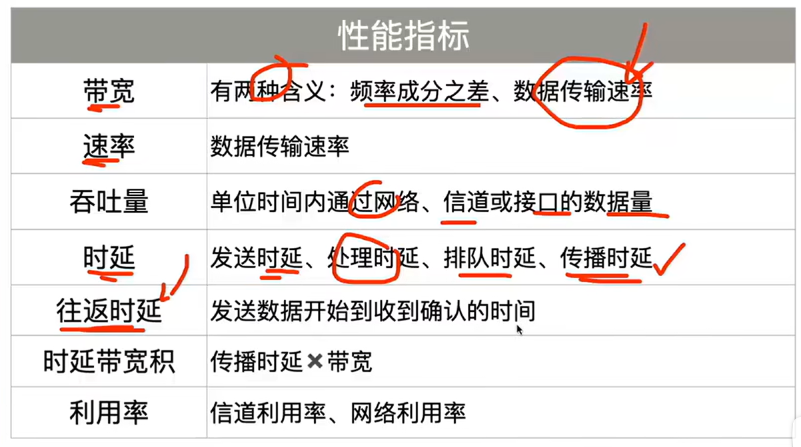

## 1.3 计算机网络体系结构（分层与协议）

分层是为了化繁为简

按功能进行抽象分层：

1. 定义层间接口**提供什么服务**，层间**如何调用服务**；
2. **对等层间的必须遵循的规则（协议）**。
   1983年， Internet采用TCP/IP协议集。（事实协议）

---

分层的原则：
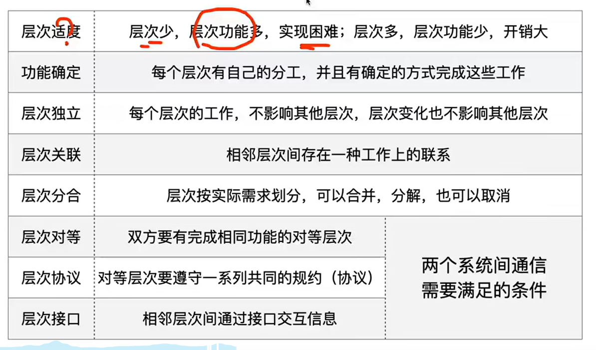

---

分层的优缺点:
**优点：**

* 各层独立
* 灵活性好
* 结构上可分割
* 易于实现和维护
* 能促进标准化工作

**缺点：**

* 降低效率
* 有些功能可能产生冗余

---

各层的主要功能：
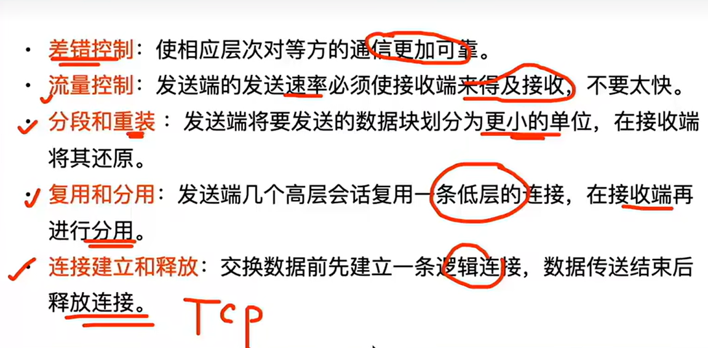

---

协议的概念：计算机网络中的数据交换必须遵守事先约定好的规则

1. 明确规定了所交换的**数据格式**以及有关的**同步问题**；
2. 网络协议简称协议，是为网络中的数据交换而建立的规则、标准或约定。

---

**协议的三要素：**

1. **语法**： **交换信息的格式**
2. **语义**： 需要发出何种控制信息，完成何种动作以及做出何种响应。解决**做什么**的问题
3. **同步**： 事件实现顺序的详细说明，解决**先做什么后做什么**的问题

## 1.4 具有五层协议的体系结构

OSI：七层体系结构，复杂不实用
TCP/IP: 四层体系结构（应用层、运输层、网际层、网络接口层）  **网络接口层无具体内容**，由厂商定义
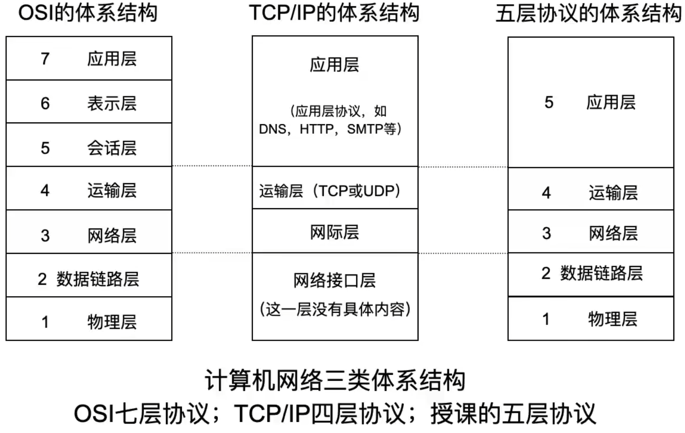

* **应用层**： 通过应用进程间的交互来完成特定网络应用；
* **运输层**； 负责向两台主机中**进程**之间的通信**提供通用的数据传输服务**，**TCP**提供面向连接的、可靠的数据传输服务，传输单位为报文段；**UDP**提供无连接的尽最努力的数据传输服务，传输单位为**用户数据报**；
* **网络层**： 提供**主机**间的**通信服务**。路由器生成**转发表**，依据转发表**转发分组**至下一个路由器；
* **数据链路层**：直连网络中相邻节点的链路上**传输帧**；
* **物理层**： 实现**比特传输**。

---

### 协议封装的概念

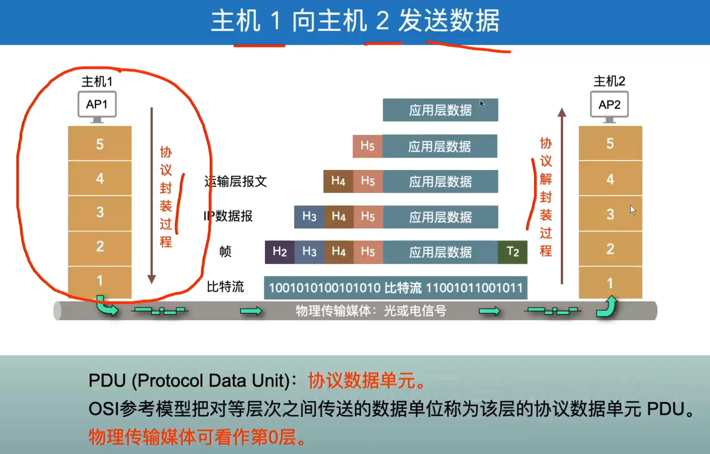

# 网络层

## 网际协议IP

* 网际协议IP是TCP/IP体系中两个最主要的协议之一
* 与**IP**协议配套使用的还有三个协议：

1. 地址解析协议**ARP**（Address Resolution Protocol）
2. 网际控制报文协议**ICMP**（Internet Control Message Protocol）
3. 网际组管理协议**IGMP**（Internet Group Management Protocol）
   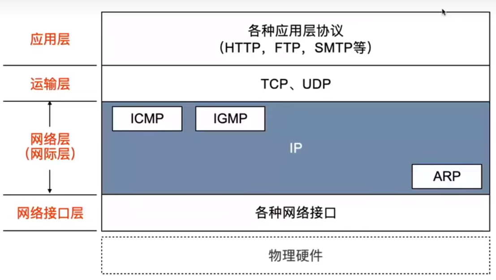

### 中间设备

物理层：转发器(repeater)
数据链路层：网桥/桥接器(bridge)
网络层：路由器(router)
网络层以上：网关(gateway) (协议变换器)
网络互联都是指用路由器进行网络互连和路由选择

### 虚拟互联网络

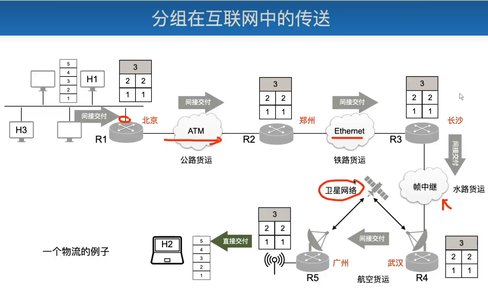
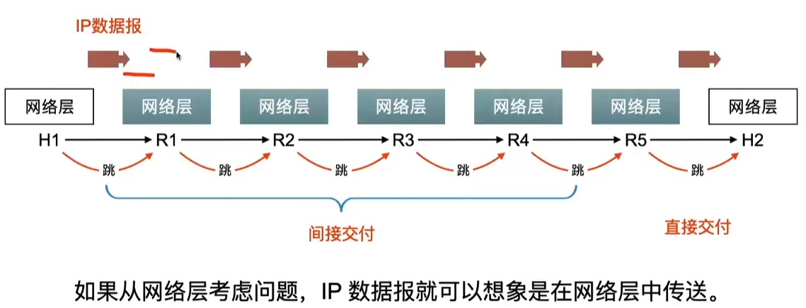

## IP地址

### 分类的IP地址

编址方法：以二进制形式存储，写成点分十进制模式
每8位一组转成十进制 例：128.11.3.31
IP地址 ::={<网络号>,<主机号>}
IP地址不但标志了接口**某一主机**，还标志了该接口所**连接的网络**
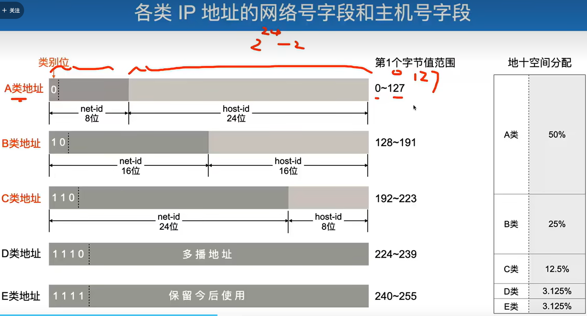
可通过第一个字节的值判断IP地址的类别

**八位二进制与十进制转换**
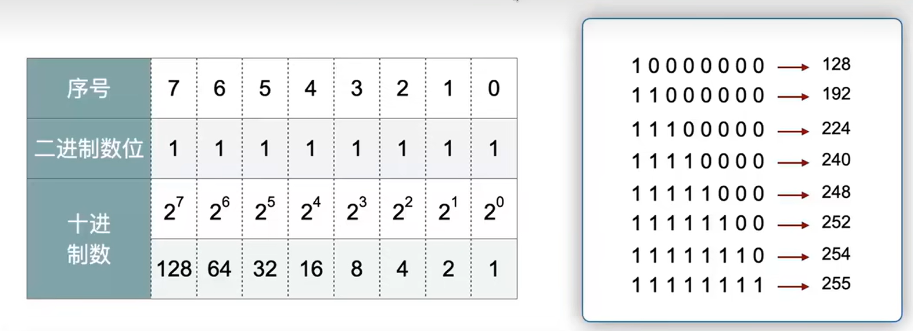

**一般不使用的IP地址：**
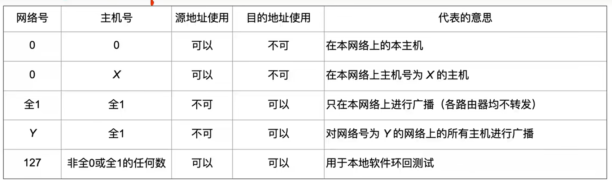

出现全0IP的情况
1. DHCP：主机自动获取IP的协议，没有IP地址之前在网络里广播寻求IP，此时IP全为0，代表本网络上的本主机，源地址可用，目的地址不可用
1. C/S（server）模式程序，希望所用网卡都对外提供服务
1. 写一条默认路由时

*如果网络Y没有划分子网，情况3等价于情况4*

**分类IP地址的优点**
1. 方便IP地址的管理
1. 路由器仅根据目的主机所连接的网络好来转发分组，减小了路由表所占的存储空间

### 无分类编址CIDR（按需分配IP地址）
* **变长子网掩码VLSM**(Variable Length Subnet Mask),提高IP地址资源的利用率
* **无分类编址方法CIDR**(Classless Inter-Domain Routing)：在VLSM基础上研究出，消除了A类、B类和C类地址以及划分子网的概念，更加有效地分配**IPv4**的地址空间：
1. CIDR变长的“网络前缀”(network-prefix)来代替分类地址中的网络号和子网号；
1. IP地址从三级编址（使用子网掩码）又回到了两级编址

* CIDR地址块：CIDR把网络潜水都相同的连续的IP地址组成“CIDR地址块”；一个CIDR地址块包含的IP地址数目，取决于网络前缀的位数
例：
*128.14.32.0/20*表示的地址块共有$2^{12}$个地址（20为网络前缀的位数，这个地址的主机号是12位），其中：