# 树

## 树的存储结构

**1. 双亲表示法**
以双亲作为索引的关键词

```c{.line-numbers}
//树的双亲表示法节点结构定义
#define MAX_TREE_SIZE 100 

typedef int ElemType;

typedef struct PTNode;
{`
    ElemType data;  // 节点数据
    int parent;  // 双亲位置
} PTNode;

typedef struct
{
    PTNode nodes[MAX_TREE_SIZE];
    int r;  // 根的位置
    int n;  //j结点数目
}PTree;
```

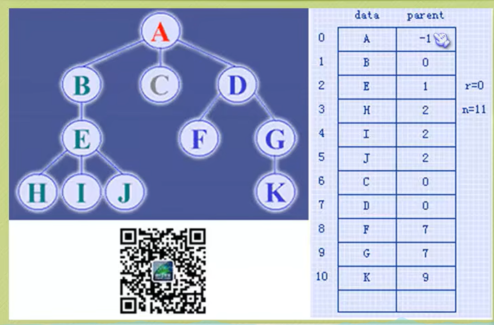
搜寻双亲结点的时间复杂度： O(1)
搜寻子节点很复杂，改变结构：
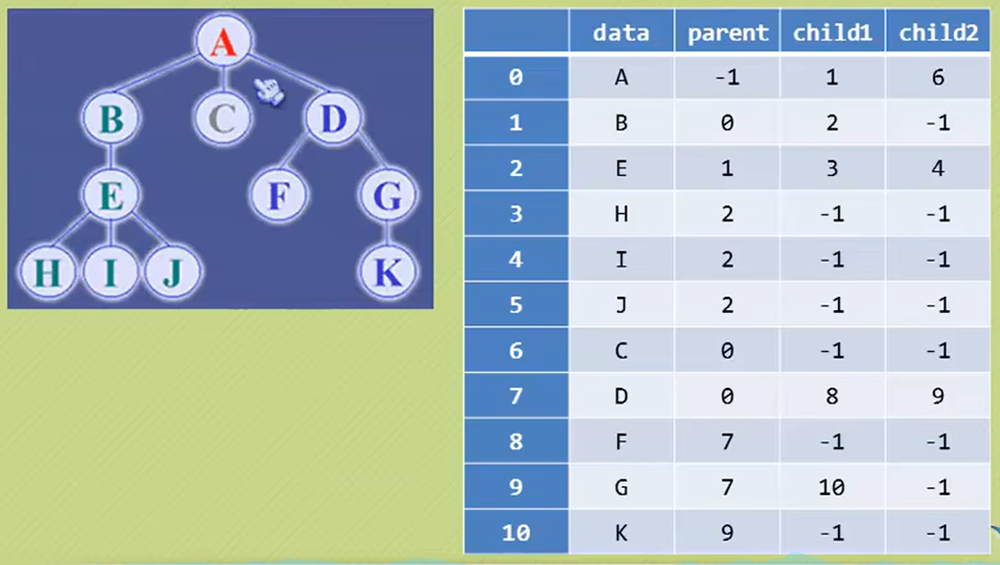
**2. 孩子表示法**
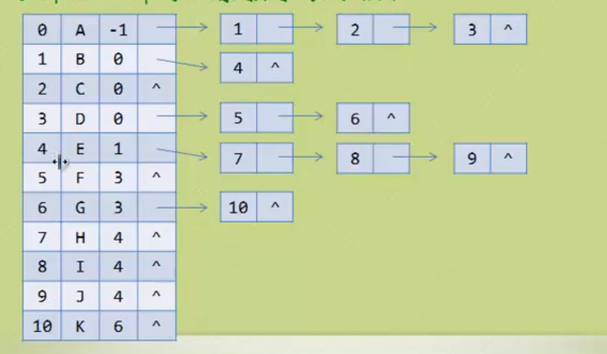
结合链表，类比哈希

```c {.line-numbers}
//树的孩子表示法节点结构定义
#define MAX_TREE_SIZE 100 

typedef char ElemType;

// 孩子节点
typedef struct CTNode;
{
    int child;  // 孩子结点的下标
    struct CTNode *next;  // 指向下一个孩子节点的指针
} *ChildPtr;

// 表头结构
typedef struct
{
    ElemType data;  // 存放在树中的结点的数据
    int parent;  // 存放双亲的下标
    ChildPtr firstchild;  // 指向第一个孩子的指针
}CTBox;

// 树结构
typedef struct
{
    CTBox nodes[MAX_TREE_SIZE];  // 结点数组
}Ctree;
```

## 二叉树

二叉树是n(n>=0)个结点的有限集合，该集合或者为空集，或者由一个根结点和两颗互不相交的、分别称为根结点的左子树和右子树的二叉树组成。
**度<=2**

### 二叉树的性质

1. 在二叉树的第$i$层上之多有$2^{i-1}$个结点($i\geq1$)
2. 深度为$k$的二叉树之多有$2^{k}-1$个结点($k\geq1$)
3. **对任何一颗二叉树T，如果其终端结点数为$n_{0}$, 度为2的结点数为$n_{2}$，则$n_{0}=n_{2}+1$**
4. 具有n个结点的完全二叉树的深度为$\log_{2}n+1$
5. 如果对一颗有n个结点的完全二叉树（其深度为$\log_{2}n+1$）的结点按层序编号，对任一结点$i(1\leq i\leq n)$有以下性质：

* 若$i=1$, 则结点$i$是二叉树的根，无双亲；若$i>1$，则其双亲是结点$i/2$
* 若$2i>n$，则结点$i$不做左孩子（结点$i$为叶子结点）；否则其左孩子是结点$2i$
* 若$2i+1>n$，则结点$i$无右孩子；否则其右孩子是结点$2i+1$

### 二叉树的存储结构

完全二叉树在数组能直接表现出逻辑结构
一般的二叉树可以把不存在的结点用"^"代替

### 二叉链表

| lchild | data | rchild |
| ------ | ---- | ------ |

```c
typedef struct BiTNode
{
    ElemType data;
    struct BiTNode *lchild, *rchild;
} BiTNode, *BiTree;  // 递归定义
```

### 二叉树的遍历

从根结点出发，按照某种**次序**以此**访问**二叉树中所有结点，使得每个结点被访问一次且仅被访问一次。
***1. 前序遍历***
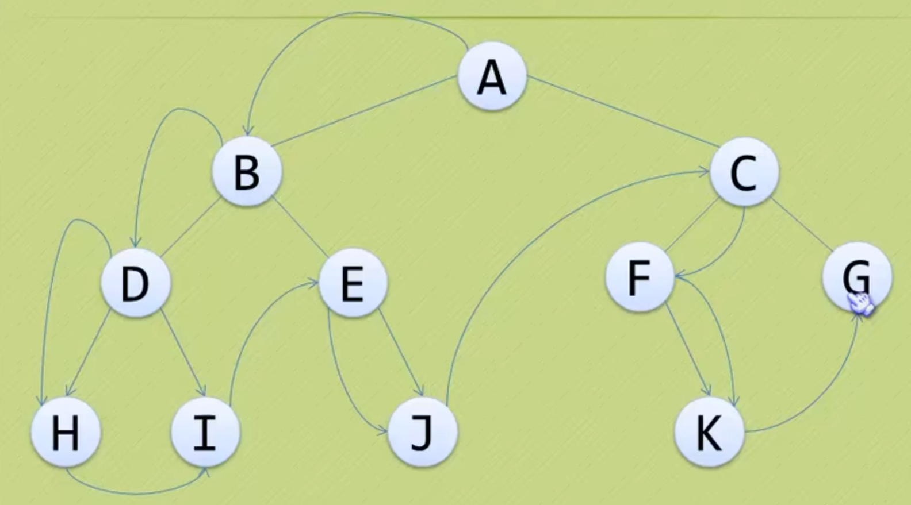
**ABDHIEJCFKG** 根左右
***2. 中序遍历***
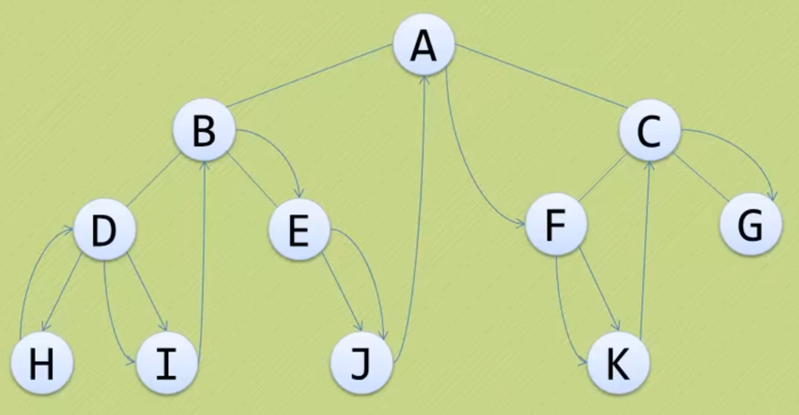
**HDIBEJAFKCG** 左根右
***3. 后续遍历*** 
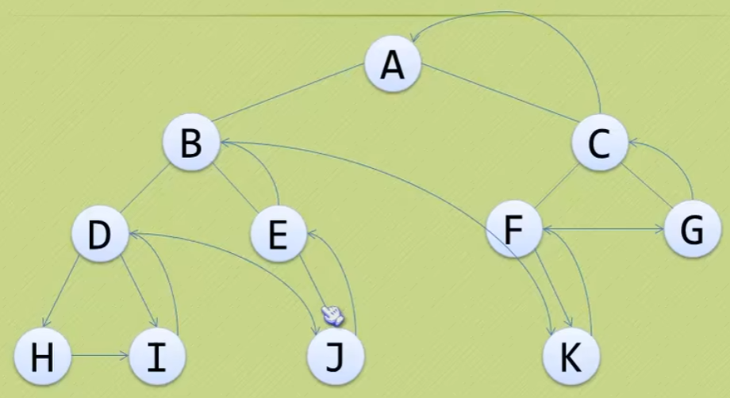
**HIDJEBKFGCA** 左右根
***4. 层序遍历***
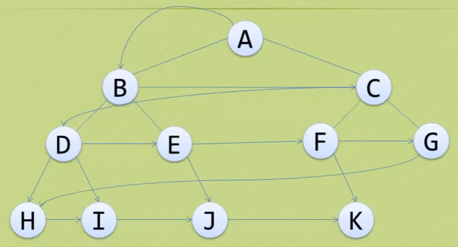
略
### 二叉树的建立和遍历算法
**题目：** 建立二叉树并输出每个字符所在的层数。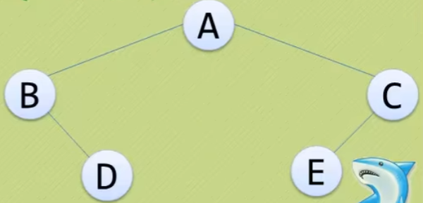
```c {.line-numbers}
#include <stdio.h>

typedef char ElemType;

typedef struct BitNode
{
    char data;
    struct BitNode *lchild, *rchild;
} BiTNode, *BiTree;

// 创建一颗二叉树，约定用户遵照前序遍历的方式输入数据
CreateBiTree(BiTree *T)
{
    char c;

    scanf("%c", c);
    if('$' == c)
    {
        *T = NULL;
    }
    else
    {
        *T = (BiTNode *)malloc(sizeof(BiTNode));
        (*T)->data = c;
        CreateBiTree(&(*T)->lchild);
        CreateBitree(&(*T)->rchild);  // 递归
    }
}

// 访问二叉树结点的具体操作
visit(char c, int level)
{
    //todo: what to do
    printf("%c 位于第%d 层\n", c, level)
}

// 遍历二叉树
PreOrderTraverse(BiTree T, int level)
{
    if (T)
    {
         visit(T->data, level);
         PreOrderTraverse(T->lchild, level+1);
         PreOrderTraverse(T->rchild, level+1);   //前序：根->左->右
    }
}

int main()
{
    int level = 1;
    BiTree T = NULL;

    CreateBiTrere(&T);
    PreOrderTraverse(T, level);

    return 0;
}
```
### 线索二叉树
**线索化： 通过在二叉树的空指针上存储前驱或后继节点的信息，从而使得在遍历二叉树时可以更高效地进行操作。**
采用**中序**遍历（左根右）可以最高效利用空结点存放前驱和后继的指针
| lchild | ltag | data | rtag | rchild |
| ------ | ---- | ---- | ---- |  ----  |
* ltag=0时指向该结点的左孩子，为1时指向该结点的前驱 
* rtag=0时指向该结点的右孩子，为1时指向该结点的后继
```c {.line-numbers}
// 线索二叉树实现
#include <stdio.h>
#include <stdlib.h>

typedef char ElemType;

// 线索存储标志位
// Link(0): 表示指向左右孩子的指针
// Thread(1): 表示指向前驱后继的线索
typedef enum {Link, Thread} PointerTag;

typedef struct BiThrNode
{
    char data;
    struct BiThrNode *lchild, *rchild;
    PointerTag ltag;
    PointerTag rtag;
} BiThrNode, *BiThrTree;

// 全局变量，始终指向刚刚访问过的结点
BiThrTree pre;

// 创建一颗二叉树，约定用户遵照前序遍历的方式输入数据
CreateBiThrTree(BiThrTree *T)
{
    char c;

    scanf("%c", c);
    if('$' == c)
    {
        *T = NULL;
    }
    else
    {
        *T = (BiThrNode *)malloc(sizeof(BiThrNode));
        (*T)->data = c;
        (*T)->ltag = Link;
        (*T)->rtag = Link;

        CreateBiThrTree(&(*T)->lchild);
        CreateBiThrtree(&(*T)->rchild);  // 递归
    }
}

// 中序遍历线索化
InThreading(BiThrTree)
{
    if ( T )
    {
        InThreading( T->lchild );  // 递归左孩子线索化

        // 结点处理
        if ( !T->lchild )  // 如果该结点没有左孩子，设置ltag为Thread，并把lchild指向刚刚访问的结点
        {
            T->ltag = Thread;
            T->lchild = pre;
        }

        if ( !pre->rchild )
        {
            pre->rtag = Thread;
            pre->rchild = T;
        }

        pre = T;

        InThreading( T->rchild );  // 递归右孩子线索化 
    }
}

InOrderThreading( BiThrTree *p, BiThrTree T)
{
    *p = (BiThrTree)malloc(sizeof(BiThrNode));
    (*p)->ltag = Link;   // pre(头指针)的左孩子指向根结点
    (*p)->rtag = Thread; // pre的右指针为线索
    (*p)->rchild = *p;   // 当前节点的右孩子指针指向自身
    if ( !T )
    {
        (*p)->lchild = *p;
    }
    else
    {
        (*p)->lchild = T;  // 将当前结点的左孩子指针指向传入的根节点T
        pre = *p;  // 设置pre指针指向当前节点，用于在线索化过程中记录前驱节点

        InThreading(T);
        pre->rchild = *p;  // 将前驱节点pre的右孩子指针指向当前节点 *p，完成了当前节点的线索化
        pre->rtag = Thread;  // 将前驱节点的右线索标记设置为Thread
        (*p)->rchild = pre;  // 将当前节点的右孩子指针指向前驱节点pre,完成了前驱节点的线索化
    }
}

void visit(char c)
{
    printf("%c", c);
}

// 中序遍历二叉树，非递归
void InOrderTraverse(BiThrTree T)
{
    BiThrTree p;
    p = T->lchild;

    while(p != T)
    {
        while(p->ltag == Link)
        {
            p = p->lchild;                                            
        }
        visit(p->data);

        while (p->rtag == Thread && p->rchild != T)
        {
            p = p->rchild;
            visit(p->data);
        }

        p = p->rchild;
    }
}

int main()
{
    BiThrTree P, T = NULL;

    CreateBiThrTree( &T );

    InOrderThreading( &P, T );

    printf("中序遍历输出结果为：");
    InOrderTraverse( P ); // P为头指针，T为根结点
    printf("\n");

    return 0;
}
```
<pre>
      A            前序遍历：ABC$$D$$E$F$$
    /   \          中序遍历：<u>C</u>B<u>D</u>A<u>EF</u>
   B     E
  / \     \
 C   D     F          
</pre>

## 树、森林及二叉树的相互转换
**普通树->二叉树**
1） 在树中所有的兄弟结点之间加一连线
2） 对每个结点，除了保留与其长子（左结点）的连线外，去掉该结点与其他孩子的连线
***加线去线层次调整***
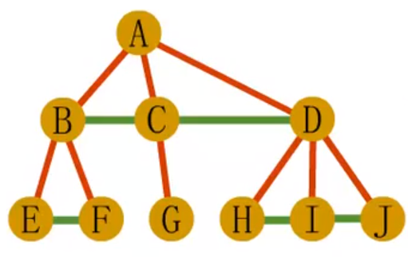      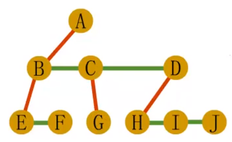 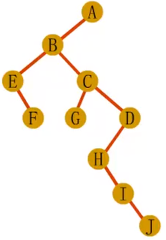
根节点只有左子树

**森林->二叉树**
1） 先将森林中的每棵树变为二叉树
2） 将各二叉树的根结点视为兄弟从左至右连在一起，就形成了一颗二叉树
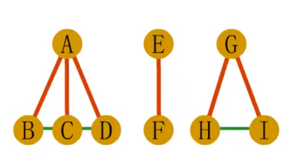    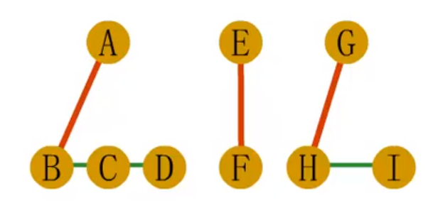 
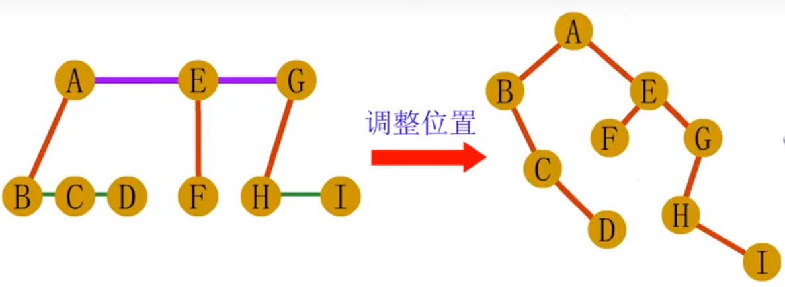 
根节点有左子树和右子树

**二叉树->树->森林**
1） 若结点x是其双亲y的左孩子，则把x的右孩子，右孩子的右孩子，……，都与y用连线连起来。
2） 去掉所有双亲到右孩子之间的连线
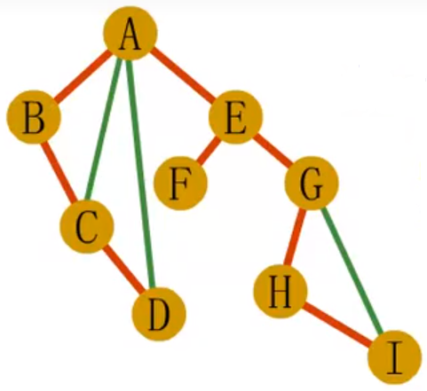 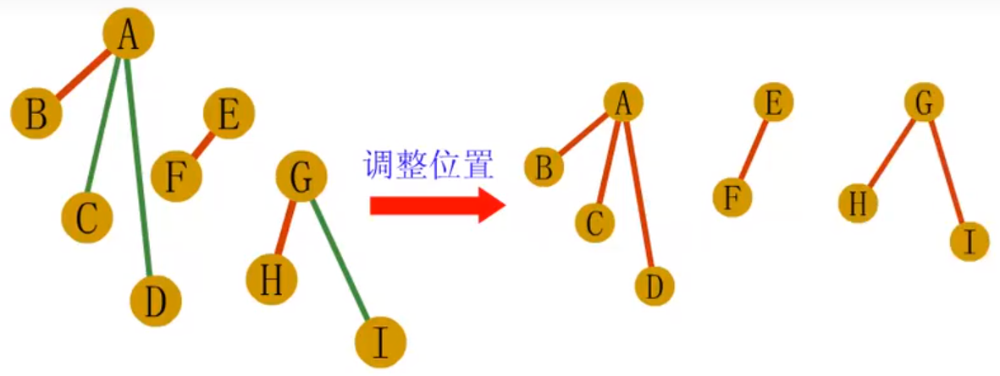 
<span style="color:red;">判断一颗二叉树能够转换成树还是森林： 二叉树根节点有右孩子为森林，否则为树</span>

## 树与森林的遍历