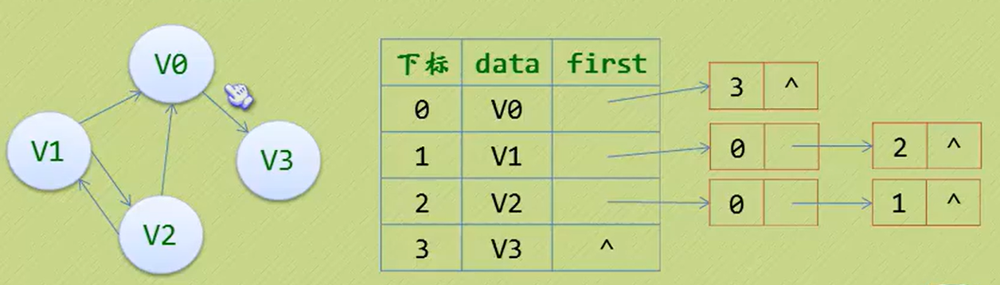

# 树

## 树的存储结构

**1. 双亲表示法**
以双亲作为索引的关键词

```c{.line-numbers}
//树的双亲表示法节点结构定义
#define MAX_TREE_SIZE 100 

typedef int ElemType;

typedef struct PTNode;
{`
    ElemType data;  // 节点数据
    int parent;  // 双亲位置
} PTNode;

typedef struct
{
    PTNode nodes[MAX_TREE_SIZE];
    int r;  // 根的位置
    int n;  //j结点数目
}PTree;
```


搜寻双亲结点的时间复杂度： O(1)
搜寻子节点很复杂，改变结构：

**2. 孩子表示法**

结合链表，类比哈希

```c
//树的孩子表示法节点结构定义
#define MAX_TREE_SIZE 100 

typedef char ElemType;

// 孩子节点
typedef struct CTNode;
{
    int child;  // 孩子结点的下标
    struct CTNode *next;  // 指向下一个孩子节点的指针
} *ChildPtr;

// 表头结构
typedef struct
{
    ElemType data;  // 存放在树中的结点的数据
    int parent;  // 存放双亲的下标
    ChildPtr firstchild;  // 指向第一个孩子的指针
}CTBox;

// 树结构
typedef struct
{
    CTBox nodes[MAX_TREE_SIZE];  // 结点数组
}Ctree;
```

## 二叉树

二叉树是n(n>=0)个结点的有限集合，该集合或者为空集，或者由一个根结点和两颗互不相交的、分别称为根结点的左子树和右子树的二叉树组成。
**度<=2**

### 二叉树的性质

1. 在二叉树的第$i$层上之多有$2^{i-1}$个结点($i\geq1$)
2. 深度为$k$的二叉树之多有$2^{k}-1$个结点($k\geq1$)
3. **对任何一颗二叉树T，如果其终端结点数为$n_{0}$, 度为2的结点数为$n_{2}$，则$n_{0}=n_{2}+1$**
4. 具有n个结点的完全二叉树的深度为$\log_{2}n+1$
5. 如果对一颗有n个结点的完全二叉树（其深度为$\log_{2}n+1$）的结点按层序编号，对任一结点$i(1\leq i\leq n)$有以下性质：

* 若$i=1$, 则结点$i$是二叉树的根，无双亲；若$i>1$，则其双亲是结点$i/2$
* 若$2i>n$，则结点$i$不做左孩子（结点$i$为叶子结点）；否则其左孩子是结点$2i$
* 若$2i+1>n$，则结点$i$无右孩子；否则其右孩子是结点$2i+1$

### 二叉树的存储结构

完全二叉树在数组能直接表现出逻辑结构
一般的二叉树可以把不存在的结点用"^"代替

### 二叉链表

| lchild | data | rchild |
| ------ | ---- | ------ |

```c
typedef struct BiTNode
{
    ElemType data;
    struct BiTNode *lchild, *rchild;
} BiTNode, *BiTree;  // 递归定义
```

### 二叉树的遍历

从根结点出发，按照某种**次序**以此**访问**二叉树中所有结点，使得每个结点被访问一次且仅被访问一次。
***1. 前序遍历***

**ABDHIEJCFKG** 根左右
***2. 中序遍历***

**HDIBEJAFKCG** 左根右
***3. 后续遍历***

**HIDJEBKFGCA** 左右根
***4. 层序遍历***

略

### 二叉树的建立和遍历算法

**题目：** 建立二叉树并输出每个字符所在的层数。

```c
#include <stdio.h>

typedef char ElemType;

typedef struct BitNode
{
    char data;
    struct BitNode *lchild, *rchild;
} BiTNode, *BiTree;

// 创建一颗二叉树，约定用户遵照前序遍历的方式输入数据
CreateBiTree(BiTree *T)
{
    char c;

    scanf("%c", c);
    if('$' == c)
    {
        *T = NULL;
    }
    else
    {
        *T = (BiTNode *)malloc(sizeof(BiTNode));
        (*T)->data = c;
        CreateBiTree(&(*T)->lchild);
        CreateBitree(&(*T)->rchild);  // 递归
    }
}

// 访问二叉树结点的具体操作
visit(char c, int level)
{
    //todo: what to do
    printf("%c 位于第%d 层\n", c, level)
}

// 遍历二叉树
PreOrderTraverse(BiTree T, int level)
{
    if (T)
    {
         visit(T->data, level);
         PreOrderTraverse(T->lchild, level+1);
         PreOrderTraverse(T->rchild, level+1);   //前序：根->左->右
    }
}

int main()
{
    int level = 1;
    BiTree T = NULL;

    CreateBiTrere(&T);
    PreOrderTraverse(T, level);

    return 0;
}
```

### 线索二叉树

**线索化： 通过在二叉树的空指针上存储前驱或后继节点的信息，从而使得在遍历二叉树时可以更高效地进行操作。**
采用**中序**遍历（左根右）可以最高效利用空结点存放前驱和后继的指针

| lchild | ltag | data | rtag | rchild |
| ------ | ---- | ---- | ---- | ------ |

* ltag=0时指向该结点的左孩子，为1时指向该结点的前驱
* rtag=0时指向该结点的右孩子，为1时指向该结点的后继

```c
// 线索二叉树实现
#include <stdio.h>
#include <stdlib.h>

typedef char ElemType;

// 线索存储标志位
// Link(0): 表示指向左右孩子的指针
// Thread(1): 表示指向前驱后继的线索
typedef enum {Link, Thread} PointerTag;

typedef struct BiThrNode
{
    char data;
    struct BiThrNode *lchild, *rchild;
    PointerTag ltag;
    PointerTag rtag;
} BiThrNode, *BiThrTree;

// 全局变量，始终指向刚刚访问过的结点
BiThrTree pre;

// 创建一颗二叉树，约定用户遵照前序遍历的方式输入数据
CreateBiThrTree(BiThrTree *T)
{
    char c;

    scanf("%c", c);
    if('$' == c)
    {
        *T = NULL;
    }
    else
    {
        *T = (BiThrNode *)malloc(sizeof(BiThrNode));
        (*T)->data = c;
        (*T)->ltag = Link;
        (*T)->rtag = Link;

        CreateBiThrTree(&(*T)->lchild);
        CreateBiThrtree(&(*T)->rchild);  // 递归
    }
}

// 中序遍历线索化
InThreading(BiThrTree)
{
    if ( T )
    {
        InThreading( T->lchild );  // 递归左孩子线索化

        // 结点处理
        if ( !T->lchild )  // 如果该结点没有左孩子，设置ltag为Thread，并把lchild指向刚刚访问的结点
        {
            T->ltag = Thread;
            T->lchild = pre;
        }

        if ( !pre->rchild )
        {
            pre->rtag = Thread;
            pre->rchild = T;
        }

        pre = T;

        InThreading( T->rchild );  // 递归右孩子线索化 
    }
}

InOrderThreading( BiThrTree *p, BiThrTree T)
{
    *p = (BiThrTree)malloc(sizeof(BiThrNode));
    (*p)->ltag = Link;   // pre(头指针)的左孩子指向根结点
    (*p)->rtag = Thread; // pre的右指针为线索
    (*p)->rchild = *p;   // 当前节点的右孩子指针指向自身
    if ( !T )
    {
        (*p)->lchild = *p;
    }
    else
    {
        (*p)->lchild = T;  // 将当前结点的左孩子指针指向传入的根节点T
        pre = *p;  // 设置pre指针指向当前节点，用于在线索化过程中记录前驱节点

        InThreading(T);
        pre->rchild = *p;  // 将前驱节点pre的右孩子指针指向当前节点 *p，完成了当前节点的线索化
        pre->rtag = Thread;  // 将前驱节点的右线索标记设置为Thread
        (*p)->rchild = pre;  // 将当前节点的右孩子指针指向前驱节点pre,完成了前驱节点的线索化
    }
}

void visit(char c)
{
    printf("%c", c);
}

// 中序遍历二叉树，非递归
void InOrderTraverse(BiThrTree T)
{
    BiThrTree p;
    p = T->lchild;

    while(p != T)
    {
        while(p->ltag == Link)
        {
            p = p->lchild;                                          
        }
        visit(p->data);

        while (p->rtag == Thread && p->rchild != T)
        {
            p = p->rchild;
            visit(p->data);
        }

        p = p->rchild;
    }
}

int main()
{
    BiThrTree P, T = NULL;

    CreateBiThrTree( &T );

    InOrderThreading( &P, T );

    printf("中序遍历输出结果为：");
    InOrderTraverse( P ); // P为头指针，T为根结点
    printf("\n");

    return 0;
}
```

<pre>
      A            前序遍历：ABC$$D$$E$F$$
    /   \          中序遍历：<u>C</u>B<u>D</u>A<u>EF</u>
   B     E
  / \     \
 C   D     F        
</pre>

## 树、森林及二叉树的相互转换

**普通树->二叉树**
1） 在树中所有的兄弟结点之间加一连线
2） 对每个结点，除了保留与其长子（左结点）的连线外，去掉该结点与其他孩子的连线
***加线去线层次调整***
``      `` ``
根节点只有左子树

**森林->二叉树**
1） 先将森林中的每棵树变为二叉树
2） 将各二叉树的根结点视为兄弟从左至右连在一起，就形成了一颗二叉树
``    ``
``
根节点有左子树和右子树

**二叉树->树->森林**
1） 若结点x是其双亲y的左孩子，则把x的右孩子，右孩子的右孩子，……，都与y用连线连起来。
2） 去掉所有双亲到右孩子之间的连线
`` ``
`<span style="color:red;">`判断一颗二叉树能够转换成树还是森林： 二叉树根节点有右孩子为森林，否则为树

## 树与森林的遍历

### 树的遍历

* 先根遍历：先访问树的根结点，然后再依次先根遍历根的每颗子树。
* 后根遍历：先依次遍历每颗子树，然后再访问根结点。
  ``
  先根遍历结果：ABEFCGDHIJ
  后根遍历结果：EFBGCHIJDA

### 森林的遍历

也分前序遍历和后续遍历，即按照树的先/后根遍历一次访问森林的每一棵树。

`<span style="color:red;">`树、森林的前根（序）遍历和二叉树的 *前序* 遍历结果相同，树、森林的后根（序）遍历和二叉树的 *中序* 遍历结果相同！

## 赫夫曼树

### 赫夫曼树定义与原理

* **权**(weight)：树结点间的连线相关的数
* **结点的路径长度**：从根结点到该结点的路径上的连接数
* **树的路径长度**：树中每个叶子结点的路径长度之和
* **结点带权路径长度**：结点的路径长度与结点权值的乘积
* **树的带权路径长度**(WPL，Weighted Path Length): 树中所有叶子结点的带权路径长度之和
  赫夫曼树即为树的带权路径长度最小的数，也叫**最优二叉树**。

### 赫夫曼编码

`<span style="color:blue;">`补充名词解释：

* 定长编码：像ASCII编码
* 变长编码：单个编码的长度不一致，可以根据整体出现频率来调节
* 前缀码：没有任何码字是其他码字的前缀
  左子树用0表示，右子树用1表示

<details>
  <summary><span style="color:blue;">huffman.h</span> </summary>

```c
////////huffman.h/////////////////////
#pragma once
#ifdef _HUFFMAN_H
#define _HUFFMAN_H

typedef struct _htNode 
{
    char symbol;
    struct _htNode *left, *right;
} htNode;

typrdef struct _htTree
{
    htNode *root;
} htTree;

typedef struct _hlNode
{
    char symbol;
    char *code;
    strruct _hlNode *next;
} hlNode;

typedef struct _hlTable
{
    hlNode *first;
    hlNode *last;
} hlTable;

htTree * buildTree(char *inputString);
hlTable * buildTable(htTree *huffmanTree);
void encode(hlTable *table, char *stringToEncode);
void decode(htTree *tree, char *stringToDecode);

#endif
```

</details>

<details>
  <summary><span style="color:blue;">queue.h</span> </summary>

```c
////////queue.h/////////////////////
#pragma once
#ifndef _PQUEUE_H
#define _PQUEUE_H

#include "huffman.h"

#define TYPE htNode * 

#define MAX_SZ 256

typedef struct _pQueueNode 
{
    TYPE val;
    unsigned int priority;
    struct _pQueueNode *next;
} qQueueNode;

typedef struct _pQueue 
{
    unsigned int size;
    pQueueNode *first;  // 指向队列的头结点
} qQueue;

void initPQueue(pQueue **queue);
void addPQueue(pQueue **queue, TYPE val, unsigned int priority);
TYPE getPQueue(pQueue **queue);

#endif
```

</details>

---

<details>
  <summary><span style="color:blue;">huffman.cpp</span> </summary>

```c
////////huffman.cpp/////////////////////
#include <stdio.h>
#include <stdlib.h>
#include <string.h>

#include "huffman.h"
#include "queue.h"

void traverseTree(htNode *treeNode, hlTable **table, int k, char code[256])
{
    if (treeNode->left == NULL && treeNode->right == NULL)
    {
        code[k] = '\0';
        hlNode *aux = (hlNode*)malloc(sizeof(hlNode));
        aux->code = (char *)maoolc(sizeof(char)*(strlen(code)+1));
        strcpy(aux->code, code);
        aux->symbol = treeNode->symbol;
        aux->next = NULL;

        if((*table)->first == NULL)
        {
            (*table)->first = aux;
            (*table)->last = aux;
        }
        else
        {
            (*table)->last->next = aux;
            (*table)->last = aux;
        }

    }

    if (treeNode->left!=NULL)
    {
        code[k]='0';
        traverseTree(treeNode->left, table, k+1, code);
    }

    if (treeNode->right!=NULL)
    {
        code[k]='1';
        traverseTree(treeNode->right, table, k+1, code);
    }
}

hlTable * buildTable(htTree * huffmanTree)
{
    hlTable *table = (hlTable *)malloc(sizeof(hlTable));
    table->first = NULL;
    table->last = NULL;

    char code[256];
    int k = 0;

    traverseTree(huffmanTree->root, &table, k, code);
    return table;
}

htTree * buildTree(char *inputString)
{
    int * probability = (int*)malloc(sizeof(int)*256);

    // 初始化
    for (int i=0; i<256; i++)
    {
    probability[i]=0;
    }

    // 统计待编码的字符串各个字符出现的次数
    for (int j=0; inputString[j]!='\0'; j++)
    {
    probability[(unsigned char) inputString[j]]++;
    }

    // pQueue队列的头指针
    pQueue * huffmanQueue;
    initPQueue(&huffmanQueue);

    // 填充队列
    for (int k=0; k<256; k++>)
    {
    if (probability[k]!=0)
    {
    htNode *aux = (htNode *)malloc(sizeof(htNode));
    aux->left = NULL;
    aux->right = NULL;
    aux->symbol = (charr) k;

    addPQueue(&huffmanQueue, aux, probability[k]);
    }
    }

    free(probablity);

    // 生成赫夫曼树 
    while(huffmanQueue->size!=1)
    {
    int priority = huffmanQueue->first->priority;
    priority += huffmanQueue->first->next->priority;

    htNode *left = getPQueue(&huffmanQueue);
    htNode *right = getPQueue(&huffmanQueue);

    htNode *newNode = (htNode *)malloc(sizeof(htNode));
    newNode->left = left;
    newNode->right = right;

    addPQueue(&huffmanQueue, newNode, priority);
    }

    htTree *tree = (htTree *) malloc(sizeof(htTree));

    tree->root = getPQueue(&huffmanQueue);

    return tree;
}

void encode(hlTable *table, char *stringToEncode)
{
    hlNode *traversal;

    printf("Encoding......\n\nInput string : \n%s\n\nEncoded string : \n", stringToEncode);

    for (int i=0; stringToEncode[i]!='\0'; i++)
    {
        traversal = table->first;
        while (traversal->symbol != stringToEncode[i])
            traversal = traversal->next;
        printf("%s", traversal->code);
    }

    printf("\n");
}

void decode(htTree *tree, char *stringToDecode)
{
    htNode *traversal = tree->root;

    printf("\n\nDecoding......\n\nInput string : \n%s\n\nDecoded string : \n", stringToDecode);

    for (int i = 0; stringToDecode[i] != '\0'; i++)
    {
        if (traversal->left == NULL && traversal->right == NULL)
        {
            printf("%c", traversal->symbol);
            traversal = tree->root;
        }

        if (stringToDecode[i] == '0')
            traversal = traversal->left;

        else if (stringToDecode[i] == '1')
            traversal = traversal->right;

        else
        {
            printf("The input string is not coded correctly!\n");
            return;
        }
    }

    if (traversal->left == NULL && traversal->right == NULL)
    {
        printf("%c", traversal->symbol);
    }
    else
    {
        printf("The input string is not coded correctly!\n");
    }
}

```

</details>

<details>
  <summary><span style="color:blue;">main.cpp</span> </summary>

```c
///////////main.cpp////////////////////////
#include <stdio.h>
#include <stdlib.h>
#include "huffman.h"

int main(void)
{
    hTree *cideTree = buildTree("I love zhouyuan!");

    hlTable *codeTable = buildTable(codeTree);

    encode(codeTable, "I love zhouyuan!");

    decode(codeTree, "0011111000111");
  
    return 0;
}
```

</details>

<details>
  <summary><span style="color:blue;">queue.cpp</span> </summary>

```c
////////queue.cpp/////////////////////
#include "queue.h"
#include <stdio.h>
#include <stdio.h>

void initPQueue(pQueue **queue)
{
    (*queue) = (pQueue *) malloc(sizeof(qQueue));
    (*queue)->first = NULL;
    (*queue)->size = 0;
    return;
}

void addPQueue(PQueue **queue, TYPE val, unsigned int priority)
{
    if ((*queue)->size == MAX_SZ)
    {
        printf( "\nQueue is full.\n");
        return;
    }

    PQueueNode *aux = (pQueueNode *)malloc(sizeof(pQueueNode));
    aux->priority = priority;
    aux->val = val;

    if ((*queue)->size == 0 || (*queue)->first == NULL) // 空队列
    {
        aux->next = NULL;
        (*queue)->first = aux;
        (*queue)-> size = 1;
        return;
    }
    else
    {
        if (priority<=(*queue)->first->priority)
        {
            aux->next = (*queue)->first;
            (*queue)->first = aux;
            (*queue)->size++;
            return;
        }
        else
        {
            pQueueNode * iterator = (*queue)->first;
            while (iterator->next!=NULL)
            {
                if (priority<=iterator->next->priority)
                {
                    aux->next = iterator->next;
                    iterator->next = aux;
                    (*queue)->size++;
                    return;
                }
                iterator = iterator->next;
            }

            if (iterator->next == NULL)
            {
                aux->next = NULL;
                iterator->next = aux;
                (*queue)->size++;
                return;
            }
        }
    }
}

TYPE getPQueue(pQueue **queue)
{
    TYPE returnValue;

    if (((*queue)->size>0))
    {
        returnValue = (*queue)->first->val;
        (*queue)->first = (*queue)->first->next;
        (*queue)->size--;
    }
    else
    {
        printf("\nQueue is empty.\n");
    }
    return returnValue;
}
```

</details>

---

---

---

# 图

## 图的定义与术语

图（graph）是由顶点的又穷非空集合和顶点（Vertex）之间的边的集合组成，通常表示为：$G(V, E)$, 其中V是图G中顶点的集合，E是图G中边的集合。

* 无向边(edge): 顶点$V_i$到$V_j$之间没有方向的边，用无序偶$(V_i，V_j)$表示
* 有向边/弧(arc)：顶点$V_i$到$V_j$之间有方向的边，用有序偶$<V_i，V_j>$表示, $V_i$称为弧头，$V_j$称为弧尾。
* **简单图**： 不存在顶点到其自身的边，且同一条边不重复出现。（*无环，无平行边）*
* 无向完全图：任意两个顶点都存在边的无向图。
* 有向完全图：任意两个顶点都存在方向互为相反的两条弧的有向图。含有n个顶点的有向完全图有$n*(n-1)$条边。
* **稀疏图和稠密图**（模糊概念）：对于有n个顶点的图，通常认为边或弧数小于$n*logn$的图为稀疏图，反之为稠密图。
* 边或弧带的数字叫**权**(weight), 带权的图称为**网**(network)。

## 图的顶点与边之间的关系

* 对于无向图$G(V, E)$，如果边$(V_1，V_2)∈E$，则称顶点$V_1$和$V_2$互为**邻接点**(adjacent)，即$V_1$和$V_2$相邻接。边$(V_1，V_2)$ **依附** (incident)于顶点$V_1$和$V_2$ / 边$(V_1，V_2)$于顶点$V_1$和$V_2$**相关联**。
* 度（degree）：顶点关联的边的数目，记为$TD(V)$
* 对于有向图$G(V, E)$，如果$<V_1，V_2>∈E$，则称顶点$V_1$**邻接到**顶点$V_2$，顶点$V_2$**邻接自**顶点$V_1$。
* 入度(InDegree)：以顶点V为头的弧的数目称为V的入度，记为ID（V）。
* 出度(OutDegree)：以顶点V为尾的弧的数目称为V的出度，记为OD（V）。
* $TD(V) = ID(V) + OD(V)$
* 路径(path)：略
* 连通图： 图中任意两个顶点都有路径的无向图。
* 连通分量： 无向图中的极大连通子图。
* 强连通图： 对于每一对$V_i$到$V_j$都存在路径的有向图。
* 强连通分量： 有向图中的极大强连通子图。
* **生成树**：连通图的一个极小连通子图，它含有图中去哪不的n个顶点，但只有足以构成一棵树的n-1条边。
* 如果一个有向图恰有一个顶点入伏为0，其余顶点的入度均为1，则是一颗**有向树**。

## 图的存储结构

### 邻接矩阵(无向图)

用一维数组存储顶点 + 用二维数组存储边或弧

<pre>
       V0
     / | \
    V1 |  V3
     \ |  /
       V2
</pre>

顶点数组vertex[4]： 

| V0 | V1 | V2 | V3 |
| -- | -- | -- | -- |

邻接矩阵/边数组arc[4][4]：


|  \  | V0 | V1 | V2 | V3 |
| -- | -- | -- | -- | -- |
| V0 | \  | 1  | 1  | 1  |
| V1 | 1  | \  | 1  | 0  |
| V2 | 1  | 1  | \  | 1  |
| V3 | 1  | 0  | 1  | \  |

0表示不存在顶点间的边，1表示顶点间存在边
arc[0][2]=1

### 邻接矩阵(有向图)
邻接矩阵不对称
顶点V1的**入度**为第V1**列**的各数之和， 顶点V1的**出度**为第V1**行**的各数之和。

### 邻接矩阵(网)

$∞$表示一个计算机允许的，大于所有边上权值的值，代表没有的弧

### 邻接表(无向图)


### 邻接表(有向图)
顶点当弧尾：


顶点当弧头（**逆邻接表**）：


### 邻接表（网）
结点定义中增加一个数据域存储权值即可


### 十字链表
 把邻接表和逆邻接表结合起来，重新定义顶点表结点结构：
 |data|firstIn|firstOut|
 |----|-------|--------|

重新定义边表结点结构：
|tailVex|headVex|headLink|tailLink|
|-------|-------|--------|--------|
|弧起点的顶点下标|弧终点的顶点下标|||


蓝色表示出度，红色表示入度
对比上面的邻接表（有向图）/顶点当弧尾

### 邻接多重表
边表结构：
|iVex|iLink|jVex|jLink|
|----|-----|----|-----|


### 边集数组
由两个一维数组构成，一个存储顶点信息，另一个存储边的信息


## 图的遍历
### 深度优先遍历（DFS）


### 马踏棋盘算法（骑士周游问题）
8*8的棋盘，求马走遍棋盘上所有位置的走法
<details>
  <summary><span style="color:blue;">test.c</span> </summary>

```c
#include <stdio.h>
#include <time.h>

#define X 8
#define Y 0

int chess[X][Y];

// 找到基于(x,y)位置的下一个可走位置
int nextxy(int *x, int *y, int count)
{
    switch(count)
    {
    case 0:
        if ( *x+2 <= X-1 && *y-1 >= 0 && chess[*x+2][*y-1]==0 ) 
        {
            *x += 2;
            *y -= 1;
            return 1;
        }
        break;

    case 1:
        if ( *x+2 <= X-1 && *y+1 >= 0 && chess[*x+2][*y+1]==0 ) 
        {
            *x += 2;
            *y += 1;
            return 1;
        }
        break;

    case 2:
        if ( *x+1 <= X-1 && *y+2 <= Y-1 && chess[*x+1][*y+2]==0 ) 
        {
            *x += 1;
            *y += 2;
            return 1;
        }
        break;

    case 3:
        if ( *x+1 <= X-1 && *y-2 >= 0 && chess[*x+1][*y-2]==0 ) 
        {
            *x += 1;
            *y -= 2;
            return 1;
        }
        break;

    case 4:
        if ( *x-2 >= 0 && *y-1 >= 0 && chess[*x-2][*y-1]==0 ) 
        {
            *x -= 2;
            *y -= 1;
            return 1;
        }
        break;

    case 5:
        if ( *x-2 >= 0 && *y+1 <= Y-1 && chess[*x-2][*y+1]==0 ) 
        {
            *x -= 2;
            *y += 1;
            return 1;
        }
        break;

    case 6:
        if ( *x-1 >= 0 && *y-2 >= 0 && chess[*x-1][*y-2]==0 ) 
        {
            *x -= 1;
            *y -= 2;
            return 1;
        }
        break;

    case 7:
        if ( *x-1 >= 0 && *y+2 <= Y-1 && chess[*x-1][*y+2]==0 ) 
        {
            *x -= 1;
            *y += 2;
            return 1;
        }
        break;

    default:
        break;
    }
    return 0;
}

void print()
{
    int i, j;

    for ( i=0; i<X; i++)
    {
        for ( j=0; j<Y; j++)
        {
            printf("%2d\t", chess[i][j]);
        }
        printf("\n");
    }
    printf("\n");
}

// 深度优先遍历棋盘
// (x,y)为位置坐标
// tag是标记变量，每走一步，tag+1
int TravelChessBoard(int x, int y, int tag)
{
    chess[x][y] = tag;

    if (X=Y == tag)
    {
        // 打印棋盘
        print();
        return 1;
    }

    // 找到马的下一个可走的坐标(x1,y1),如果找到flag=1,否则为0
    flag = nextxy(&x1, &y1, count);
    while (0==flag && count<7>)
    {
        count++;
        flag = nextxy(&x1, &y1, count);
    }

    while (flag)
    {
        if (TravelChessBoard(x1, y1, tag+1))
        {
            return 1;
        }
        
        // 继续找到马的下一步可走的坐标(x1,y1),如果找到flag=1,否则为0
        x1 = x;
        y1 = y;
        count++;

        flag = nextxy(&x1, y1, count);
        while (0==flag && count<7>)
        {
        count++;
        flag = nextxy(&x1, &y1, count);
        }
    }

    if ( 0 == flag )
    {
        chess[x][y] = 0;
    }
}

int main()
{
    int i, j;
    clock_t start, finish;

    start = clock;

    for(i=0; i<X ; i++)
    {
        for (j=0; j<Y; j++)
        {
            chess[i][j] = 0;
        }
    }

    if (!TravelChessBoard(2,0,1))
    {
        printf("抱歉，马踏棋盘失败咯……\n")
    }

    finish = clock();
    printf("\n本次计算一共耗时：%f秒\n\n", (double)(finish-start)/CLOCKS_PER_SEC);

    return 0;
}

```

</details>

### 广度优先遍历（BFS）
逐步扩大查找范围（从上到下一层一层遍历，每一层从左至右遍历，重复的跳过）
利用队列实现对图的广度遍历：
<details>
  <summary><span style="color:blue;">BFSTraverse.c</span> </summary>

```c
// 邻接矩阵的广度遍历算法
void BFSTraverse(MGraph G)
{
    int i, j;
    Queue Q;

    for (i=0; i < G.numVertexse; i++>)
    {
        visited[i] = FALSE;
    }

    initQueue( &Q );
    for (i=0; i < G.numVertexse; i++)
    {
        if (!visited[i])
        {
            printf("%c", G.vex[i]);
            visited[i] = TRUE;
            EnQueue(&Q, i);

            while (!QueueEmpty(Q))
            {
                DeQueue(&Q, &i);
                for (j=0; j<G.numVertexse; j++)
                {
                    if (G.art[i][j] == 1 && !visited[j])
                    {
                        printf("%c", G.vex[j]);
                        visited[j] = TRUE;
                        EnQueue(&Q, j);
                    }
                }
            }
        }
    }
}


```

</details>

